```mermaid
%% title: สถานะการจอง (Booking status lifecycle)
%% id: booking-lifecycle
stateDiagram-v2
  ...
```

# Spec build contract

The spec is authored as markdown in `docs/spec/sections/00…11.md` and compiled to ONE
self-contained HTML file by `docs/spec/build/build.py`. Everyone editing the spec or the
builder follows the conventions below so the three workstreams (content, diagrams, renderer)
can proceed in parallel.

## Product identity

- The product is **ReserveFlow**. Do **not** write "v2", "เวอร์ชัน 2", "v1 vs v2" anywhere in
  the main body — the reader is looking at *the* spec, not a revision of one. Version lives in
  the footer (`เอกสารรุ่น 2 · <date>`) and in the appendix only.
- Comparisons with the earlier draft, closed questions and decision history are **appendix
  material**. Main body states what IS, in the present tense.

## Document structure (new IA)

Main body — what a person needs to build or approve the thing:

| id | Section (TH · EN) |
|---|---|
| `overview` | ภาพรวม · Overview |
| `product` | ระบบทำอะไร · Product & Scope (roles, phases, screens at a glance) |
| `requirements` | ความต้องการ · Requirements (FR/NFR/business rules) |
| `flows` | เส้นทางผู้ใช้ · User Flows |
| `architecture` | สถาปัตยกรรม · Architecture & Tech Stack |
| `data-model` | โครงสร้างข้อมูล · Data Model |
| `api` | สัญญา API · API Contract |
| `folders` | โครงสร้างโค้ด · Code Structure |
| `plan` | แผนการพัฒนา · Implementation Plan |
| `devops` | DevOps, ความปลอดภัย, การทดสอบ |
| `mockups` | UI Mockups |

Appendix — provenance, history, and anything already settled:

| id | Section |
|---|---|
| `appendix` | ภาคผนวก · Appendix — with sub-parts: A ที่มาของเอกสาร (sources + how the earlier draft was reviewed), B การตัดสินใจที่ปิดแล้ว (closed decisions D-xx), C คำถามที่ปิดแล้ว (closed questions Q-xx), D ผลการรีวิว (external review log incl. spike findings), E Glossary, F Versions, G ADRs, H สิ่งที่ต้องยืนยันกับบริษัท |

## Verbosity rule — progressive disclosure

Every subsection leads with the **answer in ≤3 lines** (what we do + why, present tense), and
puts the supporting detail inside a collapsible block. Reference tables (full DDL, endpoint
tables, ticket lists, test matrices, error catalogues) are **always** collapsed by default.

Syntax — a fenced-free marker the builder converts to `<details>`:

```
:::details ดู DDL ทั้งหมด (14 ตาราง)
...markdown, including tables and code fences...
:::
```

- `:::details <summary text>` … `:::` → `<details><summary>…</summary>…</details>`.
- `:::details[open] <summary>` → rendered with the `open` attribute.
- May not be nested more than one level deep. Never put the *answer* inside a details block —
  only the elaboration.
- The builder adds a small count badge if the summary ends with `(n …)`.

## Diagrams

Author as mermaid in a fenced block with the `mermaid` language tag:

````

````

- `%% title:` and `%% id:` comment lines are required; the builder lifts them into a
  `<figure>`/`<figcaption>` and uses the id for the filename and anchor.
- The builder **pre-renders each diagram to inline SVG** with headless Chrome
  (`docs/spec/build/render-mermaid.mjs`) and caches the result in `docs/spec/diagrams/<id>.svg`.
  The published HTML therefore contains **no mermaid runtime and no external requests**.
- Keep diagrams legible: ≤ ~20 nodes, Thai labels, no colour-only meaning. Prefer several
  focused diagrams over one giant one.
- Every diagram must be preceded or followed by one sentence saying what the reader should take
  from it. A diagram that repeats the adjacent table earns its place only if it shows structure
  the table cannot.

## Charts

For real numbers (utilization by room, booking outcomes, weekday × hour heatmap, ticket burn by
week) use `:::chart` with a small JSON payload; the builder emits inline SVG (bar / hbar /
heatmap). No chart library.

```
:::chart
{"type":"hbar","title":"Utilization by room","unit":"%","max":100,
 "series":[{"label":"Horizon","value":82},{"label":"Summit","value":69},{"label":"Grove","value":53}]}
:::
```

Data shown in charts is illustrative unless the surrounding text says otherwise — the builder
stamps a muted "ตัวอย่าง" tag on any chart whose JSON carries `"sample": true`.

## Icons

Inline SVG only, from one sprite the builder injects once. Reference with `:icon[name]` in
markdown. Available names (keep this list short and add deliberately):
`calendar, clock, room, users, user-check, shield, lock, mail, bell, qr, chart, database,
server, browser, gear, check, x, warn, info, arrow-right, doc, tag, key, refresh`.
Icons are decorative: every icon must sit next to real text, never replace it, and carries
`aria-hidden="true"`.

## Status / severity chips

Unchanged from the current builder: severity, phase, size, Must/Should/Could, yes/no/partial,
and decision status are recognised from table cells automatically. Do not hand-write chip HTML.

## Hard rules

- Output is ONE `.html` file, self-contained: no external scripts, styles, fonts or images.
  Google Fonts are NOT allowed here (this file is opened from disk, often offline).
- Thai-first prose; identifiers, enums, SQL and code in English.
- Every `<section>` keeps a stable `id` (see the IA table) — links from elsewhere must not rot.
- Wide tables and code blocks scroll inside their own container; the page never scrolls
  horizontally at 390 px.
- Colour never carries meaning alone (icon + text as well); AA contrast for all text.
- No duplicate DOM ids. Heading ids are `<section-id>-<slug>`.
- `python3` here means `docs/spec/build/.venv` or the scratchpad venv; the shell's `grep` is a
  shim that mis-handles some flags — verify counts with Python.
