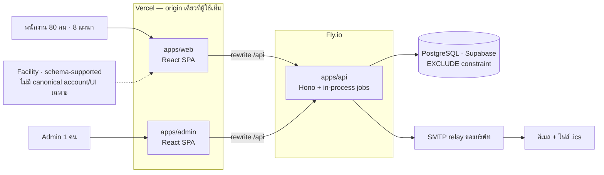

<!-- id: overview -->
## 00 · ภาพรวม (Overview)

# ReserveFlow — ระบบจองห้องประชุม (Meeting Room Booking System)

ReserveFlow คือเว็บจองห้องประชุมภายในของ บริษัท อุ๊ยรวยไม่จำกัด: พนักงานค้นห้องว่าง จองแล้วได้ห้องทันที สแกน QR หน้าห้องเพื่อเช็กอิน และ admin จัดการห้อง/ผู้ใช้/วันหยุด/การตั้งค่า ยกเลิกการจองพร้อมเหตุผลเมื่อจำเป็น และดูรายงานการใช้งาน
เอกสารฉบับนี้เป็น **สเปก as-built ของผลิตภัณฑ์เวอร์ชันสุดท้าย** — ระบุพฤติกรรมที่ส่งมอบจริง, ชุดข้อมูลเริ่มต้น, สัญญา API/DB, การ deploy และขอบเขตที่ยังเป็นงานภายหลังอย่างชัดเจน

> :icon[shield] **การันตีข้อเดียวที่นิยามระบบนี้** — หนึ่งห้อง หนึ่งช่วงเวลา มีการจองที่ถือ slot ได้ **ใบเดียว** และ **ใครกดยืนยันสำเร็จก่อนได้ห้องไปเลย ไม่มีขั้นตอนอนุมัติมาคั่น** ผู้ตัดสินคือ `EXCLUDE` constraint ตัวเดียวของ PostgreSQL ไม่ใช่โค้ดแอป จึงจองซ้อนไม่ได้แม้สองคนกดยืนยันวินาทีเดียวกัน — พิสูจน์ใน CI ด้วย concurrency gate: 100 request พร้อมกัน → `201` ใบเดียว ที่เหลือ `409` การเลื่อนเวลาที่ชนก็ตัดสินด้วยกฎเดียวกัน: ตอบ `409` และใบจองยังอยู่ที่เวลาเดิม ไม่มีจังหวะไหนที่ใบจองไม่ถือ slot ใดเลย

เส้นทาง request ที่ผู้ใช้เห็นมี origin เดียว: Vercel เสิร์ฟ SPA สองชุดและ rewrite `/api` ไปยัง Fly ซึ่งต่อ Supabase PostgreSQL โดยตรง ไม่มี message queue หรือ worker service แยก; งานดูแลระบบใช้ GitHub Actions, SMTP relay และพื้นที่ backup ตามหัวข้อ 09

### ระบบโดยสรุป (System at a glance)

| | |
|---|---|
| :icon[room] ขนาด | **3 ห้องประชุม** (Horizon · Summit · Grove) · ห้องละ **20 คน** + microphone 1 + projector 1 · **8 แผนก** · **พนักงาน 80 คน + admin 1 คน** · บริษัทเดียว · เขตเวลาเดียว **Asia/Bangkok** |
| :icon[clock] เวลา | เว็บใช้ได้ **24 ชม.** · เลือกเวลาประชุมได้เฉพาะ **จ–ศ 08:30–17:30** · **เสาร์–อาทิตย์และวันหยุดที่ admin ตั้ง ไม่มีช่องเวลาให้เลือกเลย** |
| :icon[calendar] กติกาจอง | **ใครกดก่อนได้ก่อน (first-come-first-served) — ไม่มีขั้นตอนอนุมัติ** · ขั้นละ **30 นาที** · ขั้นต่ำ **1 ชม.** · ล่วงหน้า **≤ 30 วัน** แบบ rolling |
| :icon[qr] เช็กอิน | **สแกน QR ที่ป้ายหน้าห้องด้วยมือถือ** (ทางหลัก) หรือกดปุ่มในแอป · **T−15 → T+15** · ไม่มาแล้วปล่อยห้องอัตโนมัติ |
| :icon[server] สถาปัตยกรรม | **3-tier modular monolith**: React SPA ×2 → Hono API + scheduler process เดียว → PostgreSQL; ไม่มี microservice, Redis, message broker หรือ worker service แยก (หัวข้อ 04) |
| :icon[gear] Deployment stack | **Vercel** (web/admin + `/api` proxy) · **Fly.io** `sin` (API/jobs) · **Supabase PostgreSQL** `ap-southeast-1` · **GitHub Actions** (CI/migrate/deploy/backup) · **Cloudflare R2** (encrypted dumps) · SMTP relay ของ operator (หัวข้อ 04 และ 09) |
| :icon[chart] สถานะ | ฟังก์ชันหลัก employee/admin, QR check-in, demo check-in guard และ initializer ส่งมอบแล้ว; configuration สำหรับ topology Vercel → Fly → Supabase อยู่ใน repo แต่ external provisioning/smoke ยังเป็น go-live gate · งานภายหลังแยกไว้ในหัวข้อ 08 |

> ข้อมูลตัวอย่างทั้งเล่ม (ชื่อคน, ตัวเลข utilization, อีเมล) เป็นข้อมูลสมมติ · ชุดเริ่มต้นจริงมีบัญชี credential 81 บัญชีตามรหัส `AU-001`–`AU-081` โดยไม่บันทึกรหัสผ่านไว้ในเอกสารนี้
> ที่มาของเอกสาร การตัดสินใจที่ปิดแล้ว (`D-xx`) คำถามที่ปิดแล้ว (`Q-xx`) และผลการรีวิวฉบับก่อน อยู่ใน **หัวข้อ 11 · ภาคผนวก**

### คู่มือการอ่าน (Reading guide)

| ผู้อ่าน | อ่านหัวข้อ | ใช้เวลา |
|---|---|---|
| :icon[user-check] ผู้บริหาร / เจ้าของ requirement | 00 → **01** → ภาคผนวก H (สิ่งที่ต้องยืนยัน) | 20 นาที |
| :icon[gear] Admin ระบบ / HR | 01 → 03 (flow ฝั่ง admin) → 10 (หน้าจอ A1–A12) → 09 (งาน day-2) | 45 นาที |
| :icon[shield] Tech lead | 00–09 ทั้งเล่ม | 3 ชม. |
| :icon[browser] Developer | 05 (DDL + transactions) → 06 (API) → 07 (โครงสร้างโค้ด) → 08 (ticket ของตน) → 10 (หน้าจอ) | 2 ชม. |
| :icon[check] QA | 02 (RTM) → 09 (test matrix + concurrency gate) → 08 (release gates) | 1 ชม. |
| :icon[server] IT / Ops ของบริษัท | 09 (deploy, backup, day-2) → ภาคผนวก H | 30 นาที |

:::details รหัสที่ใช้อ้างอิงทั้งเล่ม (13 ชุด)

ระยะใช้คำเดียวกันทุกที่: **MVP (W0–W8) · Phase 1.1 · Phase 2**

| รหัส | ความหมาย | อยู่ในหัวข้อ |
|---|---|---|
| `FR-xxx` / `NFR-x` / `US-xxx` | ความต้องการและ user story จาก PDF ต้นฉบับ | 02 |
| `BR-xx` | กฎธุรกิจ | 02 |
| `L-xx` | transition ของ booking lifecycle | 02 |
| `FL-xx` | เส้นทางผู้ใช้ | 03 |
| `P-xx` / `TR-xx` | หลักการออกแบบ / ความเสี่ยงทางเทคนิค | 04 |
| `H1`, `T1`–`T6` | SQL transaction | 05 |
| `C-xx` / `U-xx` | convention ของ API / กติกาการจัดการผู้ใช้ | 06 |
| `T-xxx` / `RK-xx` | ticket / ความเสี่ยงโครงการ | 08 |
| `S-xx` / `TC-xxx` | รายการความปลอดภัย / test case | 09 |
| `E-x`, `A-x`, `K-x` / `UX-xx` / `A11Y-xx` | หน้าจอ / UX fix / รายการ accessibility | 10 |
| `D-xx` / `Q-xx` | การตัดสินใจและคำถามที่ปิดแล้ว | 11 (ภาคผนวก B, C) |
| `R-xx` / `V-xx` | ข้อค้นพบจากการรีวิว | 11 (ภาคผนวก D) |
| `ADR-xxx` | บันทึกการตัดสินใจเชิงสถาปัตยกรรม | 11 (ภาคผนวก G) |

:::

### สารบัญ (Table of contents)

| หัวข้อ | เนื้อหาหนึ่งบรรทัด |
|---|---|
| **01 · ระบบทำอะไร** | บทบาทและสิทธิ์, หน้าจอทั้งหมด, ระยะการพัฒนา, นโยบายการจองแบบภาษาคน |
| **02 · ความต้องการ** | FR-001..017, NFR-1..6, US-001..008, กฎธุรกิจ BR-01..13, lifecycle 5 สถานะ, permission matrix, notification matrix, RTM |
| **03 · เส้นทางผู้ใช้** | FL-01..07 — จอง, เลื่อน/ยกเลิก, admin ยกเลิกให้พร้อมเหตุผล, จัดการผู้ใช้, วันประชุมและ QR หน้าห้อง, การจองพร้อมกัน, ประชุมส่วนตัว |
| **04 · สถาปัตยกรรม** | topology Vercel · Fly.io · Supabase, เส้นทาง request ของการสร้างการจอง, ตาราง stack พร้อมเหตุผลและ runner-up, P-01..07, TR-01..03 |
| **05 · โครงสร้างข้อมูล** | ERD, DDL เต็ม, EXCLUDE constraint A ตัวเดียว, index, SQL ของทุก transaction (T1–T6, H1), jobs, seed, settings, retention |
| **06 · สัญญา API** | conventions C-01..16, visibility 3 ระดับ, error catalogue, endpoint ทุกกลุ่ม, worked examples, authorization matrix, client contract แบบเขียนมือ |
| **07 · โครงสร้างโค้ด** | monorepo 3 apps + 3 packages, route-local schemas, domain services + transaction helpers, migrations และแนวทาง ownership ทีม 1–3 คน |
| **08 · แผนการพัฒนา** | สถานะ as-built, หลักฐานการส่งมอบ, ticket ledger เดิมเพื่อ traceability, backlog และ release gates ที่ยังต้องทำก่อน production |
| **09 · DevOps, ความปลอดภัย และการทดสอบ** | environments, deploy/CI/rollback, S-01..18, test matrix + concurrency gate, observability, backup/runbook |
| **10 · UI และ Mockups** | หน้าจอ E/A/K พร้อม state, design tokens ที่ผ่าน AA, UX-01..21, component map, accessibility checklist, panel ที่ฝัง |
| **11 · ภาคผนวก** | ที่มาของเอกสาร, D-xx, Q-xx, ผลการรีวิว, อภิธานศัพท์, เวอร์ชันที่ pin, ADR-001..008, สิ่งที่ต้องยืนยันกับบริษัท |
