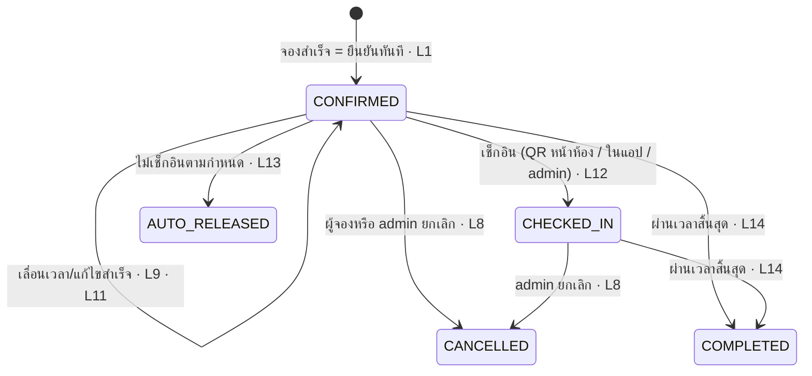
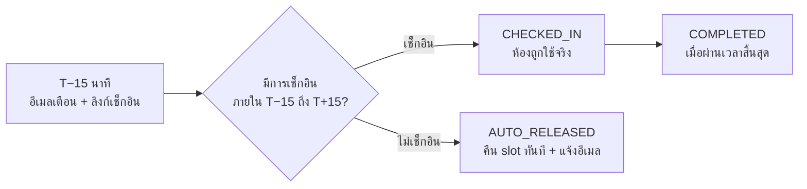

<!-- id: product -->
## 01 · ระบบทำอะไร (Product & Scope)

หัวข้อนี้อ่านจบได้ใน 3 นาที และตอบว่า **ใครใช้ทำอะไร ผ่านหน้าจอไหน ภายใต้กติกาอะไร และของแต่ละอย่างมาถึงเมื่อไร**
พนักงานค้นห้องว่าง → จองแล้วได้ห้องทันที → รับอีเมลพร้อมไฟล์ปฏิทิน → เดินไปสแกน QR หน้าห้องเพื่อเช็กอิน; admin จัดการห้อง/ผู้ใช้/วันหยุด/การตั้งค่า ยกเลิกการจองพร้อมเหตุผลเมื่อจำเป็น และดูรายงานการใช้งาน
กติกา ตัวเลข และรหัสอ้างอิงทุกตัวในหัวข้อนี้มีฉบับเต็มอยู่ใน **หัวข้อ 02 · ความต้องการ**

### 1.1 บทบาทและสิทธิ์ (Roles)

ทุกอย่างอยู่หลังการเข้าสู่ระบบ — ไม่มีหน้าไหนเปิดสาธารณะ; canonical initializer สร้างบัญชี `EMPLOYEE` และ `ADMIN` เท่านั้น. Schema/API รองรับ `FACILITY` แต่ยังไม่มี canonical account หรือหน้าจอเฉพาะ; ถ้าสร้างผ่าน API/CSV จะใช้ self-service booking แบบ EMPLOYEE และไม่มีสิทธิ์ admin

| บทบาท | ทำอะไรได้ | ขอบเขต |
|---|---|---|
| :icon[users] **EMPLOYEE** | ดูปฏิทินและค้นห้องว่าง · จอง (ได้ห้องทันทีถ้าว่าง) · แก้ไข/เลื่อน/ยกเลิก **การจองของตัวเอง** · เช็กอินของตัวเองหรือที่ตัวเองเป็นผู้เข้าร่วม | แตะการจองของคนอื่นไม่ได้ · จองนอกเวลาทำการ วันหยุด หรือเสาร์–อาทิตย์ไม่ได้ |
| :icon[shield] **ADMIN** | ทุกอย่างของ EMPLOYEE + API แก้/เลื่อน/จัดการผู้เข้าร่วมของทุกใบก่อนสิ้นสุด · **ยกเลิกการจองของทุกคนพร้อมเหตุผล** · เช็กอินให้หน้าห้อง · จัดการห้อง ผู้ใช้ วันหยุด การตั้งค่า · รายงาน, email outbox, audit log | **ไม่มีอำนาจอนุมัติหรือปฏิเสธก่อนจอง — ทุกห้องเป็น first-come-first-served** · ยกเลิกให้คนอื่นต้องระบุเหตุผลเสมอ (audit + อีเมลถึงเจ้าของ) · current UI เปิดยกเลิก/เช็กอิน ส่วน drag-and-drop ยังไม่ส่งมอบ · แก้บทบาท/ปิดใช้งานตัวเองหรือ ADMIN คนสุดท้ายไม่ได้ · **ไม่มี override นอกเวลาทำการ** |
| :icon[qr] **FACILITY** (schema-supported) | self-service booking และเช็กอินของตัวเอง/ที่เป็น attendee แบบเดียวกับ EMPLOYEE | ไม่มี canonical account, admin path, staff check-in override หรือ run-sheet เฉพาะ; private BUSY ไม่เห็นชื่อผู้จอง |

:::details กติกาสิทธิ์ที่ต้องรู้ก่อนเขียนโค้ด (5 ข้อ)

- บังคับสิทธิ์ด้วย `createRequireAuth()`/`createRequireAdmin()` ที่ route, ownership/status check ใน route และ service และ row-scoping ในคิวรี; ไม่มี `can()` module กลาง
- Resource ที่บทบาทนั้นไม่ควรรู้ว่ามีอยู่ (`/admin/*`, ผู้ใช้คนอื่น) ตอบ **404** ไม่ใช่ 403
- ข้อยกเว้นคือ booking: ทุกคนเห็นได้อย่างน้อยระดับ "ไม่ว่าง" ดังนั้น `GET /bookings/:id` คืน view ที่ถูก mask ส่วน action ที่ไม่มีสิทธิ์บนใบที่มองเห็นอยู่ตอบ **403** (หัวข้อ 06, `C-15`)
- Nav ฝั่ง client render จาก map `role → items` และ route guard ฝั่ง server คืนหน้า 403 จริง ไม่ใช่หน้าว่าง
- **ตารางสิทธิ์ฉบับเต็ม 16 แถว × 3 บทบาท อยู่ในหัวข้อ 02 · ความต้องการ (Permission matrix)**

:::

### 1.2 หน้าจอทั้งหมด (Screen inventory)

สองแอปใช้ cookie session เดียวกัน; รายการด้านล่างบันทึกหน้าจอที่ส่งมอบจริงและ state สำคัญ ส่วนรายละเอียด component/copy อยู่ในหัวข้อ 10 · UI ที่ส่งมอบ

**:icon[browser] `apps/web` — พนักงาน**

- :icon[lock] `E0` **เข้าสู่ระบบ** — `employee_code` + รหัสผ่าน และ "Remember me" เท่านั้น; ไม่มี email, mobile, forgot-password หรือสมัครสมาชิกใน employee web
- :icon[room] `E1` **ค้นหาห้อง `/rooms`** — หน้าแรกหลัง login แสดง Horizon, Summit และ Grove เท่านั้น พร้อมปุ่มเปิด filter กะทัดรัด (วันที่ เวลา จำนวนคน อุปกรณ์); `/` เป็น compatibility redirect มาหน้านี้
- :icon[room] `E2` **ผลค้นหาห้อง** — state ใน `/rooms` เดิม แสดงเหตุผลของห้องที่ไม่ผ่าน filter โดยไม่สร้าง dashboard แยก
- :icon[clock] `E3` **ห้อง & เวลา** — รายละเอียดภาษาไทย + badge `Auto-approve`, shared Buddhist date picker และตารางช่องละ 30 นาที
- :icon[doc] `E4` **ฟอร์มจอง** — หัวข้อ รายละเอียด จำนวนคน สวิตช์ประชุมส่วนตัว และคำขอพิเศษ; ไม่มี email/mobile/ผู้เข้าร่วมใน UI
- :icon[info] `E5` **รายละเอียดการจอง** — สถานะ + ไทม์ไลน์ + ปุ่มแก้ไข/เลื่อน/ยกเลิก/เช็กอิน; ฟอร์มแก้รายละเอียดและเลื่อนเวลาเปิด inline ในหน้าเดิม
- :icon[calendar] `E6` **การจองของฉัน** — แท็บกำลังจะถึง / ประวัติ + quick filter สถานะ; local development อาจแสดงปุ่ม "เดโม: ทดลองเช็กอิน" เมื่อ server ประกาศ capability
- :icon[refresh] `E7` **เลื่อนเวลา / แก้ไข** — เป็น inline state ของ `E5`, reuse date picker + `SlotGrid`; ชนแล้วเห็นทางเลือกและ **ใบจองยังอยู่ที่เวลาเดิม**
- :icon[x] `E8` **ยืนยันยกเลิก** — บอกผลก่อนกด: คืน slot ทันที · กู้คืนไม่ได้
- :icon[calendar] `E9` **ตารางเวลา** — บอร์ดอ่านอย่างเดียว รายวัน/สัปดาห์ของสามห้อง; ช่องไม่ว่างแสดงชื่อผู้จองตาม privacy allowlist และช่องที่เวลาผ่านครบแล้วเป็นสีเทาทึบ
- :icon[qr] `E10` **เช็กอินจาก QR หน้าห้อง** (MVP) — `/check-in/:roomCode` แสดงข้อมูลแล้วรอให้กด "เปิดใช้งานการจอง" โดยเจตนา จากนั้นแสดงแผงผลสำเร็จหรือไม่สำเร็จในหน้าเดิม
- :icon[gear] `E11` **โปรไฟล์** — ชื่อ รหัสพนักงาน แผนก เปลี่ยนรหัสผ่าน และขนาดตัวอักษร; ไม่แสดง email/mobile
- :icon[bell] `E12` **กระดิ่งแจ้งเตือน** (1.1) · :icon[warn] `E13` **หน้า 403 / 404 / session หมดอายุ / 500** ภาษาไทย

เมนูพนักงานบนจอใหญ่เริ่มด้วยปุ่มหลัก **ค้นหาห้อง** แล้วเรียง **การจองของฉัน → ตารางเวลาห้องทั้งหมด → โปรไฟล์** โดยไม่มีหน้า "หน้าแรก"; จอมือถือเพิ่มค้นหาห้องเป็น tab แรก บัญชี `ADMIN` เท่านั้นที่เห็นตัวสลับโหมด User/Admin ที่ท้าย left rail

**:icon[gear] `apps/admin` — ผู้ดูแลระบบ**

- :icon[chart] `A1` **ภาพรวม** — KPI การใช้ห้อง, no-show, สิ่งที่ต้องดำเนินการ
- :icon[calendar] `A3` **ปฏิทินห้อง** — บอร์ดเดียวกับ `E9` แต่เห็นทุกรายการ + เช็กอินให้ (ลากวาง = 1.1)
- :icon[doc] `A4` **การจองทั้งหมด** — ตารางกรองตามห้อง/ผู้ใช้/สถานะ/วันที่ + ยกเลิกพร้อมเหตุผล + เช็กอินให้
- :icon[info] `A5` **รายละเอียดการจอง (admin)** — เหมือน `E5` + audit trail + ปุ่มยกเลิกพร้อมเหตุผล
- :icon[room] `A6` **ห้องประชุม** · `A7` **แก้ไขห้อง** — ความจุ ชั้น อุปกรณ์ รหัสห้องบนป้าย QR เปิด/ปิดปรับปรุง
- :icon[users] `A8` **ผู้ใช้งาน** · `A9` **สร้าง/แก้ไขผู้ใช้** — ค้นหา, CSV import แบบลองก่อนจริง, ปิดใช้งาน
- :icon[gear] `A10` **ตั้งค่า** — นโยบายการจอง, เวลาทำการและวันทำการ (ชุดเดียวทุกห้อง), วันหยุด
- :icon[chart] `A11` **รายงาน** — utilization, no-show, heatmap (CSV export = 1.1)
- :icon[shield] `A12` **บันทึกระบบ** — audit log อ่านอย่างเดียว

**:icon[qr] อื่น ๆ** — `K3` **run-sheet ของ Facility** (Phase 1.1) รายวันต่อห้อง โดยประชุมส่วนตัวถูก mask

### 1.3 สถานะส่งมอบและงานต่อ (Delivery status)

| ระยะ | สถานะ | ได้อะไร |
|---|---|---|
| **Final baseline** | ส่งมอบใน repository | ค้นหา 3 ห้อง → จองยืนยันทันที → ดู/แก้/เลื่อน/ยกเลิก → calendar → QR/self/admin check-in → auto-release → รายงานและ admin management; notification/outbox และ account-email API ยังคงอยู่หลังบ้าน แต่ employee UI ไม่แสดง email/attendee/forgot/set-password surface |
| **Phase 1.1** | backlog | ลากวางบนปฏิทินฝั่ง admin, run-sheet ของ Facility, กระดิ่งในแอป, CSV export และ filter polish (`T-102`…`T-108`) |
| **Phase 2** | backlog | SSO, จองซ้ำ/waitlist, จอหน้าห้อง, analytics เพิ่มเติม และ observability automation — เปิดเมื่อธุรกิจขอและมีตัวเลขรองรับ |

> W0–W8 และ ticket estimates ในหัวข้อ 08 เป็น planning ledger เดิมเพื่อ traceability ไม่ใช่สถานะของ final baseline หรือคำยืนยันว่า pipeline/staging/UAT ทุกข้อเคยรันแล้ว

### 1.4 นโยบายการจอง (Booking policy)

**ใครกดก่อนได้ก่อน — ไม่มีขั้นตอนอนุมัติ ไม่มีคำขอค้าง** จองสำเร็จคือได้ห้องทันที คนที่กดทีหลังรู้ผลทันทีเช่นกัน
เว็บเปิดตลอด 24 ชั่วโมง แต่ **เวลาประชุมที่เลือกได้อยู่ในเวลาทำการเท่านั้น** (ค่าเริ่มต้น จ–ศ 08:30–17:30) จองสั้นสุด 1 ชั่วโมง เลือกได้ทีละครึ่งชั่วโมง ไม่มีเพดานความยาว และล่วงหน้าได้ไม่เกิน 30 วัน
ค่าทั้งหมดข้างล่างเป็นค่าเริ่มต้นที่ admin แก้ได้ในหน้า `A10` ยกเว้นที่เขียนว่า fixed

| เรื่อง | ค่าเริ่มต้น | อ้างอิง |
|---|---|---|
| :icon[clock] เวลาทำการ | จ–ศ 08:30–17:30 · ชุดเดียวใช้ทุกห้อง · **เสาร์–อาทิตย์และวันหยุดที่ admin ตั้ง ไม่มี slot ให้เลือกเลย** (seed วันหยุดราชการไทย) | `BR-01` |
| :icon[calendar] ความยาว | ช่องละ 30 นาที · ขั้นต่ำ 60 นาที · ไม่มีเพดาน · ไม่มี buffer ระหว่างการประชุม | `BR-02` |
| :icon[arrow-right] ล่วงหน้า | ≤ 30 วันแบบ rolling · จองเดี๋ยวนี้ก็ได้ โดยเวลาเริ่มปัดขึ้นครึ่งชั่วโมงถัดไป | `BR-02` |
| :icon[check] ช่วงเวลา | นับแบบ `[start, end)` — 13:00–14:00 กับ 14:00–15:00 **ไม่ชนกัน** (fixed) | `BR-03` |
| :icon[lock] ใครได้ห้อง | **first-come-first-served ทุกห้องเหมือนกันหมด** — ยืนยันสำเร็จ = ได้ห้องทันที, ชน = `409` พร้อมช่วงเวลาที่ยังว่าง (fixed) | `BR-04` |
| :icon[refresh] เลื่อนเวลาแล้วชน | ใบจอง **อยู่ที่เวลาเดิม** ไม่มีจังหวะไหนที่ไม่ถือ slot ใดเลย (fixed) | `BR-05` |
| :icon[qr] เช็กอิน | สแกน QR หน้าห้อง (ทางหลัก) หรือปุ่มในแอป · T−15 → T+15 นาที · ไม่เช็กอิน = ปล่อยห้องคืนอัตโนมัติ | `BR-08` |

**สิ่งที่ตามมาจากกติกา "ใครกดก่อนได้ก่อน"**

- :icon[check] ผล `POST /bookings` มีสองทางเท่านั้น — สำเร็จได้ `201` สถานะ `CONFIRMED` ซึ่ง employee UI แสดงว่า **จองแล้ว** (domain/admin ใช้ "ยืนยันแล้ว") หรือชนได้ `409 SLOT_UNAVAILABLE` พร้อมช่วงเวลาที่ยังว่างให้เลือกต่อในหน้าจอเดียวกัน ไม่มีทางที่สาม ไม่มีการรอ
- :icon[refresh] เลื่อนเวลาไปทับใบอื่นก็ตัดสินด้วยกฎเดียวกันและ **ไม่เสียของเดิม**: ระบบตอบ `409` แล้วใบจองยังอยู่ที่เวลาเดิมทุกประการ (`BR-05`) — inline panel `E7` ในหน้า `E5` แสดงว่าชนกับอะไรและเสนอทางเลือก ไม่มีการย้อนเงียบ ๆ และไม่มีการจองหาย
- :icon[x] admin ไม่ได้อนุมัติหรือปฏิเสธอะไร การแทรกแซงเดียวที่ admin มีต่อการจองของคนอื่นคือ **ยกเลิกพร้อมเหตุผลบังคับ** ซึ่งถูกบันทึก audit และส่งอีเมลแจ้งเจ้าของเสมอ (`BR-07`)

อ่านจากแผนภาพ: มีทางเข้าเดียวและมีแค่ 5 สถานะ — เส้นทางปกติคือ CONFIRMED → CHECKED_IN → COMPLETED ส่วนทางออกอีกสองทางคือ CANCELLED และ AUTO_RELEASED ใบจองถือ slot จริงเฉพาะ `CONFIRMED` และ `CHECKED_IN` เท่านั้น สถานะที่เหลือคืนห้องโดยไม่ลบข้อมูลและย้อนกลับไม่ได้ — employee UI ใช้คำว่า **จองแล้ว · เช็กอินแล้ว · เสร็จสิ้น · ยกเลิกแล้ว · ไม่ได้เช็กอิน** ขณะที่ domain/admin ยังคงใช้ **ยืนยันแล้ว** และ **ปล่อยอัตโนมัติ** ตามลำดับ

**เช็กอินและการปล่อยห้องอัตโนมัติ** — ทางหลักคือเดินไปถึงห้องแล้ว **สแกน QR ที่ป้ายกระดาษหน้าห้อง** ด้วยมือถือ: ระบบหาใบจองของคนที่สแกนในห้องนั้นให้เอง แต่ไม่เช็กอินตอนเปิดหน้า ผู้ใช้ต้องกด "เปิดใช้งานการจอง" แล้วจึงเห็นแผงผลสำเร็จหรือไม่สำเร็จในหน้าเดิม (ผู้จองยังได้อีเมลเตือนพร้อมลิงก์เช็กอินจากระบบหลังบ้าน ส่วน admin กดให้ได้จนถึงเวลาสิ้นสุด) หน้าต่างเช็กอินคือ T−15 ถึง T+15 ถ้าไม่มีใครเช็กอินภายในเส้นตายนั้น ระบบเปลี่ยนสถานะเป็น `AUTO_RELEASED` คืนห้องทันที และแจ้งผู้เกี่ยวข้องผ่าน notification backend

งานตามเวลา `booking.sweep` ทำงานทุกนาทีเป็นผู้ผลิตสถานะ `AUTO_RELEASED` และ `COMPLETED` — ไม่มีสถานะไหนรอให้ผู้ใช้มากดเอง
ขั้นตอนการสแกนและรหัสเหตุผลของแผงผลทั้งสองแบบอยู่ในแผนภาพ `qr-checkin` ที่ [หัวข้อ 03 · เส้นทางผู้ใช้](#flows) (`FL-05`) — ระบบนี้สร้างเฉพาะฝั่งแอป **ตัวควบคุมประตูและฮาร์ดแวร์ล็อกอยู่นอกขอบเขต**

:::details ประชุมส่วนตัว — ใครเห็นอะไร (`BR-09`)

การซ่อนข้อมูลทำที่ serializer ของ API เท่านั้น ไม่ใช่ที่ฝั่ง client — client จึงไม่มีทางได้ข้อมูลที่ไม่ควรเห็นติดมากับ response

| ผู้ดู | เห็นอะไรบนใบที่ตั้งเป็นส่วนตัว |
|---|---|
| ผู้จอง · ผู้เข้าร่วมที่อีเมลตรงกับบัญชี · ADMIN | เห็นเต็ม |
| พนักงานทั่วไป | เห็น "ไม่ว่าง" + ห้องและเวลา; เฉพาะ calendar เติม `owner_display_name` เป็น "ผู้จอง: <ชื่อ>" โดยไม่ส่ง title, owner object, แผนก หรือ email |
| FACILITY ที่ไม่เกี่ยวข้อง | BUSY แบบเดียวกับพนักงานทั่วไป แต่ private calendar ไม่เติม `owner_display_name`; ไม่มี headcount/special_request |

:::

:::details บัญชีผู้ใช้และการเข้าสู่ระบบ (`BR-10`)

- ไม่มีการสมัครสมาชิกเอง — ฐานข้อมูลเริ่มต้นสร้าง `AU-001`–`AU-081` ผ่าน guarded initializer; admin/API ยังรองรับสร้างทีละคนและ CSV import
- เข้าสู่ระบบด้วย `employee_code` + รหัสผ่านเท่านั้น; employee web ไม่แสดง email/mobile/forgot-password แม้ email ยังอยู่ภายในระบบสำหรับ credential, account workflow และ notification
- รหัสผ่านอย่างน้อย 10 ตัวอักษร, ล็อกบัญชี 15 นาทีเมื่อผิด 5 ครั้ง, session 7 วันแบบ sliding — ติ๊ก "จำฉันไว้" = คุกกี้ค้างเครื่อง, ไม่ติ๊ก = ออกจากระบบเมื่อปิดเบราว์เซอร์
- backend สร้าง token/ลิงก์ตั้งรหัสผ่านสำหรับ invite และ admin reset ได้ แต่ final employee web ซ่อนหน้า redeem และ API ไม่มี self-service forgot endpoint จึงไม่ถือเป็น employee flow ที่พร้อมใช้งานจนกว่าจะคืน route ที่จำเป็นหรือเชื่อม identity workflow ภายนอก
- การสแกน QR หน้าห้องต้องล็อกอินเสมอ — ยังไม่ได้ล็อกอินจะถูกพาไป `E0` แล้วกลับมาที่ URL เดิม
- ปิดใช้งานบัญชี = เพิกถอนทุก session + ยกเลิกการจองในอนาคตของคนนั้นพร้อมแจ้งผู้เกี่ยวข้อง; ลบถาวรได้เฉพาะบัญชีที่ยังไม่เคยมีประวัติ

:::

:::details การแจ้งเตือนและการแก้ข้อมูลหลัก (`BR-11`)

- notification backend เขียนอีเมลภาษาไทยลง outbox และ retry ผ่าน SMTP — **อีเมลล้มเหลวไม่ทำให้การจองหายไป**; การส่งจริงต้องตรวจ relay/credentials ใน environment ปลายทางและ employee UI ไม่สัญญาว่าอีเมลถูกส่งแล้ว
- 5 เหตุการณ์ของการจองที่ส่งอีเมล: ยืนยันแล้ว · ยกเลิก · เลื่อนเวลา · เตือนก่อนเริ่ม 15 นาที · ปล่อยอัตโนมัติ (บวกอีเมลบัญชีสำหรับตั้งรหัสผ่าน; ตารางเต็มอยู่ในหัวข้อ 02)
- การเช็กอินไม่ส่งอีเมล — ผู้ใช้เห็นผลทันทีบนแผงผลในหน้าจอมือถือ
- ทุกอีเมลที่เกี่ยวกับตัวใบจองแนบไฟล์ `.ics` (ยกเว้นอีเมลเตือนและอีเมลอธิบายที่ส่งถึง admin) ปฏิทินของผู้รับจึงอัปเดตหรือลบ event ตามจริง
- แก้ข้อมูลหลัก (เวลาทำการ ความจุ อุปกรณ์ วันหยุด ปิดห้องปรับปรุง) **ไม่ยกเลิกการจองเดิมอัตโนมัติ** — มีผลกับการจองใหม่เท่านั้น และหน้าจอ admin แสดงรายการที่ได้รับผลกระทบให้ตัดสินใจเอง

:::
