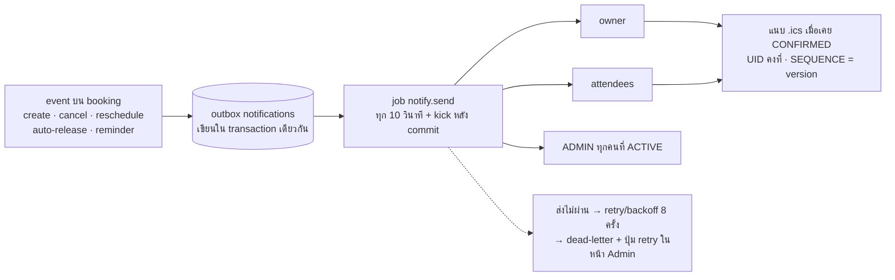

<!-- id: requirements -->
## 02 · ความต้องการ (Requirements)

<!-- section-id: requirements -->

ระบบมี requirement 17 ข้อ (FR-001..FR-017), เกณฑ์คุณภาพ 6 ข้อ (NFR-1..NFR-6) และกฎธุรกิจ 13 ข้อ (BR-01..BR-13). RTM ใน §2.7 ผูกแต่ละข้อกับหน้าจอ, endpoint, schema และรหัส test; รหัส TC เป็น traceability identifier ส่วนสถานะ automation จริงให้อ่านหัวข้อ 09 ซึ่งระบุชัดว่า browser E2E ยังเป็น manual plan

:icon[warn] **สองข้อที่ไม่ได้ทำตามที่เอกสารต้นทางระบุ** ตามมติลูกค้า (CB-01): **FR-005** (โหมด Auto/Manual ต่อห้อง) และ **FR-006** (Admin อนุมัติหรือปฏิเสธคำขอพร้อมเหตุผล) — ทุกห้องเป็น **first-come-first-served** ยืนยันทันทีที่ commit และการ “ปฏิเสธ” ถูกแทนด้วยการยกเลิกพร้อมเหตุผล. API ปัจจุบันยังให้ ADMIN แก้/เลื่อนเวลา/จัดการผู้เข้าร่วมและเช็กอินเพื่อปฏิบัติการได้ตาม lifecycle table; employee/admin UI ที่ส่งมอบเปิดเฉพาะ action ที่ระบุในหัวข้อ 10. รายละเอียดอยู่ในตาราง §2.1 และ RTM §2.7 ทั้งสองข้อยังคงเลขและลำดับความสำคัญเดิมเพื่อให้ผู้เซ็นรับเห็นส่วนต่างชัด ๆ ไม่ใช่ถูกลบทิ้ง

คำว่า **MVP** ใน requirement/RTM หมายถึง final functional baseline ที่อยู่ใน repository; **Phase 1.1** และ **Phase 2** เป็น backlog. W0–W8 และ staffing estimates ในหัวข้อ 08 เป็น planning ledger เดิม ไม่ใช่สถานะการส่งมอบปัจจุบัน

### 2.1 :icon[doc] ความต้องการเชิงหน้าที่ (FR-001..FR-017)

FR-001..012 คงเลขและลำดับความสำคัญเดิมจากเอกสารความต้องการต้นทาง ส่วน FR-013..017 เพิ่มเข้ามาเพราะระบบทำงานไม่ได้ถ้าไม่มี (ไม่มี self-registration → บัญชีต้องเกิดจากหน้าจัดการผู้ใช้) และใช้ลำดับความสำคัญที่ทีมกำหนดเอง

| ID | ชื่อ | Priority | Phase |
|---|---|---|---|
| FR-001 | Calendar View แสดงสถานะว่าง/ไม่ว่างของแต่ละห้อง | Must | MVP |
| FR-002 | ค้นหาห้องว่างจากวันที่ เวลาเริ่ม เวลาสิ้นสุด | Must | MVP |
| FR-003 | Conflict Check ณ วินาทีที่กดยืนยัน | Must | MVP |
| FR-004 | ใส่หัวข้อ รายละเอียด จำนวนคน ความเป็นส่วนตัว และความต้องการพิเศษ | Must | MVP |
| FR-005 | ห้องตั้งค่าได้ 2 โหมด Auto / Manual | Must | ไม่ทำตามที่ระบุ (CB-01) |
| FR-006 | Admin Approve / Reject พร้อมเหตุผล | Must | แทนด้วยยกเลิกพร้อมเหตุผล (CB-01) |
| FR-007 | Invite attendees และส่ง .ics | Should | Backend/API capability; ไม่เปิดใน employee UI |
| FR-008 | แก้ไขเวลาหรือยกเลิก คืน slot ทันที | Must | MVP |
| FR-009 | อีเมลเมื่อจองสำเร็จ ถูกยกเลิก เลื่อนเวลา | Must | Backend/outbox ส่งมอบ; relay ปลายทางต้อง verify |
| FR-010 | Check-in หน้าห้อง; ไม่ check-in ใน 15 นาที → ยกเลิกอัตโนมัติ | Could | MVP |
| FR-011 | Filter คุณสมบัติห้อง (Projector, 20+ คน) | Should | MVP |
| FR-012 | Admin ดู Utilization Rate | Could | MVP basic · CSV 1.1 · polish 2 |
| FR-013 | จัดการผู้ใช้ (สร้าง เชิญ CSV import role deactivate reset ลบ) | Must | Admin/API ส่งมอบ; employee invite/reset landing ซ่อนอยู่ |
| FR-014 | จัดการห้อง วันหยุด และ Settings | Must | Delivered |
| FR-015 | Audit log viewer สำหรับ ADMIN | Should | MVP W5 |
| FR-016 | Check-in ทางเดียว 3 ทางเข้า (QR หน้าห้อง / ตัวเอง / admin) | Should | MVP |
| FR-017 | My bookings + Booking detail + Reschedule / Cancel UX | Must | MVP W3 |

:::details พฤติกรรมและเกณฑ์ตรวจรับรายข้อ (17 ข้อ)

**FR-001..FR-012 — จากเอกสารความต้องการต้นทาง**

| ID | พฤติกรรม | Acceptance (Given / When / Then) |
|---|---|---|
| FR-001 | Day view = 3 คอลัมน์ Horizon/Summit/Grove × 18 แถว, Week view = 1 ห้อง × วัน; booking cell แสดงชื่อผู้จองตาม calendar allowlist. Employee calendar ทำช่องว่างที่ elapsed เป็นสีเทา/เลือกไม่ได้ แต่ booked cell ที่ elapsed ยังคงสี busy; admin calendar และ room-detail grid ยังไม่มี past styling แบบเดียวกัน | Given มี booking Horizon 13:00–14:00 · When เปิด Day view · Then cell แสดงสถานะ/ชื่อผู้จองตาม privacy; elapsed blank cell เลือกไม่ได้. ความสอดคล้อง past styling ทุก grid เป็น known UI gap |
| FR-002 | `GET /availability?start&end&headcount&features` คืน **ทุกห้อง active พร้อม verdict + reasons** (BUSY / CLOSED / HOLIDAY / CAPACITY / MISSING_FEATURE) เพื่อให้ empty-state อธิบายได้; availability และ create booking ใช้ policy/settings ชุดเดียวกันใน API โดย POST ยังเป็นผู้ตัดสินสุดท้าย | Given Horizon ไม่ว่าง 13:00–14:00 · When ค้นหา 13:00–14:00 · Then ผลลัพธ์ไม่มีห้องที่มี CONFIRMED/CHECKED_IN ทับช่วง และ Horizon แสดงเหตุผล BUSY (TC-AVL-002) |
| FR-003 | ตรวจใน transaction เดียวตาม **ลำดับ lock กลาง** (นิยามที่เดียว: 05 โครงสร้างข้อมูล §5.6 — ห้ามเริ่มด้วย lock ห้อง, C2-01): advisory lock `(actor, Idempotency-Key)` → อ่านใบเดิมแบบไม่ล็อก (ถ้ามี) → ล็อกแถว `users` ทั้ง actor+owner เรียงตาม id → `pg_advisory_xact_lock(hashtext(room_id))` ทุกห้องที่เกี่ยว เรียงตาม hashtext → validate → INSERT; **PostgreSQL EXCLUDE constraint เป็นด่านสุดท้าย**; ชนแล้วตอบ `409 SLOT_UNAVAILABLE` + ห้องอื่นที่ว่างในช่วงเดียวกัน; `Idempotency-Key` กันดับเบิลคลิก | Given A และ B กดจอง slot เดียวกันพร้อมกัน 100 request · When commit · Then มี 201 เพียง 1 รายการ ที่เหลือ 409 และ DB มีแถว live 1 แถว (TC-CON-001, TC-IDEM-011) |
| FR-004 | ฟิลด์ที่ employee web แสดง: title (1–200), description, `headcount` (จำนวนคน — ข้อมูลประกอบ), special_request และ `is_private`; ไม่มี email/mobile/attendee editor ใน create, edit, detail หรือ profile; web ตรวจฟอร์มเพื่อ UX ส่วน API ใช้ route-local Zod + service policy เป็นผู้ตัดสิน โดย API ยังรองรับ attendees เป็น internal contract | Given กรอก headcount 25 ในห้องจุ 20 · When submit · Then UI เตือน "เกินความจุห้อง" แต่บันทึกได้ (D-30c) และ special_request ไม่ถูกส่งให้ viewer ระดับ PUBLIC/BUSY (TC-VAL-012, TC-PRV-004) |
| FR-005 | :icon[warn] **ไม่ได้ทำตามที่ระบุ (มติลูกค้า CB-01)** — ไม่มีโหมดต่อห้อง ทุกห้องเป็น first-come-first-served เหมือนกันหมด: การจองที่ commit สำเร็จเป็น `CONFIRMED` ทันทีใต้ constraint A (BR-04) หน้า Admin Room edit (A7) จึงไม่มีฟิลด์โหมดอนุมัติ | ไม่มี acceptance เพราะไม่ได้ส่งมอบความสามารถนี้ — ส่วนต่างถูกบันทึกใน RTM §2.7 และรายการที่ต้องยืนยันกับบริษัท (ภาคผนวก H) ให้ผู้เซ็นรับเห็นก่อนอนุมัติ |
| FR-006 | :icon[warn] **แทนที่ขั้นปฏิเสธด้วยสิทธิ์ยกเลิกของ admin (มติลูกค้า CB-01)** — ไม่มีการอนุมัติ/ปฏิเสธล่วงหน้า; admin ยกเลิกการจองของคนอื่นได้โดยต้องใส่เหตุผล (≥ 3 ตัวอักษร) ผ่าน `POST /bookings/:id/cancel` → audit + อีเมล `booking.cancelled` ถึงเจ้าของและผู้เข้าร่วม (BR-07). สิทธิ์แก้/เลื่อน/เช็กอินเชิงปฏิบัติการเป็นคนละเรื่องและอยู่ใน L9/L11/L12 | Given booking ของพนักงานคนหนึ่ง · When admin กดยกเลิกโดยไม่ใส่เหตุผล · Then `422 REASON_REQUIRED`; When ใส่เหตุผลแล้วยืนยัน · Then สถานะเป็น CANCELLED, slot ว่างทันที, เจ้าของได้อีเมลที่มีเหตุผลนั้น และมีแถว audit `booking.cancel` พร้อม reason (TC-CAN-005, TC-AUD-016) |
| FR-007 | Internal attendee/outbox contract ยังรองรับ `.ics METHOD:REQUEST` เมื่อ CONFIRMED, `SEQUENCE+1` เมื่อ RESCHEDULED และ `METHOD:CANCEL` เมื่อ CANCELLED/AUTO_RELEASED; UID คงที่ = booking id แต่ final employee web ไม่แสดง attendee/email field, attendee list หรือ resend-invite action | Given client ภายใน/API สร้าง booking ที่มี attendee 2 คน · When เลื่อนเวลา · Then attendees ได้อีเมลใหม่ที่มี .ics UID เดิม SEQUENCE สูงขึ้น และ Google/Outlook อัปเดต event เดิม โดย employee UI ไม่มีข้อมูลอีเมลนั้น (TC-EMAIL-014, TC-EDIT-013) |
| FR-008 | Reschedule = re-run policy ทั้งชุด (BR-06); Cancel = เปลี่ยนสถานะ ไม่ลบ (BR-07); slot ว่างทันทีที่ commit เพราะแถวหลุดจาก partial index | Given เปิด My Bookings · When กดยกเลิกและยืนยัน · Then สถานะเป็น CANCELLED และ browser อีกเครื่องเห็น slot ว่างใน availability ทันที (TC-CAN-005) |
| FR-009 | ทุก event ใน §2.6 เขียนลง outbox `notifications` ใน transaction เดียวกับ booking (เอกสารต้นทางเขียนว่า "ถูกปฏิเสธ" — เมื่อไม่มีขั้นอนุมัติแล้ว เหตุการณ์ที่ตรงกันคือ **admin ยกเลิกพร้อมเหตุผล** ซึ่งส่ง `booking.cancelled` ที่มีเหตุผลอยู่ในตัว, CB-01); job `notify.send` (in-process scheduler ทุก 10 วินาที + kick หลัง commit) ส่งผ่าน SMTP relay ของบริษัท; retry/backoff + dead-letter; **email ล้มเหลวไม่ rollback การจอง** | Given SMTP ล่ม · When จองสำเร็จ · Then booking เป็น CONFIRMED, แถว outbox เป็น FAILED หลัง retry และถูกส่งซ้ำเมื่อ SMTP กลับมา (TC-EMAIL-014, TC-JOB-020) |
| FR-010 | กฎ no-show: job `booking.sweep` ทุกนาที เปลี่ยน CONFIRMED ที่ `checked_in_at IS NULL AND LEAST(end_at, start_at + checkin_grace_minutes) ≤ now()` → AUTO_RELEASED (เส้นตายเดียวกับ check-in = `effective_self_deadline`, 05 §5.5 — CF-02; setting `checkin_grace_minutes`=15, `auto_release_enabled`=true); QR = **ป้ายพิมพ์ติดหน้าห้อง** คงที่ต่อห้อง deep-link `/check-in/:roomCode` ไม่มี token หมุน — เป็นทางเข้าหลักของ check-in และอยู่ใน MVP; วิธี check-in ดู FR-016 | Given booking CONFIRMED เริ่ม 13:00 ไม่มี check-in · When เวลา 13:15 · Then สถานะเป็น AUTO_RELEASED, slot ค้นหาได้ทันที, owner + admins ได้อีเมล และ job รันซ้ำไม่สร้างผลซ้ำ (TC-QR-006, TC-JOB-020) |
| FR-011 | `headcount` + `features[]` เป็นพารามิเตอร์ของ `GET /availability` และ `GET /rooms`; ห้องที่ไม่ผ่านยังแสดงพร้อมเหตุผล CAPACITY / MISSING_FEATURE (PDF ให้ Should แต่ US-001 เป็น Must จึงส่งใน MVP) | Given ค้นหา 10 คน + projector 13:00–14:00 · When ส่ง · Then แสดงเฉพาะห้องว่างที่จุ ≥ 10 และมี projector และห้องอื่นมี reason (TC-AVL-002) |
| FR-012 | สูตร BR-13; แสดงต่อห้อง/ต่อเดือน เป็น `<table>` + CSS bar, no-show rate แยกต่างหาก, heatmap weekday×hour แบบตาราง; `GET /admin/reports/utilization` | Given ข้อมูล seed 1 เดือน · When เปิดหน้า Report เลือกเดือน · Then ตัวเลข % ต่อห้องตรงกับ SQL oracle และ denominator ไม่นับวันหยุด/นอกเวลาทำการ (TC-RPT-018) |

**FR-013..FR-017 — เพิ่มโดยทีมพัฒนา** (คอลัมน์ "ทำไมต้องมี" คือเหตุผลที่ยอมเพิ่มขอบเขต; อ้างอิงผลรีวิว R-xx / V-01 อยู่ใน ภาคผนวก D)

| ID | Requirement (เต็ม) | ทำไมต้องมี | พฤติกรรม | Acceptance (Given / When / Then) |
|---|---|---|---|---|
| FR-013 | Admin user management: สร้าง / เชิญ / CSV import (dry-run) / แก้ข้อมูล / role / department / deactivate-reactivate / reset password / ลบ | ไม่มี self-registration → บัญชีเกิดได้ทางนี้ทางเดียว (R-01) | A8/A9; `POST /admin/users` → สถานะ INVITED + อีเมล set-password token (invite 7 วัน; admin reset 24 ชม. — D-29); `POST /admin/users/import?dry_run=true` upsert ด้วย employee_code (≤ 1,000 แถว); deactivate = DISABLED + ลบ session ทั้งหมด + ยกเลิก booking ในอนาคตของคนนั้น (แจ้ง attendees); reset ใช้ token contract เดียวกับ invite; hard delete ได้เฉพาะไม่มีประวัติ (`409 USER_HAS_HISTORY`); ห้าม deactivate/ลด role ตัวเอง หรือ ADMIN คนสุดท้าย (`409 CANNOT_MODIFY_SELF` / `LAST_ADMIN`); ทุก action ลง audit. Schema ยังสงวน `FORGOT` แต่ final API ไม่มี self-service forgot route | Given admin import CSV 80 แถว แบบ dry-run · When ส่ง · Then ได้สรุป create/update/skip/error รายแถวโดย DB ไม่เปลี่ยน; When import จริง · Then ทุกคนได้อีเมลลิงก์ตั้งรหัสผ่านและ login ได้หลังตั้ง; Given user ถูก deactivate · When เรียก API ด้วย session เดิม · Then 401 (TC-USR-017, TC-AUTH-009) |
| FR-014 | Admin จัดการห้อง (ชื่อ ที่ตั้ง ความจุ features รูป active) + วันหยุด + Settings (policy ตาม BR) | ห้อง/ความจุ/อุปกรณ์เป็นข้อมูลที่ FR-002/FR-011 ใช้ค้นหา และไม่มีทางแก้ได้เลยถ้าไม่มีหน้านี้ (R-05); FR-012 ต้องมี holidays เป็น denominator; วันหยุด/เวลาทำการเป็นตัวกำหนดว่าช่วงไหนจองได้ (BR-01) | A6/A7/A10; `POST/PATCH /admin/rooms/:id`, `PUT /admin/holidays`, `PUT /admin/settings`; **เปลี่ยน master data ไม่ auto-cancel booking เดิม** (BR-11) แต่หน้าจอ admin ดึง booking อนาคตแล้วคำนวณผลกระทบใน `apps/admin/src/lib/settings-impact.ts` (ไม่มี `/impact` endpoint); ปิดห้อง (`active=false`) = หายจากการค้นหา, booking เดิมคงอยู่ให้ admin ตัดสินใจ | Given เพิ่มวันหยุด 12 ส.ค. ที่มี booking CONFIRMED อยู่ · When บันทึก · Then booking นั้นยังคง CONFIRMED, หน้าจอแสดงคำเตือน 1 รายการ และคำขอใหม่ในวันนั้นได้ `422 OUTSIDE_BUSINESS_HOURS` (reason HOLIDAY) (TC-SET-015, TC-VAL-012, TC-AUD-016) |
| FR-015 | Audit log viewer สำหรับ ADMIN (กรอง actor / entity / action / ช่วงเวลา) | audit เขียนอยู่แล้วตั้งแต่ W1 (trust boundary); viewer = 1 endpoint + 1 ตาราง ราคาถูก (อ่านอย่างเดียว — T-058) | A12; `GET /admin/audit-logs`; ตาราง append-only (`rf_app` ไม่มีสิทธิ์ UPDATE/DELETE); พนักงานเห็นเฉพาะ history ของ booking ตัวเอง | Given admin ยกเลิกการจองของพนักงานพร้อมเหตุผล · When เปิด audit log กรอง entity=booking · Then พบแถว `booking.cancel` พร้อม actor, reason, before/after ที่เขียนใน transaction เดียวกับการยกเลิก (TC-AUD-016) |
| FR-016 | Check-in action เดียว 3 ทางเข้า เรียงตามการใช้งานจริง: (1) **สแกน QR ที่ป้ายพิมพ์หน้าห้อง** → `/check-in/:roomCode` (ทางเข้าหลัก), (2) ปุ่ม "เช็กอิน" ใน My Bookings / Booking detail + ลิงก์ในอีเมล reminder T−15, (3) admin check-in จาก Admin calendar / All bookings | Company deck ให้ check-in เป็นหัวใจของการแก้ ghost booking และระบุ "ผ่านแอดมินหน้าห้อง"; ลูกค้าเลือก QR หน้าห้องเป็นวิธีหลักเพราะคนเดินถึงห้องแล้วหยิบมือถือสแกนได้ทันที (CB-02); US-006 ให้พนักงานกดเอง → ต้องมีทั้งสามทาง (V-01); ทางเดียว = admin คนเดียววิ่ง 3 ชั้นไม่ทัน 15 นาที | ทางเข้า (1) ใช้ `POST /check-in/rooms/:roomCode` — หน้า landing หาใบจองจากผู้สแกน (owner หรือ attendee) + ห้อง + เวลาปัจจุบัน แต่ **ไม่เช็กอินตอน mount** ผู้ใช้ต้องกด "เปิดใช้งานการจอง" แล้วจึงเห็นแผงผลสำเร็จ/ไม่สำเร็จในหน้าเดิม: ไม่พบใบในหน้าต่าง → `422 NO_BOOKING_IN_WINDOW`, มีใบแต่ยังไม่ถึง/เลยเวลา → `422 CHECKIN_WINDOW_CLOSED` (บอก `opens_at`), รหัสห้องไม่รู้จัก → `404`, เช็กอินไปแล้ว → 200 "เปิดใช้งานแล้ว" (idempotent); ป้าย QR เป็น static ต่อห้อง ไม่มี PII; ตัวควบคุมประตูจริงอยู่นอกขอบเขต ทางเข้า (2)(3) ใช้ `POST /bookings/:id/check-in` — server กำหนด `checkin_method` เอง โดยสมาชิกภาพมาก่อน role: owner/attendee = SELF แม้เป็น ADMIN, ADMIN ที่ไม่เกี่ยวข้อง = ADMIN; window self/QR: `start−15 ≤ now < LEAST(end_at, start+15)`, admin: ถึง `end_at`; ไม่มี token หมุน | Given booking CONFIRMED 13:00 ของฉันในห้อง Horizon · When เปิด QR landing เวลา 12:50 · Thenยังไม่เปลี่ยนสถานะ; When กดปุ่ม · Thenแผงสำเร็จและสถานะ CHECKED_IN `checkin_method='QR'`; When กดเวลา 12:40 · Thenแผงไม่สำเร็จ `422 CHECKIN_WINDOW_CLOSED`; Given ฉันไม่มีการจองในห้องนั้น · Then `422 NO_BOOKING_IN_WINDOW`; ผู้ไม่เกี่ยวข้องเรียก booking endpoint ตรงได้ `403 FORBIDDEN` (TC-CHK-019, TC-RBAC-010) |
| FR-017 | My bookings (Upcoming / ประวัติ) + Booking detail (timeline สถานะ, เหตุผลที่ admin ยกเลิก, ปุ่มตามสิทธิ์) + inline Reschedule/Edit UX + Cancel dialog บอกผลที่ตามมา | FR-008 บอกแค่ "แก้ไข/ยกเลิกได้" — ต้องระบุหน้าจอ ปุ่มตามสิทธิ์ และ dialog ยืนยัน ไม่งั้นผู้ใช้เสีย slot โดยไม่รู้ตัว (ผลรีวิว UI/UX E5–E8, ภาคผนวก D) | Employee UI ใช้ `GET /bookings?scope=mine`; `scope=attending` ยังเป็น API capability แต่ไม่มี attendee tab/filter; `GET /bookings/:id` คืน `can: {edit, reschedule, cancel, check_in}`; edit/reschedule เปิด inline ใน E5 และใช้ `PATCH /bookings/:id` + `version`; **409 = ไม่เกิดอะไรขึ้นกับใบเดิม** — panel แสดงว่าเวลาใหม่ไม่ว่าง เสนอห้อง/ช่วงอื่น และยังแสดงเวลาเดิม (BR-05) | Given booking ของฉัน 13:00–14:00 · When กดเลื่อนไป 14:00–15:00 ที่มีคนจองแล้ว · Then ได้ `409 SLOT_UNAVAILABLE` พร้อมทางเลือก และการจองยังเป็น 13:00–14:00 ด้วย `version` เดิม ไม่มีจังหวะไหนที่ slot เดิมถูกปล่อย (TC-EDIT-013, TC-CAN-005) |
:::

### 2.2 :icon[server] ความต้องการที่ไม่ใช่หน้าที่ (NFR-1..NFR-6)

หกข้อนี้เป็นเกณฑ์ที่วัดได้ ไม่ใช่คำขวัญ — แต่ละข้อมี test case ที่ทำให้ตกได้จริง และ NFR-1 เป็น **release gate** (ไม่ผ่าน = ไม่ปล่อย)

| NFR | เป้าหมาย | วิธีทำ (ย่อ) | Verification |
|---|---|---|---|
| NFR-1 Concurrency / Integrity | 2 คนจอง slot เดียวกัน → ผู้ชนะ 1 คน | EXCLUDE constraint A + ลำดับ lock กลางเดียวทั้งระบบ + `Idempotency-Key` | **Release gate** — TC-CON-001, TC-IDEM-011, TC-EDIT-013 |
| NFR-2 Performance | ปฏิทินซับซ้อนแสดงผล ≤ 2 s | 1 query บน index `(room_id, start_at)` ≤ 31 วัน, ไม่มี cache layer | TC-PERF-007 (k6 20 VU 60 s) |
| NFR-3 Security (Private) | ประชุมลับ: คนอื่นเห็น BUSY; calendar อนุญาตเฉพาะชื่อผู้จองเพิ่ม | 3 visibility levels ใน serializer + calendar allowlist `owner_display_name`; private BUSY ของ FACILITY ไม่มีชื่อนี้; ห้ามส่ง title/owner object/email/department ให้ BUSY และไม่ mask ด้วย CSS | TC-PRV-004, TC-RBAC-010, TC-SEC-021 |
| NFR-4 Usability (Admin D&D) | Calendar ลากเปลี่ยนเวลาได้ (Admin) | CSS-grid board + `@dnd-kit` + dialog ทางคีย์บอร์ด — **ส่ง Phase 1.1 ต้องมี waiver เป็นลายลักษณ์อักษร** | TC-DND-023 |
| NFR-5 Reliability (Email) | Email + .ics delivery > 99 % | outbox ใน transaction + job retry/backoff/dead-letter ผ่าน SMTP relay บริษัท; นิยาม delivery = relay ตอบรับ ÷ ที่พยายามส่ง | TC-EMAIL-014, TC-JOB-020, T-009 |
| NFR-6 Accessibility | ตัวอักษรปรับขนาดได้ + contrast สำหรับผู้อาวุโส | WCAG 2.2 AA: text tokens ≥ 4.5:1, ปุ่ม A/A+, สถานะไม่สื่อด้วยสีอย่างเดียว, keyboard ครบทุก flow | TC-A11Y-008 |

:::details การออกแบบเต็มรายข้อ และเหตุผลที่เลือกแบบนี้ (6 ข้อ)

| NFR | รายละเอียดการตอบสนอง |
|---|---|
| NFR-1 | EXCLUDE constraint **A** ตัวเดียว: ใบที่ถือห้องอยู่ (CONFIRMED/CHECKED_IN) ไม่ทับกันต่อห้อง — นี่คือการันตีทั้งหมด ไม่มีชั้นอื่นซ้อน; **ลำดับ lock กลางเดียวทั้งระบบ** ที่ transaction แก้ booking ทุกตัวต้องทำตาม (05 โครงสร้างข้อมูล §5.6): อ่านแบบไม่ล็อกก่อนถ้าจำเป็น → ล็อกแถว `users` ทั้ง actor+owner เรียงตาม id → `pg_advisory_xact_lock(hashtext(room_id))` ทุกห้องที่เกี่ยว เรียงตาม hashtext — **ห้ามล็อกห้องเป็นตัวแรก** ไม่งั้น deadlock กับ deactivate (C2-01); `Idempotency-Key` บน POST /bookings; create/reschedule/cancel/check-in เป็น transaction เดียว — ใช้ DB ไม่ใช่ app lock เพราะ app lock รั่วตาม code path Verification เต็ม: TC-CON-001 (100 parallel → 1×201), TC-IDEM-011 (replay), TC-EDIT-013 (เลื่อนไปชนแล้วใบเดิมไม่ขยับ — BR-05), cancel-vs-rebook และ adjacent-slot variants ในไฟล์เดียวกัน |
| NFR-2 | `GET /calendar` = 1 query `slot && tstzrange(from,to)` บน index `(room_id, start_at)` ≤ 31 วัน; budget API p95 ≤ 500 ms + render ≤ 1 s + network ≤ 0.5 s; ไม่มี cache layer (3 ห้อง × 1 เดือน < 1k แถว) Verification: k6 20 VU 60 s + `EXPLAIN (ANALYZE)` ยืนยัน index scan |
| NFR-3 | 3 visibility levels FULL / PUBLIC / BUSY ใน serializer `toViewerBooking()` ตัวเดียว ใช้กับทุก endpoint ที่คืน booking; calendar เติม string `owner_display_name` หลัง masking ยกเว้น private BUSY ของ FACILITY เพื่อแสดง "ผู้จอง: <ชื่อ>" โดยไม่เติม owner object/title/email/department; masking ไม่เคยทำใน CSS |
| NFR-4 | CSS-grid board ที่เขียนเอง + `@dnd-kit` snap 30 นาที → confirm dialog → `PATCH /bookings/:id`; 409 → snap back + toast; **keyboard alternative** "เลื่อนเวลา…" dialog (WCAG 2.2 SC 2.5.7) — เลือกไม่ใช้ FullCalendar เพราะ resource view เสียเงินและ drag เป็น pointer-only; **ส่งใน Phase 1.1** (endpoint และ board มีตั้งแต่ MVP, D&D เป็นชั้น interaction) — เป็น NFR ในเอกสารต้นทางจึงต้องมี **written waiver** จากเจ้าของ requirement ใน W0 (ภาคผนวก H ข้อ 10); ไม่ได้ waiver → T-102 เข้า W6 (ต้องมี dev C) |
| NFR-5 | Outbox ใน transaction + job `notify.send` (in-process scheduler; `FOR UPDATE SKIP LOCKED`, retry/backoff สูงสุด 8 ครั้ง ≈ 1 ชม., dead-letter, Message-ID คงที่ต่อแถว), ส่งผ่าน SMTP relay ของบริษัทซึ่งมี SPF/DKIM อยู่แล้ว — **พิสูจน์เส้นทางจริงตั้งแต่ W0 (T-009)** เพราะ M365 มักปิด SMTP AUTH/ต้องใช้ connector; นิยามที่วัดได้จริง: **delivery = relay ตอบรับ ÷ ที่พยายามส่ง** (ไม่นับที่อยู่ไม่ถูกต้อง) + เฝ้าดู bounce ที่กล่อง `MAIL_FROM` — ไม่ใช่ "ถึง inbox" ซึ่งวัดไม่ได้โดยไม่มี webhook ของ provider; นิยามนี้ต้องได้การยอมรับเป็นลายลักษณ์อักษร (ภาคผนวก H **ข้อ 11** — IR-01); admin เห็น outbox + ปุ่ม retry |
| NFR-6 | เป้าหมาย WCAG 2.2 AA: text tokens ของ pastel palette ทำให้เข้มขึ้นถึง 4.5:1, ปุ่ม A/A+ ใน Profile (root font-size 100/112.5/125 %), สถานะไม่สื่อด้วยสีอย่างเดียว (icon + ข้อความ), keyboard ครบทุก flow, focus visible, zoom 200 % ไม่มี horizontal scroll Verification: axe wcag2aa/wcag22aa ทุกหน้า, keyboard-only booking, zoom 200 % |
:::

### 2.3 :icon[shield] กฎธุรกิจ (Business rules BR-01..BR-13)

ค่าตัวเลขทั้งหมดเป็น policy default ที่ ADMIN แก้ได้ใน Settings ยกเว้นที่ระบุว่า fixed

| BR | Rule |
|---|---|
| BR-01 | เว็บเปิด 24/7 แต่เวลาที่เลือกได้ต้องอยู่ในเวลาทำการ (default จ–ศ 08:30–17:30) และไม่ตรงวันหยุดที่ admin จัดการ (seed วันหยุดราชการไทย); **เลือกเวลาได้เฉพาะวันทำการ จ–ศ; ส–อา และวันหยุดไม่มี slot ให้เลือก** (บังคับที่โครงสร้าง: `business_hours` มี 7 แถวตาม ISO weekday และ ส–อา ตั้ง `is_open=false` ทุกคิวรีปฏิทิน/ห้องว่างจึง join เงื่อนไขนี้เสมอ — 05 §5.8); **ไม่มี out-of-hours override ใน MVP** แม้เป็น ADMIN |
| BR-02 | Slot grid 30 นาที; ขั้นต่ำ 60 นาที; เพดานความยาว = ไม่มี (setting มี, default null); buffer 0; จองล่วงหน้าได้ 30 วันแบบ rolling; lead time ขั้นต่ำ 0 (ห้องว่างตอนนี้จองได้เลย โดยเวลาเริ่มปัดขึ้นไปครึ่งชั่วโมงถัดไป) — พื้นสุดที่ DB บังคับแข็ง: กริด 15 นาที และยาวไม่เกิน 12 ชม.; settings จึงเลือกได้เฉพาะ increment ∈ {15,30,60} และ max ≤ 720 (05 §5.10) |
| BR-03 | ช่วงเวลาเป็น half-open `[start, end)` (fixed) — 13:00–14:00 กับ 14:00–15:00 ไม่ชนกัน |
| BR-04 | **First-come-first-served ทุกห้อง ไม่มีขั้นอนุมัติ**: การจองที่ commit สำเร็จเป็น `CONFIRMED` ทันที ผู้ชนะคือคนที่ commit ก่อน ตัดสินด้วย constraint A ใน PostgreSQL; ผลของ `POST /bookings` มีสองทางเท่านั้น — `201 CONFIRMED` หรือ `409 SLOT_UNAVAILABLE` พร้อมห้อง/ช่วงเวลาทางเลือก (มติลูกค้า CB-01) |
| BR-05 | เลื่อนเวลาแล้วชน = **ไม่เสียของเดิม**: `PATCH /bookings/:id` ที่เปลี่ยนเวลา/ห้องเป็น transaction เดียวใต้ constraint A — ชนแล้วตอบ `409 SLOT_UNAVAILABLE` และแถวเดิม **ไม่ถูกแก้เลย** (`version` เท่าเดิม) ไม่มีจังหวะกลางที่ใบจองไม่ถือ slot ใด และไม่มีการปล่อย slot เดิมล่วงหน้าแล้วค่อยไปแย่งใหม่ (มติลูกค้า CB-03) |
| BR-06 | Reschedule (เวลา/ห้อง) = re-run policy ทั้งชุด (BR-01/BR-02) แล้ว update แบบ atomic ใต้ constraint A — สถานะคงเป็น CONFIRMED เสมอ ไม่มีการกลับไปรออะไร; สำเร็จ = slot เดิมว่างและ slot ใหม่ถูกถือใน commit เดียวกัน, ล้มเหลว = ตาม BR-05; employee UI แก้เฉพาะ title, description, special_request, is_private, headcount ส่วน attendee mutation ยังเป็น internal API contract; owner แก้/เลื่อนได้ก่อน `start_at`, ADMIN ก่อน `end_at` |
| BR-07 | Cancel: owner ยกเลิก booking ของตัวเองได้เมื่อสถานะ = CONFIRMED และ `now < end_at`; **ADMIN ยกเลิกได้ทุก booking ก่อน `end_at` โดยต้องใส่เหตุผล (บังคับ) → audit + อีเมลถึงเจ้าของ**; cancel/auto-release คืน slot ทันทีด้วยการเปลี่ยนสถานะ **ไม่ลบแถว**. สิทธิ์แก้/เลื่อน/เช็กอินของ ADMIN แยกอยู่ใน L9/L11/L12 |
| BR-08 | Check-in ทางหลักคือ **สแกน QR ที่ป้ายหน้าห้อง** (ระบบหาใบจองของผู้สแกนในห้องนั้นเอง) ทางรองคือปุ่มในแอปและ admin เช็กอินให้; window `start−15 นาที → LEAST(end_at, start+15 นาที)` (ADMIN ที่ไม่ใช่ owner/attendee เช็กอินให้ได้ถึง `end_at`); ไม่ check-in ถึงเส้นตายนั้น → AUTO_RELEASED (C2-03) (`checkin_grace_minutes`=15, `auto_release_enabled`=true); CHECKED_IN ไม่มีวันถูก auto-release; ไม่มี rotating token |
| BR-09 | Private meeting: owner, attendees (อีเมลตรงกับ user) และ ADMIN เห็นเต็ม; คนอื่นเห็น "ไม่ว่าง" + ห้อง/เวลา และชื่อเจ้าของการจองเฉพาะบน calendar (`owner_display_name`) โดยไม่มี title/owner object/department/email; detail/list BUSY ไม่ส่งชื่อนี้ และ private BUSY ของ FACILITY ไม่ส่ง `owner_display_name`; ไม่มี FACILITY visibility แยก; masking อยู่ใน API serializer + calendar-specific allowlist เท่านั้น |
| BR-10 | Login ด้วย `employee_code` + password เท่านั้น; employee web แสดงสองช่องนี้กับ "Remember me" และไม่มี email/mobile/forgot-password/self-registration UI; `email` ยังคงเป็นข้อมูลบัญชีภายในสำหรับ credential/invite/reset/แจ้งเตือน และ `mobile` เป็นข้อมูลหลังบ้าน — ทั้งคู่ไม่ใช่ login factor; รหัสผ่าน ≥ 10 ตัว argon2id; lockout 5 ครั้ง / 15 นาที; session 7 วันแบบ sliding; set-password token flow ยังเป็น internal/admin API contract; deactivate = เพิกถอนทุก session + ยกเลิก booking อนาคตพร้อมแจ้ง |
| BR-11 | แก้ master data (เวลาทำการ ความจุ อุปกรณ์ วันหยุด ปิดห้อง) **ไม่ auto-cancel** booking เดิม — มีผลกับคำขอใหม่เท่านั้น; หน้าจอ admin แสดงรายการ booking อนาคตที่ได้รับผลให้ตัดสินใจเอง |
| BR-12 | แสดงผล: ภาษาไทยก่อน (ไม่มี ค่ะ/ครับ), สถานะภาษาไทย + code อังกฤษในวงเล็บ, เวลา 24 ชม. สองหลัก, ปี พ.ศ. ผ่าน `formatDate()` ตัวเดียว (Intl `th-TH-u-ca-buddhist` + `timeZone:'Asia/Bangkok'` ระบุชัด — ไม่พึ่ง default ของ browser/OS); API = ISO-8601 +07:00 (ค.ศ. เสมอ รวม `year` ของ holidays); DB = timestamptz; .ics = UTC "Z" |
| BR-13 | Utilization = used_hours (นาที CHECKED_IN/COMPLETED ตัดให้อยู่ในเวลาทำการ ไม่นับวันหยุด เดือนปัจจุบันตัดที่ now) ÷ available_hours (ชั่วโมงทำการ × วันเปิด); ไม่นับ CANCELLED; AUTO_RELEASED รายงานเป็น no-show rate แยก |

### 2.4 :icon[refresh] วงจรสถานะการจอง

สถานะ 5 ค่า (enum `booking_status`) **ไม่มี DRAFT และไม่มีขั้นรออนุมัติ**; slot ถูกถือเฉพาะเมื่อสถานะ ∈ {CONFIRMED, CHECKED_IN} ไม่มี transition ใดที่ถอยหลัง ส่วน `AUTO_RELEASED` และ `COMPLETED` ผลิตโดย job `booking.sweep` ไม่ใช่คน

วงจรสถานะการจองแสดงไว้แล้วใน [หัวข้อ 01 · ระบบทำอะไร](#product) ซึ่งเป็นจุดแรกที่อธิบายแนวคิดนี้

อ่านจากแผนภาพ: มีทางเข้าเดียว (จองสำเร็จ = CONFIRMED ทันที) เส้นทางที่ดีคือ CONFIRMED → CHECKED_IN → COMPLETED และมีทางออกที่เป็น terminal สามทาง (COMPLETED, CANCELLED, AUTO_RELEASED) โดยไม่มี "reopen" — ต้องการใช้ห้องอีกครั้งต้องสร้าง booking ใหม่

:::details ตาราง transition ทั้งหมด พร้อม guard และ side effects (7 รายการ)

Label แยกตาม audience: domain/admin ใช้ `CONFIRMED` = ยืนยันแล้ว และ `AUTO_RELEASED` = ปล่อยอัตโนมัติ; employee ใช้ `CONFIRMED` = **จองแล้ว** และ `AUTO_RELEASED` = **ไม่ได้เช็กอิน** ส่วน `CHECKED_IN` = เช็กอินแล้ว, `COMPLETED` = เสร็จสิ้น, `CANCELLED` = ยกเลิกแล้วเหมือนกันทุกฝั่ง Employee quick filter มี CONFIRMED/CHECKED_IN/COMPLETED/CANCELLED เท่านั้น แต่ยัง render AUTO_RELEASED ที่ได้จาก API

| # | Event | From → To | Who | Guard | Side effects (transaction เดียวกัน เว้นแต่ระบุ) · Email (template key §2.6) |
|---|---|---|---|---|---|
| L1 | create | — → CONFIRMED | EMPLOYEE, ADMIN | validation BR-01/02, constraint A (ชน → `409 SLOT_UNAVAILABLE` + ทางเลือก) | `confirmed_at=now()`; audit `booking.create`; `booking.confirmed` → owner + attendees (+.ics REQUEST) |
| L8 | cancel | CONFIRMED, CHECKED_IN → CANCELLED | owner (`now < end_at`, เฉพาะ CONFIRMED), ADMIN (reason **บังคับ**, `now < end_at`, รวม CHECKED_IN) | — | slot ว่างทันที; audit; `booking.cancelled` (+.ics CANCEL): owner cancel → attendees; ADMIN cancel → owner + attendees (อีเมลแสดงเหตุผลของ admin); รวมกรณี deactivate user (`reason_code=OWNER_DISABLED`) |
| L9 | reschedule | CONFIRMED → CONFIRMED | owner (ก่อน `start_at`), ADMIN (ก่อน `end_at`; รวม drag&drop 1.1) | validation, constraint A, `version` ตรง | `confirmed_at=now()`, `version+1`; audit; `booking.rescheduled` → owner + attendees (+.ics REQUEST `SEQUENCE=version`) **ชน constraint A → `409` และแถวไม่ถูกแก้เลย ใบจองยังอยู่ที่เวลาเดิม (BR-05)** |
| L11 | แก้รายละเอียดอย่างเดียว; employee UI แก้ title/description/headcount/is_private/special_request, ส่วน attendees ใช้ได้เฉพาะ internal `PUT …/attendees` พร้อม `version` | CONFIRMED → CONFIRMED | owner (ก่อน `start_at`), ADMIN (ก่อน `end_at`) | `version` ตรง; CHECKED_IN แก้ไม่ได้ (เหลือ admin cancel) | `version+1`; audit `booking.update`; ไม่แตะเวลา/ห้องจึงไม่ตรวจ constraint; internal attendee diff ยังสร้าง .ics REQUEST/CANCEL; detail fields ไม่ส่งอีเมล (D-30e) |
| L12 | check-in | CONFIRMED → CHECKED_IN | **QR หน้าห้อง** (ทางหลัก) / ปุ่มในแอป / ลิงก์อีเมล = owner หรือ attendee (รวม ADMIN/FACILITY ที่เป็น owner/attendeeเอง) → `checkin_method` SELF หรือ QR; ADMIN ที่ไม่เกี่ยวข้อง → ADMIN | self/QR: `start−15 ≤ now < LEAST(end_at, start+15)`; admin: `start−15 ≤ now < end_at` — QR เพิ่มเงื่อนไข **ห้องต้องตรงกับ `roomCode` บนป้าย** และระบบหาใบจองให้เอง (ไม่พบ → `422 NO_BOOKING_IN_WINDOW`) | `checked_in_at/by`, `checkin_method`; audit; ไม่มีอีเมล; สแกน/กดซ้ำ → 200 `already_checked_in` และแผงผลบอกว่าเปิดใช้งานแล้ว |
| L13 | auto-release | CONFIRMED → AUTO_RELEASED | job `booking.sweep` | `auto_release_enabled`, `checked_in_at IS NULL`, `LEAST(end_at, start_at + grace) ≤ now()` (C2-03) | `auto_released_at`; slot ว่างทันที; audit (actor NULL); `booking.auto_released` → owner + attendees (.ics `METHOD:CANCEL` UID เดิม — C2-02) · `booking.auto_released_admin` → ADMIN (อีเมลอธิบาย ไม่มี .ics) |
| L14 | complete | CONFIRMED, CHECKED_IN → COMPLETED | job `booking.sweep` | `end_at ≤ now()` | audit เท่านั้น |

ทุก transition นอกตารางตอบ `409 INVALID_STATUS_TRANSITION`; terminal state ไม่มี "reopen" (admin สร้าง booking ใหม่) SQL ของแต่ละ transaction ดู 05 โครงสร้างข้อมูล
:::

### 2.5 :icon[key] สิทธิ์ตาม role

Role ที่ schema/API รองรับมี `EMPLOYEE`, `ADMIN` และ `FACILITY`. FACILITY ใช้ self-service booking แบบเดียวกับ EMPLOYEE แต่ไม่มีสิทธิ์ `/admin/*`; calendar ไม่ส่งชื่อเจ้าของสำหรับ private BUSY และยังไม่มี facility run-sheet UI แยก. ทุกอย่างอยู่หลัง login และบังคับด้วย `createRequireAuth()`/`createRequireAdmin()`, route/service ownership checks และ row-scoping; resource ที่ role นั้นไม่ควรรู้ว่ามี (`/admin/*`, ผู้ใช้อื่น) ตอบ 404 — ยกเว้น booking ที่ทุกคนเห็นได้อย่างน้อยระดับ BUSY จึงคืน view ที่ mask ไม่ใช่ 403/404 ส่วน action ที่ไม่มีสิทธิ์บน booking ที่เห็นอยู่ตอบ 403 (06 สัญญา API C-15)

:::details ตารางสิทธิ์เต็มทุก action (16 แถว)

| Action | EMPLOYEE | ADMIN | FACILITY (schema-supported; ไม่มี canonical account/UI เฉพาะ) |
|---|---|---|---|
| Login / เปลี่ยนรหัสผ่านตัวเอง / ดูโปรไฟล์ / ปรับขนาดตัวอักษร | ✔ | ✔ | ✔ |
| ดูปฏิทิน + availability (private ถูก mask) | ✔ | ✔ | ✔ |
| เห็นรายละเอียด booking PUBLIC ของคนอื่น (title, ผู้จอง, แผนก, เวลา) | ✔ | ✔ | ✔ แบบ PUBLIC เดียวกับ EMPLOYEE |
| เห็นรายละเอียดเต็มของ booking PRIVATE | owner / attendee เท่านั้น | ✔ ทั้งหมด | owner / attendee เท่านั้น; ผู้อื่นได้ BUSY |
| ค้นหาห้อง + สร้าง booking (ยืนยันทันทีทุกห้อง) | ✔ | ✔ (จองแทนผู้อื่นได้ด้วย `owner_id`) | ✔ จองของตัวเอง |
| แก้รายละเอียด / เลื่อนเวลา / ยกเลิก booking **ของตัวเอง** | ✔ | ✔ | ✔ |
| แก้/เลื่อนเวลา/จัดการผู้เข้าร่วม/ยกเลิก booking **ของคนอื่น** | ✖ | ✔ ใน API — ก่อน `end_at`; แก้/เลื่อนเฉพาะ CONFIRMED, ยกเลิกรวม CHECKED_IN และ **ต้องมีเหตุผล**; current admin UI เปิดยกเลิก/เช็กอิน ส่วน drag&drop ยังเป็น 1.1 | ✖ |
| จองนอกเวลาทำการ / วันหยุด / เสาร์–อาทิตย์ | ✖ | ✖ (ไม่มี override ใน MVP) | ✖ |
| Check-in booking ของตัวเอง / ที่เป็น attendee (สแกน QR หน้าห้องหรือกดในแอป) | ✔ | ✔ | ✔ |
| Check-in ให้คนอื่น (หน้าห้อง) | ✖ | ✔ | ✖ |
| ดู run-sheet วันนี้ (เวลา ห้อง headcount special_request) | ✖ | ผ่าน calendar/all-bookings ของ admin | ไม่มี route/UI เฉพาะ |
| จัดการห้อง / features / วันหยุด / Settings | ✖ | ✔ | ✖ |
| จัดการผู้ใช้ / แผนก (สร้าง เชิญ import role deactivate reset) | ✖ | ✔ (ห้ามทำกับตัวเอง / ADMIN คนสุดท้าย) | ✖ |
| Reports + CSV export (1.1) | ✖ | ✔ | ✖ |
| ดู email outbox / retry, audit log | ✖ | ✔ | ✖ |
| Hard-delete user | ✖ | เฉพาะบัญชีที่ไม่มีประวัติเลย (`409 USER_HAS_HISTORY` มิฉะนั้น → deactivate); ห้องไม่ลบ ใช้ `active=false` | ✖ |
:::

### 2.6 :icon[mail] การแจ้งเตือน (email)

ทุก event เขียนลง outbox `notifications` **ใน transaction เดียวกับ booking** แล้ว job `notify.send` เป็นคนส่ง — อีเมลล้มเหลวจึงไม่เคยทำให้การจองล้มเหลว unique `(booking_id, template_key, recipient_email, dedupe_key)` ทำให้ enqueue ซ้ำเป็น no-op; กระดิ่งในแอปเป็น Phase 1.1

อ่านจากแผนภาพ: event หนึ่งครั้งแตกเป็นอีเมลหลายฉบับที่ผู้รับต่างกัน แต่มีจุดตัดสินใจเดียว (outbox) — ตรวจสอบและส่งซ้ำได้จากที่เดียว

:::details ตารางการแจ้งเตือนรายเหตุการณ์ พร้อมกฎ .ics (6 เหตุการณ์)

ส่งภาษาไทย 1 CTA ต่อฉบับ; .ics: `UID = <booking id>@<domain>`, `SEQUENCE = bookings.version`, `DTSTART/DTEND` เป็น UTC "Z", METHOD ทั้งใน MIME และ VCALENDAR; ไม่มีอีเมลตอน check-in / complete

| Event | ผู้รับ | Template key | .ics |
|---|---|---|---|
| CONFIRMED (จองสำเร็จ) | owner + attendees | `booking.confirmed` | `METHOD:REQUEST`, SEQUENCE=version |
| CANCELLED | owner cancel → attendees; ADMIN cancel (รวม deactivate user) → owner + attendees | `booking.cancelled` (แสดงเหตุผลของ admin) | `METHOD:CANCEL` |
| RESCHEDULED (L9 — เฉพาะเมื่อสำเร็จ; 409 ไม่ส่งอะไรเลยเพราะไม่มีอะไรเปลี่ยน) | owner + attendees | `booking.rescheduled` / dedupe_key = version | `METHOD:REQUEST`, SEQUENCE+1 |
| REMINDER (T−15, setting `reminder_minutes_before`) | owner (ลิงก์เช็กอิน — ทางเลือกแทนการสแกน QR หน้าห้อง) | `booking.reminder` / dedupe_key = offset | — |
| AUTO_RELEASED | **owner + attendees ทุกคนที่เคยได้ REQUEST** (D-30b) · ADMIN ที่ ACTIVE แยก template (อีเมลอธิบาย ไม่มี .ics) | `booking.auto_released` / `booking.auto_released_admin` | owner + attendees: `METHOD:CANCEL` UID เดิม SEQUENCE=version (ปฏิทินของ *เจ้าของและผู้เข้าร่วม* ไม่ค้าง event ของห้องที่ถูกปล่อย — owner เป็น ORGANIZER จึงต้องได้ CANCEL ด้วย; แยก template_key เพราะ `notifications_dedupe` — C2-02) |
| ACCOUNT (invite / admin reset) | user นั้น (ลิงก์ตั้งรหัสผ่าน: invite 7 วัน, reset 24 ชม. — ตาราง `password_setup_tokens` ของเราเอง, D-29/C2-06); `dedupe_key = password_setup_tokens.id` ของ token → ทุกครั้งที่ออก token ใหม่ได้อีเมลใหม่เสมอ (ฉบับเก่าที่ยังไม่ส่ง → SKIPPED). ไม่มี self-service forgot route ใน final API | `account.set_password` | — |
:::

### 2.7 :icon[check] การตามรอยความต้องการ (RTM + user stories)

ทุก FR/NFR มีแถวใน RTM ที่ชี้ไป use case → หน้าจอ → endpoint → ตาราง DB → module → test case. คอลัมน์ Phase/สถานะบอกว่าเป็น final baseline, backend-only, backlog หรือส่วนต่างตามมติลูกค้า; ไม่ได้หมายความว่า TC ทุกตัวเป็น automated CI job

:::details ตารางตามรอยความต้องการ RTM (23 แถว)

คอลัมน์ตามแบบเอกสารต้นทาง (Requirement → Use case → Design UI/DB → Code/Module → Test → Status) แต่ใส่ของจริง: use case = US หรือ UC ที่ชื่อตรงกับ flow ใน 03 เส้นทางผู้ใช้; screen id ตาม inventory 10 UI Mockups (E = employee app, A = admin app, K = shared); endpoint ย่อจาก `/api/v1` ใน 06 สัญญา API; module = โฟลเดอร์ใน `apps/api/src/modules/*` และ `apps/{web,admin}/src/routes/*` ใน 07 โครงสร้างโค้ด; TC จาก 09 DevOps/QA ตารางนี้แทนตัวอย่าง RTM ในเอกสารต้นทางที่จับคู่ FR-001 → Login ผิด (ที่มา: ภาคผนวก A)

| Req | Use case | UI screen | API endpoint | DB | Module | Test case | Phase |
|---|---|---|---|---|---|---|---|
| FR-001 | UC-10 ดูปฏิทิน, US-007 | E9 Calendar, E3 Room detail, A3 Room calendar | `GET /calendar` | bookings, rooms, holidays, settings | api/availability · web/calendar · `apps/web/src/lib/slots.ts` | TC-AVL-002, TC-PERF-007, TC-PRV-004 | MVP |
| FR-002 | US-001 ค้นหาห้อง | E1 `/rooms` three-room catalogue + collapsed compact filters; E2 results เป็น state ใน route เดิม | `GET /availability` | bookings, rooms, settings, holidays | api/availability · web/rooms | TC-AVL-002, TC-VAL-012 | MVP |
| FR-003 | US-002 กันจองตัดหน้า | E4 Booking form (409 inline) | `POST /bookings` + `Idempotency-Key` | bookings (EXCLUDE A, `idempotency_key`) | api/bookings | TC-CON-001, TC-IDEM-011 | MVP |
| FR-004 | US-001/007 | E4 Booking form without email/attendee UI | `POST /bookings`, `PATCH /bookings/:id` | bookings (`booking_attendees` retained for internal API) | api/bookings route-local Zod · web booking form validation | TC-VAL-012, TC-PRV-004 | MVP |
| FR-005 | — (US-004 ไม่ใช้แล้ว) | — ไม่มีฟิลด์โหมดอนุมัติในหน้า A7 | — | — | — | — | **เปลี่ยนตามมติลูกค้า (CB-01)** — ไม่ทำตามที่ระบุ; ทุกห้อง first-come-first-served ผ่าน constraint A (ดู FR-003, BR-04) |
| FR-006 | UC-05, US-005 (แทนด้วยการยกเลิก) | A4 All bookings, A5 Booking detail (admin) — ปุ่ม "ยกเลิกพร้อมเหตุผล" | `POST /bookings/:id/cancel` | bookings (`cancelled_by/at`, `reason`, `reason_code`), audit_logs | api/bookings · admin/bookings | TC-CAN-005, TC-AUD-016, TC-RBAC-010 | **เปลี่ยนตามมติลูกค้า (CB-01)** — แทนที่การอนุมัติ/ปฏิเสธล่วงหน้า ด้วยสิทธิ์ยกเลิกพร้อมเหตุผล (BR-07) |
| FR-007 | US-003 ส่ง .ics | K4 email templates; ไม่มี employee attendee/email surface | (ผ่าน outbox/internal attendee API) | notifications, booking_attendees | api/notifications · api/email (`ical-generator`) | TC-EMAIL-014, TC-EDIT-013 | Backend/API capability |
| FR-008 | US-005 ยกเลิก/เลื่อนเวลา | E5 inline edit/reschedule panel, E6 My bookings, E8 Cancel dialog | `PATCH /bookings/:id`, `POST /bookings/:id/cancel` | bookings | api/bookings · web/bookings | TC-CAN-005, TC-EDIT-013, TC-AVL-002 | MVP |
| FR-009 | US-004/005 | K4 email templates, A-outbox view | outbox + job `notify.send` (in-process scheduler) | notifications | api/notifications · jobs | TC-EMAIL-014, TC-JOB-020 | MVP |
| FR-010 | US-006 auto-release | E10 Check-in landing + explicit activation button + same-page result panel | job `booking.sweep`, `POST /check-in/rooms/:roomCode` | bookings (`checked_in_*`, `checkin_method`, `auto_released_at`), settings | api/jobs/sweep · api/checkin | TC-QR-006, TC-JOB-020, TC-CHK-019 | MVP |
| FR-011 | US-001 | E1/E2 filters | `GET /availability?headcount&features`, `GET /rooms` | rooms (+features) | api/availability | TC-AVL-002 | MVP |
| FR-012 | US-008 Utilization | A11 Reports, A1 Dashboard KPI | `GET /admin/reports/utilization\|outcomes\|heatmap` (`export` 1.1) | bookings, settings, holidays | api/reports · admin/reports | TC-RPT-018 | MVP basic / 1.1 CSV |
| FR-013 | UC-07 จัดการผู้ใช้ | A8 Users list, A9 User drawer; account setup/reset เป็น internal/admin API workflow ไม่มี employee E0b route | `GET/POST /admin/users`, `PATCH /admin/users/:id`, `POST /admin/users/:id/{deactivate,reactivate,reset-password,resend-invite}`, `POST /admin/users/import`, `DELETE /admin/users/:id`, `POST /auth/set-password` | users, departments, sessions, password_setup_tokens, audit_logs | api/users · api/auth (better-auth) · admin/users | TC-USR-017, TC-AUTH-009, TC-RBAC-010 | Admin/API delivered; employee link landing hidden; no forgot endpoint |
| FR-014 | UC-08 จัดการห้อง/Settings | A6 Rooms, A7 Room edit, A10 Settings + holidays | `POST/PATCH /admin/rooms`, `POST /admin/rooms/:id/photo`, `PUT /admin/holidays`, `GET /settings`, `PUT /admin/settings` | rooms, holidays, settings, audit_logs | api/rooms · api/settings · admin/rooms · admin/settings | TC-SET-015, TC-VAL-012, TC-AUD-016; browser journey #9 is manual | Delivered |
| FR-015 | UC-09 ตรวจสอบย้อนหลัง | A12 Audit log | `GET /admin/audit-logs` | audit_logs (append-only) | api/audit · admin/audit | TC-AUD-016 | MVP W5 |
| FR-016 | UC-06 Check-in, US-006 | E10 explicit QR activation + same-page result, E5/E6 self action, A3/A4 admin action | `POST /check-in/rooms/:roomCode` (QR) + `POST /bookings/:id/check-in` (ตัวเอง/admin) | bookings (`checked_in_at/by`, `checkin_method`), rooms.code | api/checkin · web/checkin · web/bookings · admin/calendar | TC-CHK-019, TC-RBAC-010, TC-QR-006 | MVP |
| FR-017 | UC-05 จัดการการจองของฉัน, US-005 | E5 Booking detail + inline E7 state, E6 My bookings, E8 | employee uses `GET /bookings?scope=mine`; API retains `scope=attending`; `GET /bookings/:id` (`can` object) | bookings, booking_attendees | api/bookings · web/bookings | TC-EDIT-013, TC-CAN-005, TC-PRV-004 | MVP W3 |
| NFR-1 | US-002 | — | ทุก endpoint ที่แก้ booking | EXCLUDE A, advisory lock | api/bookings · api/checkin | TC-CON-001, TC-IDEM-011, TC-EDIT-013 | MVP (release gate) |
| NFR-2 | UC-10 | E9, A3 | `GET /calendar` | index `(room_id, start_at)` | api/availability | TC-PERF-007 | MVP |
| NFR-3 | US-007 | ทุกหน้าที่แสดง booking | ทุก endpoint ที่คืน booking | bookings.is_private | api/lib `can` · api/bookings `toViewerBooking` | TC-PRV-004, TC-RBAC-010, TC-SEC-021 | MVP |
| NFR-4 | UC-04 admin reschedule | A3 Room calendar (dnd-kit + keyboard dialog) | `PATCH /bookings/:id` | — | admin/calendar | TC-DND-023 | 1.1 |
| NFR-5 | US-003 | A-outbox view | `notify.send` job, `POST /admin/notifications/emails/:id/retry` | notifications | api/notifications · jobs | TC-EMAIL-014, TC-JOB-020 | MVP |
| NFR-6 | — | ทุกหน้า + E11 ปุ่ม A/A+ | — | — | packages/ui tokens | TC-A11Y-008 | MVP |
:::

:::details เรื่องราวผู้ใช้ US-001..US-008 และสถานะการส่งมอบ (8 เรื่อง)

| US | เรื่อง (ย่อ) | Priority | Acceptance (ย่อ) | สถานะการส่งมอบ |
|---|---|---|---|---|
| US-001 | พนักงานค้นหาห้องว่างสำหรับ 10 คน + projector 13:00–14:00 | Must | เห็นเฉพาะห้องว่างที่ตรงเงื่อนไข | Delivered — FR-002 + FR-011 (TC-AVL-002) |
| US-002 | กันจองตัดหน้า: A กด submit ก่อน B 1 วินาที → A ได้, B เห็น "ห้องไม่ว่างแล้ว" | Must | ผู้ชนะ 1 คน | Delivered — concurrency gate TC-CON-001; UI แสดง 409 พร้อมทางเลือก |
| US-003 | ส่ง .ics ให้ทีมเมื่อ internal client/API ระบุผู้เข้าร่วม | Should | อีเมลมีไฟล์ .ics แนบ โดย employee web ไม่แสดง email/attendee UI | Backend/API capability — FR-007 (TC-EMAIL-014) |
| US-004 | Admin อนุมัติคำขอห้อง Boardroom (VIP) → Confirmed + อีเมลผู้จอง | Must | สถานะเปลี่ยนและส่งเมล | :icon[warn] **ไม่ใช้แล้ว — เปลี่ยนตามมติลูกค้า (CB-01)**: ไม่มีขั้นอนุมัติ ทุกห้องรวม Boardroom เป็น first-come-first-served สิ่งที่เหลือให้ admin คือยกเลิกพร้อมเหตุผล (FR-006 แถวใหม่, BR-07) ส่วนต่างนี้ต้องให้เจ้าของ requirement เซ็นรับ (ภาคผนวก H) |
| US-005 | ยกเลิกจาก My Bookings → Cancelled, slot ว่างทันที | Must | ปฏิทินว่างทันที | Delivered — FR-008/017 (TC-CAN-005) |
| US-006 | ไม่ check-in ภายใน 15 นาทีหลังเริ่ม → ยกเลิกอัตโนมัติ | Could | ระบบยกเลิกเอง | Delivered — QR หน้าห้อง + ปุ่มในแอป + admin check-in + auto-release job (TC-QR-006, TC-CHK-019) |
| US-007 | ตั้งหัวข้อเป็น Private → ปฏิทินส่วนกลางแสดงแค่ "Busy" | Should | คนอื่นเห็นแค่ไม่ว่าง | Delivered — serializer mask; calendar แสดง "ไม่ว่าง" และชื่อผู้จองผ่าน field allowlist (TC-PRV-004) |
| US-008 | Admin ดู Utilization รายเดือน เป็นกราฟแท่งต่อห้อง | Could | กราฟเปรียบเทียบ % ต่อห้อง | Delivered basic — ตาราง + CSS bar; CSV export 1.1 และ analytics polish Phase 2 (TC-RPT-018) |
:::

:icon[warn] **ยังต้องยืนยันก่อน production** (ภาคผนวก H): ลงนามรับส่วนต่าง FR-005 / FR-006 / US-004, ตรวจ SMTP/backup-restore/deployment health/UAT ใน environment จริง และทบทวน bootstrap credentials ของบัญชี canonical; mobile ไม่ใช่ login factor, ไม่มีเพดานความยาว และ `AU-001` เป็น ADMIN ชุดแรกถูกปิดเป็นข้อกำหนดแล้ว
