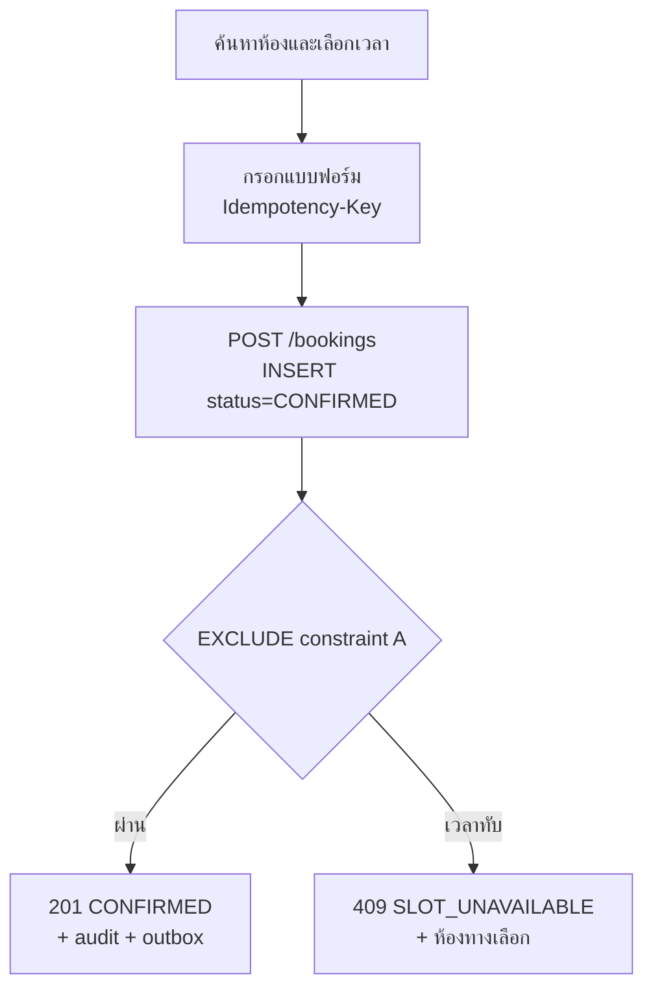
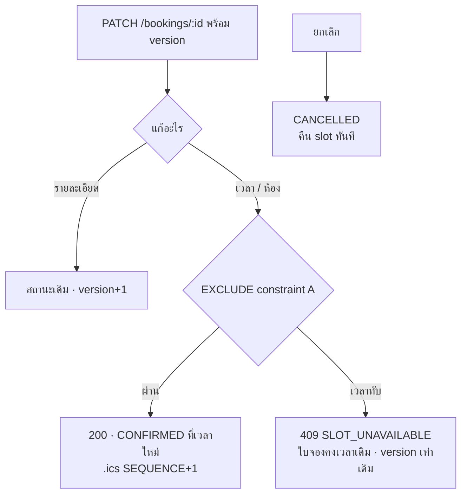
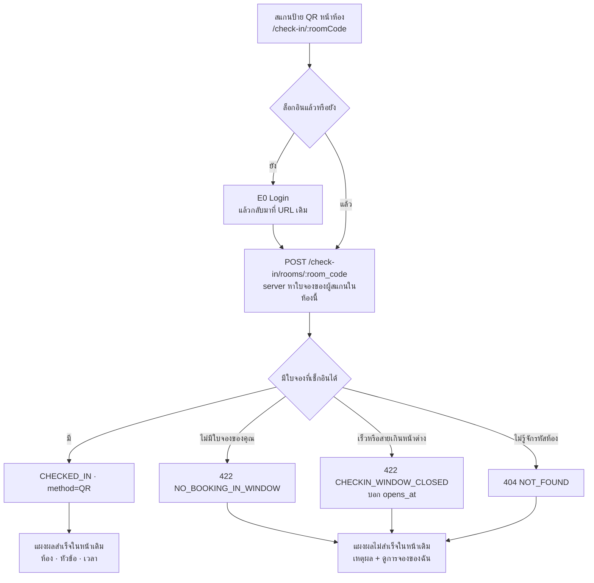
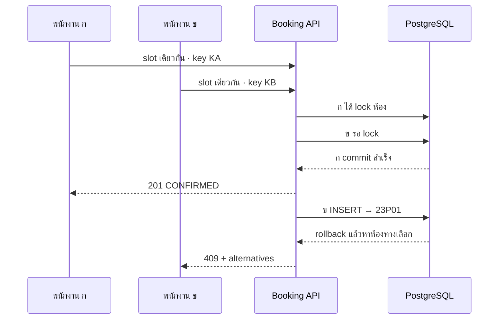
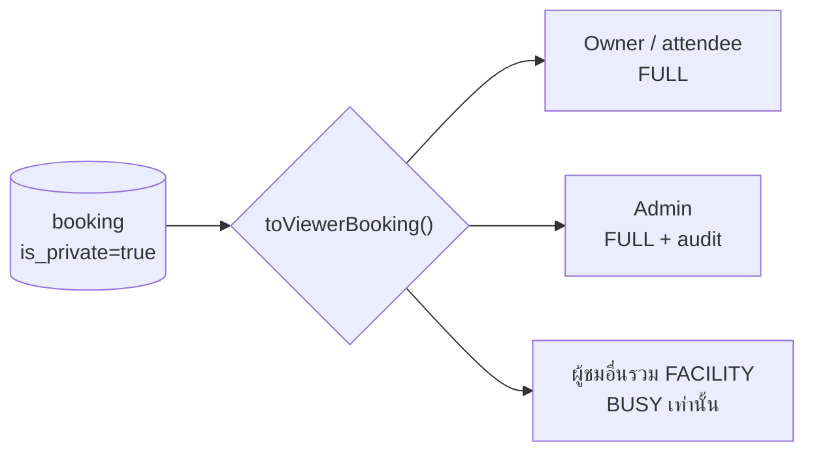

<!-- id: flows -->
## 03 · เส้นทางผู้ใช้ (User Flows)

ตาราง step → actor → screen → API → ผล/สถานะ; รหัสหน้าจอจาก screen inventory (E = employee app, A = admin app — หัวข้อ 10); error code ตาม catalogue หัวข้อ 06; กฎ/lifecycle/สิทธิ์ → หัวข้อ 02; SQL ของ transaction → หัวข้อ 05 หลักเดียวทุก flow: **หน้าจอเป็นคำแนะนำ ฐานข้อมูลเป็นผู้ตัดสิน** — UI สร้างกริดด้วย `apps/web/src/lib/slots.ts` และตรวจฟอร์มใน route เพื่อ UX ส่วน API ตรวจซ้ำด้วย route-local Zod + service policy และ EXCLUDE constraint เป็นด่านสุดท้ายเสมอ

### 3.1 พนักงาน — ค้นหาและจองห้อง (FL-01) :icon[calendar]

ทางเดียว ไม่มีสาขา: ค้นหา → เลือกช่วงเวลา → ยืนยัน → **`201 CONFIRMED`** หรือ **`409 SLOT_UNAVAILABLE`** พร้อมห้องทางเลือก ใครยิงถึงฐานข้อมูลก่อนได้ห้องไป (first-come-first-served) และ EXCLUDE constraint A คือผู้ตัดสินเสมอ

ไม่มีเส้นทางที่สาม — ผู้ใช้ออกจากหน้าฟอร์มพร้อมการจองที่ยืนยันแล้ว หรือพร้อมข้อความว่าใครจองตัดหน้าไปพร้อมทางเลือกที่กดต่อได้ทันที

:::details ขั้นตอน FL-01 ตั้งแต่ login ถึงหน้าผลลัพธ์ (8 ขั้น)

| # | Actor | Screen | API | ผล / สถานะ |
|---|---|---|---|---|
| 1 | Employee | E0 Login | `POST /auth/sign-in {employee_code, password, remember_me}` | รับรหัสพนักงานเป็น sign-in identity เพียงอย่างเดียว; 200 + cookie `__Host-sid` สำหรับ session 7 วันแบบ sliding; `remember_me=true` = persistent cookie, `false` = browser-session cookie ซึ่งออกจากระบบเมื่อปิดเบราว์เซอร์; 401 `INVALID_CREDENTIALS` (ไม่บอกว่า code หรือ password ผิด), 423 `ACCOUNT_LOCKED` (5 ครั้ง/15 นาที), 403 `ACCOUNT_DISABLED` → "บัญชีถูกปิดใช้งาน ติดต่อ Admin" |
| 2 | Employee | E1 `/rooms` → กด `ค้นหาห้องว่าง` เพื่อเปิด filter กะทัดรัด (วันที่, เริ่ม, สิ้นสุด, จำนวนคน, feature) | `GET /settings` (cache 5 นาที) → `GET /availability?start&end&headcount&features` | ก่อนค้นหาแสดงห้องเดโม 3 ห้อง; หลังค้นหา API คืน **ทุกห้อง active** พร้อม verdict `available` + `reasons[]` (BUSY/CLOSED/HOLIDAY/CAPACITY/MISSING_FEATURE); ช่วงเวลาผิดกฎ → 422 `OUTSIDE_BUSINESS_HOURS` / `MIN_DURATION` / `SLOT_INCREMENT` / `MAX_ADVANCE` / `IN_PAST` แสดง inline โดยอยู่หน้าเดิม |
| 3 | Employee | E2 Search results (state ใน `/rooms`) | — | การ์ดห้องที่ผ่านเกณฑ์ +เหตุผล; `busy_until` เป็นเวลาสิ้นสุดสูงสุดของ booking ที่ทับ **ช่วงที่ค้นหา** ใช้เป็น hint เท่านั้น ไม่รับประกันว่าเป็น slot ถัดไปที่จองได้เมื่อมีใบต่อเนื่องหลังช่วงค้นหา |
| 4 | Employee | E3 Room & time (slot grid 30 นาที 08:30–17:30 + select เริ่ม/สิ้นสุดผูกกัน) | `GET /rooms/:id`, `GET /calendar?from&to&room_id` | UI คำนวณ FREE/BUSY/CLOSED/PAST ด้วย helper ใน `apps/web/src/lib/slots.ts`; cell BUSY เลือกไม่ได้และไม่มีชื่อประชุม; ทุกห้องใช้เกณฑ์เดียวกัน |
| 5 | Employee | E4 Booking form (title, description, private switch, special request, headcount) | — | employee web ไม่มี email/mobile/attendee editor; client สร้าง UUID ตอน submit ครั้งแรก, reuse หลัง network/5xx เพื่อ retry logical attempt เดิม และล้าง key หลังสำเร็จหรือ 4xx; CTA เดียวทุกห้อง |
| 6 | Employee | E4 → submit | `POST /bookings` + header `Idempotency-Key` | tx ตามลำดับ lock กลาง (หัวข้อ 05 §5.6): advisory lock `(actor, key)` → อ่านใบเดิมแบบไม่ล็อก → ล็อกแถว `users` actor+owner เรียงตาม id → `pg_advisory_xact_lock(hashtext(room_id))` เรียงตาม hashtext → INSERT `status=CONFIRMED` → constraint A ตัดสิน → **201** `Booking` + outbox CONFIRMED (owner + attendees, .ics REQUEST) + audit; ไม่มี header → 400 `IDEMPOTENCY_KEY_REQUIRED` |
| 7 | System → Employee | E4 inline alert (ไม่ใช่ toast) | — | ชนกัน → **409 `SLOT_UNAVAILABLE`** `details:{room_id,start_at,end_at,alternatives:[{room_id,name}]}` → ข้อความ "ห้อง Horizon ไม่ว่างแล้วในช่วง 14:00–15:00 (มีคนจองก่อนเมื่อสักครู่)" + ปุ่ม "เลือกเวลาอื่น" (กลับ E3 refetch) / "ดูห้องอื่นที่ว่าง" (จาก `alternatives`); validation → 422 ตามข้อ 2 (headcount เกินความจุ = คำเตือนใน UI ไม่บล็อก — D-30c) |
| 8 | Employee | E5 Booking result / detail | `GET /bookings/:id` | แสดง "จองสำเร็จ" และ employee status "จองแล้ว" + ปุ่มดาวน์โหลด `.ics`; ไม่แสดง email delivery, attendee list หรือ resend action; ใบจองอยู่ที่ `CONFIRMED` ตั้งแต่วินาทีที่ commit |

Idempotency (หัวข้อ 06 C-10): key เก็บบนแถว `bookings` (`UNIQUE (created_by, idempotency_key)`); retry ด้วย key เดิม (double-click, เน็ตหลุด) → ได้ booking เดิมกลับ `200` + header `Idempotent-Replayed: true`; request ที่สองที่เข้ามาขณะแรกยังไม่ commit จะรอที่ unique index แล้วได้ผลเดียวกัน; ผลลัพธ์ 4xx ไม่ถูกเก็บ (retry รันใหม่ — validation deterministic จึงได้ 4xx เดิม) — booking ซ้ำเกิดไม่ได้แม้ UI ไม่ debounce และไม่ต้องมีตาราง idempotency แยก
:::

### 3.2 พนักงาน — เลื่อนเวลาและยกเลิก (FL-02) :icon[refresh]

การเลื่อนเวลาเป็น **transaction เดียว** ใต้ constraint A: สำเร็จ = ย้ายไปเวลาใหม่, ชน = `409 SLOT_UNAVAILABLE` และแถวเดิม **ไม่ถูกแตะ** — ใบจองยังอยู่ที่เวลาเดิมพร้อม `version` เท่าเดิม การยกเลิกเปลี่ยนสถานะแทนการลบแถว

**ไม่มีจังหวะไหนที่ใบจองไม่ถือ slot ใดเลย** — slot เดิมไม่เคยถูกปล่อยล่วงหน้าแล้วค่อยไปคว้าอันใหม่ ทั้งการปล่อยและการคว้าอยู่ใน UPDATE เดียวที่ constraint A ตัดสิน ถ้าไม่ผ่านคือ rollback ทั้งก้อน (CB-03)

:::details ขั้นตอนแก้ เลื่อนเวลา และยกเลิก (5 ขั้น)

| # | Actor | Screen | API | ผล / สถานะ |
|---|---|---|---|---|
| 1 | Employee | E6 My bookings (แท็บ Upcoming) → E5 detail | `GET /bookings?scope=mine` | ปุ่มแสดงตาม `can:{edit,reschedule,cancel,check_in}` ที่ server คำนวณ (กฎอยู่ที่เดียว) |
| 2a | Employee | กด "เลื่อนเวลา" ที่ E5 → เปิด E7 inline panel ในหน้าเดิม (reuse shared Buddhist date picker + E3 slot grid) | `PATCH /bookings/:id {version, start_at, end_at, room_id?}` | panel preload ห้อง/เวลาเดิม; validate window ใหม่ → UPDATE ภายใต้ constraint A → 200 `{booking}` สถานะคง CONFIRMED, `version+1`; internal outbox/.ics ยังทำงานตาม L9 |
| 2b | Employee | E5 "แก้ไขรายละเอียด" inline (title, description, privacy, special request, headcount) | `PATCH /bookings/:id {version, ...}` | employee UI ไม่มี attendee/email controls; เปลี่ยนสถานะไม่ได้และไม่แตะเวลา (กฎ detail-only L11) ส่วน `PUT /bookings/:id/attendees` ยังคงเป็น internal API contract |
| 3 | System | E7 inline alert + slot grid ภายใน E5 | — | **409 `SLOT_UNAVAILABLE`** `details:{room_id,start_at,end_at,alternatives:[…]}` → panel ขึ้น "ช่วง 14:00–15:00 ในห้อง Horizon ถูกจองไปแล้ว — การจองของคุณยังอยู่ที่ 13:00–14:00 ตามเดิม" + ปุ่มเลือกเวลาอื่น/ห้องอื่นจาก `alternatives`; หัวการ์ดยังโชว์เวลาเดิม **ไม่มี optimistic move ไม่มี revert ให้ผู้ใช้เห็น**; อื่น ๆ: 409 `VERSION_CONFLICT {current_version}` → refetch แล้วแก้ใหม่; 409 `INVALID_STATUS_TRANSITION`; 422 window codes |
| 4 | Employee | E8 native confirmation dialog: "คืน slot ทันที · กู้คืนไม่ได้" + เหตุผล (optional; ถ้ากรอกต้อง ≥3 ตัวอักษร) | `POST /bookings/:id/cancel {reason?}` | อนุญาตเมื่อ `status = CONFIRMED` และ `now < end_at` (L8) → CANCELLED ทันทีที่ commit (เปลี่ยนสถานะ ไม่ลบแถว); notification/.ics side effects ยังทำใน backend แต่ employee dialog ไม่แสดงข้อมูล email/attendee; ยกเลิกซ้ำ → 200 |
| 5 | Employee | E5 หลังยกเลิก | `GET /bookings/:id` | สถานะ CANCELLED อ่านได้ตลอด (ประวัติไม่หาย) และ slot ว่างให้คนอื่นจองทันทีที่ commit — ถ้า admin เป็นคนยกเลิกให้ ดู FL-03 |
:::

### 3.3 Admin — ยกเลิกการจองของผู้อื่น (FL-03) :icon[x]

ขั้น “ปฏิเสธคำขอ” ถูกแทนด้วย **ยกเลิกพร้อมเหตุผลบังคับ**: เจ้าของได้อีเมลพร้อมเหตุผลนั้น · slot ว่างให้คนอื่นทันที · audit บันทึกว่าใครทำ เมื่อไร ด้วยเหตุผลอะไร. API ยังอนุญาต ADMIN แก้/เลื่อนเวลา/จัดการผู้เข้าร่วมของใบอื่นก่อนสิ้นสุดและเช็กอินให้; current admin UI เปิดยกเลิก/เช็กอิน ส่วน drag-and-drop ยังเป็น 1.1

:::details ขั้นตอน admin ยกเลิกการจอง (4 ขั้น)

| # | Actor | Screen | API | ผล / สถานะ |
|---|---|---|---|---|
| 1 | Admin | A4 All bookings (กรองห้อง/ผู้ใช้/วันที่) → A5 detail | `GET /bookings?...` | เห็นทุกใบเต็มรูปแบบรวมประชุมส่วนตัว (การเปิดดูถูก audit — FL-07) |
| 2 | Admin | A5 → "ยกเลิกการจองนี้" → Dialog เหตุผล (**บังคับกรอก**) + คำเตือนว่าเจ้าของจะได้รับอีเมล | `POST /bookings/:id/cancel {reason}` | ไม่กรอก → 422 `REASON_REQUIRED` (ปุ่มยืนยัน disabled จนกว่าจะมีข้อความ); ยกเลิกได้เมื่อ `now < end_at` มิฉะนั้น 409 `INVALID_STATUS_TRANSITION` |
| 3 | System | — | — | CANCELLED + `cancelled_by`=admin, `cancelled_at`, `cancel_reason` → slot ว่างทันที; outbox `booking.cancelled` → **owner + attendees** พร้อมเหตุผลที่ admin กรอก + .ics `METHOD:CANCEL` (UID เดิม); audit `booking.cancel` เก็บ actor, เหตุผล และ before/after |
| 4 | Employee (เจ้าของ) | อีเมล → E5 | `GET /bookings/:id` | เห็นสถานะ CANCELLED พร้อมบรรทัด "ยกเลิกโดย Admin: {cancel_reason}" — จองใหม่ได้เองทันทีจาก E1 `/rooms` (ห้องว่างแล้ว) |

เหตุผลบังคับเพราะเป็น action ที่ผู้ใช้ไม่ได้เป็นคนทำเอง: อีเมลที่บอกแค่ "ถูกยกเลิก" สร้างงานถามกลับให้ admin มากกว่าที่ประหยัดไป (FR-006)
:::

### 3.4 Admin — สร้างผู้ใช้ / CSV import / ปิดใช้งาน (FL-04) :icon[users]

Admin จัดการวงจรบัญชีตั้งแต่เชิญ ตั้งรหัสผ่าน นำเข้า CSV จนถึงปิดใช้งาน โดยไม่เห็นรหัสผ่านและถอน session ทันทีเมื่อปิดบัญชี

:::details ขั้นตอนจัดการวงจรบัญชีผู้ใช้ (5 ขั้น)

| # | Actor | Screen | API | ผล / สถานะ |
|---|---|---|---|---|
| 1a | Admin | A8 Users list → "เพิ่มผู้ใช้" → A9 drawer (employee_code, ชื่อ, email, mobile, ทีม, role) | `POST /admin/users {employee_code, full_name, email, mobile?, department_id, role?}` | 201 `User status=INVITED` + token ตั้งรหัสผ่าน (`password_setup_tokens`, `purpose='INVITE'` 7 วัน — D-29/C2-06) + email ACCOUNT พร้อมลิงก์ `/set-password?token=`; 409 `VALIDATION_FAILED {field}` เมื่อ employee_code/email ซ้ำ; **admin ไม่เคยเห็น/ตั้งรหัสผ่าน** |
| 1b | Admin | A8 → "นำเข้า CSV" (`employee_code,full_name,email,mobile,department_code,role`) | `POST /admin/users/import?dry_run=true` → ดู preview → `POST /admin/users/import` | dry-run คืน `{summary:{create,update,skip,error}, rows:[{line,action,message}]}` โดยไม่เขียน; รอบจริง upsert ด้วย `employee_code` (ไม่แตะ status/password ของคนเดิม) + ส่ง invite ให้แถว CREATE; 413 > 2 MB |
| 2 | User ใหม่ | account setup/reset token ของ internal/admin auth workflow | `POST /auth/set-password {token, new_password}` | API รองรับ ≥ 10 ตัวอักษร, ใช้ token ครั้งเดียวและ revoke session; **final employee web ไม่มี `/set-password`/`/forgot` route** จึงยังไม่ใช่ end-to-end UI flow — canonical 81 บัญชีใช้ guarded initializer และเปลี่ยนรหัสผ่านจาก Profile ได้ |
| 3 | User ใหม่ | E0 Login → E1 `/rooms` | `POST /auth/sign-in` → `GET /me` | session 7 วันแบบ sliding; `remember_me=true` ใช้ persistent cookie ส่วน `false` ใช้ browser-session cookie ซึ่งออกจากระบบเมื่อปิดเบราว์เซอร์; ถ้ายังไม่ตั้งรหัส admin กด "ส่งคำเชิญอีกครั้ง" `POST /admin/users/:id/resend-invite` (409 ถ้าไม่ใช่ INVITED) |
| 4 | Admin | A9 "ปิดใช้งานบัญชี" → native confirmation dialog ที่โหลดและแสดงจำนวน/รายการจองที่จะถูกยกเลิก พร้อมเหตุผล optional | `POST /admin/users/:id/deactivate {reason?}` | status DISABLED + **ลบ session ทั้งหมดทันที** + CONFIRMED/CHECKED_IN ที่ยังไม่เริ่มของคนนั้น → CANCELLED `reason_code=OWNER_DISABLED` (attendees ได้ .ics CANCEL); การยกเลิกเป็นผลบังคับ ไม่ใช่ checkbox; guards 409 `CANNOT_MODIFY_SELF` / `LAST_ADMIN`; request ถัดไปด้วย cookie เดิม → 401 `UNAUTHENTICATED` (session ถูกลบ); login → 403 `ACCOUNT_DISABLED` "บัญชีถูกปิดใช้งาน ติดต่อ Admin" |
| 5 | Admin | A9 "เปิดใช้งานอีกครั้ง" / "ลบ" | `POST /admin/users/:id/reactivate` / `DELETE /admin/users/:id` | ลบถาวรได้เฉพาะบัญชีที่ไม่มี booking/audit (สร้างผิด) มิฉะนั้น 409 `USER_HAS_HISTORY {hint:'deactivate'}` — ประวัติต้องอยู่ |

Admin reset รหัสผ่าน = `POST /admin/users/:id/reset-password` (ลิงก์ 24 ชม.) — ใช้ token contract เดียวกับข้อ 2 ภายในระบบบัญชี โดยไม่เพิ่ม field หรือ route ให้ employee login
:::

### 3.5 วันประชุม — เตือน → สแกน QR หน้าห้อง → เช็กอิน / ปล่อยอัตโนมัติ (FL-05) :icon[qr]

ทางหลักของการเช็กอินคือ **QR ที่พิมพ์ติดไว้หน้าห้อง**: เดินไปถึงห้อง สแกน แล้วระบบหาใบจองของคนที่สแกนให้เอง หน้า landing ยังไม่เปลี่ยนสถานะจนผู้ใช้กด "เปิดใช้งานการจอง" จากนั้นแสดงแผงผลสำเร็จหรือไม่สำเร็จในหน้าเดิม ปุ่มเช็กอินในแอปและการเช็กอินโดย admin เป็นทางเข้ารอง ส่วน auto-release ปล่อยห้องเองเมื่อไม่มีใครเช็กอินถึงเส้นตาย

สองผลลัพธ์เท่านั้นและทั้งคู่จบในหน้าจอเดียวบนมือถือ — ผู้ใช้ไม่ต้องเลือกใบจองเอง เพราะ *ใครสแกน* + *ห้องไหน* + *ตอนนี้กี่โมง* ระบุใบจองได้ใบเดียวอยู่แล้ว

**ขอบเขต:** ระบบนี้สร้างเฉพาะฝั่งแอป — ในการติดตั้งจริงสัญญาณเช็กอินสำเร็จอาจถูกส่งต่อไปปลดล็อกประตู แต่ **ตัวควบคุมประตู/ฮาร์ดแวร์ล็อกอยู่นอกขอบเขตของระบบนี้** ข้อความบนแผงผลจึงยืนยันว่าการจอง "ถูกเปิดใช้งานแล้ว" ไม่ใช่คำสัญญาว่าประตูเปิด

ดูแผนภาพเช็กอินและการปล่อยห้องอัตโนมัติ (`checkin-autorelease`) ใน [หัวข้อ 01 · ระบบทำอะไร](#product) ซึ่งเป็นจุดแรกที่อธิบายแนวคิดนี้

**เครื่องมือเดโมใน local development** — เมื่อ web รันใน `DEV` และ `/me` ประกาศ capability `demo_check_in`, E6 แสดงปุ่ม **"เดโม: ทดลองเช็กอิน"** เฉพาะการจอง `CONFIRMED` ของผู้ใช้ที่ยังไม่เริ่ม ปุ่ม prepare จะเลื่อนเวลาของ demo environment แล้วเปิด URL `/check-in/:roomCode` จริง เครื่องมือนี้ไม่ข้าม landing และไม่เช็กอินอัตโนมัติ ผู้ใช้ยังต้องกดปุ่มบน E10; production ไม่ render action นี้

:::details ขั้นตอนวันประชุม ตั้งแต่อีเมลเตือนถึง auto-release (9 ขั้น)
Window เช็กอิน = `start−15` → `LEAST(end_at, start+15)` (settings `checkin_open_before_minutes` / `checkin_grace_minutes`; ADMIN ที่ไม่ใช่ owner/attendee ถึง `end_at`) — นิยามเดียวอยู่ที่ 06 §6.3.5 ทุกขั้นที่เป็นงานระบบขับด้วย `booking.sweep` ทุก 1 นาที (statement idempotent, หัวข้อ 05) — ไม่มี per-booking timer ให้ reconcile ตอน reschedule/cancel

| # | Actor | Screen | API / Job | ผล / สถานะ |
|---|---|---|---|---|
| 1 | System | — | sweep → outbox REMINDER (dedupe ต่อ booking) | T−15: email owner "อีก 15 นาทีเริ่มประชุม — กดเช็กอิน" พร้อมลิงก์ไป E5 ของ booking นั้น |
| 2 | Employee | ป้าย QR กระดาษหน้าห้อง → E10 `/check-in/:roomCode` | — | QR **คงที่ต่อห้อง** (พิมพ์ 3 แผ่น ทำใหม่เฉพาะตอนเปลี่ยนชื่อ/รหัสห้อง) encode `https://<host>/check-in/<roomCode>`; สแกนแล้วเบราว์เซอร์มือถือเปิดหน้านี้; ยังไม่ล็อกอิน → E0 Login แล้ว redirect กลับ URL เดิม; ไม่มี rotating token (เหตุผลด้านความปลอดภัย S-13 หัวข้อ 09) |
| 3 | Employee | E10 → ปุ่ม "เปิดใช้งานการจอง" | `POST /check-in/rooms/:room_code` | server resolve เอง: booking `CONFIRMED` ในห้องนี้ ที่ผู้สแกนเป็น owner หรือ attendee และ `now` อยู่ใน window → **CHECKED_IN**, `checkin_method='QR'`, `checked_in_at/by`, audit; ไม่มีอีเมล |
| 4 | System → Employee | E10 **success result panel** (เขียว + :icon[check]) | — | "เช็กอินสำเร็จ · เปิดใช้งานการจองแล้ว" + ห้อง / หัวข้อ / ช่วงเวลา; สแกนซ้ำ → `200 already_checked_in:true` → panel เดิมพร้อมบรรทัด "การจองนี้ถูกเปิดใช้งานไปแล้ว" (idempotent) |
| 5 | System → Employee | E10 **failure result panel** (แดง + :icon[warn]) | — | 422 `NO_BOOKING_IN_WINDOW` → "ไม่พบการจองของคุณที่เช็กอินได้ในห้องนี้ตอนนี้"; 422 `CHECKIN_WINDOW_CLOSED {opens_at, closes_at}` → "เช็กอินได้ตั้งแต่ {opens_at}" (เร็วไป) / "เลยเวลาเช็กอินแล้ว" (สายไป); 404 = รหัสห้องไม่มีในระบบ; 409 `INVALID_STATUS_TRANSITION` = ใบนั้นถูกปล่อย/ยกเลิกไปแล้ว; ทุก panel มีลิงก์ "ดูการจองของฉัน" → E6 |
| 6 | Employee (ทางรอง) | E6/E5 ปุ่ม "เช็กอิน" (โผล่เฉพาะใน window; `can.check_in`) + countdown "ห้องจะถูกปล่อยใน mm:ss" | `POST /bookings/:id/check-in` | เหมือนข้อ 3 แต่ `checkin_method='SELF'` — ใช้เมื่ออยู่ไกลป้าย เช่น กดจากลิงก์ในอีเมล reminder; เช็กอินซ้ำ → 200 `already_checked_in:true` |
| 7 | Admin (ทางรอง) **ที่ไม่ใช่ owner/attendee ของใบนั้น** | A3 Room calendar / A4 All bookings → "เช็กอิน" | `POST /bookings/:id/check-in` (endpoint เดียวกับข้อ 6) | server ตั้ง `checkin_method='ADMIN'` และอนุญาตถึง `end_at` (ไม่มี force flag). **ถ้า admin คนนั้นเป็น owner หรือ attendee เอง จะได้ `SELF` และหน้าต่าง self ตามข้อ 6** — สมาชิกภาพมาก่อน role, กฎอยู่ที่ 06 §6.3.5 ที่เดียว |
| 8 | System | — | sweep statement 3 | เลย `end_at` → CHECKED_IN (หรือ CONFIRMED เมื่อปิด check-in) → **COMPLETED**; audit เท่านั้น |
| 9 | System | — | sweep statement 2 | `LEAST(end_at, start+15)` และ `checked_in_at IS NULL` → **AUTO_RELEASED** → slot ว่างทันที (แถวออกจาก partial index ของ constraint A) → email AUTO_RELEASED: **owner + attendees ได้ .ics `METHOD:CANCEL`** (owner เป็น ORGANIZER ปฏิทินจึงต้องไม่ค้าง) และ admins ได้ `booking.auto_released_admin` อีเมลอธิบายไม่มี ics (D-30b; C1-14/C2-02); A1 นับเป็น no-show rate ไม่ใช่ utilization |

หมายเหตุ: เส้นตาย auto-release คือ `LEAST(end_at, start_at + checkin_grace_minutes)` — เส้นเดียวกับขอบบนของหน้าต่าง self check-in จึงไม่มีช่วงที่ปุ่มยังกดได้แต่ห้องถูกปล่อยไปแล้ว (C2-03) — ดูหัวข้อ 05 §5.5
:::

### 3.6 การจองพร้อมกัน (Concurrency) — สองคนยืนยัน slot เดียวกัน (FL-06) :icon[lock]

เมื่อสองคนยืนยัน slot เดียวกัน advisory lock จะเรียงคิวต่อห้อง และ EXCLUDE constraint รับประกันผลสุดท้ายเป็นหนึ่ง `201` กับหนึ่ง `409` โดยไม่เกิดการจองซ้อน

:::details ลำดับเหตุการณ์และเหตุผลของกลไกสองชั้น (6 ขั้น)
| # | Actor | เหตุการณ์ | ผล / สถานะ |
|---|---|---|---|
| 1 | Employee A + B | ส่ง `POST /bookings` สำหรับ Horizon 13:00–14:00 พร้อม `Idempotency-Key` คนละค่า | ทั้งคู่ผ่าน validation เรื่องเวลา ระยะ และ advance window |
| 2 | API | เปิด transaction ตามลำดับกลาง §5.6: idempotency → users → `pg_advisory_xact_lock(hashtext(room))` | A ได้ lock ห้อง; B รอห้องเดียวกัน |
| 3 | API / PostgreSQL | A INSERT `CONFIRMED [13:00,14:00)` พร้อม outbox + audit แล้ว commit | A ได้ `201 Created {status: CONFIRMED}` และ lock ถูกปล่อย |
| 4 | API / PostgreSQL | B ได้ lock ต่อแล้วพยายาม INSERT ช่วงเดิม | EXCLUDE A คืน `23P01 bookings_no_overlap_confirmed` |
| 5 | API | rollback transaction ของ B แล้วค้นหาห้องว่างช่วงเดียวกัน | B ได้ `409 SLOT_UNAVAILABLE {alternatives:[Grove Room]}` |
| 6 | Employee A + B | E5 แสดงผลตาม response | A เห็น "จองสำเร็จ"; B เห็น inline alert "ห้อง Horizon ไม่ว่างแล้ว…" และปุ่ม "ดูห้องอื่นที่ว่าง" |

สองชั้นเพราะ: advisory lock เรียง tx ต่อห้อง (ตัดเหตุผลเรื่อง deadlock ใน tx หลายแถวอย่าง reschedule/cancel; เพดาน one writer per room พอสำหรับ 3 ห้อง) ส่วน EXCLUDE constraint คือตัว **รับประกัน** — ถอด lock ออกผลยังเป็นหนึ่ง 201 หนึ่ง 409 Release gate: 100 POST พร้อมกัน slot เดียว → 201 หนึ่งเดียว + 1 แถวใน DB (หัวข้อ 09) กติกาเดียวกันนี้ใช้กับ `PATCH` ที่ย้ายเวลา (FL-02): ผู้แพ้ได้ 409 และใบจองอยู่ที่เดิม
:::

### 3.7 ประชุมส่วนตัว — ใครเห็นอะไร (FL-07) :icon[shield]

การประชุม `is_private=true` ผ่าน `toViewerBooking()` จุดเดียว: owner, attendee และ Admin เห็นเต็ม ส่วนพนักงานทั่วไปเห็น BUSY โดย title/description/attendees และข้อมูลประชุมอื่นไม่เคยถึง browser; เฉพาะ `GET /calendar` ของ EMPLOYEE/ADMIN เติม `owner_display_name` เพื่อระบุว่าใครจองห้องตามข้อกำหนด UI ส่วน FACILITY ที่ไม่เกี่ยวข้องยังไม่เห็นชื่อผู้จอง private

:::details ตาราง visibility ของผู้ชมแต่ละประเภท (4 ประเภท)
Booking `is_private=true` "Product Roadmap Review" Horizon 14:00–15:00 เจ้าของ = วิโนทัย, attendee ภายใน = napa@ บริษัท, ผู้ชม 4 คนเรียก API เดียวกัน (`GET /calendar`, `GET /bookings/:id`) — masking ทำใน serializer `toViewerBooking()` ชั้นเดียว ไม่ใช่ CSS (D: ทดสอบได้ด้วยการยิง API ตรง; UI โกหกไม่ได้)

| ผู้ชม | Visibility | E9/A3 calendar cell | E5/A5 detail | หมายเหตุ |
|---|---|---|---|---|
| วิโนทัย (owner) | FULL | ชื่อจริง + badge "ส่วนตัว" | ทุกอย่าง + `can{edit,reschedule,cancel,check_in}` + history | — |
| Napa (attendee, email ตรงกับ user) | FULL | ชื่อจริง | ทุกอย่าง, `can.check_in=true` (เช็กอินแทน owner ได้ รวมทาง QR หน้าห้อง), `can.edit=false` | ปรากฏใน `scope=attending` |
| กิตติ (พนักงานทั่วไป) | BUSY | "ไม่ว่าง" + ผู้จอง (`owner_display_name`) + ห้อง/เวลา, ไม่มี title/owner object/headcount | `GET /bookings/:id` คืน view BUSY แบบเดิมและไม่มี `owner_display_name` (ไม่ใช่ 403/404 เพราะ id เห็นจากปฏิทินอยู่แล้ว); `/ics`, `/attendees` → 403 `FORBIDDEN_PRIVATE` | slot ยังเลือกจองไม่ได้เหมือน booking ปกติ |
| ADMIN | FULL | ชื่อจริง + badge | ทุกอย่าง + audit trail | รายงาน CSV เว้นชื่อ PRIVATE เว้นแต่ `include_private_titles` (audit) |

เพิ่มเติม: `is_private=false` → กิตติและ FACILITY ที่ไม่เกี่ยวข้องเห็นระดับ PUBLIC (ชื่อ, เจ้าของ, ทีม, `attendee_count` แต่ไม่เห็น description/attendees/special_request/headcount). Final serializer ไม่มี visibility ระดับ FACILITY แยก
:::

### 3.8 ส่วนต่อขยาย Phase 1.1 (สั้น ๆ)

- **Admin drag & drop** บน A3: ลากการ์ด → optimistic move → `PATCH /bookings/:id {version, start_at, end_at, room_id?}` → คง CONFIRMED + .ics SEQUENCE+1 ให้ attendees; 409 `SLOT_UNAVAILABLE`/`VERSION_CONFLICT` → การ์ดเด้งกลับที่เวลาเดิม + toast (กติกา CB-03 เดียวกับ FL-02); ทุกการ์ดมีเมนู "เลื่อนเวลา…" เปิด dialog เรียก API เดียวกัน (keyboard path, WCAG 2.2 SC 2.5.7)
- **Facility run-sheet** ยังไม่ส่งมอบและไม่มี route ใน final API; หากทำต่อ ต้องออกแบบ contract/visibility ใหม่โดยไม่สมมติว่ามีระดับ FACILITY อยู่แล้ว. กระดิ่งแจ้งเตือนในแอปก็ยังเป็น backlog
