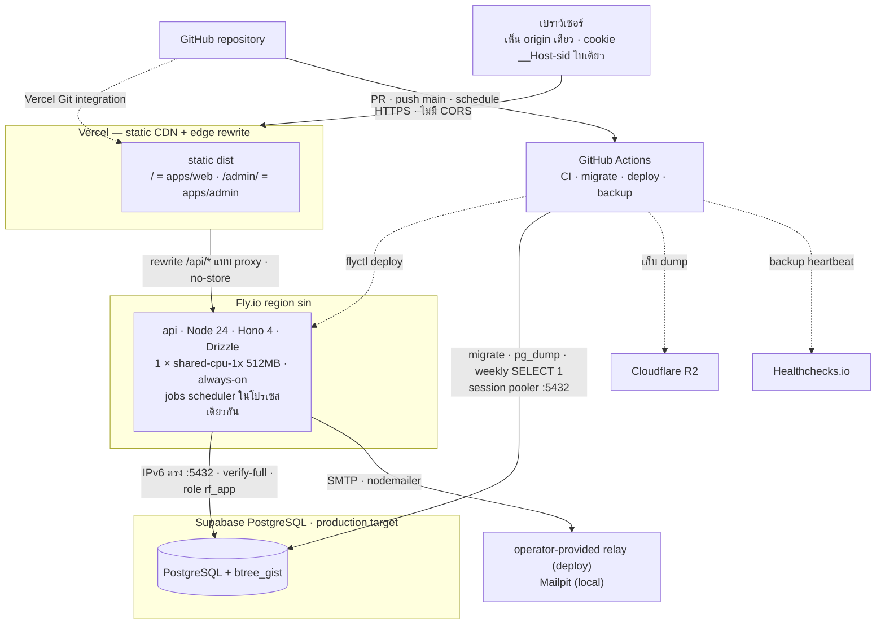

<!-- id: architecture -->
## 04 · สถาปัตยกรรม (Architecture & Tech Stack)

ReserveFlow คือ CRUD app ขนาด ~30 bookings/วัน ที่มี requirement ยากจริงอยู่ข้อเดียว — "ห้ามจองซ้อน" — และ PostgreSQL มีกลไกนั้นให้แล้ว (EXCLUDE constraint) ที่เหลือจึงเลือกของที่น่าเบื่อ มีชิ้นส่วนน้อย และทีม 1–3 คนดูแลได้โดยไม่ต้องมี on-call ทุกชั้นในหัวข้อนี้ตอบคำถาม "ถ้าไม่มีชิ้นนี้จะเสียอะไร" ได้ — ตอบไม่ได้ = ถูกตัดออก

### 4.1 ภาพรวมระบบ (System context & deployment)

**Topology ที่ repository กำหนดไว้** ใช้ Vercel เสิร์ฟสอง SPA จาก output เดียวและ rewrite `/api/*` ไปยัง API บน Fly.io (`sin`) ซึ่งต่อ PostgreSQL ผ่าน `DATABASE_URL` — เบราว์เซอร์จึงเห็น origin เดียวและใช้ cookie `__Host-sid` ใบเดียวกับทั้งสองแอป ไม่มี Redis หรือ worker process แยก; `infra/compose.yml` ใช้สำหรับ local PostgreSQL + Mailpit ส่วน `fly.staging.toml` เป็นเพียง configuration สำหรับ staging แบบ Fly-only ไม่ใช่หลักฐานว่า staging app หรือ Supabase project ถูก provision/deploy แล้ว

**รูปแบบสถาปัตยกรรม:** 3-tier modular monolith — presentation เป็น React SPA สองชุด, application เป็น Hono API กับ scheduler ใน Node process เดียว และ persistence เป็น PostgreSQL หนึ่งฐาน งานธุรกิจแบ่งเป็น route/service/module ภายใน monorepo แต่มี production runtime backend เพียงก้อนเดียว จึงไม่มี network boundary ภายใน, distributed transaction หรือ eventual consistency ระหว่าง microservices; notification outbox ยังอยู่ใน PostgreSQL เดียวกันและถูก drain โดย scheduler ใน API process

#### 4.1.1 Deployment stack ฉบับใช้งานจริง

ตารางนี้คือ inventory ของ **target topology ที่ไฟล์ใน repository รองรับ** ไม่ใช่คำยืนยันว่า account, secret, domain หรือ external service ทุกตัวถูก provision และผ่าน smoke แล้ว; หลักฐาน external state และ go-live gates อยู่ในหัวข้อ 09

| ชั้น / งาน | Platform หรือ service | สิ่งที่ deploy และหน้าที่ | Configuration ที่เป็นหลักฐานใน repo |
|---|---|---|---|
| Web + edge | **Vercel** | Static bundle ของ employee app ที่ `/` และ admin app ที่ `/admin/` ใน project/origin เดียว; proxy `/api/*` ไป Fly.io และปิด rewrite caching ของ API | `vercel.json`, root script `build:vercel` |
| API + background jobs | **Fly.io** | app `reserveflow-api` ที่ region `sin`; Node 24 + Hono API และ scheduler process เดียว, `shared-cpu-1x` 512 MB, always-on 1 machine; image มี SPA bundles เป็น fallback ด้วย | `fly.toml`, `apps/api/Dockerfile`; staging shape อยู่ใน `fly.staging.toml` |
| Transactional database | **Supabase PostgreSQL** | production target ที่ `ap-southeast-1`; runtime role `rf_app` ต่อ direct `:5432`, ส่วน migration/backup ใช้ Supavisor **session** pooler `:5432`; ใช้ `btree_gist`, `citext` และ EXCLUDE constraint | `infra/supabase/bootstrap.sql`, Drizzle migrations, `DATABASE_URL` / `DATABASE_URL_MIGRATE` contract |
| Email delivery | **SMTP relay ที่ operator เลือก** | Nodemailer ส่ง notification และไฟล์ `.ics` จาก PostgreSQL outbox; implementation ไม่ผูกกับ Resend/Postmark หรือ provider รายใดรายหนึ่ง; local ใช้ Mailpit | `SMTP_*`, `MAIL_*`, `apps/api/src/email`, `infra/compose.yml` |
| CI + delivery orchestration | **GitHub Actions** | PR/main: lint, typecheck, test, build; production workflow: migrate Supabase → deploy Fly → poll readiness; Vercel deploy แยกผ่าน Git integration จึงไม่ atomic กับ Fly | `.github/workflows/ci.yml`, `.github/workflows/deploy.yml` |
| Backup storage | **Cloudflare R2** | GitHub Actions ทำ nightly `pg_dump -Fc`, เข้ารหัสด้วย `age`, เก็บใน R2 และลบ dump เกิน retention; restore drill ยังเป็น go-live gate | `.github/workflows/backup.yml` |
| Health + operations | **Fly health checks + structured logs + Healthchecks.io heartbeat** | `/api/healthz`, `/api/readyz`, Fly service check, pino request logs และ heartbeat ของ backup; ยังไม่มี external uptime/error tracker ที่ provision ยืนยันแล้ว | `fly.toml`, API health routes, `.github/workflows/backup.yml` |
| Local development | **Docker Compose** | PostgreSQL 18 + Mailpit; Vite dev servers proxy `/api` ไป API local และไม่ใช้ production cloud services | `infra/compose.yml`, Vite configs |

**Request path หลัก:** Browser → Vercel → (`/` หรือ `/admin/` เป็น static SPA; `/api/*` เป็น proxy) → Fly.io → Supabase PostgreSQL. เส้นทางประกอบคือ Fly.io → SMTP relay สำหรับอีเมล และ GitHub Actions → Supabase/R2 สำหรับ migration กับ backup

บริบทของระบบและผู้เกี่ยวข้องแสดงไว้แล้วใน [หัวข้อ 00 · ภาพรวม](#overview) ซึ่งเป็นจุดแรกที่อธิบายแนวคิดนี้

สิ่งที่ควรอ่านจากภาพนี้: deployable backend คือ **Docker image เดียว + Postgres URL เดียว** และไม่มี Supabase client SDK; image เดียวกันมี API กับ dist ของสอง SPA ส่วน SMTP และ R2 เป็น integration ที่ผู้ดูแลต้องใส่ credentials และตรวจสอบการทำงานใน environment จริง

สิ่งที่ควรอ่านจากภาพนี้: `api` เป็นโปรเซสเดียวที่ถือทั้ง HTTP และ jobs — การแยก worker ออกเป็น Fly machine ที่สองทำได้ภายหลังด้วย env ตัวเดียวโดยไม่แก้ code (§4.7)

:::details รายละเอียด topology, เส้นทาง route, connection และ migrate
- **Vercel configuration** — root `build:vercel` build สอง SPA แล้ว copy `apps/admin/dist` ไปใต้ `apps/web/dist/admin`; `vercel.json` กำหนด output เป็น `apps/web/dist`, rewrite `/api/:path*` ไป Fly, และ SPA fallbacks สำหรับ `/admin/*` กับ route อื่น ๆ ตามลำดับที่เขียนไว้ในไฟล์; API ติด `Cache-Control: no-store` และ config ติด `x-vercel-enable-rewrite-caching: 0` ให้ `/api`. Repository ไม่ยืนยัน plan, project provisioning, Git integration หรือ platform route order นอกเหนือจาก config นี้
- **Fly production configuration** — `fly.toml` กำหนด app `reserveflow-api`, region `sin`, `shared-cpu-1x` 512 MB, `min_machines_running=1` และ `auto_stop_machines=false`; เมื่อ `WORKER_ENABLED=true` โปรเซสเดียวรัน `booking.sweep` ทุก 60 วินาที, `notify.send` ทุก 10 วินาที และ `maintenance.daily` เวลา 03:15 Asia/Bangkok; image มี dist ของสอง SPA และ redirect request นอก `/api` ที่ host ไม่ตรง `PUBLIC_BASE_URL` ไป canonical origin ด้วย 308
- **PostgreSQL target** — production docs/config มุ่งไป Supabase PostgreSQL + `btree_gist`/`citext`; runtime ต่อผ่าน `DATABASE_URL`, ส่วน migrate/backup ใช้ `DATABASE_URL_MIGRATE`; `env.ts` ปฏิเสธ transaction-pooler port `:6543` และ `sslmode=disable`; `infra/supabase/bootstrap.sql` สร้าง `rf_app`, ตั้ง `search_path = public, extensions`, revoke สิทธิ์ anon/authenticated และระบุ dashboard step ที่ SQL ทำแทนไม่ได้
- **อีเมล** — runtime ใช้ SMTP settings จาก environment ผ่าน Nodemailer; local compose ใช้ Mailpit `:1025` (UI `:8025`). Repository ไม่ยืนยันว่า relay production/staging ถูก provision หรือทดสอบแล้ว
- **Backup** — `.github/workflows/backup.yml` schedule `pg_dump -Fc` → `age` → R2 + healthchecks.io heartbeat ทุกคืน และ `SELECT 1` รายสัปดาห์; การสำเร็จของ schedule, bucket และ restore ต้องตรวจจาก external state/runbook แยกต่างหาก
- **migrate/deploy** — `.github/workflows/deploy.yml` รัน `drizzle-kit migrate` ผ่าน `DATABASE_URL_MIGRATE` แล้ว `flyctl deploy --remote-only` และ poll `/api/readyz`; workflow นี้ไม่ deploy Vercel จึงไม่มี automatic cross-platform ordering ที่ repository รับประกัน
- **TZ policy** — schema ใช้ `timestamptz`, wire ใช้ ISO-8601 และ business-time helpers ใช้ค่าคงที่ `APP_TZ='Asia/Bangkok'`/UTC+7 โดยไม่พึ่ง local timezone ของ process
- **Staging configuration** — `fly.staging.toml` กำหนดชื่อ `reserveflow-staging`, Fly-only static serving และ auto-stop; ไม่มี staging deploy workflow หรือหลักฐาน external provisioning ใน repository; **local dev = `infra/compose.yml`** (postgres + mailpit)
- ไฟล์ที่ ship แล้ว: `vercel.json`, `fly.toml`, `fly.staging.toml`, `.github/workflows/{ci,deploy,backup}.yml`, `infra/supabase/bootstrap.sql`; environments / CI / runbook ฉบับเต็ม: หัวข้อ 09
:::

### 4.2 เส้นทางของ request "สร้างการจอง"

`POST /api/v1/bookings` ใช้ Zod schema ที่ประกาศใน route → ตรวจสิทธิ์จองแทนและ policy แบบ fail-fast → เรียก `createBooking()` ซึ่งเปิด transaction ตามลำดับ **idempotency → users → rooms → `$decision_time`** → INSERT โดยให้ EXCLUDE constraint เป็นผู้ตัดสิน overlap คนสุดท้าย → เขียน `audit_logs` + notification outbox ใน transaction เดียวกัน → ตอบ `201`; การยิงซ้ำด้วย `Idempotency-Key` เดิมคืนใบเดิมเสมอ

:::details ทั้ง 8 ขั้นของ `POST /api/v1/bookings` (8 ขั้น)
1. **Edge** — เมื่อ deploy ตาม `vercel.json`, Vercel rewrite `POST /api/v1/bookings` ไป API บน Fly; browser แนบ cookie `__Host-sid`; API ยอมรับ unsafe request เมื่อ `Origin` อยู่ใน allowlist หรือ `Sec-Fetch-Site: same-origin` มิฉะนั้นปฏิเสธ
2. **Middleware/route guard** — ออก `request_id`, ใช้ general rate limit ต่อ session cookie (หรือ IP/`anon` เมื่อไม่มี cookie), resolve session → `actor` (better-auth), บังคับ header `Idempotency-Key`; หลังตรวจ replay แล้วจึงใช้ create limit ต่อ `actor.id`
3. **Validation** — route-local `createSchema` เป็น `z.strictObject()` และ `parseBody()` ปฏิเสธ unknown/invalid fields; schema นี้ไม่ได้มาจาก `packages/shared` และไม่ได้ผูกผ่าน `@hono/zod-openapi`; error ออกใน envelope `{code,message,details,request_id}`
4. **Authz + policy (fail fast, ยังไม่ผูกพัน)** — route ตรวจว่า `owner_id` อื่นใช้ได้เฉพาะ ADMIN แล้วตรวจห้อง active และ window จาก `settings`/business hours/holidays ก่อนเริ่ม transaction; binding room state ถูกอ่านซ้ำ `FOR SHARE` หลัง room advisory lock ในขั้น 5
5. **เริ่ม transaction** — advisory lock ต่อ `(actor, Idempotency-Key)` → replay ใบเดิมถ้ามี → `FOR SHARE` actor/owner ที่ ACTIVE เรียง id → room advisory lock เรียงตาม `hashtext` → อ่าน room `FOR SHARE` + ตรวจ buffer → อ่าน `clock_timestamp()` ครั้งเดียวเป็น decision time; helper ที่ใช้จริงคือ `withTx()`, `lockRooms()` และ `decisionTime()` ใน `apps/api/src/lib/tx.ts`
6. **INSERT** `bookings` ด้วย `status = CONFIRMED` — EXCLUDE constraint A ตัดสิน literal overlap และ buffer probe ใต้ room lock ตัดสินช่องว่างที่ตั้งค่าเพิ่ม; เมื่อชน route รอ transaction rollback แล้วเรียก `slotUnavailableError()` นอก transaction เพื่อสร้าง `409 SLOT_UNAVAILABLE` พร้อม `details.alternatives`
7. **transaction เดียวกัน** — เขียน `audit_logs` (before/after, actor, request_id) และแถว outbox ใน `notifications` (`booking.confirmed` → owner + attendees พร้อม JSON snapshot ที่จำเป็นต่อการส่ง) — การจองจึง commit ไม่ได้ถ้าไม่มีแถวแจ้งเตือนคู่กัน; ไฟล์ `.ics` ถูก generate ตอน scheduler drain outbox ไม่ได้เก็บเป็นไฟล์ในแถวนี้
8. **COMMIT** → route เรียก `kickOutbox()` แบบ best-effort ซึ่ง scheduler defer `notify.send` ด้วย `setImmediate`; loop 10 วินาทีเก็บตก → ตอบ `201` + `Location`; replay ตอบ `200` + `Idempotent-Replayed: true` และไม่สร้างแถวที่สอง
:::

### 4.3 Tech stack ที่ตัดสินแล้ว

| ชั้น | สิ่งที่เลือก |
|---|---|
| Repo / tooling | pnpm workspaces + Turborepo; Node 24 LTS; TypeScript strict; **Biome** (lint + format) |
| Front-ends | **สอง Vite + React 19 SPA** (`apps/web`, `apps/admin`) + **TanStack Router**; `build:vercel` รวมทั้งสอง dist ใต้ output เดียว และ Docker image เก็บ dist ทั้งคู่เพื่อเสิร์ฟจาก Fly ได้ |
| UI | Tailwind CSS v4 + native semantic elements และ custom components ใน `packages/ui`; ไม่มี shadcn/Radix/sonner; self-hosted Noto Sans Thai/Inter; pastel tokens ที่ระบุเป้าหมาย contrast ระดับ AA |
| Forms | Controlled native React forms; API ใช้ route-local Zod validators ส่วน front-end มี form checks และ TypeScript payload types ของตัวเอง; `packages/shared` แชร์ enums/error codes/constants เท่านั้น; ไม่มี React Hook Form |
| Server state | TanStack Query; ตัวกรองปฏิทินอยู่ใน URL; ไม่มี Redux/Zustand |
| Calendar | **CSS-grid board เขียนเอง** (3 ห้อง × 18 แถวครึ่งชั่วโมง 08:30–17:30; day + week) + dialog/panel "เลื่อนเวลา…" ที่ใช้คีย์บอร์ดได้; ไม่มี drag-and-drop runtime |
| Date/time | `@daypicker/buddhist` + `@daypicker/react` ถูก lazy-load ใน shared `ThaiDatePickerField`; server/web/admin ใช้ fixed UTC+7 helpers และ `Intl.DateTimeFormat` (ไม่มี date-fns); UI แสดง พ.ศ., URL ใช้ `YYYY-MM-DD`, DB เป็น `timestamptz`, wire timestamp เป็น ISO-8601 ที่ `+07:00` |
| API | **Hono 4** บน Node; route-local Zod validation; OpenAPI 3.1 ประกอบด้วยมือใน `apps/api/src/docs.ts`, JSON ที่ `/api/openapi.json` และ Swagger UI ที่ `/api/docs`; ไม่มี committed `openapi.json` artifact |
| API style | REST, JSON snake_case, `/api/v1`, error envelope `{code,message,details,request_id}`, `Idempotency-Key` บน `POST /bookings` |
| API client | generic same-origin `fetch` wrapper (`apiRequest`/`apiFetch`) แยกในแต่ละ SPA + hand-written response/payload interfaces; shared `ErrorCode` enum; ไม่มี `hono/client`/`hc` |
| DB :icon[database] | PostgreSQL (CI/local ใช้ PG18; deploy target คือ Supabase) + `btree_gist`; EXCLUDE constraint **ตัวเดียว (A)** บน `bookings`; live-slot writers ใช้ room advisory locks ส่วน sweep ที่ย้ายสถานะออกจาก live set ใช้ row locks/SQL idempotence |
| ORM | Drizzle ORM + `drizzle-kit generate`/committed SQL; EXCLUDE อยู่ใน `0004_bookings_exclude.sql`, extension bootstrap อยู่ใน local/Supabase infra และ append-only audit trigger อยู่ใน `0000_functions.sql`; **ห้าม `drizzle-kit push` นอก local** |
| Auth :icon[lock] | **better-auth** (`employee_code` + password ที่ wrapper resolve ไปยัง internal email credential, Postgres sessions, cookie `__Host-sid`, admin plugin, argon2id ผ่าน `@node-rs/argon2`) + rate-limit/lockout ของเรา |
| CSRF / CORS | origin เดียว (Vercel rewrite แบบ proxy ไม่ใช่ redirect) → ไม่มี CORS; SameSite=Lax + middleware ของเราตรวจ `Origin`/`Sec-Fetch-Site` บน **ทุก** unsafe method; ไม่มี CSRF token |
| Authz :icon[shield] | `createRequireAuth`/`createRequireAdmin` route guards + permission checks ใน booking routes/services + serializer `toViewerBooking()`; ไม่มีโมดูล `can()`, CASL หรือ RLS |
| Jobs | **in-process scheduler** ในโปรเซส API เมื่อ `WORKER_ENABLED=true`: `booking.sweep` ทุกนาที, `notify.send` ทุก 10 s + kick หลัง commit, และ `maintenance.daily` เวลา 03:15 Asia/Bangkok |
| Email :icon[mail] | **Nodemailer over SMTP** ผ่านตาราง `notifications` (outbox); templates ภาษาไทยเป็น functions ที่คืน text/HTML; `ical-generator` สำหรับ .ics; local ใช้ Mailpit ส่วน deploy ใช้ SMTP env ของ operator |
| QR :icon[qr] | `uqr` ใน admin app → ป้ายห้อง static 3 แผ่นสำหรับพิมพ์ เข้ารหัส `/check-in/:roomCode` |
| Files | รูปห้อง JPEG/PNG/WebP ขนาดไม่เกิน 5 MB เป็น `bytea` ใน `rooms`; authenticated `GET /api/v1/rooms/:id/photo` ส่ง bytes เดิมพร้อม MIME ที่ sniff ได้และรับ global `Cache-Control: no-store`; ไม่มี ETag หรือ server-side re-encode |
| Charts :icon[chart] | semantic `<table>` + CSS bars/cells สำหรับ utilization และ heatmap |
| Testing | Vitest (unit + API integration กับ PostgreSQL จริง) รวม concurrency/lock/permission gates; browser journey และ accessibility ใช้ manual checklist ตาม `docs/testing/e2e-plan.md` — ยังไม่มี automated Playwright E2E ใน CI |
| CI/CD | CI มี 4 jobs: Biome lint, typecheck, Vitest บน PostgreSQL service และ build; deploy workflow รัน migrate → Fly deploy → `/api/readyz`; frontend deployment ไม่อยู่ใน workflow และ repository ไม่รับประกันลำดับกับ Vercel |
| Deploy :icon[server] | `vercel.json`/`build:vercel` เตรียม SPA output + `/api` rewrite; `fly.toml` เตรียม app `reserveflow-api`; Docker image เสิร์ฟ API และ SPA dist ได้; external deployment/provisioning status ไม่ได้เก็บใน repository |
| Observability | pino JSON + request id + log redaction; `/api/healthz` และ `/api/readyz`; Fly/deploy workflow ตรวจ readiness; failed-email queue + retry อยู่ใน admin |
| Backups | scheduled workflow เตรียม `pg_dump -Fc \| age` → R2 + heartbeat และ weekly `SELECT 1`; repository ยังไม่มี automated restore drill, scrub script หรือ completed drill log จึงต้องถือ restore verification เป็นงานปฏิบัติการที่ยังค้าง |
| Security baseline | HTTPS, cookie `__Host-`, argon2id, rate limits, RBAC คืน 404 สำหรับ resource ที่มองไม่เห็น, schema-owner migration role (`rf_owner` ใน local / `postgres` บน Supabase) แยกจาก runtime role `rf_app`, zod-validated env, log redaction, PDPA retention |

:::details เหตุผลและทางเลือกที่แพ้ — repo, front-end และ UI (7 ชั้น)
| ชั้น | เหตุผล | ทางเลือกที่แพ้และเพราะอะไร |
|---|---|---|
| Repo / tooling | strict node_modules ของ pnpm กัน `apps/web` import ของฝั่ง server โดยบังเอิญ; Turbo = 1 devDep + 20 บรรทัดแลกกับ `--filter` และ CI cache; Biome = binary เดียวแทน ESLint + Prettier + 6 plugins | Nx (เครื่องจักรสำหรับองค์กร 20 dev); ESLint + Prettier (8 devDeps + 150 บรรทัด config เพื่อผลเท่ากัน) |
| Front-ends | API ต้องเป็น long-running service อยู่แล้ว (jobs/SMTP) จึงไม่ต้องเพิ่ม SSR runtime; TanStack Router `validateSearch` functions normalize URL state; สอง build แยก employee/admin code แต่ `build:vercel` รวมสอง dist เป็น frontend artifact เดียว และ Docker image ก็ถือทั้งคู่ — frontend สองชุดออกพร้อมกัน แต่ Fly กับ Vercel ไม่ใช่ atomic cross-platform release | Next.js (เลือกเมื่อทีม standardise ที่ Next อยู่แล้ว); app เดียว + lazy `/admin/*` chunks (ประหยัด router/bootstrap หนึ่งชุดแต่ shell ต่างกัน); React Router (typed search params อ่อนกว่า) |
| UI | native semantic elements + custom components ทำให้ควบคุม label/focus/aria ได้ตรงโดยไม่เพิ่ม UI runtime; Tailwind v4 config อยู่ใน CSS (`@theme`) และ tokens อยู่ใน `packages/ui`; Thai ใช้ self-hosted font | shadcn/Radix, MUI และ Mantine เพิ่ม dependency/visual system ที่ผลิตภัณฑ์นี้ไม่ต้องใช้ |
| Forms | form state ขนาดเล็กถือใน React โดยตรง; API ตรวจซ้ำด้วย route-local Zod และ front-end สร้าง payload ผ่าน hand-written types/checks — dependency form framework ไม่คุ้มสำหรับฟอร์มชุดนี้ แต่ schema drift ระหว่างสองฝั่งต้องอาศัย tests/review | React Hook Form/Formik/TanStack Form เพิ่ม abstraction โดยไม่มี field-array ซับซ้อนใน employee flow |
| Server state | ทุกอย่างบนจอคือ server state; `staleTime 30s` + `refetchOnWindowFocus` กัน admin ทำงานกับ list เก่า (ยกเลิก/เช็กอินจากข้อมูลค้าง); client state ที่เหลือคือ "dialog เปิดอยู่ไหม" = `useState` | SWR (mutation/invalidation ergonomics อ่อนกว่า); Zustand (ไม่มี cross-tree client state ให้เก็บ) |
| Calendar | ปฏิทิน booking เป็น grid คงที่ที่ควบคุม Thai label, contrast, focus order และ `role="grid"` ได้หมด; dialog/panel เป็นเส้นทาง keyboard หลัก | FullCalendar / Schedule-X และ react-big-calendar ถูกตัดออก; **backlog ที่ยังไม่ implement:** drag-and-drop และ `@dnd-kit` |
| Date/time | `ThaiDatePickerField` ทำให้ quick search, room detail และ reschedule ใช้ปฏิทิน พ.ศ. ชุดเดียวกัน ขณะที่ค่าบน URL/API ยังคง Gregorian; day picker lazy-load เพื่อลด initial bundle | native `<input type=date>` แสดงผลต่างกันต่อ browser/locale; Temporal/Luxon/moment เกินความจำเป็นสำหรับ UTC+7 คงที่ |
:::

:::details เหตุผลและทางเลือกที่แพ้ — API และ contract (3 ชั้น)
| ชั้น | เหตุผล | ทางเลือกที่แพ้และเพราะอะไร |
|---|---|---|
| API | Hono router factories ใช้ Web-standard Request/Response; route-local Zod validators ทำ runtime validation; OpenAPI document เขียนแยกด้วยมือและมี inventory test จึงมีต้นทุน review ที่ต้องยอมรับ | `@hono/zod-openapi`/`createRoute()` เคยเป็นทางเลือกเพื่อรวม validation/type/docs แต่ไม่ได้ติดตั้ง; Fastify/NestJS เพิ่ม abstraction สำหรับขนาดระบบนี้ |
| API style | contract ที่ `curl` ได้, เอกสารได้, ส่งให้คนนอก repo ได้; 409 ต้องอ่านด้วยเครื่องได้เพื่อให้ UI ไฮไลต์ช่องที่ชน | tRPC (ผูก FE, RPC blob ที่ curl ไม่ได้); GraphQL (ไม่มีปัญหา over-fetch ที่ 3 ห้อง และพา field-level authz + N+1 เข้ามา) |
| API client | generic `fetch` wrapper ทำให้ browser bundle ไม่ import server code และ error envelope ถูกจัดการที่เดียวต่อ SPA; response interfaces ยังเป็น hand-written จึงต้อง review drift | **ทางขึ้นในอนาคต:** ทำ OpenAPI ให้ครบแล้ว generate ด้วย `openapi-typescript`/`openapi-fetch`; ปัจจุบันไม่มี `hc` หรือ committed OpenAPI artifact |
:::

:::details เหตุผลและทางเลือกที่แพ้ — ข้อมูล (2 ชั้น)
| ชั้น | เหตุผล | ทางเลือกที่แพ้และเพราะอะไร |
|---|---|---|
| DB | การันตีระดับ DB ไม่รั่วผ่าน code path; EXCLUDE constraint A ตัวเดียว: CONFIRMED/CHECKED_IN ไม่ทับกันต่อห้อง; advisory lock ต่อห้องอยู่ **หลัง** lock แถว user ตามลำดับกลาง หัวข้อ 05 §5.6 (ห้องไม่ใช่ lock ตัวแรก, C2-01); PG18 มี `uuidv7()` ในตัว แต่ DDL หัวข้อ 05 ใช้ `gen_random_uuid()` เพื่อให้รันบน PG ≥ 16 ได้; หนึ่ง writer ต่อห้องพอสำหรับ 3 ห้อง (เพดานดู §4.7) | app-level lock อย่างเดียว (รั่วผ่าน code path ที่ลืม); SELECT-then-INSERT (คือ race ที่ทั้งระบบออกแบบมาเพื่อกำจัด) |
| ORM | Drizzle เป็น typed SQL builder ไม่ใช่ abstraction เหนือ SQL — สองสิ่งสำคัญสุด (EXCLUDE, report ด้วย `tstzrange` intersection) เขียนผ่าน `sql` tagged template ได้และยัง typed; ไม่มี engine binary ใน image | Prisma (ต้อง `--create-only` แล้วแก้ SQL มืออยู่ดี, client หนัก); Kysely (types ดีแต่ไม่มี migration story/schema-derived types) |
:::

:::details เหตุผลและทางเลือกที่แพ้ — ตัวตนและสิทธิ์ (3 ชั้น)
| ชั้น | เหตุผล | ทางเลือกที่แพ้และเพราะอะไร |
|---|---|---|
| Auth | better-auth ให้ Postgres sessions, password hashing hooks และ admin plugin schema; app ยังเป็นเจ้าของ employee-code wrapper, lockout และ admin user lifecycle เอง; deactivate ลบ session rows ใน transaction และ middleware re-check `users.status` | hand-rolled sessions/JWT/Keycloak ถูกตัดออก; **future option ที่ยังไม่ configure:** company SSO/OIDC |
| CSRF / CORS | two SPAs + API ใต้ origin เดียว (Vercel rewrite) = cookie เดียว, ไม่มี preflight, ไม่มี cookie-domain bug; Hono `csrf()` ตรวจเฉพาะ content-type แบบฟอร์มจึงไม่พอ (หัวข้อ 06 C-04) | token-based CSRF (เพิ่มชิ้นส่วนเพื่อแก้ปัญหาที่ topology ตัดทิ้งไปแล้ว) |
| Authz | 3 roles × ~8 actions — policy DSL คือ overhead ล้วน; ถ้า title ไปถึง browser ถือว่าเปิดเผยแล้ว จึงต้อง mask ที่ API ไม่ใช่ CSS | CASL (ceremony); RLS (ต้อง `SET LOCAL app.user_id` ทุก pooled checkout และทำให้ job ที่ไม่มี user ยุ่งยาก) |
:::

:::details เหตุผลและทางเลือกที่แพ้ — งานเบื้องหลังและงานภายนอก (5 ชั้น)
| ชั้น | เหตุผล | ทางเลือกที่แพ้และเพราะอะไร |
|---|---|---|
| Jobs | outbox table **คือ** คิวอยู่แล้วและ sweep คำนวณความจริงใหม่ทุกรอบ → งานปัจจุบันไม่ต้องการ queue library; `pg_try_advisory_xact_lock` ต่อ job ให้ singleton แม้มี 2 replica; แยกเป็น container ที่สองได้โดยไม่แก้ code; `/readyz` ใช้เวลา success ล่าสุดของ `booking.sweep` ตัดสิน ready/stale ภายใน แต่ response เปิดเผยเพียง `status`/`reason` | **pg-boss** (เพิ่ม schema/migrations ของไลบรารีและ retry model ที่สองสำหรับ workload ปัจจุบัน — ถูกตัดในรีวิว C1-37); BullMQ/Redis (เพิ่ม datastore ที่สอง); per-booking `startAfter` job (ต้อง cancel/reschedule เมื่อแก้หรือยกเลิก booking) |
| Email | Nodemailer แยก transport จาก outbox; SMTP host/port/user/pass/from/reply-to มาจาก env; templates ปัจจุบันเป็น TypeScript functions ที่คืน text/HTML และ `.ics` ใช้ `ical-generator`; relay failure ไม่ rollback booking | react-email ไม่ได้ติดตั้ง; SES/Resend เป็น provider alternatives ที่ต้องประเมิน domain auth/deliverability; package `ics` ถูกตัดเพราะ METHOD/SEQUENCE semantics |
| QR | ป้ายเข้ารหัส `/check-in/:roomCode`; server หา booking ของ *ผู้ใช้ที่ล็อกอิน* ใน *ห้องนั้น* ภายใน window เอง — ไม่มี QR ต่อ booking ให้สร้าง/ส่ง/หมดอายุ | rotating token ต่อ booking (แก้ภัยที่ไม่มีใครมี; พา key rotation + clock skew เข้ามา) |
| Files | มีเพียง 3 รูป; `bytea` ติดไปกับ `pg_dump`; API sniff JPEG/PNG/WebP, จำกัด 5 MB และส่ง bytes เดิมโดยไม่พึ่ง filesystem; endpoint ปัจจุบันเป็น authenticated/no-store และไม่มี ETag | Supabase Storage/S3/R2 ถูกตัดสำหรับรูป 3 ใบ; `sharp` เป็นทางเลือกที่เคยพิจารณาแต่ไม่ได้ติดตั้งเพราะยังไม่ re-encode ฝั่ง server |
| Charts | screen reader อ่านตารางได้ (canvas เป็นกล่องดำ), พิมพ์ได้, 0 kB; งานหนักอยู่ที่ SQL (`generate_series` + `tstzrange` intersection) ไม่ใช่ที่ chart lib | Recharts/Chart.js (เพิ่มวันที่ dashboard ต้องการ stacked series + tooltip จริง — drop-in ทีหลังได้) |
:::

:::details เหตุผลและทางเลือกที่แพ้ — ส่งมอบและดูแล (6 ชั้น)
| ชั้น | เหตุผล | ทางเลือกที่แพ้และเพราะอะไร |
|---|---|---|
| Testing | double booking เป็น data race จึงใช้ PostgreSQL จริง; gate ปัจจุบันยิง create 100 ครั้งพร้อมกันและมี targeted tests สำหรับ idempotency/colliding reschedule/jobs/admin races — ไม่ได้มี generic concurrency gate ครบทุก writer | mock แทน DB constraint test; Testcontainers (GH Actions `services:` block เดียวทำได้เท่ากันโดยไม่เพิ่ม dep) |
| CI/CD | migration ต้องไม่รันตอน app boot (race ถ้ามี 2 replica, DDL ซ่อนตอน restart 09:00); Vitest ตรวจ inventory ของ OpenAPI document; migrate เป็น pre-deploy step แยกและ deploy workflow ตรวจ `/api/readyz` หลัง Fly ขึ้น | manual deploy (audit ไม่ได้, ทำซ้ำไม่ได้) |
| Deploy | in-process jobs ต้องการ always-on API; `fly.toml` จึงปิด auto-stop และ Dockerfile ถือทั้ง API/SPA; portability มาจาก Docker image + PostgreSQL/SMTP env แต่เวลา/ค่าใช้จ่ายย้าย platform ยังไม่ได้พิสูจน์ | VM/docker compose และ serverless/managed alternatives เป็นทางเลือกในอนาคต; ต้องตรวจข้อกำหนด/ราคา provider ณ วันที่ตัดสินใจ |
| Observability | baseline ที่ implement คือ pino logs + request id/redaction, health/readiness probes, deploy readiness check และ failed-email queue/retry ใน admin | **backlog ที่ยังไม่ implement:** error/metrics alerting เช่น Sentry หรือ OTel/Prometheus/Grafana/Loki |
| Backups | workflow สร้าง encrypted off-platform dumps แต่ backup ยังไม่ถือว่าพิสูจน์จน restore ได้; repository ไม่มี `rf-drill` automation/scrub script/completed log | **required operational backlog:** isolated restore drill + PII scrub/assertions; provider backup/PITR เป็น future option ที่ต้องตรวจ plan/ราคา ณ เวลานั้น |
| Security baseline | trust boundary ไม่ถูกลดทอนไม่ว่า scale จะเล็กแค่ไหน — แต่ทุกข้อต้องเป็นการตั้งค่าหรือ constraint ไม่ใช่ subsystem ใหม่; `rf_app` มี `audit_logs` INSERT/SELECT เท่านั้น + BEFORE UPDATE/DELETE trigger raise; retention: attendee emails + payload 12 เดือน, audit 24 เดือน (รายการเต็ม + test hook ดูหัวข้อ 09 §9.6) | — |
:::

> ตารางนี้มาจากการตั้งโจทย์เดียวกันให้สถาปนิกสองรายทำงานแยกกันโดยไม่เห็นคำตอบของอีกฝ่าย แล้วชี้ขาดจุดที่ต่างกัน — บันทึกฉบับเต็มอยู่ใน **ภาคผนวก ง (ผลการรีวิว)**

### 4.4 หลักการออกแบบที่ใช้ตัดสินทุกอย่าง (Design principles)

- **P-01 Origin เดียว, ไม่มี CORS** :icon[lock] — `/`, `/admin/`, `/api` อยู่ใต้ origin เดียวเมื่อ deploy ตาม config: cookie `__Host-sid` ใบเดียวใช้ทั้งสองแอป, ไม่มี `Domain=` attribute, unsafe requests ตรวจ `Origin`/`Sec-Fetch-Site`; `/api` ติด `Cache-Control: no-store` และ Vercel config ปิด rewrite caching. หากย้าย API ไป subdomain ต้องออกแบบ CORS/credential/CSRF ใหม่
- **P-02 DB การันตี, service functions เป็น funnel** :icon[database] — EXCLUDE constraint A เป็น final arbiter; booking routes เรียก functions ใน `apps/api/src/modules/bookings/service.ts` (`createBooking`, `updateBooking`, `shiftBookingToDemoCheckin`, `replaceAttendees`, `cancelBooking`, `checkInById`, `checkInByRoom`) ซึ่งใช้ transaction/lock helpers กลางจาก `lib/tx.ts`; user deactivation ใน `modules/users/service.ts` มี cancellation writer ที่ล็อก users/rooms ตามลำดับ ส่วน sweep/maintenance เป็น SQL writers ที่มี invariants ของตนเอง. ไม่มี `bookingService.mutate` หรือ CI grep gate
- **P-03 Transactional outbox** :icon[mail] — mutation ที่ต้องส่ง email เขียน `notifications` ใน transaction เดียวกับ domain/audit change; worker drain ภายหลังด้วย persisted attempts/backoff/dead-letter จึงไม่ทำให้ SMTP failure rollback booking. Check-in/complete ซึ่งไม่ต้องส่ง mail ไม่สร้าง outbox row
- **P-04 Sweep ที่ idempotent แทน timer ต่อ booking** :icon[refresh] — `booking.sweep` คำนวณ auto-release, complete และ reminder จากตารางทุกนาที; job ใช้ advisory lock ต่อชื่อและ SQL idempotence จึงรันซ้ำได้โดยไม่สร้าง per-booking timers
- **P-05 Config ธุรกิจอยู่ใน `settings` table, ไม่ใช่ env** :icon[gear] — เวลาทำการ, วันหยุด, `checkin_grace_minutes`, advance window และ slot increment แก้ได้จาก Admin โดยไม่ deploy; env มีเฉพาะ deployment/runtime config เช่น `DATABASE_URL`, auth, SMTP, worker และ logging ซึ่งถูก Zod validate ตอน boot
- **P-06 เปลี่ยนสถานะ ไม่ลบแถว** — cancel/auto-release คือ status change; slot ว่างทันทีเพราะแถวหลุดจาก `WHERE` ของ constraint; `rf_app` ไม่มีสิทธิ์ DELETE บน `bookings` และ `audit_logs` เป็น append-only ด้วย trigger
- **P-07 TypeScript ทุกชั้น แต่ contract ยังแยกกัน** — API validators อยู่ใน route files, OpenAPI อยู่ใน `apps/api/src/docs.ts`, และสอง SPA ใช้ hand-written interfaces; `packages/shared` แชร์ enum/error code/constants. การลด drift อาศัย route/OpenAPI inventory tests และ review ไม่ใช่ schema เดียว generate ทุกอย่าง

### 4.5 ข้อเท็จจริงของ library ที่ตรวจแล้ว และ version pins

ข้อเท็จจริงที่มีผลต่อวิธีเขียน code: **EXCLUDE constraint เขียนใน Drizzle `pgTable` DSL ไม่ได้** ต้องใช้ custom migration, **jobs ไม่มีไลบรารี** (`setInterval` + `pg_try_advisory_xact_lock`) และ employee date picker ใช้ `@daypicker/buddhist`/`@daypicker/react` เฉพาะหน้าที่ต้องเลือกวันที่ โดย lazy-load แยกจาก booking calendar grid

**Version pins**: `package.json` ของแต่ละ workspace และ `pnpm-lock.yaml` เป็น source of truth; ภาคผนวก ฉ (Versions) เป็นตารางสรุปและต้องไม่ override manifests

:::details รายละเอียดที่ตรวจแล้ว และสิ่งที่ตั้งใจไม่มีใน stack
- **Drizzle ORM** — generated `slot` ใช้ `generatedAlwaysAs`; `tstzrange` ใช้ `customType`; EXCLUDE constraint อยู่ใน custom SQL migration `0004_bookings_exclude.sql`; extensions ถูกสร้างโดย local compose/Supabase bootstrap ไม่ใช่ migration นั้น; `drizzle.config.ts` ไม่มี `schemaFilter`; ใช้ `generate` + `migrate` และห้าม `push` นอก disposable local DB
- **Jobs ไม่มี queue library** — `setInterval`/`setTimeout` + `pg_try_advisory_xact_lock(hashtext('job:<name>'))`; process guard ข้ามรอบซ้อน; `stop()` clear timers และรอ in-flight rounds ตอน SIGTERM; เวลา 03:15 Bangkok คำนวณตรงเป็น 20:15 UTC เพราะไทยเป็น fixed UTC+7 (ไม่มี `@date-fns/tz` หรือ cron parser)
- **Dependency facts** — runtime pins ที่ใช้อยู่จริงคือ Hono 4.13.3, Zod 4.4.3, better-auth 1.7.1, Drizzle ORM 0.45.2/kit 0.31.10 และ packages ตาม manifests; repository ไม่มี Dependabot config จึงต้องอัปเดต pin ผ่าน PR/CI ด้วยกระบวนการของทีม
- สิ่งที่ **ไม่มี** ใน stack ปัจจุบัน: `@hono/zod-openapi`, `hono/client`, date-fns, react-email, Sentry, `sharp`, `@dnd-kit`, Redis, Nginx/Caddy config, object-storage/Supabase SDK, chart/full-calendar/state-management libraries, ESLint/Prettier, NestJS, Next.js, Terraform และ `@aws-sdk/*`; `@daypicker/*` ใช้เฉพาะ date field
:::

### 4.6 ความเสี่ยงทางเทคนิค 3 ข้อใหญ่ (TR-xx)

- **TR-01** :icon[warn] **writer ใหม่อาจข้าม service/lock/error mapping** — EXCLUDE constraint ยังหยุด literal overlap แต่ buffer policy และ public 409 shape อยู่ใน code; writer ที่เขียนตรงอาจคืน 500 หรือข้าม configured gap
- **TR-02** :icon[warn] **dependency pins อายุน้อยบน critical path** — better-auth 1.7.1, TanStack Router 1.170.32, TypeScript 7.0.2 และ DayPicker 10.0.1 กระทบ login/router/build/date picker โดยตรง
- **TR-03** :icon[warn] **topology ที่ config ไว้เป็น single API + single Postgres + single SMTP path** — external provisioning, backup execution/restore และ mail deliverability ไม่ได้พิสูจน์จาก repository

(risk register เต็ม RK-01…RK-10 อยู่หัวข้อ 08 §8.5 — TR-01 ≈ RK-05, TR-02 ≈ RK-02, TR-03 ≈ RK-01/RK-03)

:::details Mitigation ของ TR-01…TR-03 (3 ข้อ)
| ID | ความเสี่ยง | Mitigation |
|---|---|---|
| **TR-01** | writer ใหม่อาจข้าม room lock/buffer probe หรือไม่ map `23P01` | writer ที่ส่งมอบอยู่ใน booking service module และใช้ `lib/tx.ts`; create มี 100-way race gate, reschedule มี collision rollback tests และ `Idempotency-Key` กัน retry. **ช่องว่างปัจจุบัน:** ไม่มี CI grep gate และไม่มี 100-way test ครบทุก writer จึงต้องเพิ่ม test/review เมื่อเพิ่ม mutation |
| **TR-02** | auth/router/compiler/date-picker pins เปลี่ยนแล้วอาจทำให้ login, navigation หรือ build ล้ม | pins ตรงตัว + lockfile; CI รัน lint/typecheck/Vitest/build; T-008 ครอบ better-auth และ T-009 ครอบ SMTP/.ics; date-picker มี unit tests. ไม่มี Playwright/Dependabot automation ใน repository |
| **TR-03** | config ตั้ง API/Postgres/SMTP อย่างละเส้น; external outage หรือ misconfiguration หยุด flow หลัก และ scheduled dump ที่ไม่เคย restore ยังไม่ใช่ recovery proof | สิ่งที่ implement แล้ว: `/readyz`, Fly health check, encrypted dump workflow + heartbeat/weekly ping, persisted outbox retry/dead-letter และ admin resend. **งานค้างก่อนอ้าง DR พร้อมใช้:** provision/verify external services, ทดสอบ SMTP, รัน isolated restore drill และบันทึกผล. **future options:** provider PITR/second Fly machine ต้องตรวจ plan/ราคาและย้าย rate limiter ออกจาก memory ก่อน scale-out |
:::

### 4.7 เพดานของทางลัดแต่ละอัน (Ceilings)

code มี `// ponytail:` comments หลายจุดเพื่อบันทึกเพดานเฉพาะที่ แต่ตารางนี้คือรายการรวมของ trade-off/ทางขึ้น; เวลาและความยากในการย้ายเป็นประมาณการที่ต้องพิสูจน์ก่อนให้คำมั่น

:::details ตารางเพดานและทางขึ้น (8 ทางลัด)
| ทางลัด | เพดาน | ทางขึ้นเมื่อถึงเพดาน |
|---|---|---|
| `pg_advisory_xact_lock` ต่อห้อง (หนึ่ง live-slot writer ต่อห้อง) | contention ทำ write latency สูงจนวัดได้ | EXCLUDE ยังป้องกัน literal overlap แต่ configured buffer พึ่ง lock+probe; ก่อนถอด lock ต้องตั้ง buffer=0 หรือย้าย buffer invariant ลง DB แล้วเพิ่ม concurrency tests/retry สำหรับ `40P01`/`40001` |
| Vercel rewrite เป็นกลไก origin เดียว | proxy hop ทำ p95 จากกรุงเทพแย่จนวัดได้ | benchmark ก่อน; Docker image เสิร์ฟสอง SPA ได้อยู่แล้ว จึงสามารถชี้ canonical origin ไป Fly หลังทดสอบ cookie/static/deep links |
| Supabase deploy target + scheduled off-platform dump configuration | ธุรกิจขอ RPO < 24 ชม. หรือประกาศ business-critical | ประเมิน provider plan ที่มี backup/PITR ณ เวลานั้น + second API machine; ห้ามอ้างพร้อมใช้จน restore/scale test ผ่าน |
| รูปห้องเป็น `bytea` ใน `rooms` | รูปกลายเป็น gallery ต่อห้อง หรือไฟล์โตเกินหลัก MB | ย้ายไป Supabase Storage (bucket + policy) |
| jobs scheduler ในโปรเซส API (`WORKER_ENABLED=true`) | งาน job เริ่มโผล่ใน API p95 (เช่น CSV import 1,000 คน, render .ics จำนวนมาก) | start Fly machine ที่สองจาก image เดิมด้วย `WORKER_ENABLED=true` และตั้งของ API เป็น `false` — ไม่แก้ code |
| Static room QR ไม่มี rotating token | มีคนถ่ายรูปป้ายแล้ว check-in จากที่อื่นได้ แต่ยังเช็กอินได้เฉพาะ booking ของตน/ที่ตนเป็น attendee ใน window | future options: office-network policy หรือ signed/rotating token หลัง threat review; ยังไม่มี implementation |
| hand-written API response interfaces | route/OpenAPI/front-end type drift เริ่มทำให้ defect หลุด | ทำ OpenAPI ให้ครบและ generate client/types ใน CI; ปัจจุบัน `/api/openapi.json` เป็น runtime document และไม่ได้ commit artifact |
| in-memory rate limiter | API instance ที่สอง | ตาราง PG `rate_limit_buckets` |
:::
