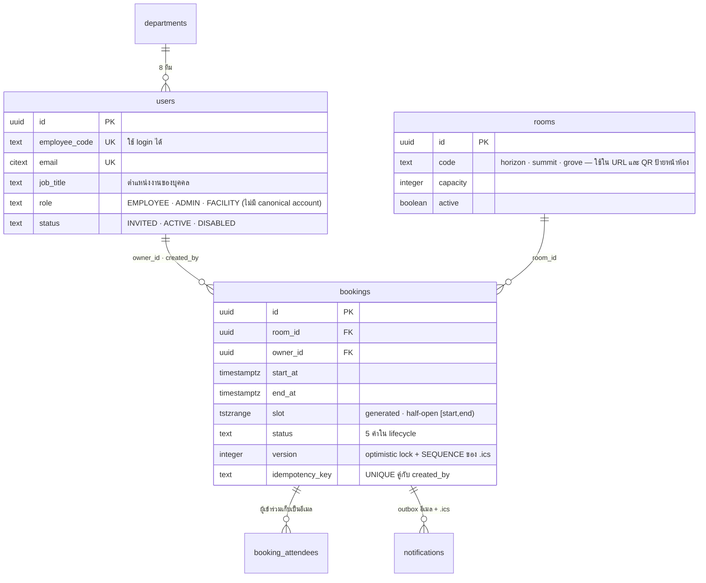

<!-- id: data-model -->
## 05 · โครงสร้างข้อมูล (Data Model)

**ฐานข้อมูลเป็นผู้ตัดสินสุดท้าย** — กฎที่ห้ามพังเด็ดขาด (ไม่จองซ้อน, audit แก้ไม่ได้) อยู่ใน PostgreSQL ไม่ใช่ในโค้ด; โค้ดมีหน้าที่แปล error ของ DB ให้เป็นข้อความที่ผู้ใช้เข้าใจ ทุกคอลัมน์เวลาเป็น `timestamptz` และคณิตศาสตร์วัน/ชั่วโมงทำผ่าน `AT TIME ZONE 'Asia/Bangkok'` เสมอ ขนาดข้อมูล ≈ 5k bookings/ปี — index ทุกตัวมีไว้ให้ query plan "ถูกรูป" ไม่ใช่เพราะโหลด

หัวข้อนี้เรียงตามลำดับที่ต้องรู้จริง: ตารางมีอะไร (5.1) → การันตีไม่จองซ้อน (5.3) → ลำดับ lock (5.6) → สถานะการจอง (5.5) ส่วนของอ้างอิง (DDL เต็ม, ดัชนี, SQL ของทุกธุรกรรม, รายงาน, retention) อยู่ในบล็อกที่กดเปิดได้

### 5.1 ERD และรายการตาราง



สิ่งที่ควรอ่านจากภาพนี้: `bookings` เป็นตารางเดียวที่ถือความจริงเรื่อง "ใครได้ห้องไหนเวลาไหน" — check-in, การยกเลิกและ idempotency key ล้วนเป็น **คอลัมน์บนแถวเดียวกัน** ไม่ใช่ตารางลูก

| ตาราง | หน้าที่ | เจ้าของ |
|---|---|---|
| `departments` | 8 ทีม (master data) | ของเรา |
| `users` | พนักงาน/แอดมิน: core + admin plugin ของ better-auth และ additionalFields ของเรา (`employee_code`, `department_id`, `job_title`, `mobile`, `status`, …); `job_title` คือตำแหน่งงานของบุคคล แยกจาก `role` ที่ใช้ RBAC | better-auth + ของเรา |
| `sessions` | session cookie `__Host-sid` — ลบแถว = หลุดทันที | better-auth |
| `accounts` | credential ของบัญชี; argon2id hash อยู่ที่ `accounts.password` | better-auth |
| `verifications` | ตารางภายในของ better-auth — **ไม่ใช่** ที่เก็บ token ตั้งรหัสผ่านของเรา; ปล่อยให้ไลบรารีใช้เองและ purge รายวัน | better-auth |
| `password_setup_tokens` | token ตั้งรหัสผ่านของเรา: invite 7 วัน / admin reset 24 ชม. + `purpose` + `used_at`; enum `FORGOT` คงอยู่ใน schema เพื่อ compatibility แต่ไม่มี forgot endpoint ใน build ปัจจุบัน | ของเรา |
| `rooms` | 3 ห้อง + `code` (ใช้ใน URL ของ QR หน้าห้อง) + `active` (soft delete) | ของเรา |
| `features`, `room_features` | อุปกรณ์และจำนวนต่อห้อง | ของเรา |
| `business_hours` | เวลาทำการ 7 แถว (จ–อา) ชุดเดียวใช้ร่วมทุกห้อง — ไม่มี override รายห้อง (D-02) | ของเรา |
| `holidays` | วันหยุดที่ admin กำหนด; canonical initializer เริ่มเป็นตารางว่าง | ของเรา |
| `settings` | policy key/value (`jsonb`) — 10 คีย์, ดู §5.10 | ของเรา |
| `bookings` | การจอง + สถานะ + check-in/cancel/auto-release + idempotency key | ของเรา |
| `booking_attendees` | ผู้เข้าร่วมเก็บเป็นอีเมล (match กับ `users` ตอนอ่าน) | ของเรา |
| `notifications` | **transactional outbox** + delivery log ของอีเมล | ของเรา |
| `audit_logs` | append-only + trigger กันแก้/ลบ | ของเรา |

:::details ตารางที่ตั้งใจ "ไม่มี" และตารางที่เพิ่มมาแทน (7 อย่าง)
ไม่มี: `checkins` (check-in = 4 คอลัมน์บน `bookings`), `idempotency_keys` (key อยู่บนแถว `bookings` และ **ไม่มี `request_hash`** — key เดิมคืนใบเดิมเสมอ, CF-01), `business_hours` รายห้อง, `DRAFT` status (ฟอร์มเป็น client state), ตาราง token ของ QR (QR เป็น **ป้ายพิมพ์คงที่ต่อห้อง** → deep link `/check-in/:roomCode` ป้องกันด้วย login + สมาชิกภาพในใบจอง + หน้าต่างเวลา + ห้องต้องตรง ไม่มี token ให้หมุนหรือให้รั่ว), ตาราง rate-limit (better-auth ตั้ง `rateLimit.storage` ไม่ใช่ `database`; lockout เก็บบน `users.failed_logins`/`locked_until`)

**มี** `password_setup_tokens` ของเราเอง: เอกสารของ better-auth ให้ reset-password ที่มี "อายุเดียว" ต่อทั้งระบบ และ callback ส่งมาแค่ token/URL — implementation ต้องการ TTL ต่างกันระหว่าง invite 7 วันกับ admin reset 24 ชม. และต้องการ id ของ token ไว้เป็น `notifications.dedupe_key` ใน **tx เดียวกับ outbox** ซึ่งสัญญาของไลบรารีไม่รับประกัน (C2-06). ค่า `FORGOT` เป็น schema reservation จากแผนเดิม; ไม่มี route ออก token purpose นี้ใน API ปัจจุบัน
:::

:::details คอลัมน์ที่ better-auth เป็นเจ้าของ — รายการผูกพันของ schema freeze (4 model)
ได้จากการรัน `getAuthTables(auth.$context.options)` กับ config จริงใน `apps/api/src/auth/index.ts` บน PostgreSQL 18.6 — `id` เป็น implicit ทุก model และ **ไม่ได้** ถูกสร้างโดยไลบรารี (`advanced.database.generateId: false`) จึงเป็น `gen_random_uuid()` DEFAULT ของ Postgres

| model → ตาราง | คอลัมน์ที่ไลบรารีอ่าน/เขียนตรง ๆ | ดัชนีที่ไลบรารีประกาศ |
|---|---|---|
| `user` → `users` | `full_name`, `email`, `email_verified`, `image`, `created_at`, `updated_at`, `role`, `banned`, `ban_reason`, `ban_expires`, `employee_code`, `department_id`, `job_title`, `mobile`, `status` | ไม่มี |
| `session` → `sessions` | `expires_at`, `token`, `created_at`, `updated_at`, `ip_address`, `user_agent`, `user_id`, `impersonated_by` | ไม่มี |
| `account` → `accounts` | `issuer`, `account_id`, `provider_id`, `user_id`, `access_token`, `refresh_token`, `id_token`, `access_token_expires_at`, `refresh_token_expires_at`, `scope`, `password`, `created_at`, `updated_at` | `UNIQUE (issuer, account_id)` |
| `verification` → `verifications` | `identifier`, `value`, `expires_at`, `created_at`, `updated_at` | ไม่มี |

- **ของเราอย่างเดียว ไลบรารีไม่เคยแตะ**: `users.failed_logins`, `locked_until`, `last_login_at`, `disabled_at`, `created_by` และทั้ง `password_setup_tokens` — ทุกคอลัมน์ต้อง nullable หรือมี DEFAULT เพราะ INSERT ของ better-auth ไม่เอ่ยถึงเลย
- **ดัชนีที่เป็นของเรา ไม่ใช่ของไลบรารี**: `sessions_user_idx`, `sessions_expires_idx`, `verifications_identifier_idx` — เก็บไว้ แต่อย่าอธิบายว่าเป็นของ better-auth
- better-auth ประกาศ `role`, `banned`, `status` เป็น nullable/`input:false`; DDL ของเราเข้มกว่า (`NOT NULL DEFAULT`) และใช้งานได้เพราะ create hook ของ plugin ส่งค่ามาทุกครั้ง — **ห้ามแก้ให้ "ตรงกับไลบรารี"**
:::

### 5.2 DDL ฉบับเต็ม (10 ไฟล์ migration)

- **`text` + `CHECK` แทน PG enum** — เพิ่มค่าใหม่ = `DROP CONSTRAINT; ADD CONSTRAINT` ในไฟล์เดียวแบบ transactional ไม่ติดข้อจำกัดของ `ALTER TYPE … ADD VALUE` (ทำใน transaction ไม่ได้, ลบค่าไม่ได้) ราคาคือ 1 บรรทัด CHECK ต่อคอลัมน์
- **extension สร้างโดย bootstrap superuser ไม่ใช่ migration** — `gen_random_uuid()` เป็น core ของ PG 13+ ใช้ได้เลย แต่ `btree_gist` และ `citext` ต้อง `CREATE EXTENSION` ใน `infra/db/init/01-roles.sql`; `rf_owner` รันเองไม่ได้ (`permission denied to create extension` — พิสูจน์บน PG 18.6, W0 ข้อ S7) จึงไม่มีบรรทัด `CREATE EXTENSION` ในไฟล์ migration ใดเลย
- **ตารางของ better-auth ใช้ชื่อพหูพจน์** ผ่าน `modelName`, `id` เป็น `uuid` ที่ DB ใส่ default, คอลัมน์เวลาเป็น `timestamptz` — field map ที่ผูกพันอยู่ในไฟล์ config เดียว (§5.11) ไม่ใช่ในเอกสารนี้
- ลำดับไฟล์: `0000` ฟังก์ชัน → `0001` auth + departments → `0002` master data → `0003` bookings → `0004` EXCLUDE (§5.3) → `0005` outbox + audit → `0006` grants → `0007` ดัชนี FK → `0008` ดัชนีตัวกรอง audit → `0009` ตำแหน่งงานผู้ใช้

:::details `0000_functions.sql` — trigger function + audit immutability (2 ฟังก์ชัน)
```sql
-- 0000_functions.sql  (custom migration; ทุกไฟล์ขึ้นต้นด้วย 2 บรรทัดนี้)
SET lock_timeout = '5s'; SET statement_timeout = '60s';
-- ไม่มี CREATE EXTENSION ที่นี่: btree_gist / citext ถูกสร้างโดย superuser ใน infra/db/init/01-roles.sql
-- (rf_owner ไม่มีสิทธิ์สร้าง extension แม้เป็น trusted extension — W0 ข้อ S7)

CREATE FUNCTION set_updated_at() RETURNS trigger LANGUAGE plpgsql AS $$
BEGIN NEW.updated_at := now(); RETURN NEW; END $$;

-- audit_logs: แก้ไม่ได้เลย, ลบได้เฉพาะงาน retention ที่ประกาศ GUC (ดู §5.10)
CREATE FUNCTION audit_logs_immutable() RETURNS trigger LANGUAGE plpgsql AS $$
BEGIN
  IF TG_OP = 'DELETE' AND current_setting('rf.audit_purge', true) = 'on' THEN RETURN OLD; END IF;
  RAISE EXCEPTION 'audit_logs is append-only' USING ERRCODE = 'insufficient_privilege';
END $$;
```
:::

:::details `0001_departments_auth.sql` — departments, users, sessions, accounts, verifications, password_setup_tokens (6 ตาราง)
```sql
-- 0001_departments_auth.sql  (departments/password_setup_tokens = เรา; users/sessions/accounts/verifications = better-auth + additionalFields)
CREATE TABLE departments (
  id         uuid PRIMARY KEY DEFAULT gen_random_uuid(),
  code       text NOT NULL UNIQUE CHECK (code ~ '^[A-Z0-9_]{2,16}$'),
  name       text NOT NULL CHECK (length(name) BETWEEN 1 AND 100),
  active     boolean NOT NULL DEFAULT true,
  created_at timestamptz NOT NULL DEFAULT now(),
  updated_at timestamptz NOT NULL DEFAULT now()
);
CREATE TRIGGER trg_departments_updated BEFORE UPDATE ON departments FOR EACH ROW EXECUTE FUNCTION set_updated_at();

CREATE TABLE users (
  -- better-auth core (user.modelName='users'; user.fields.name='full_name')
  id             uuid PRIMARY KEY DEFAULT gen_random_uuid(),
  full_name      text NOT NULL CHECK (length(full_name) BETWEEN 1 AND 120),
  email          citext NOT NULL UNIQUE CHECK (email ~ '^[^@\s]+@[^@\s]+\.[^@\s]+$'),
  email_verified boolean NOT NULL DEFAULT false,           -- true เมื่อผู้ใช้ redeem ลิงก์ invite สำเร็จ (set-password) — ไม่ใช่ตอน admin สร้าง (C1-20)
  image          text,                                     -- ไม่ใช้ (better-auth ต้องมี)
  created_at     timestamptz NOT NULL DEFAULT now(),
  updated_at     timestamptz NOT NULL DEFAULT now(),
  -- better-auth admin plugin (defaultRole 'EMPLOYEE', adminRoles ['ADMIN'])
  role           text NOT NULL DEFAULT 'EMPLOYEE' CHECK (role IN ('EMPLOYEE','ADMIN','FACILITY')),  -- FACILITY รองรับใน auth/API แต่ไม่มี canonical account หรือ UI เฉพาะ
  banned         boolean NOT NULL DEFAULT false,           -- มิเรอร์ของ status='DISABLED' (ดูหมายเหตุใต้ DDL); ผู้เขียนคนเดียวคือธุรกรรม deactivate ของเรา
  ban_reason     text,
  ban_expires    timestamptz,
  -- ของเรา (user.additionalFields)
  employee_code  citext NOT NULL UNIQUE CHECK (employee_code ~ '^[A-Za-z0-9-]{3,20}$'),  -- public login identity เพียงอย่างเดียว (resolve → internal email ก่อนเรียก better-auth)
  department_id  uuid NOT NULL REFERENCES departments(id) ON DELETE RESTRICT,
  job_title      text NOT NULL DEFAULT 'พนักงาน' CHECK (length(job_title) BETWEEN 1 AND 100), -- ตำแหน่งงานมนุษย์ แยกจาก role ของ RBAC
  mobile         text CHECK (mobile ~ '^0[0-9]{9}$'),      -- ติดต่อ/กู้บัญชีเท่านั้น ไม่ใช่ login factor; redact ใน log/audit
  status         text NOT NULL DEFAULT 'INVITED' CHECK (status IN ('INVITED','ACTIVE','DISABLED')),  -- INVITED = ยังไม่ตั้งรหัสผ่าน
  failed_logins  smallint NOT NULL DEFAULT 0,              -- lockout 5 ครั้ง / 15 นาที (ดูหัวข้อ 09)
  locked_until   timestamptz,
  last_login_at  timestamptz,
  disabled_at    timestamptz,
  created_by     uuid REFERENCES users(id),                -- admin ที่สร้าง; NULL = seed
  CONSTRAINT users_disabled_consistent CHECK ((status = 'DISABLED') = (disabled_at IS NOT NULL)),
  CONSTRAINT users_banned_mirror       CHECK (banned = (status = 'DISABLED'))                 -- access state มีค่าเดียว (C1-17)
);
CREATE INDEX users_department_idx ON users (department_id);
CREATE INDEX users_role_idx ON users (role) WHERE status = 'ACTIVE';   -- "ส่งอีเมลหา ADMIN ทุกคน"
CREATE TRIGGER trg_users_updated BEFORE UPDATE ON users FOR EACH ROW EXECUTE FUNCTION set_updated_at();
```

**`banned` เป็นมิเรอร์ — ห้ามลบทั้งคอลัมน์และ CHECK.** `users.status` คือความจริงเชิงความหมาย (guard ทุก request join คอลัมน์นี้); `banned` เป็นสำเนาที่มีผู้เขียนคนเดียวคือธุรกรรม `POST /admin/users/:id/deactivate` ของเรา ซึ่งตั้งทั้งสองค่าใน `UPDATE` เดียว `users_banned_mirror` คือสิ่งที่ทำให้สองค่านี้ไม่มีทางเพี้ยน — และมันจับได้ทันทีเมื่อ `auth.api.banUser()` พยายามเขียน `banned=true` โดยไม่แตะ `status` (ล้มด้วย `23514 users_banned_mirror`, พิสูจน์บน DB จริง) จึง **404 ทั้ง `banUser` และ `unbanUser`** ของ admin plugin ไม่เปิดเป็น route ทางเลือกที่ตรวจแล้วไม่เอา: ลบคอลัมน์ → adapter ของ plugin `SELECT` ชื่อที่ไม่มี → `42703` (คลาสความล้มเหลวเดียวกับ `issuer`); ลบ CHECK → `banUser` สำเร็จเงียบ ๆ ตั้ง `banned=true` ขณะ `status` ยัง `ACTIVE` แล้ว admin เชื่อว่าปิดบัญชีแล้วทั้งที่ผู้ใช้ยังใช้งานอยู่; `GENERATED ALWAYS AS (status = 'DISABLED') STORED` → INSERT ของไลบรารีชน `428C9 cannot insert into generated column`

```sql
-- better-auth: คอลัมน์ทั้งหมดที่ adapter อ่าน/เขียนตรง ๆ (ดูรายการผูกพันใน §5.1)
CREATE TABLE sessions (
  id              uuid PRIMARY KEY DEFAULT gen_random_uuid(),
  user_id         uuid NOT NULL REFERENCES users(id) ON DELETE CASCADE,
  token           text NOT NULL UNIQUE,                    -- ค่าใน cookie __Host-sid (better-auth จัดการ)
  expires_at      timestamptz NOT NULL,                    -- 7 วัน sliding; remember_me=true → คุกกี้ค้างเครื่อง, false → คุกกี้หมดอายุเมื่อปิดเบราว์เซอร์ (better-auth 1.7.1 ให้ Max-Age=604800 สูงสุด)
  ip_address      text,
  user_agent      text,
  impersonated_by uuid,                                    -- admin plugin; ไม่เปิดใช้ impersonation
  created_at      timestamptz NOT NULL DEFAULT now(),
  updated_at      timestamptz NOT NULL DEFAULT now()
);
CREATE INDEX sessions_user_idx ON sessions (user_id);
CREATE INDEX sessions_expires_idx ON sessions (expires_at);          -- purge รายวัน (ดัชนีของเรา ไม่ใช่ของไลบรารี)

-- ทั้ง 13 คอลัมน์เป็นข้อบังคับ: adapter SELECT ทุกชื่อนี้ตรง ๆ ทุกครั้งที่ sign-in
-- ตัด issuer ออก → 42703 column "issuer" does not exist; ตัดหกคอลัมน์ token ออก → 42703 เช่นกัน (พิสูจน์สองครั้งบน PG 18.6, W0 ข้อ S1/S2)
CREATE TABLE accounts (
  id                       uuid PRIMARY KEY DEFAULT gen_random_uuid(),
  user_id                  uuid NOT NULL REFERENCES users(id) ON DELETE CASCADE,
  issuer                   text NOT NULL,                  -- แถว credential = 'local:credential'
  account_id               text NOT NULL,                  -- แถว credential = users.id
  provider_id              text NOT NULL,                  -- 'credential' = email/password
  password                 text,                           -- argon2id ผ่าน emailAndPassword.password.hash/verify (@node-rs/argon2)
  access_token             text,                           -- หกคอลัมน์ OAuth: ไม่ใช้ใน MVP (SSO Phase 2)
  refresh_token            text,                           --   แต่ห้ามตัดออก — adapter อ่านทุกชื่อ
  id_token                 text,
  access_token_expires_at  timestamptz,
  refresh_token_expires_at timestamptz,
  scope                    text,
  created_at               timestamptz NOT NULL DEFAULT now(),
  updated_at               timestamptz NOT NULL DEFAULT now()
);
CREATE UNIQUE INDEX accounts_issuer_account_id_idx ON accounts (issuer, account_id);   -- ดัชนีที่ better-auth ประกาศเอง
CREATE INDEX accounts_user_idx ON accounts (user_id);

CREATE TABLE verifications (                               -- ตารางภายในของ better-auth — ไม่ใช้ตั้งรหัสผ่าน (ดู password_setup_tokens); purge รายวัน
  id         uuid PRIMARY KEY DEFAULT gen_random_uuid(),
  identifier text NOT NULL,
  value      text NOT NULL,
  expires_at timestamptz NOT NULL,
  created_at timestamptz NOT NULL DEFAULT now(),
  updated_at timestamptz NOT NULL DEFAULT now()
);
CREATE INDEX verifications_identifier_idx ON verifications (identifier);   -- ดัชนีของเรา

-- ลิงก์ตั้งรหัสผ่านเป็นของเราเอง ไม่ฝากไว้กับ better-auth (D-29 ตาม C2-06): TTL ต่างกันต่อ purpose
-- และต้องมี id ของ token ไว้เป็น notifications.dedupe_key ใน tx เดียวกับ outbox
CREATE TABLE password_setup_tokens (
  id         uuid PRIMARY KEY DEFAULT gen_random_uuid(),
  user_id    uuid NOT NULL REFERENCES users(id) ON DELETE CASCADE,
  token_hash text NOT NULL UNIQUE,                         -- sha256(token); token = 32 ไบต์สุ่ม base64url ส่งเฉพาะในอีเมล ไม่เคยเก็บ plaintext
  purpose    text NOT NULL CHECK (purpose IN ('INVITE','RESET','FORGOT')),
  expires_at timestamptz NOT NULL,                         -- app ปัจจุบันตั้ง INVITE = now()+7d, RESET = now()+24h; FORGOT ยังไม่ถูกออกโดย route ใด
  used_at    timestamptz,                                  -- ใช้ครั้งเดียว: redeem = UPDATE … WHERE used_at IS NULL AND expires_at > now() RETURNING (race-safe, พิสูจน์แล้ว)
  created_by uuid REFERENCES users(id),                    -- admin ที่กดส่ง; schema รองรับ NULL ไว้แต่ final API ไม่มี self-service forgot
  created_at timestamptz NOT NULL DEFAULT now()
);
CREATE INDEX password_setup_tokens_user_idx ON password_setup_tokens (user_id) WHERE used_at IS NULL;
```
:::

:::details `0002_master_data.sql` — rooms, features, room_features, business_hours, holidays, settings (6 ตาราง)
```sql
CREATE TABLE rooms (
  id            uuid PRIMARY KEY DEFAULT gen_random_uuid(),
  code          text NOT NULL UNIQUE CHECK (code ~ '^[a-z0-9-]{2,32}$'),  -- 'horizon'; ใช้ใน URL และ QR ป้ายห้อง (/check-in/:roomCode)
  name          text NOT NULL CHECK (length(name) BETWEEN 1 AND 80),
  floor         text,
  location      text,                                      -- 'Garden Wing'
  description   text CHECK (length(description) <= 1000),
  capacity      integer NOT NULL CHECK (capacity BETWEEN 1 AND 500),
  photo         bytea,                                     -- ไบต์รูปอยู่ในแถว; API expose photo_url = /api/v1/rooms/<id>/photo
  active        boolean NOT NULL DEFAULT true,             -- soft delete; bookings FK RESTRICT
  created_at    timestamptz NOT NULL DEFAULT now(),
  updated_at    timestamptz NOT NULL DEFAULT now()
);
CREATE TRIGGER trg_rooms_updated BEFORE UPDATE ON rooms FOR EACH ROW EXECUTE FUNCTION set_updated_at();

CREATE TABLE features (
  key  text PRIMARY KEY CHECK (key ~ '^[a-z_]{2,32}$'),    -- 'projector'
  name text NOT NULL,                                      -- ชื่อแสดงผลภาษาไทย
  icon text                                                -- ชื่อ lucide icon
);

CREATE TABLE room_features (
  room_id     uuid NOT NULL REFERENCES rooms(id) ON DELETE CASCADE,
  feature_key text NOT NULL REFERENCES features(key) ON DELETE RESTRICT,
  quantity    integer NOT NULL DEFAULT 1 CHECK (quantity >= 1),
  PRIMARY KEY (room_id, feature_key)
);

-- เวลาทำการของบริษัท: 7 แถว (weekday 1–7) ใช้ร่วมทุกห้อง; ไม่มี override รายห้อง (D-02) — ถ้าต้องการภายหลังเพิ่ม room_id nullable + UNIQUE NULLS NOT DISTINCT ใน 1 migration
CREATE TABLE business_hours (
  weekday    smallint PRIMARY KEY CHECK (weekday BETWEEN 1 AND 7),  -- ISO: 1 = จันทร์ … 7 = อาทิตย์
  is_open    boolean NOT NULL,
  open_time  time,
  close_time time,
  updated_by uuid REFERENCES users(id),
  updated_at timestamptz NOT NULL DEFAULT now(),
  CONSTRAINT business_hours_valid CHECK (NOT is_open OR (open_time IS NOT NULL AND close_time IS NOT NULL AND open_time < close_time))
);

CREATE TABLE holidays (
  day  date PRIMARY KEY,
  name text NOT NULL
);

-- policy settings: 1 แถวต่อคีย์ (§5.10); zod `SettingsSchema` ใน apps/api/src/lib/settings.ts ตรวจทั้งก้อนและกฎข้ามคีย์; cache ในโปรเซส 60 วินาที
CREATE TABLE settings (
  key        text PRIMARY KEY CHECK (key ~ '^[a-z_]{3,48}$'),
  value      jsonb NOT NULL,
  updated_by uuid REFERENCES users(id),
  updated_at timestamptz NOT NULL DEFAULT now()
);
```
:::

:::details `0003_bookings.sql` — bookings + booking_attendees (2 ตาราง)
```sql
-- 0003_bookings.sql  (ยังไม่มี EXCLUDE — อยู่ใน 0004, SQL อยู่ใน §5.3)
CREATE TABLE bookings (
  id               uuid PRIMARY KEY DEFAULT gen_random_uuid(),
  room_id          uuid NOT NULL REFERENCES rooms(id) ON DELETE RESTRICT,
  owner_id         uuid NOT NULL REFERENCES users(id) ON DELETE RESTRICT,   -- เจ้าของการประชุม ("My bookings", masking, check-in)
  created_by       uuid NOT NULL REFERENCES users(id) ON DELETE RESTRICT,   -- ผู้กด (= owner เว้นแต่ ADMIN จองแทน)
  title            text NOT NULL CHECK (length(title) BETWEEN 1 AND 200),
  description      text CHECK (length(description) <= 2000),
  special_request  text CHECK (length(special_request) <= 1000),
  headcount        integer CHECK (headcount >= 1),
  is_private       boolean NOT NULL DEFAULT false,
  start_at         timestamptz NOT NULL,
  end_at           timestamptz NOT NULL,
  slot             tstzrange GENERATED ALWAYS AS (tstzrange(start_at, end_at, '[)')) STORED,  -- half-open
  status           text NOT NULL CHECK (status IN ('CONFIRMED','CHECKED_IN','COMPLETED',
                                                   'CANCELLED','AUTO_RELEASED')),   -- 5 ค่า, §5.5
  version          integer NOT NULL DEFAULT 1,             -- +1 ทุกการเปลี่ยนแปลง (คนหรือ job); = .ics SEQUENCE; optimistic lock ของ PATCH
  idempotency_key  uuid NOT NULL,                          -- client สร้างเมื่อ submit; reuse หลัง network/5xx และสร้างใหม่หลัง 4xx; ไม่มี request_hash
  confirmed_at     timestamptz,                            -- ตั้งตอน INSERT และทุกครั้งที่เลื่อนเวลาสำเร็จ
  reason_code      text CHECK (reason_code IN ('OWNER_CANCELLED','ADMIN_CANCELLED','OWNER_DISABLED','NO_SHOW')),
  reason           text,                                   -- API บังคับ 3–1000 เมื่อ admin ยกเลิกใบของคนอื่น; DB ไม่มี length CHECK
  -- check-in
  checked_in_at    timestamptz,
  checked_in_by    uuid REFERENCES users(id),
  checkin_method   text CHECK (checkin_method IN ('SELF','QR','ADMIN')),   -- QR = สแกนป้ายหน้าห้อง (ทางเข้าหลัก)
  -- release / cancel
  auto_released_at timestamptz,
  cancelled_at     timestamptz,
  cancelled_by     uuid REFERENCES users(id),
  created_at       timestamptz NOT NULL DEFAULT now(),
  updated_at       timestamptz NOT NULL DEFAULT now(),

  -- DB-level sanity (ค่านโยบาย min/increment/advance อยู่ใน settings → บังคับที่ API)
  CONSTRAINT bookings_time_order   CHECK (end_at > start_at),
  CONSTRAINT bookings_15min_grid   CHECK (extract(epoch FROM start_at)::bigint % 900 = 0
                                      AND extract(epoch FROM end_at)::bigint   % 900 = 0),   -- พื้นสุดของ DB: กริด 15 นาที → settings.slot_increment_minutes ∈ {15,30,60} (zod บังคับ, §5.10)
  CONSTRAINT bookings_hard_max     CHECK (end_at - start_at <= interval '12 hours'),          -- เพดานแข็ง 12 ชม. (ทำให้ range query ใช้ btree start_at ได้) → settings.max_duration_minutes ≤ 720 หรือ null
  CONSTRAINT bookings_confirm_ok   CHECK (status NOT IN ('CONFIRMED','CHECKED_IN','COMPLETED') OR confirmed_at IS NOT NULL),
  CONSTRAINT bookings_checkin_ok   CHECK (status <> 'CHECKED_IN'    OR (checked_in_at IS NOT NULL AND checkin_method IS NOT NULL)),
  CONSTRAINT bookings_cancel_ok    CHECK (status <> 'CANCELLED'     OR (cancelled_at IS NOT NULL AND cancelled_by IS NOT NULL)),
  CONSTRAINT bookings_release_ok   CHECK (status <> 'AUTO_RELEASED' OR auto_released_at IS NOT NULL),
  CONSTRAINT bookings_terminal_why CHECK (status NOT IN ('CANCELLED','AUTO_RELEASED') OR reason_code IS NOT NULL),
  CONSTRAINT bookings_idem_unique  UNIQUE (created_by, idempotency_key)    -- ตาข่ายชั้นสอง: key เดิมไม่มีวันสร้าง booking ใบที่สอง
);
CREATE TRIGGER trg_bookings_updated BEFORE UPDATE ON bookings FOR EACH ROW EXECUTE FUNCTION set_updated_at();

CREATE INDEX bookings_room_start_idx ON bookings (room_id, start_at);
CREATE INDEX bookings_owner_idx      ON bookings (owner_id, start_at DESC);
CREATE INDEX bookings_live_idx       ON bookings (start_at, end_at) WHERE status IN ('CONFIRMED','CHECKED_IN');
-- ดัชนีคุม FK ที่ชี้กลับไป users (checked_in_by / cancelled_by) อยู่ใน 0007 — ที่เดียว

CREATE TABLE booking_attendees (
  booking_id uuid   NOT NULL REFERENCES bookings(id) ON DELETE CASCADE,
  email      citext NOT NULL CHECK (email ~ '^[^@\s]+@[^@\s]+\.[^@\s]+$'),
  name       text,
  PRIMARY KEY (booking_id, email)
);
CREATE INDEX booking_attendees_email_idx ON booking_attendees (email);   -- "ฉันเป็นผู้เข้าร่วมไหม" → เปิด private

-- ไม่มีตาราง idempotency_keys (key อยู่บนแถว bookings) และไม่มีตารางบันทึกการตัดสินใจของ admin — การยกเลิกอยู่ในคอลัมน์ cancelled_* + reason_code/reason และมีสำเนาถาวรใน audit_logs
```
:::

:::details `0005_outbox_audit.sql` — notifications + audit_logs (2 ตาราง)
```sql
-- outbox + delivery log: INSERT ใน transaction เดียวกับการจอง; worker notify.send ระบายออก
CREATE TABLE notifications (
  id                  bigint GENERATED ALWAYS AS IDENTITY PRIMARY KEY,
  booking_id          uuid REFERENCES bookings(id) ON DELETE SET NULL,   -- NULL สำหรับ account.set_password
  channel             text NOT NULL DEFAULT 'EMAIL' CHECK (channel IN ('EMAIL')),  -- 1.1: เพิ่ม 'IN_APP' + recipient_user_id ด้วย DROP/ADD CHECK
  template_key        text NOT NULL,                       -- 'booking.confirmed', 'booking.cancelled', 'booking.auto_released', … (zod enum ในโค้ด)
  dedupe_key          text NOT NULL DEFAULT '',            -- booking events = version::text, reminder = epoch ของ start_at, account.set_password = password_setup_tokens.id ของ token ที่ออก (ออก token ใหม่ = แถวใหม่เสมอ; C1-05)
  recipient_email     citext NOT NULL,
  payload             jsonb NOT NULL,                      -- snapshot ทุกอย่างที่ template + .ics ต้องใช้ ณ เวลาที่ enqueue
  status              text NOT NULL DEFAULT 'PENDING' CHECK (status IN ('PENDING','SENT','FAILED','SKIPPED')),
  attempts            smallint NOT NULL DEFAULT 0,
  next_attempt_at     timestamptz NOT NULL DEFAULT now(),
  last_error          text,
  provider_message_id text,                                -- id ที่ relay ตอบกลับมาในบรรทัด 250
  sent_at             timestamptz,
  created_at          timestamptz NOT NULL DEFAULT now(),
  CONSTRAINT notifications_dedupe UNIQUE NULLS NOT DISTINCT (booking_id, template_key, recipient_email, dedupe_key)  -- ทุก enqueue เป็น ON CONFLICT DO NOTHING
);
CREATE INDEX notifications_pending_idx ON notifications (next_attempt_at) WHERE status = 'PENDING';
CREATE INDEX notifications_booking_idx ON notifications (booking_id, created_at DESC);   -- หน้าจอ admin "อีเมลของการจองนี้"

-- append-only; actor_id NULL = ระบบ/job
CREATE TABLE audit_logs (
  id          bigint GENERATED ALWAYS AS IDENTITY PRIMARY KEY,
  actor_id    uuid REFERENCES users(id),
  action      text NOT NULL,            -- 'booking.create','booking.cancel','user.disable','settings.update','auth.login_failed', …
  entity_type text NOT NULL,            -- 'booking','user','room','settings','auth'
  entity_id   text NOT NULL,
  before      jsonb,                    -- redact: password, mobile
  after       jsonb,
  reason      text,                     -- เหตุผลที่ admin พิมพ์ (ดูหัวข้อ 09 S-15)
  ip          inet,
  request_id  text,
  created_at  timestamptz NOT NULL DEFAULT now()
);
CREATE INDEX audit_logs_entity_idx ON audit_logs (entity_type, entity_id, created_at DESC);
CREATE INDEX audit_logs_actor_idx  ON audit_logs (actor_id, created_at DESC);
CREATE TRIGGER trg_audit_logs_immutable BEFORE UPDATE OR DELETE ON audit_logs
  FOR EACH ROW EXECUTE FUNCTION audit_logs_immutable();
```
:::

:::details `0006_grants.sql` — สิทธิ์ของ `rf_app` (ต้อง REVOKE DELETE ตรง ๆ ไม่ใช่ GRANT ทับ)
`infra/db/init/01-roles.sql` ตั้ง default privileges ของ `rf_owner` ไว้ให้ `rf_app` ได้ `select, insert, update, delete` — ตารางใหม่ทุกตารางที่ `rf_owner` สร้างจึงมาพร้อม `DELETE` (ตรวจแล้ว: ตารางที่สร้างสด `rf_app` ได้ `DELETE, INSERT, SELECT, UPDATE`) การ `GRANT` ชุดที่แคบกว่าทับ **ไม่หด** ACL เดิม ต้อง `REVOKE` ตรง ๆ ไม่งั้นกฎ "ไม่มี DELETE โดย default" ของหัวข้อ 09 ถูกปิดทิ้งเงียบ ๆ และ definition of done ข้อ (5) ของ schema (`DELETE FROM bookings` ด้วย `rf_app` ต้อง permission denied) จะไม่ผ่าน (W0 ข้อ S8)

```sql
-- 0006_grants.sql  (custom; roles rf_owner / rf_app สร้างโดย infra/db/init/01-roles.sql — ดูหัวข้อ 09)
GRANT USAGE ON SCHEMA public TO rf_app;
GRANT SELECT, INSERT, UPDATE ON ALL TABLES IN SCHEMA public TO rf_app;
GRANT USAGE, SELECT ON ALL SEQUENCES IN SCHEMA public TO rf_app;

-- 1) ล้าง DELETE ที่ default privileges ของ 01-roles.sql แจกให้ตาราง 0001–0005 มาแล้ว
REVOKE DELETE ON ALL TABLES IN SCHEMA public FROM rf_app;
-- 2) ตารางใหม่ในอนาคตต้องไม่ได้ DELETE ฟรีอีก — GRANT ที่แคบกว่าไม่หด ACL จึงต้อง REVOKE ที่ default privileges
ALTER DEFAULT PRIVILEGES FOR ROLE rf_owner IN SCHEMA public REVOKE DELETE ON TABLES FROM rf_app;
ALTER DEFAULT PRIVILEGES FOR ROLE rf_owner IN SCHEMA public GRANT SELECT, INSERT, UPDATE ON TABLES TO rf_app;
ALTER DEFAULT PRIVILEGES FOR ROLE rf_owner IN SCHEMA public GRANT USAGE, SELECT ON SEQUENCES TO rf_app;
-- 3) DELETE เฉพาะตารางที่โค้ดลบจริง (§5.10 retention + endpoint ที่ replace set / hard delete):
GRANT DELETE ON sessions, verifications, password_setup_tokens, booking_attendees, notifications, room_features, holidays, features, users TO rf_app;
REVOKE UPDATE, DELETE ON audit_logs FROM rf_app;   -- + trigger ใน 0000 กันแม้ rf_owner
-- bookings / rooms / departments / settings / business_hours: ไม่มี DELETE (cancel = เปลี่ยนสถานะ; ปิด = active=false; settings/hours = UPSERT)
```
:::

:::details `0007_fk_indexes.sql` — ดัชนี partial คุม FK ที่ยังไม่มีดัชนี (3 ตัว)
สาม FK นี้ชี้กลับไป `users` และ **ไม่มี query ใดใช้** — มีไว้ให้ PostgreSQL ไม่ต้อง seq scan `bookings`/`users` ทุกครั้งที่ `DELETE FROM users` (hard delete ของผู้ใช้ที่ไม่มีประวัติ, หัวข้อ 06); เป็น partial เพราะทั้งสามคอลัมน์ NULL เป็นส่วนใหญ่ จึงเกือบไม่มีต้นทุนตอนเขียน (C1-40) ประกาศที่ไฟล์นี้ที่เดียว ไม่ซ้ำใน 0001/0003

```sql
CREATE INDEX bookings_checked_in_by_idx ON bookings (checked_in_by) WHERE checked_in_by IS NOT NULL;
CREATE INDEX bookings_cancelled_by_idx  ON bookings (cancelled_by)  WHERE cancelled_by  IS NOT NULL;
CREATE INDEX users_created_by_idx       ON users (created_by)       WHERE created_by    IS NOT NULL;   -- self-FK
```
:::

### 5.3 การันตี "ไม่จองซ้อน" — EXCLUDE ตัวเดียว

การันตีทั้งหมดของระบบอยู่ใน constraint **ตัวเดียว** บน `bookings` ไม่ใช่ในโค้ด: ใบที่ถือห้องอยู่ (`CONFIRMED`/`CHECKED_IN`) ห้ามทับกันในห้องเดียวกัน — นั่นคือทั้งหมดของเรื่อง concurrency เพราะทุกการจองที่ commit สำเร็จคือการจองที่ยืนยันแล้ว (first-come-first-served, BR-04) ทุก writer จึง **INSERT/UPDATE แล้วให้ DB ตัดสิน** — ไม่มี SELECT-แล้ว-INSERT ที่ไหนในระบบ; `23P01` คือคำตอบว่า "ชน" และถูกแปลเป็น `409 SLOT_UNAVAILABLE` พร้อมห้องทางเลือก

```sql
-- 0004_bookings_exclude.sql  (custom: Drizzle DSL เขียน EXCLUDE ไม่ได้)
-- (A) การจองที่ถือห้องอยู่ (CONFIRMED/CHECKED_IN) ห้ามทับกันในห้องเดียวกัน — constraint เดียวของระบบ
ALTER TABLE bookings ADD CONSTRAINT bookings_no_overlap_confirmed
  EXCLUDE USING gist (room_id WITH =, slot WITH &&)
  WHERE (status IN ('CONFIRMED','CHECKED_IN'));
```

พูดตรง ๆ ว่า A อนุญาตอะไรและห้ามอะไร:

| คู่สถานะ (ห้องเดียวกัน, เวลาทับกัน) | ผลของ (A) |
|---|---|
| CONFIRMED × CONFIRMED / CHECKED_IN | **ห้าม** — ไม่จองซ้อน; ผู้ที่ commit ก่อนได้ห้อง อีกฝ่ายได้ `409 SLOT_UNAVAILABLE` (FR-003, US-002) |
| CHECKED_IN × CHECKED_IN | **ห้าม** — เหตุผลเดียวกัน (check-in ไม่เคยย้ายเวลา จึงไม่มีทางสร้างการทับใหม่) |
| อะไรก็ตาม × COMPLETED / CANCELLED / AUTO_RELEASED | **อนุญาต** — สามสถานะนี้อยู่นอก `WHERE` ของ constraint การเปลี่ยนสถานะจึงเท่ากับปล่อยช่องคืนทันทีโดยไม่ต้องลบแถว (FR-008) |
| ใบเดียวกันกับเวอร์ชันเก่าของตัวเอง | **อนุญาต** — `UPDATE` แถวตัวเองไม่ชนตัวเอง → reschedule เป็น `UPDATE` ธรรมดาใต้ constraint เดียวกัน |

**ทำไม half-open `[start,end)`**: `[13:00,14:00)` กับ `[14:00,15:00)` ไม่ทับกันภายใต้ `&&` — จองต่อเนื่องหลังกันได้โดยไม่ต้องลบ 1 วินาทีหรือบวก buffer **ทำไม `slot` เป็น generated column**: อ้างอิงได้ทั้งใน EXCLUDE, query (`b.slot && …`) และ Drizzle และไม่มีวันไม่ตรงกับ `start_at/end_at` constraint เป็น **immediate** (ไม่ deferrable) โดยตั้งใจ: ผู้เขียนรู้ผลทันทีที่ statement ทำงาน ไม่ใช่ตอน COMMIT — นี่คือสิ่งที่ทำให้การเลื่อนเวลาที่ชนล้มเหลวโดย **ไม่แตะแถวเดิมเลย** (BR-05/CB-03): `UPDATE` ทั้งก้อนถูก rollback ใบจองยังอยู่ที่เวลาเดิมพร้อม `version` เดิม และ **ไม่เคยมีจังหวะไหนที่ slot เดิมถูกปล่อยแล้วยังไม่ได้ slot ใหม่**

### 5.4 ดัชนี (Indexes)

ดัชนีทั้งหมดมาจาก query ที่มีอยู่จริง ยกเว้นสามตัวสุดท้ายที่มีไว้ให้ FK check ไม่ seq scan

:::details ดัชนีทุกตัวกับ query ที่ใช้ (12 แถว)
| Index | ใช้โดย query |
|---|---|
| `bookings_no_overlap_confirmed` (GiST partial, จาก EXCLUDE A) | ตรวจชนตอน INSERT/UPDATE; availability ต่อช่อง (`b.slot && tstzrange(slot)`); room search `NOT EXISTS … slot &&` (§5.8) |
| `bookings_room_start_idx (room_id, start_at)` | calendar day/week per room (รวม COMPLETED), reports (range บน start_at) |
| `bookings_owner_idx (owner_id, start_at DESC)` | My bookings |
| `bookings_live_idx (start_at, end_at) WHERE CONFIRMED/CHECKED_IN` | sweep ทั้งสามข้อ (auto-release, complete, reminder) และการหาใบของผู้สแกน QR ในหน้าต่างเช็กอิน |
| `bookings_idem_unique (created_by, idempotency_key)` | `ON CONFLICT` ตอน create |
| `booking_attendees_email_idx` | unmask private: "ผู้ดูเป็นผู้เข้าร่วมไหม" |
| `notifications_pending_idx (next_attempt_at) WHERE PENDING` | `notify.send` drain |
| `notifications_dedupe` (UNIQUE) | enqueue idempotent |
| `users_role_idx WHERE ACTIVE` | รายชื่อ ADMIN สำหรับ `booking.auto_released_admin` |
| `audit_logs_entity_idx`, `audit_logs_actor_idx` | audit viewer |
| `accounts_issuer_account_id_idx` (UNIQUE), `sessions_expires_idx`, `verifications_identifier_idx` | sign-in ของ better-auth; `maintenance.daily` purge |
| `bookings_checked_in_by_idx`, `bookings_cancelled_by_idx`, `users_created_by_idx` (partial `WHERE … IS NOT NULL`, ไฟล์ 0007) | ไม่มี query ใช้ — มีไว้ให้ FK check ตอน `DELETE FROM users` ไม่ seq scan `bookings`; partial จึงเกือบไม่มีต้นทุนเขียน (C1-40) |
:::

### 5.5 สถานะการจอง (Booking status)

| สถานะ | ความหมาย | ถือช่อง |
|---|---|---|
| `CONFIRMED` | ยืนยันแล้ว ห้องเป็นของใบนี้ — สถานะแรกเสมอ (ไม่มีขั้นรอ) | ใช่ |
| `CHECKED_IN` | มีคนมาใช้จริง (สแกน QR หน้าห้องหรือกดเช็กอิน) แก้ไม่ได้อีก เหลือแต่ admin ยกเลิก | ใช่ |
| `COMPLETED` | จบตามเวลา — ปลายทางที่ดี (sweep ตั้งให้ที่ `end_at`) | ไม่ |
| `CANCELLED` | owner ยกเลิกเอง, admin ยกเลิกพร้อมเหตุผล หรือ owner ถูกปิดบัญชี (`OWNER_CANCELLED` / `ADMIN_CANCELLED` / `OWNER_DISABLED`) | ไม่ |
| `AUTO_RELEASED` | ไม่มีใครเช็กอินภายในเส้นตาย → ปล่อยช่องคืน (`NO_SHOW`) | ไม่ |

สามค่าล่างเป็น **terminal** และไม่มีทาง reopen (สร้างใบใหม่แทน); transition ที่ไม่อยู่ในตารางด้านล่าง → `409 INVALID_STATUS_TRANSITION`; ทำซ้ำ transition เดิม (cancel ใบที่ CANCELLED แล้ว, สแกน QR ซ้ำ) → `200` ด้วยข้อมูลปัจจุบัน ไม่มี `DRAFT` (ฟอร์มเป็น client state)

**เส้นตายเช็กอิน/auto-release ที่ใช้จริง = `effective_self_deadline = LEAST(end_at, start_at + checkin_grace_minutes)`** (C2-03) — สูตรเดียวนี้ใช้ทั้งใน T6/T6-QR, sweep ข้อ 1 และ `can.check_in` ที่ส่งให้ UI

:::details ตาราง transition ทั้ง 11 เส้นทาง (จาก → เหตุการณ์ → ไป + ผลข้างเคียง)
ช่องถูกถือเฉพาะเมื่อ status ∈ {CONFIRMED, CHECKED_IN} และการจองเข้าสู่ CONFIRMED ตั้งแต่วินาทีที่ commit — ไม่มีสถานะกลางที่ยังไม่ถือช่อง

| จาก | เหตุการณ์ | ใคร | Guard | ไป | ผลข้างเคียง (tx เดียวกัน) |
|---|---|---|---|---|---|
| — | create | EMPLOYEE, ADMIN, FACILITY | policy (หัวข้อ 02), A | CONFIRMED | `confirmed_at=$decision_time`; outbox `booking.confirmed` (+ics REQUEST) → owner+attendees; audit; ชน A → `409 SLOT_UNAVAILABLE` ไม่มีแถวเกิดขึ้น |
| CONFIRMED | cancel (ADMIN ต้องมี reason) | owner, ADMIN | `end_at > $decision_time` | CANCELLED | ช่องว่างทันที; `cancelled_*`, `reason_code` OWNER_/ADMIN_CANCELLED; outbox `booking.cancelled` (+ics CANCEL) → owner+attendees |
| CHECKED_IN | cancel (reason บังคับ) | ADMIN | `end_at > $decision_time` | CANCELLED | เช่นเดียวกัน; admin ยกเลิกได้ทุกใบก่อน `end_at` |
| CONFIRMED | reschedule (เวลา/ห้อง) | owner (ก่อน `start_at`), ADMIN (ก่อน `end_at`; รวม drag&drop 1.1) | version ตรง, policy, A | CONFIRMED | `confirmed_at=$decision_time`, `version++`; outbox `booking.rescheduled` (+ics REQUEST SEQUENCE=version) **ชน A → `23P01` → tx rollback ทั้งก้อน: แถวเดิมไม่ถูกแก้ `version` เท่าเดิม ใบจองยังถือช่องเดิมอยู่ ไม่เคยมีจังหวะที่ปล่อยช่องเดิมทิ้ง (CB-03/BR-05)** |
| CONFIRMED | edit รายละเอียด (title/description/attendees/special_request/is_private/headcount) | owner, ADMIN | version ตรง; **predicate เดียวทุก endpoint**: owner ต้อง `now() < start_at`, ADMIN ต้อง `now() < end_at`; CHECKED_IN = แก้ไม่ได้แล้ว (เหลือ admin cancel เท่านั้น — C1-28) | CONFIRMED | `version++`; ไม่แตะเวลา/ห้องจึงไม่ต้องผ่าน A; ไม่ส่งอีเมลสำหรับ title/description/is_private/special_request/headcount; attendees diff: คนเพิ่มได้ `booking.confirmed` +ics REQUEST, คนถูกถอดได้ ics CANCEL (Q-13, D-30e) |
| CONFIRMED | **check-in ด้วย QR หน้าห้อง (ทางเข้าหลัก)** | ผู้สแกนที่เป็น owner หรือ attendee ของใบนั้น | ห้องต้องตรงกับ `roomCode` บนป้าย + `start_at−open_before ≤ $decision_time < LEAST(end_at, start_at+grace)`; **ระบบหาใบเอง** จาก (ผู้สแกน, ห้อง, เวลา) — 0 แถว → `422 NO_BOOKING_IN_WINDOW` | CHECKED_IN | `checked_in_at/by`, `checkin_method='QR'`; audit; ไม่มีอีเมล; สแกนซ้ำ → 200 (modal "เปิดใช้งานแล้ว") |
| CONFIRMED | check-in ด้วยตัวเองในแอป (ปุ่ม / ลิงก์ในอีเมล reminder) | owner หรือ attendee (**รวม ADMIN ที่เป็น owner/attendee เอง** — สมาชิกภาพมาก่อน role, 06 §6.3.5) | `start_at−open_before ≤ $decision_time < LEAST(end_at, start_at+grace)` | CHECKED_IN | `checked_in_at/by`, `checkin_method='SELF'`; audit; ไม่มีอีเมล |
| CONFIRMED | check-in โดย admin (endpoint เดียวกับปุ่ม server เลือก method) | ADMIN ที่ **ไม่ใช่** owner/attendee | `start_at−open_before ≤ $decision_time < end_at` | CHECKED_IN | `checkin_method='ADMIN'`; audit |
| CONFIRMED | auto-release | sweep | `auto_release_enabled`, `checked_in_at IS NULL`, `LEAST(end_at, start_at+grace) <= now()` (C2-03) | AUTO_RELEASED | `auto_released_at`, `reason_code='NO_SHOW'`; outbox **`booking.auto_released` → owner + attendees ทุกคนที่เคยได้ REQUEST พร้อม .ics `METHOD:CANCEL` UID เดิม SEQUENCE=version** (D-30b แก้ไขตาม C1-14/C2-02 — ปฏิทินของ *ทั้งเจ้าของและผู้เข้าร่วม* ต้องไม่ค้าง event ของห้องที่ถูกปล่อย; owner คือ ORGANIZER จึงอยู่ฝั่ง CANCEL) + `booking.auto_released_admin` → ADMIN ที่ ACTIVE (อีเมลอธิบาย ไม่มี ics; admin ที่บังเอิญเป็น owner/attendee ได้ทั้งสองฉบับเพราะคนละ `template_key`); audit |
| CHECKED_IN, CONFIRMED | complete | sweep | `end_at <= now()` — รันหลัง auto-release ในรอบเดียวกันเสมอ จึงไม่แซงที่ขอบ (C2-03) | COMPLETED | audit เท่านั้น (CONFIRMED→COMPLETED เกิดเมื่อปิด auto-release) |
| CONFIRMED/**CHECKED_IN** ที่ `start_at > $decision_time` | deactivate owner | ADMIN (users module) | แถว `users` ของ owner ถูก `FOR UPDATE` ก่อน (ดู §5.6 ลำดับ lock) | CANCELLED | `reason_code='OWNER_DISABLED'`, `cancelled_by=admin`; outbox `booking.cancelled` (+ics CANCEL ให้ attendees); ประชุมที่ **เริ่มไปแล้ว** ไม่ถูกยกเลิกอัตโนมัติ (admin ยกเลิกเองได้) — C2-11 |
:::

:::details ทำไมเส้นตายเป็น `LEAST(end_at, start_at + grace)` ไม่ใช่ `start_at + grace`
grace เป็นคีย์ *ปฏิบัติการ* ที่มีผลย้อนหลังกับใบ live ทุกใบ (§5.10) ส่วน `min_duration_minutes` มีผลกับคำขอใหม่เท่านั้น — ตั้ง min=30 จองไว้ 30 นาที แล้วเปลี่ยนเป็น min=60 + grace=45 จะทำให้ sweep ข้อ 2 (COMPLETED ที่ `end_at`) แซงข้อ 1 และใบนั้นไม่มีวันเป็น AUTO_RELEASED ทั้งที่ไม่มีใครมา; `LEAST()` ปิดช่องนี้โดยไม่ต้องเก็บ snapshot นโยบายต่อใบ และทำให้ sweep ข้อ 1 ชนะข้อ 2 เสมอที่ขอบ

ส่วนขอบล่างไม่ต้องใช้ `GREATEST(start_at, confirmed_at)`: ใบจองเป็น CONFIRMED ตั้งแต่วินาทีที่สร้าง จึงไม่มีทางที่ `confirmed_at` จะมาทีหลัง `start_at` — เว้นแต่การเลื่อนเวลา ซึ่ง owner ทำได้ก่อน `start_at` เดิมเท่านั้นและตั้ง `confirmed_at` ใหม่พร้อมเวลาใหม่ในธุรกรรมเดียว (D-30d)
:::

### 5.6 ลำดับ lock กลางและธุรกรรม (Transactions)

โค้ดปัจจุบันไม่มี generic `mutate()` ตัวเดียว แต่ booking service และ users service ใช้ transaction primitive ชุดเดียวจาก `lib/tx.ts` เพื่อรักษาลำดับ **user ก่อน room**: create/update/demo-shift/replace-attendees/cancel/check-in-by-id ล็อก actor + owner ก่อนล็อกห้อง; QR check-in ล็อกผู้สแกนก่อนห้องแล้วจึงค้นหาใบจาก (ผู้สแกน, ห้อง, เวลา); deactivate ล็อก target user ก่อนรวบรวมห้องของใบอนาคตและล็อกห้องตามลำดับ จึงไม่เกิดเส้นทางที่ถือห้องแล้วค่อยย้อนมารอ user (CF-01, C2-01)

```
(0) idempotency  pg_advisory_xact_lock(hashtext($actor||':'||$idem))   — create เท่านั้น → replay SELECT → คืนใบเดิมก่อนแตะอย่างอื่น
(1) global       pg_advisory_xact_lock(hashtext('users:last-admin'))    — เฉพาะ op ที่แตะ invariant ระดับระบบ (ถอดสิทธิ์/ปิด/ลบ ADMIN)
(2) users        SELECT 1 FROM users WHERE id=$u AND status='ACTIVE' FOR SHARE|FOR UPDATE   — user ที่ operation นั้นเกี่ยวข้อง เรียงตาม id
(3) rooms        SELECT pg_advisory_xact_lock(hashtext(r::text))        — ทุกห้องที่เกี่ยว เรียงตาม hashtext
                 ↑ ชุดห้องอาจ **คำนวณหลังขั้น (2)** ผ่าน room resolver (deactivate อ่านใบของ user ใต้ user lock ก่อนจึงรู้ว่าต้องล็อกห้องไหน)
(4) $decision_time = clock_timestamp()   — หลังได้ lock ครบทุกตัว
```

เวลาที่ใช้ตัดสินคือ `$decision_time` **หลังได้ lock ครบ** ไม่ใช่ `now()` (ค้างที่เวลาเริ่ม tx จึงเพี้ยนตามเวลารอ lock); outbox + audit เขียนใน tx เดียวกับการเปลี่ยนแปลงเสมอ; การแปล error ของ PG ทำ **นอก** tx หลัง rollback เท่านั้น เพราะใน tx ที่ abort แล้วทุก query ได้ `25P02`

:::details หลักการทั้งห้าข้อของลำดับ lock — implementation ปัจจุบัน
1. **Idempotency ก่อน side effect:** create ล็อก advisory key แล้วค้นหาใบเดิมก่อนแตะ user หรือ room; key เดิมคืนใบเดิมและไม่มี `request_hash`/ตาราง idempotency แยก (CF-01/C1-08)
2. **Global invariant ก่อน user:** งานที่อาจกระทบ admin คนสุดท้ายขอ `users:last-admin` lock ก่อนล็อกแถว user (U-01)
3. **User ก่อน room:** booking ที่อ้าง booking id ล็อก `{actor, owner}` เรียงตาม id แล้วจึงเรียก `lockRooms`; QR check-in ล็อก actor แล้ว room เพราะต้องค้นหา booking จากห้องและเวลา; deactivate ล็อก target user แล้วค่อยรวบรวมและล็อกห้องของใบอนาคต
4. **Room lock เป็นลำดับคงที่:** create/cancel/check-in ล็อกหนึ่งห้อง, update ล็อกห้องเดิมและห้องใหม่, deactivate ล็อกทุกห้องที่พบ; เมื่อได้ lock แล้ว service อ่านข้อมูล booking/room ซ้ำก่อนเขียน
5. **เวลาและ error อยู่ขอบ transaction:** service อ่าน `clock_timestamp()` หลังได้ lock ครบและใช้ค่านั้นตัดสิน guard; sweep ใช้ `now()` เดียวต่อรอบ; outbox + audit เขียนใน transaction เดียวกับ mutation; การ map PostgreSQL error ทำหลัง rollback และ `40P01`/`40001` retry หนึ่งครั้งก่อนตอบ 503
:::

:::details การแปลง error ของ PostgreSQL → HTTP (8 กรณี)
| เงื่อนไขจาก PG | HTTP | `code` |
|---|---|---|
| `23P01 exclusion_violation` (A) | 409 | `SLOT_UNAVAILABLE` (+`details.alternatives` = ห้องว่างช่วงเดียวกัน — ดูหัวข้อ 06); tx ถูก rollback ทั้งก้อน แถวเดิม (ถ้าเป็นการเลื่อนเวลา) จึงไม่ถูกแก้เลย — CB-03 |
| `23505` บน `bookings_idem_unique` | 200 | คืน booking เดิม (จัดการด้วย `ON CONFLICT DO NOTHING` + SELECT) — รวมกรณี key เดิมกับ payload ต่าง: ไม่มี `request_hash` ไม่มีตาราง idempotency (CF-01) |
| `23514 check_violation` ที่รู้จัก | 400 | `VALIDATION_FAILED` (zod ควรดัก input ปกติก่อน; DB เป็นตาข่ายชั้นสุดท้าย) |
| UPDATE ได้ 0 แถว, มี `version=` ใน WHERE | 409 | `VERSION_CONFLICT` (`details.current_version`) |
| UPDATE ได้ 0 แถว, status guard | 409 | `INVALID_STATUS_TRANSITION` (หรือ 200 ถ้าอยู่ในสถานะเป้าหมายแล้ว) |
| UPDATE ได้ 0 แถว, check-in นอก window | 422 | `CHECKIN_WINDOW_CLOSED` (+`details.opens_at`) |
| UPDATE ได้ 0 แถว, สแกน QR แล้วไม่มีใบของผู้สแกนในห้องนั้นในหน้าต่างเลย | 422 | `NO_BOOKING_IN_WINDOW` (modal เช็กอินไม่สำเร็จ + ลิงก์ "ดูการจองของฉัน"); รหัสห้องไม่รู้จัก → 404 ตั้งแต่ก่อนถึง SQL |
| `40P01` / `40001` | 503 | retry 1 ครั้ง แล้ว `INTERNAL` |
:::

:::details T1 create — เส้นทางเดียวสำหรับทุกห้อง (SQL)
**T1 create** — ทุกห้องเดินเส้นทางนี้เส้นเดียว ผลลัพธ์มีสองอย่างเท่านั้น: `201 CONFIRMED` หรือ `409 SLOT_UNAVAILABLE` (BR-04) (idempotency = advisory lock ต่อ key + `SELECT` ก่อน side effect + `UNIQUE (created_by, idempotency_key)` เป็นตาข่ายชั้นสอง; replay → ใบเดิม 200 + `Idempotent-Replayed: true` — ไม่มีตารางแยก, หัวข้อ 06 C-10)

```sql
BEGIN;
SELECT pg_advisory_xact_lock(hashtext($me::text || ':' || $idem::text));   -- (0) request key เดิมเรียงกัน: ใบที่สองรอใบแรก commit แล้วค่อยเห็นด้านล่าง
SELECT id FROM bookings WHERE created_by=$me AND idempotency_key=$idem;
-- มีแถว → ROLLBACK, คืนใบเดิม 200 + `Idempotent-Replayed: true` (ยังไม่แตะ user/ห้องใด — C1-08/CF-01)
--   payload ต่างก็คืนใบเดิม: ไม่มีคอลัมน์ request_hash และไม่มีตาราง idempotency (trade-off ที่ยอมรับ — client ตัวเดียวเป็น first-party)
SELECT 1 FROM users WHERE id=$u AND status='ACTIVE' FOR SHARE;              -- (2) ทุก user ใน {actor, owner} เรียงตาม id; 0 แถว → 403 ACCOUNT_DISABLED / 404 (C1-10, CF-01)
SELECT pg_advisory_xact_lock(hashtext($room::text));                        -- (3)
SELECT active, capacity FROM rooms WHERE id=$room FOR SHARE;                -- (e) อ่านสถานะห้องใต้ lock ในธุรกรรมเดียวกัน: active=false → 422 ROOM_INACTIVE; capacity ใช้เตือนใน response (headcount เกินความจุไม่บล็อก — D-30c) (C2-04/CF-03) — `FOR SHARE` กัน PATCH ห้องคอมมิตแทรกกลาง
SELECT clock_timestamp() AS decision_time;                                  -- (4) ใช้แทน now() ทุกจุดด้านล่าง (C2-10)
INSERT INTO bookings (room_id, owner_id, created_by, title, description, headcount, special_request, is_private,
                      start_at, end_at, status, confirmed_at, idempotency_key)
VALUES ($room, $owner, $me, $title, $desc, $headcount, $req, $private,
        $start, $end, 'CONFIRMED', $decision_time, $idem)
ON CONFLICT (created_by, idempotency_key) DO NOTHING
RETURNING *;
-- 0 แถว → key นี้เคยสร้างสำเร็จแล้ว (เช่น 5xx หลัง commit) → SELECT ใบเดิมคืน 200
-- 23P01 → tx abort → 409 SLOT_UNAVAILABLE
INSERT INTO booking_attendees (booking_id, email, name)
SELECT $id, e, n FROM unnest($emails::citext[], $names::text[]) AS t(e, n) ON CONFLICT DO NOTHING;
INSERT INTO notifications (booking_id, template_key, dedupe_key, recipient_email, payload)
SELECT $id, 'booking.confirmed', '1', r, $payload FROM unnest($owner_and_attendee_emails::citext[]) r
ON CONFLICT DO NOTHING;
INSERT INTO audit_logs (actor_id, action, entity_type, entity_id, after, ip, request_id)
VALUES ($me, 'booking.create', 'booking', $id, $row_redacted, $ip, $rid);
COMMIT;
```
:::

:::details T4 reschedule / edit — PATCH และ PUT …/attendees (SQL)
**การเลื่อนเวลาที่ล้มเหลวไม่ทำให้เสียของเดิม (CB-03/BR-05):** `UPDATE` ก้อนเดียวข้างล่างคือทั้งหมดของการเลื่อนเวลา — ไม่มีการ `DELETE`/`UPDATE` ปล่อยช่องเดิมก่อนแล้วค่อยจองใหม่ ถ้าเวลาใหม่ชนกับใบอื่น PostgreSQL ตอบ `23P01` ตั้งแต่ statement นั้น **tx ถูก rollback ทั้งก้อน** ผลคือแถวเดิมยังมี `start_at/end_at/room_id/version` ค่าเดิมทุกช่อง และช่องเวลาเดิมไม่เคยหลุดจาก constraint A แม้เสี้ยววินาที (API แปลงเป็น `409 SLOT_UNAVAILABLE` + `alternatives` **นอก** tx หลัง rollback — C1-07) ทดสอบ: จอง 13:00–14:00 แล้วสั่งย้ายไปทับใบ 14:00–15:00 → 409 และอ่านใบเดิมซ้ำต้องได้ 13:00–14:00 พร้อม `version` เดิม (TC-EDIT-013)

```sql
BEGIN;
SELECT 1 FROM users WHERE id=$u AND status='ACTIVE' FOR SHARE;            -- (2) ทุก user ใน {actor, owner} เรียงตาม id (C1-10, CF-01)
SELECT pg_advisory_xact_lock(hashtext(r::text))
  FROM (SELECT r FROM unnest(ARRAY[$old_room, $new_room]::uuid[]) r ORDER BY hashtext(r::text)) s;  -- (3) ทั้งสองห้อง เรียงคงที่ (ห้องเดิม = lock ซ้ำ ไม่เป็นไร: advisory lock reentrant ใน session เดียว); implementation เรียก `lockRooms()` จาก `updateBooking()`
SELECT active, capacity FROM rooms WHERE id=$new_room FOR SHARE;          -- (e) อ่านสถานะห้องปลายทางใต้ lock; active=false → 422 ROOM_INACTIVE; capacity ใช้เตือนเท่านั้น ไม่บล็อก (D-30c) (C2-04/CF-03)
SELECT clock_timestamp() AS decision_time;                                -- (4) C2-10
-- สถานะไม่เปลี่ยน: CONFIRMED เข้า CONFIRMED ออก (ไม่มีสาขาอื่นให้ตัดสินอีกแล้ว)
UPDATE bookings
   SET room_id=$new_room, start_at=$start, end_at=$end,
       title=$title, description=$desc, headcount=$headcount, special_request=$req, is_private=$private,
       confirmed_at = CASE WHEN $time_or_room_changed THEN $decision_time ELSE confirmed_at END,
       version=version+1
 WHERE id=$id AND version=$expected_version
   AND status='CONFIRMED'
   AND (($is_admin AND end_at > $decision_time) OR (owner_id=$me AND start_at > $decision_time))   -- predicate เดียวกับ §5.5 / 06 / can.edit (C1-28); เวลาหลัง lock (C2-10)
 RETURNING *;
-- 0 แถว → SELECT 1 ครั้งเพื่อแยก: ไม่มี/ไม่ใช่ของฉัน → 404, version ไม่ตรง → 409 VERSION_CONFLICT, status/เวลา → 409 INVALID_STATUS_TRANSITION
-- 23P01 → ROLLBACK ทั้ง tx → 409 SLOT_UNAVAILABLE; **แถวเดิมไม่เปลี่ยนเลยและยังถือช่องเวลาเดิมอยู่** (CB-03) — UI drag&drop เด้งกลับที่เดิม
-- attendees diff (PUT …/attendees ใช้ tx นี้โดยไม่แตะเวลา/ห้อง — ต้องส่ง version เช่นกัน C1-13): DELETE … WHERE booking_id=$id AND email <> ALL($keep); INSERT … ON CONFLICT DO NOTHING
-- outbox ตามตาราง §5.5 (dedupe_key = version ใหม่); audit before/after
COMMIT;
```
:::

:::details T5 cancel และ T6 check-in (SQL)
**T5 cancel**

```sql
BEGIN;
SELECT 1 FROM users WHERE id=$u AND status='ACTIVE' FOR SHARE;            -- (2) {actor, owner} เรียงตาม id — ลำดับเดียวกับทุก writer (CF-01)
SELECT pg_advisory_xact_lock(hashtext($room::text));                      -- (3)
SELECT clock_timestamp() AS decision_time;                                -- (4) C2-10
UPDATE bookings
   SET status='CANCELLED', cancelled_at=$decision_time, cancelled_by=$me, reason=$reason,
       reason_code = CASE WHEN $is_admin AND owner_id <> $me THEN 'ADMIN_CANCELLED' ELSE 'OWNER_CANCELLED' END,
       version=version+1
 WHERE id=$id AND end_at > $decision_time
   AND (status='CONFIRMED' OR ($is_admin AND status='CHECKED_IN'))
   AND (owner_id=$me OR $is_admin)
 RETURNING *;
-- 0 แถว: CANCELLED อยู่แล้ว → 200 (idempotent); อื่น ๆ → 409 INVALID_STATUS_TRANSITION
-- admin ยกเลิกใบของคนอื่นต้องมี $reason (API บังคับ ≥ 3 ตัวอักษรก่อนถึง SQL — 422 REASON_REQUIRED ถ้าไม่มี)
-- outbox booking.cancelled (+ics CANCEL); audit (reason ของ admin เข้า audit_logs.reason ด้วย)
COMMIT;
```

**T6 check-in** — สองรูปแบบที่ใช้ `UPDATE` ก้อนเดียวกัน ต่างกันแค่ **วิธีระบุใบจอง**: ทางเข้าปุ่ม/admin ระบุด้วย `b.id=$id`, ทางเข้า QR ไม่มี id เลยจึงให้ SQL หาใบเองจาก (ผู้สแกน, ห้องบนป้าย, เวลา)

```sql
BEGIN;
SELECT 1 FROM users WHERE id=$u AND status='ACTIVE' FOR SHARE;             -- (2) {actor, owner} เรียงตาม id — ลำดับเดียวกับทุก writer; ผู้ถูกปิดบัญชีเช็กอินไม่ได้ (CF-01)
SELECT pg_advisory_xact_lock(hashtext($room::text));                       -- (3)
SELECT clock_timestamp() AS decision_time;                                 -- (4) หน้าต่างต้องวัดจากเวลาที่ได้ lock ไม่ใช่เวลาที่ tx เริ่ม (C2-10)
UPDATE bookings b
   SET status='CHECKED_IN', checked_in_at=$decision_time, checked_in_by=$me, checkin_method=$method, version=version+1
 WHERE b.id=$id AND b.status='CONFIRMED'
   AND $decision_time >= b.start_at - make_interval(mins => $open_before)
   AND $decision_time <  CASE WHEN $method='ADMIN' THEN b.end_at
                     ELSE LEAST(b.end_at, b.start_at + make_interval(mins => $grace)) END   -- effective_self_deadline §5.5 (C2-03); $method ∈ {SELF, ADMIN} บน endpoint นี้: app ตั้ง SELF ถ้าผู้กดเป็น owner/attendee **แม้จะเป็น ADMIN ด้วย** (สมาชิกภาพมาก่อน role — 06 §6.3.5 เป็นเจ้าของกฎ), ADMIN เฉพาะ admin ที่ไม่เกี่ยวข้อง; `QR` มาจาก T6-QR ด้านล่างเท่านั้น
   AND ($method='ADMIN' OR b.owner_id=$me
        OR EXISTS (SELECT 1 FROM booking_attendees a WHERE a.booking_id=b.id AND a.email=$my_email))
 RETURNING b.*;
-- 0 แถว: CHECKED_IN แล้ว → 200; CONFIRMED แต่นอก window → 422 CHECKIN_WINDOW_CLOSED; อื่น ๆ → 409 INVALID_STATUS_TRANSITION
INSERT INTO audit_logs (...);
COMMIT;
```

**T6-QR — สแกนป้ายหน้าห้อง (`POST /check-in/rooms/:roomCode`)**: request ไม่มี booking id เลย เงื่อนไขที่มีอยู่แล้ว (ห้อง + สมาชิกภาพ + หน้าต่างเวลา + `status='CONFIRMED'`) จึงเป็นตัวเลือกใบให้เอง — ผู้สแกนไม่ต้องเลือกอะไร ไม่ต้องมี token และ URL ไม่มี PII

```sql
-- 404 ROOM_NOT_FOUND ก่อนเข้ามาถ้า roomCode ไม่มีในตาราง rooms (หรือ active=false)
BEGIN;
SELECT 1 FROM users WHERE id=$me AND status='ACTIVE' FOR SHARE;            -- (2) ผู้สแกน (= actor และ owner ที่เป็นไปได้)
SELECT pg_advisory_xact_lock(hashtext($room::text));                       -- (3) $room = (SELECT id FROM rooms WHERE code=$room_code AND active)
SELECT clock_timestamp() AS decision_time;                                 -- (4)
UPDATE bookings b
   SET status='CHECKED_IN', checked_in_at=$decision_time, checked_in_by=$me, checkin_method='QR', version=version+1
 WHERE b.id = (                                                            -- ← ต่างจาก T6 แค่การระบุใบ: หาเองแทนที่จะรับ id มา
   SELECT c.id FROM bookings c
    WHERE c.room_id=$room AND c.status='CONFIRMED'
      AND $decision_time >= c.start_at - make_interval(mins => $open_before)
      AND $decision_time <  LEAST(c.end_at, c.start_at + make_interval(mins => $grace))   -- หน้าต่าง self เดียวกัน (C2-03)
      AND (c.owner_id=$me
           OR EXISTS (SELECT 1 FROM booking_attendees a WHERE a.booking_id=c.id AND a.email=$my_email))
    ORDER BY c.start_at
    LIMIT 1)                                                               -- ปกติมีใบเดียวอยู่แล้ว (min_duration 60 นาที > หน้าต่าง 15+15) แต่ถ้า admin ตั้ง open_before/grace กว้างจนสองใบติดกันคาบเกี่ยว ให้เลือก **ใบที่เริ่มก่อน** เสมอ — deterministic, ไม่พึ่งลำดับที่ planner คืน
 RETURNING b.*;
-- 1 แถว → modal สำเร็จ (ห้อง/หัวข้อ/เวลา + ข้อความว่ากำลังปลดล็อกประตู)
-- 0 แถว → SELECT 1 ครั้งเพื่อแยกเหตุผลให้ modal ไม่สำเร็จ:
--   (i) มีใบ CHECKED_IN ของผู้สแกนในห้องนี้ที่คร่อมเวลาอยู่ → 200 "เปิดใช้งานแล้ว" (idempotent ตาม CB-02)
--   (ii) มีใบ CONFIRMED ของผู้สแกนในห้องนี้วันนี้แต่ยังไม่ถึง/เลยหน้าต่าง → 422 CHECKIN_WINDOW_CLOSED + `opens_at`
--   (iii) ไม่มีเลย → 422 NO_BOOKING_IN_WINDOW ("ไม่พบการจองของคุณในห้องนี้ตอนนี้" + ลิงก์ดูการจองของฉัน)
INSERT INTO audit_logs (...);   -- action 'booking.checkin', method QR, ip ของผู้สแกน (residual risk ที่ยอมรับ: ถ่ายรูปป้ายไปสแกนที่โต๊ะ — 09 S-13)
COMMIT;
```

:icon[info] **ขอบเขต:** ระบบนี้ส่งมอบเฉพาะฝั่งแอป — การต่อสัญญาณไปยังตัวควบคุมประตู/กลอนไฟฟ้าอยู่นอกขอบเขต ข้อความบน modal จึงบอกว่า "เปิดใช้งานการจองแล้ว" ไม่ใช่คำสัญญาว่าประตูเปิดแน่นอน
:::

### 5.7 งานเบื้องหลัง (Jobs)

สาม loop ใน **โปรเซส API เดียวกัน** เมื่อ `WORKER_ENABLED=true` (ADR-004, C1-37): `booking.sweep` ทุกนาที (auto-release → complete → reminder), `notify.send` ระบาย outbox ทุก 10 วินาที + kick หลัง commit, `maintenance.daily` 03:15 ทุกงานเป็น idempotent และกันรันซ้อนด้วย `pg_try_advisory_xact_lock('job:<name>')` จึงปลอดภัยแม้มีสอง replica

Sweep **ไม่ขอ advisory lock ของห้อง** เพราะทุก statement ย้ายแถวออกจากชุด live หรือ enqueue reminder เท่านั้น — ไม่มีทางสร้างการทับซ้อน; ชนกับ API tx ที่ถือแถวเดียวกันก็แค่รอ row lock แล้วเห็นสถานะใหม่ → 0 แถว

:::details scheduler (~40 บรรทัด) + ตารางงานทั้งสาม
```ts
// apps/api/src/jobs/index.ts — ไม่มี pg-boss: outbox table คือคิวอยู่แล้ว, sweep คำนวณความจริงปัจจุบันใหม่ทุกครั้ง
export function startJobs(db: Db) {
  const loops = [
    every(60_000,      'booking.sweep',      sweep),      // ทุกนาที
    every(10_000,      'notify.send',        drain),      // ทุก 10 วินาที (+ kick หลัง commit)
    daily('03:15',     'maintenance.daily',  maintenance) // Asia/Bangkok
  ];
  return { stop: () => Promise.all(loops.map(l => l.stop())) };   // SIGTERM: หยุด timer แล้วรอรอบที่ค้างจบ (≤ 30 s)
}
async function runOnce(name: JobName, fn: (tx: Tx) => Promise<void>) {
  await withTx(async tx => {
    const [{ ok }] = await tx.execute(sql`SELECT pg_try_advisory_xact_lock(hashtext(${'job:' + name})) AS ok`);
    if (!ok) return;                       // อีก instance/รอบก่อนยังรันอยู่ → ข้าม (singleton)
    await fn(tx);
  });
  jobState[name] = { lastSuccessAt: new Date() };   // /readyz อ่านค่านี้ (sweep เก่ากว่า 3 นาที → 503)
}
// every(): setInterval + guard "รอบก่อนยังไม่จบ → ข้าม" + try/catch → pino error log + health state ที่ `/api/readyz` อ่าน
// kick: หลัง COMMIT ของทุก tx ที่เขียน outbox → setImmediate(() => jobs.kick('notify.send'))  (พลาดได้ — loop 10 s ตามเก็บ)
```

| Job | trigger | งาน (idempotent — รันซ้ำ/พร้อมกันไม่เปลี่ยนผล) | retry |
|---|---|---|---|
| `booking.sweep` | ทุก 60 วินาที (ครั้งแรกตอน boot) | 3 statements ด้านล่างใน tx เดียว | ไม่ต้อง — นาทีถัดไปคือ retry |
| `notify.send` | kick หลัง commit + ทุก 10 วินาที | drain แถว `PENDING` ที่ `next_attempt_at <= now()` ทีละแถว `FOR UPDATE SKIP LOCKED` | backoff ใน SQL (`next_attempt_at`), 8 ครั้ง → `FAILED`; admin ตรวจจากหน้า email queue (ค่าเริ่มต้นกรอง `FAILED`) และกด retry ให้กลับเป็น `PENDING` |
| `maintenance.daily` | 03:15 Asia/Bangkok | purge sessions/verifications หมดอายุ, retention PII (§5.10) | — |

ทำไม sweep รายนาทีแทน job ต่อใบ (`startAfter`): reschedule/cancel จะต้อง reconcile job ค้าง; sweep อ่านสถานะปัจจุบันเสมอ; คลาด ±60 วินาทีบน grace 15 นาทีไม่มีความหมาย ทำไมไม่ใช้ pg-boss: งานของเรามี 3 loop ที่ idempotent + outbox ที่มี retry ในตัวเอง — queue library เพิ่ม schema `pgboss.*`, migration ของไลบรารี, readiness ที่ต้องรอ `work()` และ retry model ที่สองโดยไม่ได้อะไรที่ advisory lock + `setInterval` ไม่ให้; แยก worker เป็น container ที่สอง = รัน image เดิมด้วย `WORKER_ENABLED=true` และ `pg_try_advisory_xact_lock` กันรันซ้อนให้เอง `-- ponytail: setInterval + advisory lock; กลับมาดู queue library เมื่อมี job ที่ต้อง per-item retry/delay จริง ๆ`
:::

:::details `booking.sweep` — 3 statements ใน tx เดียว (SQL)
(`$grace`, `$enabled`, `$reminder` จาก settings; ใช้ `now()` เดียวต่อรอบโดยตั้งใจ — ไม่ถือ advisory lock จึงไม่มีเวลารอให้เพี้ยน)

Sweep **ไม่ขอ advisory lock**: ทุก statement ย้ายแถวออกจากชุด live (AUTO_RELEASED / COMPLETED) หรือ enqueue reminder เท่านั้น — ไม่มีทางสร้างการทับซ้อน; WHERE มี status guard ทุกตัว; ถ้าชนกับ API tx ที่ถือแถวเดียวกัน row lock ของ UPDATE จะเรียงให้ (รอแล้วเห็น status ใหม่ → 0 แถว) — ไม่มี deadlock เพราะ sweep ล็อกแถวทีละ statement และไม่ถือ advisory lock ใด (หัวข้อ 04 P-02, 07)

```sql
BEGIN;
-- 1) no-show → AUTO_RELEASED
WITH r AS (
  UPDATE bookings SET status='AUTO_RELEASED', auto_released_at=now(), reason_code='NO_SHOW', version=version+1
   WHERE $enabled AND status='CONFIRMED' AND checked_in_at IS NULL
     AND LEAST(end_at, start_at + make_interval(mins => $grace)) <= now()   -- effective_self_deadline §5.5: grace > ความยาวใบเก่า ก็ยัง AUTO_RELEASED ที่ end_at ไม่ถูกข้อ 2 แซง (C2-03)
   RETURNING id, owner_id, version)
INSERT INTO notifications (...) SELECT 'booking.auto_released' → **owner + attendees ทุกคนที่เคยได้ REQUEST** (payload.ics='CANCEL', UID เดิม, SEQUENCE=version) UNION ALL 'booking.auto_released_admin' → ADMIN ที่ ACTIVE (อีเมลอธิบาย ไม่มี ics) ON CONFLICT DO NOTHING;   -- D-30b แก้ไข (C1-14); **owner ต้องอยู่ฝั่ง CANCEL** เพราะเป็น ORGANIZER ของ .ics ที่ออกไปตอน CONFIRMED — ไม่งั้นปฏิทินเจ้าของค้าง event ของห้องที่ถูกปล่อย; และต้องเป็น **คนละ `template_key`** เพราะ `notifications_dedupe` = (booking_id, template_key, recipient_email, dedupe_key) — คีย์เดียวสองเพย์โหลดจะชนกันเองเมื่อ admin เป็น owner/attendee แล้วได้ฉบับใดฉบับหนึ่งแบบสุ่ม (C2-02)

-- 2) ประชุมจบ → COMPLETED (ไม่มีอีเมล; audit อย่างเดียวตาม §5.5 — IR-02)
UPDATE bookings SET status='COMPLETED', version=version+1
 WHERE status IN ('CHECKED_IN','CONFIRMED') AND end_at <= now()
 RETURNING id, status;                                -- + audit rows (actor NULL, action 'booking.complete') จาก RETURNING เหมือนข้อ 1

-- 3) reminder T−$reminder (exactly-once ด้วย UNIQUE; dedupe_key = epoch ของ start_at)
INSERT INTO notifications (booking_id, template_key, dedupe_key, recipient_email, payload)
SELECT b.id, 'booking.reminder', extract(epoch FROM b.start_at)::bigint::text, u.email,
       jsonb_build_object('booking_id', b.id, 'start_at', b.start_at)
FROM bookings b JOIN users u ON u.id = b.owner_id
WHERE b.status='CONFIRMED' AND b.start_at > now() AND b.start_at <= now() + make_interval(mins => $reminder)
ON CONFLICT DO NOTHING;
COMMIT;
```

Reminder กับ reschedule/cancel: **dedupe_key = start_at** → เลื่อนเวลาแล้วได้ reminder ใหม่สำหรับเวลาใหม่ (ถูกต้อง), เวลาเดิมส่งครั้งเดียวตลอดชีวิตใบจอง; cancel แล้ว sweep ไม่ enqueue (guard `status='CONFIRMED'`); แถว reminder ที่ค้างคิวอยู่แล้วตอน cancel/เลื่อน → drain ตรวจก่อนส่ง: ถ้า booking ไม่ CONFIRMED หรือ `payload.start_at <> bookings.start_at` → `status='SKIPPED'` ใบที่จองตอน T−5 ได้ reminder ทันทีในนาทีถัดไป (ยอมรับ — มีลิงก์ check-in ติดมาพอดี)
:::

:::details `notify.send` drain — 1 tx ต่อ 1 อีเมล + backoff (SQL)
วนจนไม่เหลือแถว; 1 tx ต่อ 1 อีเมล → crash กลางทางซ้ำได้สูงสุด 1 ฉบับ = at-least-once ซึ่งพอสำหรับอีเมล; ฉบับซ้ำถูกกล่องจดหมาย dedupe ด้วย `Message-ID` ที่คำนวณจาก id: `<notif-{id}@{domain}>` (C1-31); SMTP timeout 10 s เพื่อไม่ถือ row lock/connection นานเมื่อ relay ช้า; ไม่มี lease/SENDING state โดยตั้งใจ — ~30 ฉบับ/วันบน connection เดียว; **ทุกแถวผ่านการตรวจ "ล้าสมัย" ก่อนส่ง** ไม่ใช่เฉพาะ reminder (IR-03)

```sql
BEGIN;
SELECT n.*, b.status AS booking_status, b.start_at AS booking_start_at
  FROM notifications n LEFT JOIN bookings b ON b.id = n.booking_id
 WHERE n.status='PENDING' AND n.next_attempt_at <= now()
 ORDER BY n.id LIMIT 1 FOR UPDATE OF n SKIP LOCKED;       -- 0 แถว → จบรอบ
-- ตรวจ "ล้าสมัย" ก่อนส่งเสมอ → UPDATE notifications SET status='SKIPPED' WHERE id=$id; COMMIT; continue
--   (i) reminder: booking_status <> 'CONFIRMED' หรือ payload->>'start_at' <> booking_start_at
--   (ii) booking ถึงสถานะสุดท้ายแล้ว (IR-03): booking_status IN ('CANCELLED','AUTO_RELEASED')
--        AND template_key NOT IN ('booking.cancelled','booking.auto_released','booking.auto_released_admin')
--        → relay ล่มคาคิวไว้แล้วกลับมา จะไม่ส่ง "ยืนยันการจอง" ตามหลัง "ยกเลิกแล้ว"; ตรวจแค่สถานะสุดท้าย **ไม่เทียบ `payload.version`**
--        เพราะ version เพิ่มจากการแก้รายละเอียดด้วย — เทียบ version จะกลืนใบเชิญที่ยังถูกต้อง
-- render text/html ด้วย apps/api/src/email/templates.ts + สร้าง .ics ด้วย ical-generator → Nodemailer SMTP
-- (messageId = '<notif-' || id || '@' || domain || '>', socketTimeout 10 s)
UPDATE notifications SET status='SENT', sent_at=now(), attempts=attempts+1, provider_message_id=$mid WHERE id=$id;
COMMIT;
-- ส่งไม่สำเร็จ (ใน tx เดิม):
UPDATE notifications
   SET attempts=attempts+1, last_error=left($err, 1000),
       next_attempt_at = now() + LEAST(2 ^ attempts, 64) * interval '30 seconds',   -- 30s,1m,2m,4m,8m,16m,32m
       status = CASE WHEN attempts + 1 >= 8 THEN 'FAILED' ELSE 'PENDING' END
 WHERE id=$id;
COMMIT;
-- admin กด retry: UPDATE notifications SET status='PENDING', attempts=0, next_attempt_at=now() WHERE id=$id AND status='FAILED'
```
:::

### 5.8 ห้องว่างและปฏิทิน (Availability / Calendar)

ช่องเวลาไม่ได้เก็บเป็นแถว — คำนวณสด ๆ จาก `business_hours` × `holidays` × `bookings` ทุกครั้ง (≈ 18 ช่อง × 3 ห้อง = 54 แถว) กฎที่ DB ไม่รู้ (`min_lead_minutes`, `max_advance_days`, `min_duration_minutes`) ตรวจที่ API; employee web ใช้ settings payload กับ helper ใน `apps/web/src/lib/slots.ts` เพื่อวาดกริดและพรีเช็ค โดย server ยังเป็นผู้ตัดสินสุดท้าย

การค้นห้องคืน **ทุกห้อง active** พร้อมข้อเท็จจริงต่อเหตุผล (busy / capacity / features) แล้ว API ประกอบ `reasons[]` เอง — ไม่กรองห้องหายไปเงียบ ๆ (C1-24) ส่วนปฏิทินให้ SQL คืน "ข้อเท็จจริง" (`is_private`, `owner_id`, `owner_full_name`, `viewer_is_attendee`) แล้ว `toViewerBooking()` ตัดสินระดับการมองเห็น ก่อน calendar route เติมเฉพาะ `owner_display_name` สำหรับ EMPLOYEE/ADMIN; private BUSY ของ FACILITY ไม่เติม — **ไม่มี masking ใน SQL หรือ CSS**

:::details ช่องว่าง/ไม่ว่าง ต่อห้องต่อวัน (SQL)
(`$1 date`, `$2 slot_increment_minutes`, `$3 room_id` หรือ NULL)

```sql
WITH hours AS (                        -- เวลาทำการของบริษัท (ชุดเดียวทุกห้อง)
  SELECT r.id AS room_id, bh.is_open, bh.open_time, bh.close_time
  FROM rooms r
  JOIN business_hours bh ON bh.weekday = extract(isodow FROM $1::date)::int
  WHERE r.active AND ($3::uuid IS NULL OR r.id = $3)
), slots AS (
  SELECT h.room_id, s AS slot_start, s + make_interval(mins => $2) AS slot_end
  FROM hours h
  CROSS JOIN LATERAL generate_series(
         ($1::date + h.open_time)  AT TIME ZONE 'Asia/Bangkok',
         ($1::date + h.close_time) AT TIME ZONE 'Asia/Bangkok' - make_interval(mins => $2),
         make_interval(mins => $2)) AS s
  WHERE h.is_open AND NOT EXISTS (SELECT 1 FROM holidays WHERE day = $1::date)   -- วันปิด/วันหยุด → 0 ช่อง
)
SELECT s.room_id, s.slot_start, s.slot_end,
       CASE WHEN bool_or(b.status IN ('CONFIRMED','CHECKED_IN')) THEN 'BUSY'
            WHEN s.slot_start < now()                            THEN 'PAST'
            ELSE 'FREE' END AS state
FROM slots s
LEFT JOIN bookings b ON b.room_id = s.room_id
                    AND b.status IN ('CONFIRMED','CHECKED_IN')
                    AND b.slot && tstzrange(s.slot_start, s.slot_end, '[)')      -- ใช้ GiST ของ constraint A
GROUP BY 1,2,3 ORDER BY 1,2;
```

ฝั่ง API ต่อท้ายกฎจาก settings ที่ DB ไม่รู้: `min_lead_minutes`, `max_advance_days`, `min_duration_minutes` (ช่อง FREE ที่เหลือไม่ถึง 60 นาทีก่อนปิดจะถูกทำเป็น "เลือกเป็นจุดจบได้อย่างเดียว")
:::

:::details ค้นห้องตามช่วงเวลา + ความจุ + อุปกรณ์ — FR-002, FR-011 (SQL)
```sql
-- คืน **ทุกห้อง active** พร้อมข้อเท็จจริงต่อเหตุผล (ไม่กรองห้องที่ไม่ผ่านออก — API ประกอบ reasons[] / available / busy_until จากคอลัมน์เหล่านี้; C1-24)
SELECT r.*,
       r.capacity >= coalesce($people, 1)                                                AS capacity_ok,
       NOT EXISTS (SELECT 1 FROM unnest($features::text[]) f
                    WHERE NOT EXISTS (SELECT 1 FROM room_features rf WHERE rf.room_id=r.id AND rf.feature_key=f)) AS features_ok,
       busy.n > 0                                                                         AS is_busy,
       busy.until                                                                         AS busy_until    -- max upper() ของใบที่ทับ requested interval เท่านั้น; ไม่ใช่ next-bookable guarantee
FROM rooms r
CROSS JOIN LATERAL (SELECT count(*) AS n, max(upper(b.slot)) AS until FROM bookings b
                     WHERE b.room_id=r.id AND b.status IN ('CONFIRMED','CHECKED_IN') AND b.slot && tstzrange($start,$end,'[)')) busy
WHERE r.active
ORDER BY (busy.n = 0 AND r.capacity >= coalesce($people,1)) DESC, r.capacity, r.name;
-- reasons: is_busy → BUSY; NOT capacity_ok → CAPACITY; NOT features_ok → MISSING_FEATURE;
-- CLOSED/HOLIDAY มาจาก validateWindow() ก่อนถึง SQL (ใช้กับทุกห้องพร้อมกันเพราะเวลาทำการเป็นชุดเดียว) → available = NOT is_busy AND capacity_ok AND features_ok AND window ok
```
:::

:::details Calendar feed + masking (SQL)
SQL ให้ "ข้อเท็จจริง" (`is_private`, `owner_id`, `owner_full_name`, `viewer_is_attendee`), `toViewerBooking()` ใน API เลือกระดับ FULL / PUBLIC / BUSY และ **ไม่ใส่** title/description/attendees/owner object ลง JSON เมื่อ mask; `GET /calendar` เติม `owner_display_name` หลัง serialize ยกเว้น private BUSY ของ FACILITY ตามข้อยกเว้นในหัวข้อ 06 §6.1.1

```sql
SELECT b.id, b.room_id, b.start_at, b.end_at, b.status, b.is_private, b.version, b.headcount,
       b.title, b.description, b.special_request, b.owner_id,
       u.full_name AS owner_name, d.name AS department_name,
       EXISTS (SELECT 1 FROM booking_attendees a WHERE a.booking_id=b.id AND a.email=$my_email) AS viewer_is_attendee
FROM bookings b
JOIN users u ON u.id = b.owner_id
JOIN departments d ON d.id = u.department_id
WHERE b.room_id = ANY($rooms)
  AND b.status IN ('CONFIRMED','CHECKED_IN','COMPLETED')
  AND b.start_at < $to AND b.start_at >= $from - interval '12 hours' AND b.end_at > $from   -- btree (room_id,start_at); 12 h = bookings_hard_max
ORDER BY b.room_id, b.start_at;
```

มาตรฐานการทดสอบ: เรียก API ตรงด้วย session ของคนนอก → JSON ของใบ private ต้อง **ไม่มี key** `title` (ไม่ใช่ค่าว่าง)
:::

### 5.9 อัตราการใช้งาน (Utilization — FR-012)

`utilization_pct = 100 × used_hours / available_hours` ต่อห้องต่อช่วง เฉพาะเวลาทำการ (Asia/Bangkok): เศษคือความยาวของ `slot ∩ หน้าต่างเวลาทำการ` ของใบที่ `CHECKED_IN`/`COMPLETED`, ส่วนคือ Σ `(close − open)` ทุกวันเปิดที่ไม่ใช่วันหยุด (เสาร์–อาทิตย์ไม่เข้าตัวหารเพราะ `business_hours.is_open=false`) CANCELLED ไม่อยู่ทั้งเศษและส่วน; AUTO_RELEASED เป็นเศษ 0 และไปโผล่ใน **no-show rate** = `auto_released / (completed + auto_released)`

ตัวเลขจริงของเรา: 9 ชม. × 20 วันทำการ = **180 ชม./ห้อง/เดือน → 540 ชม. รวม 3 ห้อง** (ส.ค. 2569: 21 วันจันทร์–ศุกร์ หัก 12 ส.ค.) หัวข้อ 10 ใช้ตัวหาร 540 ไม่มี materialized view — 3 ห้อง × ~30 ใบ/วันอ่านตรงจาก `bookings_room_start_idx` ได้สบาย

:::details SQL รายงาน + heatmap + ข้อจำกัดที่ตั้งใจ
เดือนปัจจุบันตัดปลายตัวหารที่ `now()` ("ถึงวันนี้") ด้วย `LEAST(close_timestamp, now())` ใน CTE `windows` — ตัวเลขกลางเดือนจึงไม่ถูกหารด้วยเวลาที่ยังมาไม่ถึง

**ข้อจำกัดที่ตั้งใจ (C1-30)**: ตัวหารคำนวณจาก `business_hours`/`holidays`/`rooms` **ปัจจุบัน** (ไม่มีประวัติ effective-date) — แก้เวลาทำการย้อนหลังจึงเปลี่ยนตัวเลขของเดือนก่อน; ตัวหารของห้องเริ่มนับตั้งแต่ `rooms.created_at` — บังคับจริงด้วย `GREATEST(open_timestamp, rooms.created_at)` ใน CTE `windows` แล้วทิ้งหน้าต่างที่ว่าง (`windows_nonempty`) จึงไม่มีห้องที่เปิดวันที่ 16 ได้ตัวหารของ 1–31 (C2-09; test: ห้องที่สร้างกลางเดือนและกลางวัน) และห้อง `active=false` ยังคงแสดงเดือนที่มีข้อมูลใช้งาน; หน้ารายงานระบุ "คำนวณด้วยเวลาทำการปัจจุบัน"; ถ้าต้องการตัวเลขที่ตรึงไว้ใช้ CSV export รายเดือน (1.1) เป็น snapshot — `-- ponytail: ไม่มีตาราง capacity facts; เพิ่มเมื่อเวลาทำการเปลี่ยนบ่อยกว่าปีละครั้ง`

```sql
-- $from, $to (date, inclusive)
WITH days AS (
  SELECT d::date AS day FROM generate_series($from::date, $to::date, interval '1 day') d
  WHERE NOT EXISTS (SELECT 1 FROM holidays h WHERE h.day = d::date)
), room_hours AS (                      -- เวลาทำการชุดเดียวทุกห้อง (join เพื่อให้ได้แถวต่อห้อง); พา created_at มาด้วยเพื่อตัดตัวหารก่อนห้องเปิด (C2-09)
  SELECT r.id AS room_id, r.created_at AS room_created_at, bh.weekday, bh.is_open, bh.open_time, bh.close_time
  FROM rooms r CROSS JOIN business_hours bh
), windows AS (
  SELECT rh.room_id,
         tstzrange(GREATEST((d.day + rh.open_time) AT TIME ZONE 'Asia/Bangkok', rh.room_created_at),
                   LEAST((d.day + rh.close_time) AT TIME ZONE 'Asia/Bangkok', now()), '[)') AS win
  FROM days d JOIN room_hours rh ON rh.weekday = extract(isodow FROM d.day)::int AND rh.is_open
  WHERE (d.day + rh.open_time) AT TIME ZONE 'Asia/Bangkok' < now()
), windows_nonempty AS (                -- ห้องที่เปิดกลางเดือน/กลางวัน: หน้าต่างก่อน created_at ว่าง → ทิ้ง ไม่งั้นตัวหารเป็นลบ/เกินจริง (C2-09)
  SELECT room_id, win FROM windows WHERE NOT isempty(win) AND upper(win) > lower(win)
), avail AS (
  SELECT room_id, sum(extract(epoch FROM upper(win) - lower(win))) / 3600 AS hours FROM windows_nonempty GROUP BY room_id
), used AS (
  SELECT b.room_id, sum(extract(epoch FROM upper(b.slot * w.win) - lower(b.slot * w.win))) / 3600 AS hours
  FROM bookings b JOIN windows_nonempty w ON w.room_id = b.room_id AND b.slot && w.win
  WHERE b.status IN ('COMPLETED','CHECKED_IN')
  GROUP BY b.room_id
), outcomes AS (
  SELECT room_id,
         count(*) FILTER (WHERE status='COMPLETED')                 AS completed,
         count(*) FILTER (WHERE status='CANCELLED')                 AS cancelled,
         count(*) FILTER (WHERE status='AUTO_RELEASED')             AS auto_released
  FROM bookings
  WHERE start_at >= ($from::date)::timestamp AT TIME ZONE 'Asia/Bangkok'
    AND start_at <  ($to::date + 1)::timestamp AT TIME ZONE 'Asia/Bangkok'
  GROUP BY room_id
)
SELECT r.id, r.name,
       round(coalesce(u.hours,0)::numeric, 1)                                         AS used_hours,
       round(coalesce(a.hours,0)::numeric, 1)                                         AS available_hours,
       round(100 * coalesce(u.hours,0)::numeric / nullif(a.hours,0), 1)               AS utilization_pct,
       o.completed, o.cancelled, o.auto_released,
       round(100.0 * o.auto_released / nullif(o.completed + o.auto_released, 0), 1)   AS no_show_pct
FROM rooms r
LEFT JOIN avail a    ON a.room_id = r.id
LEFT JOIN used u     ON u.room_id = r.id
LEFT JOIN outcomes o ON o.room_id = r.id
ORDER BY utilization_pct DESC NULLS LAST;
```

Heatmap (วัน × ชั่วโมงเริ่ม, ตารางธรรมดา): `SELECT extract(isodow FROM start_at AT TIME ZONE 'Asia/Bangkok') dow, extract(hour FROM start_at AT TIME ZONE 'Asia/Bangkok') hr, count(*) FROM bookings WHERE status IN ('COMPLETED','CHECKED_IN') AND start_at >= $from_ts AND start_at < $to_ts GROUP BY 1,2`
:::

### 5.10 ข้อมูลตั้งต้น, คีย์ settings, การเก็บรักษา / PII

`settings` มี **10 คีย์** แบ่งสองกลุ่มที่ต่างกันเรื่องผลย้อนหลัง: กฎ *หน้าต่างการจอง* (increment/min/max/advance/lead/buffer) ตรวจตอนสร้าง/เลื่อนเท่านั้น — ใบเดิมไม่ถูกตรวจซ้ำ (D-26); กฎ *ปฏิบัติการ* (check-in window, grace, auto-release, reminder) อ่านค่าปัจจุบันทุกรอบ sweep จึง **มีผลทันทีกับใบ live ทุกใบ** หน้า Settings แสดงข้อความนี้ข้างกลุ่มนั้น เราไม่ snapshot นโยบายลงใบจอง (over-engineering สำหรับ 3 ห้อง)

Canonical initializer รันแยกจาก migrate ด้วย `pnpm db:initialize --apply` และทำให้ชุดข้อมูลตั้งต้นตรงกับ manifest แบบ deterministic ส่วน retention เป็นงานใน `maintenance.daily`: ข้อเท็จจริงเชิงสถิติของการจอง (ห้อง เวลา สถานะ owner) เก็บตลอด แต่ข้อความอิสระถูกล้างหลัง 24 เดือน และอีเมลผู้เข้าร่วมถูกลบหลัง 12 เดือน

:::details Canonical initializer — ตารางและข้อมูลตั้งต้น (7 ตาราง)
`apps/api/src/db/{initialize.ts,demo-seed.ts,seed.ts}` เป็น contract เดียวของข้อมูลเริ่มต้น; รันหลัง migration ครบ `0000`–`0009`

| ตาราง | ข้อมูล | หมายเหตุ |
|---|---|---|
| `departments` | 8 แถว canonical: `EXEC`, `HR`, `FIN`, `SALES`, `MKT`, `ENG`, `OPS`, `CS` | พนักงาน 10 คนต่อแผนกพอดี; assignment deterministic ไม่ใช้ random runtime |
| `rooms` | `horizon` Horizon Room – Executive Boardroom, ชั้น 4; `summit` Summit Room – Creative Space, ชั้น 5; `grove` Grove Room – Garden Wing, ชั้น 2; **ทุกห้อง capacity 20** และมีรูปจาก asset ใน repo | `code` คือสิ่งที่พิมพ์ลงป้าย QR (`/check-in/<code>`) — เปลี่ยนชื่อห้องไม่ต้องพิมพ์ใหม่ เปลี่ยน `code` ต้องพิมพ์ใหม่ |
| `features` / `room_features` | feature canonical มี `microphone` และ `projector`; **ทุกห้องมี microphone 1 + projector 1 เท่ากัน** | initializer replace association ของสามห้องให้ตรง exact set นี้; ไม่สืบทอด feature เก่าหรือมีของเฉพาะห้อง |
| `business_hours` | 7 แถว: จ–ศ 08:30–17:30 เปิด, **ส–อา `is_open=false`** (ชุดเดียวทุกห้อง) | เสาร์–อาทิตย์จึงไม่มี slot ให้เลือกโดยโครงสร้าง ไม่ต้องมีกฎแยก (BR-01) |
| `holidays` | 0 แถว | วันหยุดเป็น operational master data ที่ admin เพิ่มภายหลัง; initializer ปฏิเสธ target ที่มีวันหยุดอยู่แล้ว |
| `users` | 1 ADMIN `AU-001` + 80 EMPLOYEE `AU-002`–`AU-081`; 8 ตำแหน่งงานหมุนแบบ deterministic (`ผู้จัดการ`, `ผู้ช่วยผู้จัดการ`, `หัวหน้าทีม`, `เจ้าหน้าที่อาวุโส`, `เจ้าหน้าที่`, `นักวิเคราะห์`, `ผู้ประสานงาน`, `ผู้เชี่ยวชาญ`) | `FACILITY` สงวนไว้ใน schema แต่ไม่มี canonical account; credential สร้างผ่าน better-auth, อ่านรหัสจาก env และไม่พิมพ์ค่าออก log; rerun รักษา hash ของ account ที่มีอยู่ |
| `settings` | 10 คีย์ในบล็อกถัดไป | |

**Safety preflight เป็นส่วนหนึ่งของ contract ไม่ใช่คำเตือนใน runbook:** CLI ไม่ทำอะไรถ้าไม่มี `--apply`; อ่าน URL เฉพาะจาก `INITIALIZE_DATABASE_URL`; ต้องระบุ `INITIALIZE_ENVIRONMENT` และ `INITIALIZE_CONFIRM=initialize:<database-name>` ให้ตรง target; ปฏิเสธ Supabase transaction pooler `:6543`, TLS disabled และ target production-like ที่ไม่มี `INITIALIZE_ALLOW_PRODUCTION=true`; ตรวจว่า migration ครบและ environment marker ตรง; ใช้ advisory lock กัน initializer สองตัวชนกัน; ปฏิเสธ user/room/department ที่ไม่อยู่ใน manifest, credential shape ที่ไม่ canonical และแถว operational ใด ๆ (`bookings`, attendees, sessions, verification/token, notifications, audit หรือ holidays) **ก่อน write แรก**. รหัส initialization สองกลุ่มต้องผ่าน policy และไม่เท่ากัน แต่เอกสาร/console ไม่บันทึกค่าจริง

Initializer upsert เฉพาะ canonical users/master data และแทน `room_features` ของสามห้องเพื่อบังคับ exact equipment; จึงไม่ควรอธิบายว่า “ไม่ลบอะไรเลย” แม้มันไม่ truncate และไม่ลบ user, booking หรือ operational history. คำสั่ง `pnpm db:seed:demo` เป็นทางเลือกแยกสำหรับฐานข้อมูลชื่อ `_demo` ที่ตั้ง marker `demo` และปฏิเสธ production เสมอ
:::

:::details Settings — ทั้ง 10 คีย์ พร้อมกฎ zod และผลย้อนหลัง
ค่า default = นโยบายในหัวข้อ 11 §11.B / หัวข้อ 02; ทุกคีย์แก้ได้ในหน้า Settings; คอลัมน์ "มีผลกับ" บอกว่าคีย์นั้นตรวจเฉพาะคำขอใหม่ หรือมีผลทันทีกับใบ live (C1-15)

| key | default | ใช้ที่ | กฎ (zod `SettingsSchema`, ตรวจทั้งก้อนตอน PUT — C1-15/C1-29) | มีผลกับ |
|---|---|---|---|---|
| `slot_increment_minutes` | `30` | API `SettingsSchema` + web `slots.ts` | ∈ {15, 30, 60} (DB floor = กริด 15 นาที) | คำขอใหม่ |
| `min_duration_minutes` | `60` | zod | multiple ของ increment, ≥ increment | คำขอใหม่ |
| `max_duration_minutes` | `null` (= ไม่จำกัดเกินเวลาทำการ; Q-11) | zod | null หรือ multiple ของ increment, ≥ min, ≤ 720 (DB hard max 12 ชม.) | คำขอใหม่ |
| `buffer_minutes` | `0` | API occupancy/window checks | 0 หรือ multiple ของ increment | คำขอใหม่ |
| `max_advance_days` | `30` (rolling) | zod | 1–365 | คำขอใหม่ |
| `min_lead_minutes` | `0` (start ปัดขึ้นช่อง 30 นาทีถัดไป) | zod | 0–1440 | คำขอใหม่ |
| `checkin_open_before_minutes` | `15` | T6/T6-QR, sweep | 0–120 | **ทุกใบที่ยังไม่เริ่ม (live)** |
| `checkin_grace_minutes` | `15` | T6/T6-QR, sweep ข้อ 1 | 1–120 (ไม่ผูกกับ `min_duration_minutes` — เส้นตายจริงคือ `LEAST(end_at, start_at+grace)` §5.5 จึงไม่มีทางที่ COMPLETED แซง AUTO_RELEASED แม้ใบเก่าจะสั้นกว่า grace — C2-03) | **ทุกใบ live** |
| `auto_release_enabled` | `true` | sweep ข้อ 1 | boolean | **ทุกใบ live** |
| `reminder_minutes_before` | `15` | sweep ข้อ 3 | 0–1440 | **ทุกใบ live** |
:::

:::details Retention — SQL ของ `maintenance.daily` + runbook รายไตรมาส
```sql
DELETE FROM sessions         WHERE expires_at < now();
DELETE FROM verifications    WHERE expires_at < now();
DELETE FROM password_setup_tokens WHERE expires_at < now() OR used_at IS NOT NULL;   -- token ตั้งรหัสผ่านของเรา (C2-06)
DELETE FROM booking_attendees a USING bookings b
 WHERE b.id = a.booking_id AND b.end_at < now() - interval '12 months';      -- อีเมลผู้เข้าร่วม 12 เดือน
DELETE FROM notifications    WHERE created_at < now() - interval '12 months'; -- payload มีชื่อ/อีเมล/หัวข้อ
-- เนื้อหาบรรยายของการจองเก่า (C1-19): เก็บข้อเท็จจริงเชิงสถิติ (ห้อง เวลา สถานะ owner) ไว้ตลอด แต่ล้างข้อความอิสระหลัง 24 เดือน
UPDATE bookings SET title = '[ลบตามนโยบายเก็บรักษา]', description = NULL, special_request = NULL, reason = NULL
 WHERE end_at < now() - interval '24 months'
   AND (title <> '[ลบตามนโยบายเก็บรักษา]' OR description IS NOT NULL
        OR special_request IS NOT NULL OR reason IS NOT NULL);   -- idempotent; เงื่อนไขต้องครอบ **ทุก** ช่องข้อความอิสระ ไม่ใช่แค่ description ไม่งั้นใบที่มีแต่ title/special_request/reason จะไม่ถูกล้างเลย (C2-07); title ยังผ่าน CHECK length ≥ 1
-- audit_logs 24 เดือน: runbook รายไตรมาส รันด้วย rf_owner (rf_app ไม่มีสิทธิ์ DELETE):
--   BEGIN; SET LOCAL rf.audit_purge = 'on'; DELETE FROM audit_logs WHERE created_at < now() - interval '24 months'; COMMIT;
```
:::

:::details บัญชีข้อมูลส่วนบุคคล (PII inventory — PDPA, 7 ประเภท)
เจ้าของนโยบาย = HR/DPO ของบริษัท ต้องยืนยันตารางนี้ใน W0 (หัวข้อ 11 §11.H **ข้อ 12** — IR-01)

| ข้อมูล | ที่เก็บ | วัตถุประสงค์ / ฐาน | ใครเห็น | เก็บนานเท่าไร → ทำอย่างไร |
|---|---|---|---|---|
| ชื่อ, รหัสพนักงาน, อีเมลบริษัท, แผนก | `users` | บัญชีผู้ใช้และเจ้าของการจอง (สัญญาจ้าง/ประโยชน์โดยชอบ) | ทุกคนใน directory (ชื่อ อีเมล แผนก), ADMIN ทั้งหมด | ตลอดการจ้าง; หลังพ้นสภาพ 12 เดือน → **pseudonymise** ชื่อ/อีเมล/มือถือ (คง `employee_code` เพื่อ join รายงาน — ยังเชื่อมกลับได้ผ่าน HR จึงไม่เรียก anonymise) |
| เบอร์มือถือ | `users.mobile` | ติดต่อ/กู้บัญชี | ADMIN + เจ้าตัว | เช่นเดียวกับแถวบน; ไม่อยู่ใน log/อีเมล/export/audit |
| password hash | `accounts.password` | ยืนยันตัวตน | ไม่มีใคร (argon2id) | ลบเมื่อลบบัญชี |
| session, IP, user-agent | `sessions`, `audit_logs.ip` | ความปลอดภัย | ADMIN (audit) | session หมดอายุ → ลบรายวัน; audit 24 เดือน |
| หัวข้อ/รายละเอียด/คำขอพิเศษการประชุม | `bookings` | ให้บริการจอง; private masking | owner/attendees/ADMIN (FULL), คนอื่นตาม 06 §6.1.1 | 24 เดือน → ล้างข้อความอิสระ |
| อีเมลผู้เข้าร่วม (รวมบุคคลภายนอก) | `booking_attendees`, `notifications.payload` | ส่ง .ics (ประโยชน์โดยชอบ) | FULL viewers | 12 เดือนหลังประชุม → ลบ |
| การกระทำของผู้ใช้ | `audit_logs` | ตรวจสอบย้อนหลัง | ADMIN | 24 เดือน |

DSAR/incident/retention เป็นข้อกำหนดก่อน go-live แต่ repo ปัจจุบันยังไม่มี `docs/runbooks/pdpa.md` หรือ executable procedure. หน้า Users รองรับการจัดการบัญชีเท่านั้น; export/pseudonymise, ผู้อนุมัติ, incident escalation และผลต่อ backup ต้องถูกเขียน ทบทวนด้านกฎหมาย และซ้อมก่อนใช้ข้อมูลจริง

- `users.mobile`: เห็นเฉพาะ ADMIN และเจ้าตัว; ไม่อยู่ใน log, อีเมล, export, หรือ `audit_logs.before/after` (serializer redact `mobile`, `password`)
- หัวข้อ private: ไม่หลุดออกจาก API ให้คนที่ไม่มีสิทธิ์; อีเมลใบ private ใช้ subject กลาง ("[ส่วนตัว] การประชุม" + ห้อง/เวลา); audit viewer เป็น ADMIN เท่านั้น
- ผู้ใช้ที่ถูก deactivate เก็บแถวไว้ (FK จาก bookings/audit); การ "ลบจริง" ทำได้เฉพาะผู้ใช้ที่ไม่มีประวัติ (409 `USER_HAS_HISTORY` มิฉะนั้น); **pseudonymise** `full_name/email/mobile` เมื่อ HR ร้องขอหลัง 12 เดือน
:::

### 5.11 better-auth config, Drizzle และไฟล์ migration สัปดาห์ 1

**artefact ที่ผูกพันเรื่อง field map คือไฟล์ `apps/api/src/auth/index.ts`** ไม่ใช่รายการในเอกสารนี้ — better-auth เข้าถึงคอลัมน์ตามชื่อที่ config บอก ถ้า field map ไม่ครบ ไลบรารีจะยิง SQL หาคอลัมน์ camelCase (`emailVerified`, `userId`, `expiresAt`, `ipAddress`, `accountId`, `providerId`, `accessTokenExpiresAt`, …) ที่ schema ของเราไม่มี แล้วล้มด้วย `42703` คลาสเดียวกับ `issuer` — จึง **freeze ที่ไฟล์นั้น** และให้ CI ตรวจว่า field map กับ schema ยังตรงกัน

Drizzle เป็น typed SQL builder ไม่ใช่ abstraction: `tstzrange`/`citext` เป็น `customType`, ส่วน EXCLUDE / trigger / function / GRANT เขียนใน DSL ไม่ได้จึงอยู่ใน custom migration และ **ห้าม `drizzle-kit push` นอกเครื่อง dev**

:::details field map ที่ต้องมีครบใน `apps/api/src/auth/index.ts` (4 model + admin plugin)
ทุกบรรทัดข้างล่างคือของที่ต้องมี ไม่ใช่ตัวเลือก — ขาดข้อไหนก็ล้มด้วย `42703` (S3/S4) หรือ "admin ทำอะไรไม่ได้เลย" (S5)

- **`user`** — `modelName: 'users'` + `fields`: `name → full_name`, `emailVerified → email_verified`, `createdAt → created_at`, `updatedAt → updated_at`; `additionalFields`: `employee_code`, `department_id`, `mobile`, `status`
- **`session`** — `modelName: 'sessions'` + `fields` ทั้งหก: `userId → user_id`, `expiresAt → expires_at`, `ipAddress → ip_address`, `userAgent → user_agent`, `createdAt → created_at`, `updatedAt → updated_at`
- **`account`** — `modelName: 'accounts'` + `fields` ทั้งสิบ: `userId → user_id`, `accountId → account_id`, `providerId → provider_id`, `accessToken → access_token`, `refreshToken → refresh_token`, `idToken → id_token`, `accessTokenExpiresAt → access_token_expires_at`, `refreshTokenExpiresAt → refresh_token_expires_at`, `createdAt → created_at`, `updatedAt → updated_at` (`issuer`, `scope`, `password` ชื่อตรงกันอยู่แล้ว)
- **`verification`** — `modelName: 'verifications'` + `fields` ทั้งสาม: `expiresAt → expires_at`, `createdAt → created_at`, `updatedAt → updated_at`
- **`advanced.database.generateId: false`** — ให้ `gen_random_uuid()` ของ Postgres เป็นผู้ออก id
- **admin plugin** — `admin({ defaultRole: 'EMPLOYEE', adminRoles: ['ADMIN'], roles: { ADMIN: adminAc, EMPLOYEE: userAc, FACILITY: userAc }, schema: { user: { fields: { banReason: 'ban_reason', banExpires: 'ban_expires' } }, session: { fields: { impersonatedBy: 'impersonated_by' } } } })` — ขาด `schema` → plugin หาคอลัมน์ `banReason`/`banExpires`/`impersonatedBy`; ขาด `roles` → `adminRoles: ['ADMIN']` ถูกตรวจแบบ case-insensitive แต่ค้นหาด้วยคีย์ตรง ทำให้ **ทุก endpoint ของ admin ตอบ "ไม่อนุญาต"**
- `banUser`/`unbanUser` ของ plugin **ไม่เปิดเป็น route** (404) — ชน `users_banned_mirror` (`23514`); ผู้เขียน `banned` มีคนเดียวคือ `POST /admin/users/:id/deactivate` (§5.2)
:::

:::details Drizzle notes — customType, custom migration, กฎ push/generate
- **`tstzrange`** ไม่มีใน Drizzle → `customType<{ data: string }>({ dataType: () => 'tstzrange' })`; คอลัมน์ `slot` ประกาศ ``.generatedAlwaysAs(sql`tstzrange(start_at, end_at, '[)')`)`` → Drizzle emit `GENERATED ALWAYS AS (…) STORED` ได้เอง `citext` ก็ `customType` เช่นกัน (ใช้กับ `users.email/employee_code`, `booking_attendees.email`, `notifications.recipient_email`)
- **EXCLUDE, trigger, function, GRANT, `UNIQUE NULLS NOT DISTINCT`** เขียนใน DSL ไม่ได้ → `drizzle-kit generate --custom` ได้ไฟล์ว่างแล้วเติม SQL เอง (0000, 0004, 0006, 0007, 0008) Partial/GiST index ธรรมดาเขียนใน DSL ได้ (``index().using('gist', …).where(sql`…`)``) `CREATE EXTENSION` ไม่อยู่ใน migration เลย — local สร้างจาก `infra/compose.yml`; Supabase สร้างครั้งเดียวด้วย `infra/supabase/bootstrap.sql`
- **ห้าม `drizzle-kit push` นอกเครื่อง dev** — push introspect แล้วอาจพยายาม "แก้" constraint ที่มันไม่รู้จัก; ใช้ `generate` → commit SQL → `pnpm db:migrate` เท่านั้น Production workflow รัน migration ด้วย `DATABASE_URL_MIGRATE` ผ่าน Supavisor session pooler ก่อน deploy Fly; API ไม่ migrate ตอน boot (หัวข้อ 09)
- ตาราง better-auth: รัน `npx @better-auth/cli generate` **ครั้งเดียว** ให้ได้ Drizzle schema เริ่มต้น แล้ว commit เป็นไฟล์ของเรา (`apps/api/src/db/schema/auth.ts`) — จากนั้นแก้เอง: `uuid` id + `gen_random_uuid()`, `timestamptz`, `citext`, additionalFields, CHECK ผ่าน `check()` ของ Drizzle Upgrade better-auth ที่เพิ่มคอลัมน์ = เรา generate migration เองจาก diff (ไม่ให้ไลบรารี migrate บน prod)
- ทุกไฟล์ขึ้นต้น `SET lock_timeout='5s'; SET statement_timeout='60s';`; forward-only, ไม่มี down; expand → migrate code → contract ใน release ถัดไป
:::

:::details ไฟล์ migration ปัจจุบัน (10 ไฟล์ + initializer)
| ไฟล์ | ชนิด | เนื้อหา |
|---|---|---|
| `0000_functions.sql` | custom | `set_updated_at()`, `audit_logs_immutable()` (extension เป็นของ `infra/db/init/01-roles.sql`) |
| `0001_departments_auth.sql` | generate | `departments`, `users` (+additionalFields, CHECK, `users_banned_mirror`), `sessions`, `accounts` (13 คอลัมน์ + unique `(issuer, account_id)`), `verifications`, **`password_setup_tokens`** (C2-06), triggers |
| `0002_master_data.sql` | generate | `rooms`, `features`, `room_features`, `business_hours`, `holidays`, `settings` |
| `0003_bookings.sql` | generate | `bookings` (+CHECK, generated `slot`, btree/partial index), `booking_attendees` |
| `0004_bookings_exclude.sql` | custom | EXCLUDE A — constraint เดียวของระบบ (§5.3) |
| `0005_outbox_audit.sql` | generate + มือ | `notifications`, `audit_logs`, trigger immutable |
| `0006_grants.sql` | custom | GRANT/REVOKE `rf_app`; `REVOKE DELETE` ทั้งของที่มีอยู่และของ default privileges; DELETE รายตาราง |
| `0007_fk_indexes.sql` | custom | ดัชนี partial 3 ตัวคุม FK (`bookings.checked_in_by/cancelled_by`, `users.created_by`) — ที่เดียวในทั้ง schema |
| `0008_audit_filter_indexes.sql` | custom | ดัชนี `audit_logs(action,id)` และ `audit_logs(created_at)`; ฐาน live สร้าง concurrently ล่วงหน้าตาม runbook แล้ว migration เป็น metadata no-op |
| `0009_users_job_title.sql` | generate | เพิ่ม `users.job_title` พร้อม default และ CHECK ความยาว 1–100 |
| `initialize.ts` + `demo-seed.ts` + `seed.ts` | scripts | §5.10 canonical initializer ที่ guard production ชัดเจน และ demo-only entry point แยกต่างหาก |

**Definition of done ของ schema** (W1, release gate ก่อน W3 ใช้) — integration test บน Postgres จริงยืนยัน: (1) INSERT CONFIRMED ทับ CONFIRMED → `23P01`; (2) INSERT CONFIRMED ทับ CHECKED_IN → `23P01`, ทับ CANCELLED/AUTO_RELEASED/COMPLETED → ผ่าน; UPDATE เลื่อนเวลาไปทับใบอื่น → `23P01` และแถวเดิมไม่เปลี่ยน (CB-03); (3) `[13:00,14:00)` + `[14:00,15:00)` ผ่าน; (4) `UPDATE audit_logs` / `DELETE` ด้วย `rf_app` → permission denied, ด้วย `rf_owner` โดยไม่ตั้ง GUC → exception; (5) `DELETE FROM bookings` ด้วย `rf_app` → permission denied (ต้องผ่านหลัง `REVOKE` ใน 0006); (6) sweep รัน 2 ครั้งติด → แถวเปลี่ยนครั้งเดียว, notifications ไม่เพิ่ม; (7) sign-in ผ่านจริงหลัง migrate — พิสูจน์ว่า `accounts` มี 13 คอลัมน์และ field map ครบ
:::
