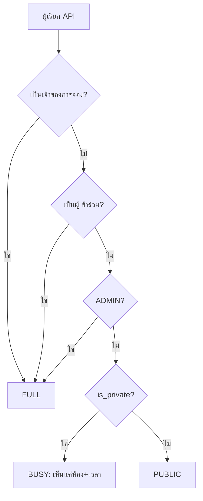

<!-- id: api -->
## 06 · สัญญา API (API Contract)

API เดียว (`apps/api`, Hono 4) รับใช้ทั้ง `apps/web` และ `apps/admin` ผ่าน origin เดียว สัญญาที่รันจริงประกอบด้วย zod validator ที่อยู่ใกล้แต่ละ route, enum/error/constants กลางใน `packages/shared` และ serializer แบบ allowlist; ตารางข้างล่างเป็นเอกสาร as-built ที่ต้องแก้พร้อม source เมื่อ contract เปลี่ยน ไม่ใช่ schema ชุดที่สอง

### 6.1 ข้อตกลงร่วม (Conventions)

- **C-03/C-04 · Session และ CSRF** :icon[lock] — ใช้ cookie `__Host-sid`; `remember_me: true` ทำให้ cookie ค้างเครื่องสำหรับ session แบบ sliding 7 วัน (`Max-Age=604800`) ส่วน `false` เป็น browser-session cookie ที่หมดเมื่อปิดเบราว์เซอร์ ไม่มี session 30 วัน ทุก unsafe method ตรวจ `Origin` หรือ `Sec-Fetch-Site: same-origin`
- **C-02/C-05 · รูปแบบข้อมูลและเวลา** — business API ของ ReserveFlow ใช้ `snake_case`, enum `UPPER_SNAKE` และ timestamp ISO-8601 แบบ `+07:00`; raw Better Auth routes เป็นข้อยกเว้นและใช้ shape/timestamp ของไลบรารี
- **C-08 · Error** — error ที่ออกจาก ReserveFlow handler ใช้ envelope `{ code, message, details?, request_id }`; raw Better Auth routes ใช้ error shape ของไลบรารีและอาจไม่มี `request_id`
- **C-10 · Idempotency** — `POST /bookings` บังคับ `Idempotency-Key`; key เดิมคืน booking เดิม `200` พร้อม `Idempotent-Replayed: true`
- **C-06 · Pagination** — list ทั่วไปใช้ `?page=1&page_size=20` (สูงสุด 100); audit และ notification list default 50; response เป็น `{ data, page }`
- **C-13 · Rate limits** — sign-in 5/นาทีต่อ IP+employee code, สร้าง booking 30/นาที, QR check-in / booking-id check-in / demo shift มี limiter 10/นาทีแยกกัน, resend-invite/reset-password รวมกันตาม target/admin และ route ทั่วไป 600/นาที; เกินกำหนดตอบ `429` + `Retry-After`
- **C-01/C-14 · Versioning** — business API อยู่ใต้ `/api/v1`; auth/health/docs อยู่นอก prefix นี้ การเปลี่ยนแบบ additive ต้อง backward-compatible ส่วน breaking change ใช้ major prefix ใหม่คู่ขนาน ประวัติรุ่นอยู่ในภาคผนวก ฉ
- **C-16 · Visibility** :icon[shield] — booking ทุกใบออกจาก `toViewerBooking()` เป็นหนึ่งใน `FULL`, `PUBLIC`, `BUSY`; field ที่ถูก mask ต้องไม่มี key นั้นใน JSON

:::details ข้อตกลง C-01…C-16 ฉบับเต็ม (16 ข้อ)
| # | เรื่อง | ข้อตกลง | ทำไม |
|---|---|---|---|
| C-01 | Base path | `/api/v1/...` สำหรับ business API; `/api/auth/*` = better-auth (mounted ตรง ไม่อยู่ใต้ `/api/v1`); `/api/healthz`, `/api/readyz`, `/api/openapi.json`, `/api/docs` นอก `/api/v1` | auth/health/docs เป็น infrastructure ไม่ใช่ domain; เวอร์ชันของมันไม่ผูกกับ business prefix |
| C-02 | Format | ReserveFlow business JSON ใช้ `snake_case`; raw Better Auth request/response ใช้ camelCase ตามไลบรารี; enum เป็น UPPER_SNAKE; id ของ domain เป็น UUID. Content type เป็น JSON ยกเว้น multipart, image, `.ics` และ `/api/docs` ซึ่งเป็น HTML | serializer ทำ mapping DB row → business wire shape; auth/docs รักษาสัญญาของผู้ให้บริการ |
| C-03 | Auth | session cookie `__Host-sid` (`HttpOnly; Secure; SameSite=Lax; Path=/`) ออกโดย better-auth; session มี TTL 7 วันแบบ sliding; `remember_me: true` = persistent cookie สำหรับ session นี้ (`Max-Age=604800`), `false` = browser-session cookie ที่หมดเมื่อปิดเบราว์เซอร์; ไม่มี session 30 วันและไม่มี bearer/JWT | revoke ได้ทันที (deactivate = ลบ session), ไม่มี token ใน JS |
| C-04 | CSRF | middleware ใน `apps/api/src/app.ts` ก่อน route ทุกตัว (ไม่ใช้ Hono `csrf()`): ทุก request ที่ไม่ใช่ GET/HEAD/OPTIONS — ไม่ว่าจะเป็น JSON, multipart หรือไม่มี body — ต้องมี `Origin` อยู่ในชุด `PUBLIC_BASE_URL` + additional allowed origins จาก config หรือถ้าไม่มี `Origin` ต้องมี `Sec-Fetch-Site: same-origin`; ไม่ผ่าน → `403 FORBIDDEN`; ไม่มี CSRF token และไม่มี CORS (origin เดียว) | SameSite=Lax + Origin/Fetch-Metadata check ปิดช่อง cross-site mutation ทุกชนิด body โดยไม่ต้องมี token plumbing |
| C-05 | เวลา | business endpoint รับ ISO-8601 และ serialize เวลาเป็น `+07:00`; raw Better Auth response ใช้ ISO timestamp ของไลบรารี (โดยทั่วไป UTC). Param วันที่เป็น `YYYY-MM-DD` ตาม Asia/Bangkok; "now" = นาฬิกา server | client clock เชื่อไม่ได้; DB เก็บ `timestamptz` |
| C-06 | Pagination | list ทั่วไป default `page=1&page_size=20`, audit/notification default 50, max 100 → `{ data, page }`; list ที่มีขอบเขตไม่ paginate; sort/filter เป็น whitelist ต่อ endpoint | offset pagination พอสำหรับข้อมูลปัจจุบัน |
| C-07 | Single resource | ตอบ object ตรง ๆ ไม่ห่อ `{ data }`; `POST` ที่สร้าง resource ตอบ `201` + `Location` | น้อยชั้นกว่า |
| C-08 | Error envelope | ReserveFlow handlers ใช้ `{ code, message, details?, request_id }`; Better Auth allowlisted routes ตอบ error shape ของไลบรารีโดยตรงและอาจไม่มี `request_id`. UI business routes แปลจาก `code` | employee/admin มีตารางข้อความของตนใน `src/lib/i18n.ts` |
| C-09 | Request id | รับ/สะท้อน `X-Request-Id` (สร้างให้ถ้าไม่ส่ง) ปรากฏใน error body, pino log, audit row | เชื่อม bug report กับ log ได้ใน 1 คำสั่ง grep |
| C-10 | Idempotency-Key | header `Idempotency-Key: <uuid>` **บังคับ** ที่ `POST /bookings` (หายหรือไม่ใช่ UUID → `400 IDEMPOTENCY_KEY_REQUIRED`); key อยู่บน `bookings` และ replay คืนใบเดิม `200` + `Idempotent-Replayed: true`. Key เดิมแต่ payload ต่างก็คืนใบเดิมเพราะไม่มี `request_hash` | double-click/retry ปลอดภัยโดยไม่ต้องมีตารางแยก |
| C-11 | Idempotent-by-state | transition ซ้ำที่ได้ผลเดิม (cancel ของที่ CANCELLED แล้วโดย actor เดิม, check-in ซ้ำ) ตอบ `200` + representation ปัจจุบัน; transition ที่ผิดกฎเท่านั้นที่ได้ `409 INVALID_STATUS_TRANSITION`. **สถานะปลายทางถูกตรวจ *ก่อน* `version` เสมอ** — `version` บังคับเฉพาะตอนแก้แถวจริง (`PATCH /bookings/:id`, `PUT …/attendees`) ไม่ใช่ตอน replay สถานะปลายทาง มิฉะนั้น response ที่หายกลางทาง + retry จะได้ 409 บนงานที่สำเร็จไปแล้ว (รอบตรวจซ้ำ codex-verify) | UI retry ได้โดยไม่ต้อง special-case |
| C-12 | Optimistic lock | `PATCH /bookings/:id` ต้องส่ง `version` (body) ไม่ตรง → `409 VERSION_CONFLICT { current_version }`; `version` bump ทุกครั้งที่แถวเปลี่ยน (รวม job) และ = `.ics SEQUENCE` | drag&drop/แก้พร้อมกันไม่ทับกันเงียบ ๆ |
| C-13 | Rate limits | in-process memory store: sign-in 5/นาที ต่อ IP+employee_code + unknown identifier 20/นาที ต่อ IP; lockout 5 ครั้ง/15 นาที → `423 ACCOUNT_LOCKED`; booking create 30/นาที; QR check-in, booking-id check-in และ DEV demo shift ใช้ limiter **คนละ instance** 10/นาที; resend/reset ใช้ bucket ร่วมตาม target/admin; อื่น ๆ 600/นาที → `429` + `Retry-After` | scale หลาย instance ต้องย้าย limiter ไป shared store |
| C-14 | Versioning | prefix `/api/v1`; การเพิ่ม field/endpoint/enum ค่าใหม่ใน output ไม่เปลี่ยน major prefix; breaking change ใช้ major prefix ใหม่คู่ขนาน; fetch client อ่านเฉพาะ field ที่ต้องใช้และจึงทน output field เพิ่มได้ ส่วน request body หลักใช้ `z.strictObject()` | internal tool ใช้ namespace เดิมตราบใดที่ contract ยัง backward-compatible |
| C-15 | Hidden resources | route `/admin/*` สำหรับ non-ADMIN ตอบ `404 NOT_FOUND` (ไม่เผยว่ามี); ownership ผิดบน resource ที่ผู้ใช้เห็นอยู่แล้วตอบ `403 FORBIDDEN` | security baseline หัวข้อ 09 |
| C-16 | Visibility levels | ทุก endpoint ที่คืน booking ผ่าน `toViewerBooking(row, viewer)` → `visibility ∈ FULL / PUBLIC / BUSY` (ตาราง 6.1.1) field ที่ถูก mask **ถูกตัดออก** ไม่ใช่ส่ง `null`; calendar เติม `owner_display_name` หลัง serialize ยกเว้น private BUSY ของ FACILITY | test ยืนยันว่า masked JSON ไม่มี key `title`; final serializer ยังไม่มี `FACILITY` visibility branch แยก |
:::

#### 6.1.1 ระดับการมองเห็น (Visibility)

`toViewerBooking()` ให้รายละเอียดครบเฉพาะ owner, attendee และ ADMIN; คนทั่วไป (รวม FACILITY ที่ไม่เกี่ยวข้องใน implementation ปัจจุบัน) เห็นหัวข้อเมื่อ `is_private=false` และเห็นเพียงสถานะไม่ว่างเมื่อ `is_private=true`

| Level | ใครได้ | field ที่ได้ |
|---|---|---|
| `FULL` | owner, attendee ที่ email ตรงกับ user, ADMIN | base + `title, description, special_request, headcount, version, owner, attendee_count, attendees[], checkin, reason_code, cancel, created_at, updated_at`; เฉพาะ `GET /bookings/:id` เติม `history[]` และ `can` |
| `PUBLIC` | พนักงานทั่วไป, booking `is_private=false` | `id, room_id, start_at, end_at, status, is_private, title, owner {id, full_name, department}, attendee_count` |
| `BUSY` | พนักงานทั่วไป, booking `is_private=true` | `id, room_id, start_at, end_at, status, is_private` เท่านั้น — UI แสดง "ไม่ว่าง" |

กฎเพิ่มเติม: (1) `toViewerBooking()` เป็น allowlist ต่อ level และสร้าง object ทีละ field โดยไม่ spread แถว DB; final implementation ไม่มี response-zod strip ชั้นที่สอง; (2) ทุก BookingView มี `visibility` และ `is_mine` เสมอ ให้ UI ตัดสินใจได้โดยไม่ต้องเดา

ข้อยกเว้นที่จำกัดผิว API: `GET /calendar` เติม `owner_display_name: string` หลังผ่าน serializer เพื่อใช้เป็นป้ายชื่อผู้จองบน cell เท่านั้น แม้ระดับ BUSY ก็ยังไม่มี `title`, `owner` object, department, email, description หรือ attendee data; private BUSY ของ FACILITY ไม่เติมชื่อนี้ และ `GET /bookings`, `GET /bookings/:id` กับผิวอื่นไม่เติม field นี้



สิ่งที่ควรอ่านจากภาพนี้: owner, attendee และ ADMIN เห็นข้อมูลครบ; คนอื่นเห็นหัวข้อของการประชุมสาธารณะ หรือเห็นเพียงห้องกับเวลาของการประชุมส่วนตัว

### 6.2 แคตตาล็อก error (Error Catalogue)

`code` = `ErrorCode` enum ใน `packages/shared/src/errors.ts`; คอลัมน์สุดท้ายย่อจากตารางข้อความของ employee/admin UI (แต่ละแอปมี `lib/i18n.ts` และไม่แสดง `message` ของ server)

:::details แคตตาล็อก error as-built ทั้งหมด (28 codes)
| HTTP | code | เกิดเมื่อ / `details` | ข้อความ UI (TH) |
|---|---|---|---|
| 400/409/413/415/422 | `VALIDATION_FAILED` | JSON/query/body ไม่ผ่าน zod หรือ constraint ที่เปิดเผยได้; unique ใช้ 409, ขนาดไฟล์ใช้ 413, media type ใช้ 415, policy เช่น account email domain ใช้ 422 | ข้อมูลไม่ถูกต้อง กรุณาตรวจสอบอีกครั้ง |
| 400 | `IDEMPOTENCY_KEY_REQUIRED` | `POST /bookings` ไม่มี header หรือค่าไม่ใช่ UUID | (bug ฝั่ง client — แสดง "เกิดข้อผิดพลาด กรุณาลองใหม่") |
| 401 | `UNAUTHENTICATED` | ไม่มี/หมดอายุ session | กรุณาเข้าสู่ระบบ |
| 401 | `INVALID_CREDENTIALS` | sign-in ผิด (ไม่บอกว่า field ไหน) | รหัสพนักงานหรือรหัสผ่านไม่ถูกต้อง |
| 403 | `FORBIDDEN` | role/ownership ไม่ผ่าน; รวมกรณี CSRF/Origin check ไม่ผ่าน (C-04 — ไม่แยก code, กรณีนี้ UI ไม่แสดงข้อความแต่ reload หน้า) | คุณไม่มีสิทธิ์ทำรายการนี้ |
| 403 | `FORBIDDEN_PRIVATE` | `GET /bookings/:id/ics` สำหรับ viewer ที่ไม่ได้ FULL (ไม่ขึ้นกับ `is_private`); attendee mutation ที่ไม่มีสิทธิ์ใช้ `FORBIDDEN` | การประชุมนี้เป็นแบบส่วนตัว |
| 403 | `ACCOUNT_DISABLED` | `users.status=DISABLED` (sign-in หรือ request ใดก็ตาม; session ถูกลบแล้ว) | บัญชีนี้ถูกปิดการใช้งาน กรุณาติดต่อผู้ดูแล |
| 404 | `NOT_FOUND` | ไม่มี resource, ห้อง inactive สำหรับพนักงาน, `/admin/*` สำหรับ non-admin | ไม่พบข้อมูล |
| 409 | `SLOT_UNAVAILABLE` | ชนกับ CONFIRMED/CHECKED_IN (pre-check หรือ EXCLUDE `23P01`); `details: { room_id, start_at, end_at, alternatives: [{ room_id, code, name }], conflicting_booking_id? (ADMIN เท่านั้น) }` | ช่วงเวลานี้ถูกจองแล้ว — เลือกห้อง/เวลาอื่น |
| 409 | `VERSION_CONFLICT` | booking PATCH/attendees version ไม่ตรง → `{ current_version, current: BookingView }`; demo shift → `{ current_version }`; settings `If-Match` ไม่ตรง → `{ etag }` | ข้อมูลถูกแก้ไขระหว่างนั้น กรุณาโหลดใหม่ |
| 409 | `INVALID_STATUS_TRANSITION` | เช่น reschedule ของที่ COMPLETED, check-in ของที่ AUTO_RELEASED, cancel ของที่เลย `end_at` แล้ว; `details: { status, action }` | รายการนี้อยู่ในสถานะที่ทำรายการไม่ได้แล้ว |
| 409 | `USER_HAS_HISTORY` | `DELETE /admin/users/:id` ที่มีประวัติ; `details.hint: "deactivate"` | ผู้ใช้นี้มีประวัติการใช้งาน ให้ปิดการใช้งานแทนการลบ |
| 409 | `LAST_ADMIN` | ลด role / ปิดบัญชี ADMIN คนสุดท้าย | ต้องมีผู้ดูแลระบบอย่างน้อย 1 คน |
| 409 | `CANNOT_MODIFY_SELF` | admin แก้ role/ปิด/ลบบัญชีตัวเอง | ไม่สามารถแก้ไขสิทธิ์หรือสถานะของบัญชีตัวเองได้ |
| 410 | `TOKEN_EXPIRED` | set-password token หมดอายุ/ถูกใช้แล้ว | ลิงก์นี้หมดอายุแล้ว กรุณาขอลิงก์ใหม่ |
| 422 | `OUTSIDE_BUSINESS_HOURS` | นอกเวลาทำการ/วันหยุด; `details: { reason: "HOURS" \| "CLOSED_DAY" \| "HOLIDAY", open_time?, close_time?, holiday_name? }` | อยู่นอกเวลาทำการ ({open_time}–{close_time}) / วันหยุด {holiday_name} |
| 422 | `MIN_DURATION` / `MAX_DURATION` / `SLOT_INCREMENT` | ผิดกติกาช่วงเวลา; details ใช้ `min_duration_minutes`, `max_duration_minutes` หรือ `slot_increment_minutes` | จองขั้นต่ำ {min} นาที / สูงสุด {max} นาที / ต้องลงตัวทุก {inc} นาที |
| 422 | `MAX_ADVANCE` | เกิน `max_advance_days`; `details: { latest_start_at }` | จองล่วงหน้าได้ไม่เกิน {days} วัน |
| 422 | `IN_PAST` | `start_at` ก่อน earliest slot ที่คำนวณจากเวลา server + lead time และปัดตาม increment | เวลาที่เลือกผ่านไปแล้ว |
| 422 | `ROOM_INACTIVE` | `rooms.active=false` | ห้องนี้ปิดให้บริการ |
| 422 | `CHECKIN_WINDOW_CLOSED` | นอกหน้าต่าง check-in (ทั้งทาง QR และปุ่มในแอป); `details: { opens_at, closes_at }` | เช็กอินได้ตั้งแต่ {opens_at} ถึง {closes_at} |
| 422 | `NO_BOOKING_IN_WINDOW` | สแกน QR หน้าห้อง (`POST /check-in/rooms/:room_code`) แล้วไม่มี booking ของคุณในห้องนี้ที่เช็กอินได้ตอนนี้; `details: { room_code }` | ไม่พบการจองของคุณที่เช็กอินได้ในห้องนี้ตอนนี้ |
| 422 | `REASON_REQUIRED` | admin ยกเลิก booking ของผู้อื่นโดยไม่ใส่เหตุผล (แยกจาก VALIDATION_FAILED เพื่อให้ UI focus ช่อง) | กรุณาระบุเหตุผล |
| 423 | `ACCOUNT_LOCKED` | lockout; `details.locked_until` (ไม่มี `Retry-After`) | เข้าสู่ระบบผิดหลายครั้ง กรุณารอสักครู่ |
| 429 | `RATE_LIMITED` | `Retry-After` | ทำรายการถี่เกินไป กรุณารอสักครู่ |
| 500/503 | `INTERNAL` | unhandled error; deadlock/serialization retry แล้วยังไม่สำเร็จใช้ status 503; body ไม่เผยรายละเอียดภายใน | เกิดข้อผิดพลาดในระบบ กรุณาลองใหม่อีกครั้ง |

Mapping จาก Postgres (รายละเอียด SQL ดูหัวข้อ 05): `23P01` exclusion → `SLOT_UNAVAILABLE`; unique ที่รู้จัก → `409 VALIDATION_FAILED { field }`; `23505` บน booking idempotency ถูก service แปลงเป็น replay 200; UPDATE 0 แถวเมื่อมี `version` predicate → `VERSION_CONFLICT`, เมื่อมีแค่ `status` predicate → `INVALID_STATUS_TRANSITION`; `40P01/40001` → retry transaction 1 ครั้ง แล้วตอบ `503 INTERNAL`
:::

### 6.3 รายการ endpoint (Endpoints)

ตารางนี้เป็นแผนที่สำหรับหา route: แสดงเฉพาะ method, path และ role; path ที่ไม่ขึ้นต้นด้วย `/api` อยู่ใต้ `/api/v1` สัญลักษณ์คือ `E` EMPLOYEE · `A` ADMIN · `F` FACILITY (Phase 1.1) · `*` ทุกคนที่ login · `–` ไม่ต้อง login

| พื้นที่ | Method + path | Roles |
|---|---|---|
| Auth | `POST /api/v1/auth/sign-in` · `POST /api/v1/auth/set-password` | `–` |
| Auth | `POST /api/auth/sign-out` · `GET /api/auth/get-session` · `POST /api/auth/change-password` · `GET /api/v1/me` | `*` |
| Rooms / master data | `GET /rooms` · `GET /rooms/:id` · `GET /rooms/:id/photo` · `GET /features` · `GET /departments` | `*` |
| Rooms / master data | `POST /admin/rooms` · `PATCH /admin/rooms/:id` · `PUT /admin/rooms/:id/features` · `POST /admin/rooms/:id/photo` · `DELETE /admin/rooms/:id/photo` · `POST /admin/departments` · `PATCH /admin/departments/:id` | `A` |
| Directory | `GET /directory/users` | `*` |
| Availability / calendar | `GET /availability` · `GET /calendar` | `*` |
| Bookings | `POST /bookings` | `*` (จองให้ตนเอง; `A` ใช้ `owner_id` ได้) |
| Bookings | `GET /bookings` · `GET /bookings/:id` | `*` |
| Bookings | `PATCH /bookings/:id` · `POST /bookings/:id/cancel` · `PUT /bookings/:id/attendees` | owner, `A` |
| Bookings | `GET /bookings/:id/ics` | `FULL` viewers |
| Bookings (DEV only) | `POST /bookings/:id/demo-check-in-ready` | owner; ต้องเปิด capability `demo_check_in` |
| Check-in | `POST /check-in/rooms/:room_code` (ทางเข้าหลัก — QR ที่ป้ายหน้าห้อง) | `*` ที่เป็น owner/attendee ของใบนั้น |
| Check-in | `POST /bookings/:id/check-in` | owner, attendee หรือ `A` |
| Users | `GET /admin/users` · `GET /admin/users/:id` · `POST /admin/users` · `POST /admin/users/:id/resend-invite` · `POST /admin/users/import` · `PATCH /admin/users/:id` · `POST /admin/users/:id/deactivate` · `POST /admin/users/:id/reactivate` · `POST /admin/users/:id/reset-password` · `DELETE /admin/users/:id` | `A` |
| Settings / calendar policy | `GET /settings` | `*` |
| Settings / calendar policy | `PUT /admin/settings` · `PUT /admin/business-hours` · `PUT /admin/holidays` | `A` |
| Reports | `GET /admin/reports/utilization` · `GET /admin/reports/outcomes` · `GET /admin/reports/heatmap` | `A` |
| Notifications | `GET /admin/notifications/emails` · `POST /admin/notifications/emails/:id/retry` | `A` |
| Audit | `GET /admin/audit-logs` | `A` |
| Health / docs | `GET /api/healthz` · `GET /api/readyz` · `GET /api/openapi.json` · `GET /api/docs` | `–` |

รายละเอียด request/response, code เฉพาะ route และ side effect อยู่ในตารางรายพื้นที่ด้านล่าง; domain/admin mutation ที่มี audit intent เขียน `audit_logs` ใน transaction เดียวกัน. ข้อยกเว้นสำคัญคือ set-password ใช้ `password_setup_tokens.used_at` เป็นหลักฐานการ redeem และ intentionally ไม่สร้าง audit actor row; Better Auth session endpoints จัดการ state ของ library เอง

:::details 6.3.1 Auth — request/response และกติกา (6 endpoints)

#### 6.3.1 Auth — better-auth + thin wrappers

Code ที่ระบุในตารางเป็น code เฉพาะ route; `401`/`403`/`404`/`429`/`500` แบบ generic ใช้ได้กับทุก endpoint

better-auth mount ที่ `/api/auth/*` และเป็นเจ้าของ session/cookie กับ credential verification; เรา allowlist ให้เรียกตรงเพียง sign-out/get-session/change-password ส่วน sign-in รับเฉพาะ `employee_code` ที่ wrapper resolve ไปยัง internal email credential พร้อม lockout/audit และ set-password ของ invite/admin reset อยู่ใต้ `/api/v1/auth/*` — route Better Auth อื่น (`/api/auth/sign-in/email`, `/api/auth/admin/*`, `/api/auth/forget-password`, …) ถูก middleware ตอบ `404` เพื่อไม่ให้มีทางลัดเลี่ยง guard

`auth.api.banUser` และ `auth.api.unbanUser` ไม่ถูกเปิดเป็น route และตอบ `404` โดยตั้งใจ: ทั้งคู่เขียน `banned` โดยไม่เขียน `status` จึงชน `users_banned_mirror` (`23514`, พบจริงใน W0 spike); `POST /admin/users/:id/deactivate` เป็นผู้เขียน `banned` เพียงทางเดียว

| Method & path | ผู้ให้บริการ | Roles | Request | Response | Codes | Side effects / กติกา |
|---|---|---|---|---|---|---|
| `POST /api/v1/auth/sign-in` | wrapper | – | `{ employee_code: string, password: string, remember_me?: boolean }` | `{ user, department, capabilities: { demo_check_in } }` + `Set-Cookie: __Host-sid` | 200, 401 INVALID_CREDENTIALS, 403 ACCOUNT_DISABLED, 423 ACCOUNT_LOCKED, 429 | รับ `employee_code` เป็น public sign-in identity; omitted `remember_me` ใช้ default `true` จึงเป็น persistent session 7 วัน, `false` เป็น browser-session cookie; email คงอยู่ในฐานข้อมูลแต่ employee UI ซ่อน; อัปเดต lockout/last login/audit; demo capability เปิดเฉพาะ server ที่อนุญาต |
| `POST /api/auth/sign-out` | better-auth | * | – | 200 + clear cookie | | ลบ session แถวนั้น |
| `GET /api/auth/get-session` | better-auth | – | – | better-auth session object หรือ `null` | 200 | ไม่บังคับ login; signed-out ตอบ `200 null`; UI หลักใช้ `/me` |
| `POST /api/auth/change-password` | better-auth | * | `{ currentPassword, newPassword (≥10), revokeOtherSessions?: boolean }` | `200 { token, user }` | better-auth 400 shape เมื่อ current password ผิด | field/response/error ใช้ camelCase และสัญญาของ Better Auth; web ปัจจุบันไม่ส่ง `revokeOtherSessions` |
| `GET /api/v1/me` | wrapper | * | – | `{ user: { id, employee_code, full_name, email, mobile, role, status, department_id, last_login_at }, department: { id, code, name }, capabilities: { demo_check_in }, session: { expires_at } }` | 200 | front-end เรียกตอน boot; employee UI ไม่ render email/mobile แม้ backend shape คง field ไว้ |
| `POST /api/v1/auth/set-password` | wrapper | – | `{ token, new_password (≥10) }` | `204` | 410 TOKEN_EXPIRED, 400 VALIDATION_FAILED, 403 ACCOUNT_DISABLED | flow เดียวสำหรับ invite/admin reset: hash token → guarded `UPDATE password_setup_tokens SET used_at=now() … RETURNING user_id` เป็นขั้นแรก (0 แถว → 410 และ rollback ได้) → lock user และปฏิเสธ DISABLED → hash Argon2id ใน transaction → `INSERT` credential row ใน `accounts` เมื่อยังไม่มี หรือ `UPDATE accounts.password` เมื่อมีแล้ว → set `users.status='ACTIVE'`, `email_verified=true`, reset lockout → delete ทุก session. ไม่เรียก `auth.api.setUserPassword` เพราะ token claim, credential write และ user activation ต้อง atomic บน DB transaction เดียว |

employee web ที่ส่งมอบมี route UI เฉพาะ `/login` และไม่มี `/forgot`, `/set-password` หรือ `/register`; set-password endpoint ยังคงเป็น account API แต่ลิงก์ที่ admin/outbox สร้างยังไม่มี employee landing จึงไม่ใช่ flow ที่ใช้งานได้ end-to-end ใน final UI. ไม่มี forgot endpoint ใน final API. ชุด canonical ใช้ guarded initializer และผู้ใช้เปลี่ยนรหัสผ่านจาก Profile (หัวข้อ 02 §2.4)

:::

:::details 6.3.2 Rooms, Features, Departments — request/response และกติกา (12 endpoints)

#### 6.3.2 Rooms, Features, Departments

`Room = { id, code, name, floor, location, description, capacity, photo_url, active, features: [{ key, name, icon, quantity }], created_at, updated_at }` — `photo_url` เป็น computed API field (`/api/v1/rooms/:id/photo` เมื่อมีรูป) ไม่ใช่คอลัมน์ใน DB; เวลาทำการเป็นชุดเดียวทุกห้อง (D-02) อยู่ใน `GET /settings` ไม่อยู่บน Room

| Method & path | Roles | Request | Response | Codes | Side effects / กติกา |
|---|---|---|---|---|---|
| `GET /rooms` | * | `?capacity_min=int&features=projector,microphone&include_inactive=true (A)` | `{ data: Room[] }` | 200 | พนักงานได้เฉพาะ `active=true` เสมอ (FR-001, FR-011) |
| `GET /rooms/:id` | * | – | `Room` | 404 | พนักงาน: inactive → 404 |
| `GET /rooms/:id/photo` | * | – | binary JPEG/PNG/WebP ตาม bytes ที่เก็บ | 404 | ตรวจ visibility ของห้องเหมือน `GET /rooms/:id`; รูปอยู่ใน `rooms.photo bytea` ไม่ใช้ volume/object storage |
| `GET /features` | * | – | `{ data: [{ key, name, icon }] }` | | |
| `GET /departments` | * | `?include_inactive=true` (ADMIN เท่านั้น) | `{ data: [{ id, code, name, active }] }` | 403 เมื่อ non-admin ขอ inactive | default คืน active เท่านั้น |
| `POST /admin/rooms` | A | `{ code (^[a-z0-9-]{2,32}$), name, floor?, location?, description?, capacity: int 1–500, active?: true, features?: [{ key, quantity }] }` | `Room` 201 | 409 VALIDATION_FAILED (code ซ้ำ) | |
| `PATCH /admin/rooms/:id` | A | subset ของข้างบน (ยกเว้น `code`) | `Room` | 404, 409 | **ต้องเขียนใต้ `pg_advisory_xact_lock(hashtext($room))` ตัวเดียวกับ booking writer** — ไม่งั้น create ที่ validate `active` ไปแล้วอาจ commit ใบ CONFIRMED ในห้องที่เพิ่งถูกปิด (T1 ขั้น (e) อ่านค่าใหม่ด้วย `FOR SHARE` ใต้ lock เดียวกัน จึงเห็นเฉพาะค่าที่ commit แล้ว — C2-04/CF-03; barrier test create-vs-PATCH บน `active` = TC-ROOM-028). การเปลี่ยน `capacity`/`active` มีผลกับคำขอใหม่เท่านั้น ไม่ auto-cancel booking เดิม (หัวข้อ 02 §2.4) — admin app แสดง warning โดยดึง `GET /bookings?scope=all&room_id=&from=today&page_size=100` **วนจนครบทุกหน้า จนถึงขอบของ `max_advance_days` ปัจจุบัน** แล้วตรวจด้วย helper ฝั่ง admin — ไม่มี `/impact` endpoint |
| `PUT /admin/rooms/:id/features` | A | `[{ key, quantity ≥1 }]` | `Room` | 400 | replace ทั้ง set |
| `POST /admin/rooms/:id/photo` | A | multipart `file` (jpeg/png/webp ≤ 5 MB) | `{ photo_url }` | 413, 415 | ตรวจชนิดจาก bytes แล้วเก็บ bytes เดิมใน `rooms.photo`; audit เก็บเฉพาะขนาด/ชนิด ไม่เก็บภาพ |
| `DELETE /admin/rooms/:id/photo` | A | – | 204 | | ตั้ง `rooms.photo = NULL` |
| `POST /admin/departments` | A | `{ code (^[A-Z0-9_]{2,16}$), name }` | 201 | 409 VALIDATION_FAILED (code ซ้ำ) | |
| `PATCH /admin/departments/:id` | A | `{ name?, active? }` | 200 | | ไม่มี DELETE — ปิดด้วย `active=false` (user FK RESTRICT) |

ไม่มี `DELETE /admin/rooms/:id`: ปิดด้วย `active=false` — booking เก่ายังอ้าง FK ได้; ห้อง inactive หายจาก list/availability ของพนักงาน. Feature catalogue เป็น read-only master data ใน final API; admin เปลี่ยนได้เฉพาะ association/quantity ของแต่ละห้องผ่าน `PUT /admin/rooms/:id/features` ไม่มี `/admin/features*` CRUD

:::

:::details 6.3.2b Directory — request/response และกติกา (1 endpoint)

#### 6.3.2b Directory (backend capability; employee UI ยังไม่เปิดใช้)

| Method & path | Roles | Request | Response | กติกา |
|---|---|---|---|---|
| `GET /directory/users` | * | `?q=&page&page_size` (q ≥ 2 ตัวอักษร, ILIKE full_name/email/employee_code) | `{ data: [{ id, full_name, email, department: { code, name } }], page }` | เฉพาะ `status='ACTIVE'`; **ไม่มี** mobile/role/status/last_login (ต่างจาก `/admin/users`). Contract คงไว้สำหรับ attendee/account integration แต่ E4 ที่ส่งมอบไม่ render directory, attendee chips หรือ email field |

:::

:::details 6.3.3 Availability & Calendar — request/response และกติกา (2 endpoints)

#### 6.3.3 Availability & Calendar

| Method & path | Roles | Request | Response | Codes | กติกา |
|---|---|---|---|---|---|
| `GET /availability` | * | `?start=ISO&end=ISO&headcount=int?&features=a,b?` | `{ start, end, rooms: [{ room: RoomLite, available: bool, reasons: ("BUSY"\|"CLOSED"\|"HOLIDAY"\|"CAPACITY"\|"MISSING_FEATURE")[], busy_until?: ISO }] }` | 200, 400 VALIDATION_FAILED, 422 window codes | คืนทุกห้อง active พร้อมคำตัดสิน; query shape ตรวจที่ route และ policy window ตรวจที่ service; POST booking ยังเป็นผู้ตัดสินสุดท้าย |
| `GET /calendar` | * | `?from=YYYY-MM-DD&to=YYYY-MM-DD&room_id=uuid?` (≤ 31 วัน) | `{ from, to, rooms: RoomLite[], business_hours, holidays, bookings: BookingView[] }` | 200, 400 VALIDATION_FAILED, 404 (room ไม่พบ/inactive) | mask ต่อ viewer; feed เดียวของ day/week/room detail; ไม่มี `/slots`; `Cache-Control: no-store` |

:::

:::details 6.3.4 Bookings — request/response และกติกา (7 endpoints + 1 conditional DEV endpoint)

#### 6.3.4 Bookings

BookingView ระดับ `FULL` (ระดับอื่นตัด field ตาม 6.1.1):
```
{ id, room_id,
  owner: { id, full_name, department: { id, code, name } | null },
  title, description, special_request, headcount, is_private,
  status: "CONFIRMED"|"CHECKED_IN"|"COMPLETED"|"CANCELLED"|"AUTO_RELEASED",   // ห้าสถานะ ครบทั้งวงจร
  start_at, end_at, version,
  attendee_count, attendees: [{ email, name }],
  checkin:  { checked_in_at, method: "QR"|"SELF"|"ADMIN" } | null,
  cancel:   { cancelled_at, cancelled_by: { id, full_name } | null, reason } | null,
  reason_code: null | "OWNER_CANCELLED" | "ADMIN_CANCELLED" | "OWNER_DISABLED" | "NO_SHOW",
  visibility: "FULL", is_mine, created_at, updated_at }
```

`GET /bookings/:id` เติม `can: { edit, reschedule, cancel, check_in }` และ `history: [{ event, at, actor }]` เฉพาะเมื่อ viewer ได้ FULL; list/mutation/check-in response ใช้ BookingView ด้านบนตรง ๆ. ห้องต้อง resolve จาก `room_id` ด้วย room query/cache ฝั่ง client — BookingView ไม่มี nested `room`

| Method & path | Roles | Request | Response | Codes | Side effects / กติกา |
|---|---|---|---|---|---|
| `POST /bookings` | * | header `Idempotency-Key`; `{ room_id, start_at, end_at, title, description?, is_private?, special_request?, headcount?, attendees?: [{ email, name? }] (≤50; duplicate email ถูก lowercase/deduplicate), owner_id? (A เท่านั้น) }` | `BookingView` 201 + `Location` | 400/403/404/409/422/429 ตาม catalogue | ถ้า mutation ผ่านจะได้ CONFIRMED ทันที; slot conflict ได้ 409 และไม่มีสถานะรอ. Shape/auth/policy error ยังเป็นผลลัพธ์ที่เป็นไปได้ตามปกติ; employee form ไม่เปิด attendee/owner field |
| `GET /bookings` | * | `?scope=mine\|attending\|all&status=a,b&room_id=&from=YYYY-MM-DD&to=&page&page_size&sort=start_at`; A เพิ่ม `owner_id, department_id, q (title/ชื่อ/employee_code)` | `{ data: BookingView[], page }` | 200, 403 (`scope=all` และ admin filters ต้อง A; ไม่มี facility run-sheet route ใน final API) | default `scope=mine`, `from=today`, `sort=start_at`; "ประวัติ" = `to=today&sort=-start_at` |
| `GET /bookings/:id` | * | – | `BookingView` ตาม 6.1.1; FULL เติม `history` + `can` | 200, 404 | non-viewer ได้ BUSY/PUBLIC view **ไม่ใช่ 403** (id เห็นได้จาก calendar อยู่แล้ว) |
| `PATCH /bookings/:id` | owner, A | `{ version, title?, description?: string|null, is_private?, special_request?: string|null, headcount?: number|null, start_at?, end_at?, room_id? }` | `BookingView` | 200, 409 VERSION_CONFLICT / SLOT_UNAVAILABLE / INVALID_STATUS_TRANSITION, 422 window codes | CONFIRMED เท่านั้น; owner ก่อน start, ADMIN ก่อน end. Reschedule เป็น atomic UPDATE; ชนแล้วแถวเดิมไม่เปลี่ยน; detail-only edit ไม่ส่งอีเมล |
| `POST /bookings/:id/cancel` | owner, A | `{ reason?: string (≥3) }` — บังคับเฉพาะ ADMIN ที่ยกเลิกของผู้อื่น | `BookingView` | 200, 409 INVALID_STATUS_TRANSITION, 422 REASON_REQUIRED | owner cancellation ส่ง CANCEL ให้ attendees; admin ที่ยกเลิกของผู้อื่นส่งให้ owner + attendees พร้อมเหตุผล |
| `PUT /bookings/:id/attendees` | owner, A | `{ version, attendees: [{ email, name? }] (≤50) }` | `BookingView` | 200, 409 VERSION_CONFLICT / INVALID_STATUS_TRANSITION | replace set, deduplicate email, bump version; diff ส่ง REQUEST/CANCEL |
| `GET /bookings/:id/ics` | FULL viewers | – | `text/calendar` | 403 FORBIDDEN_PRIVATE | payload เดียวกับใน email (UID/SEQUENCE เดิม) — ปุ่ม "เพิ่มลงปฏิทิน"; generator ตัวเดียวกับ outbox |
| `POST /bookings/:id/demo-check-in-ready` | owner; route มีเฉพาะเมื่อ server เปิด `demoToolsEnabled` | `{ version }` | `BookingView` | 403 FORBIDDEN, 409 VERSION_CONFLICT / INVALID_STATUS_TRANSITION / SLOT_UNAVAILABLE, 429 | **DEV/demo only ไม่ใช่ production feature** — เลื่อน booking CONFIRMED ของ owner ที่ยังไม่เริ่มให้เข้า check-in window โดยคง duration เดิม, lock ห้อง/ตรวจ buffer และ bump version; 10/นาที. Client แสดงปุ่มเฉพาะ `import.meta.env.DEV` และเมื่อ `/me.capabilities.demo_check_in=true`; จากนั้นพาไปหน้า QR จริงซึ่งยังต้องกดเช็กอินเอง |

ADMIN แก้/ยกเลิก/เช็กอิน booking ของคนอื่นผ่าน path เดียวกัน (role check) — ไม่มี `/admin/bookings/*` เลย

:::

:::details 6.3.5 Check-in — request/response และกติกา (2 endpoints)

#### 6.3.5 Check-in

หน้าต่าง self check-in = `[start_at − checkin_open_before_minutes, LEAST(end_at, start_at + checkin_grace_minutes))` (default 15/15 — `LEAST` เพราะ grace เป็นคีย์ที่มีผลย้อนหลัง จึงต้องไม่เลย `end_at` ของใบที่สั้นกว่า grace; นิยามเดียวกับ §5.5/T6/sweep — C2-03); ADMIN เช็กอินให้ได้ถึง `end_at`; auto-release โดย sweep ที่เส้นตายเดียวกันเมื่อยัง CONFIRMED และ `auto_release_enabled` (หัวข้อ 05 §5.7). ทุกใบเป็น CONFIRMED ตั้งแต่วินาทีที่สร้าง หน้าต่างจึงคำนวณจาก `start_at` อย่างเดียวพอ (D-30d).

**ทางเข้าหลักคือ QR ที่พิมพ์ติดหน้าห้อง** :icon[qr] (MVP — FR-016, FL-05): ป้ายหนึ่งใบต่อห้อง เป็น deep link **static** `https://<host>/check-in/<roomCode>` ไม่มี token/HMAC และไม่หมดอายุ (พิมพ์ใหม่เฉพาะเมื่อเปลี่ยน `rooms.code`) ลำดับคือ สแกน → เบราว์เซอร์มือถือเปิดหน้า → ยังไม่ล็อกอินก็ล็อกอินแล้วเด้งกลับ URL เดิม → หน้าแสดงห้องและคำอธิบาย → **ผู้ใช้กดปุ่ม “เปิดใช้งานการจอง” อย่างตั้งใจ** → จึงยิง `POST /api/v1/check-in/rooms/:room_code` → render result panel สำเร็จ/ไม่สำเร็จในหน้าเดิม. หน้าไม่ mutate ตอน mount เพื่อกันการสแกน/refresh โดยไม่ตั้งใจและไม่เผา rate limit; ผู้ใช้ไม่ต้องเลือก booking เพราะ server หาใบให้จาก *ใครกด* + *ห้องไหน* + *เวลาปัจจุบัน*

**ขอบเขต:** ระบบนี้สร้างเฉพาะฝั่งแอป การต่อกับตัวควบคุมประตู/กลอนไฟฟ้าอยู่นอกขอบเขต ข้อความใน result panel จึงยืนยันว่า "เปิดใช้งานการจองแล้ว" ไม่ใช่รับประกันว่าประตูเปิด (หัวข้อ 09 S-13 คือ threat model ของทางเข้านี้)

**endpoint เดียวต่อการเช็กอินหนึ่งครั้ง** และ **หัวข้อนี้เป็นเจ้าของกฎการเลือก `checkin_method`** (หัวข้อ 02 FR-016/L12, 03 FL-05 และ 05 §5.5/T6 อ้างกลับมาที่นี่): server ตัดสินเอง โดย **สมาชิกภาพมาก่อน role เสมอ** —
1. เข้าทาง QR `POST /check-in/rooms/:room_code` และผู้สแกนเป็น owner หรือ attendee → `QR` → หน้าต่าง self
2. เข้าทาง `POST /bookings/:id/check-in` และผู้กดเป็น owner หรือ attendee (อีเมลตรงกับ user) → `SELF` **แม้ผู้กดจะเป็น ADMIN ก็ตาม** (admin ที่จองห้องเองแล้วเดินเข้าห้องคือผู้ใช้ ไม่ใช่เจ้าหน้าที่หน้าห้อง — ถ้าบันทึกเป็น `ADMIN` รายงาน no-show/การใช้งานจะอ่านว่า "ต้องมีเจ้าหน้าที่มาเช็กอินให้" ซึ่งผิด) → หน้าต่าง self
3. ไม่ใช่ทั้งสอง แต่เป็น ADMIN → `ADMIN` → หน้าต่างถึง `end_at`
4. อื่น ๆ → `403 FORBIDDEN`
Test ที่ต้องมี (TC-CHK-019): ADMIN ที่เป็น owner ของใบนั้นกดเช็กอิน → `checkin_method='SELF'` และถูกปฏิเสธด้วย `422 CHECKIN_WINDOW_CLOSED` ถ้าเลยเส้นตาย self แล้ว (ไม่ได้หน้าต่างยาวถึง `end_at` ของ admin) (FR-016, D-22)

| Method & path | Roles | Request | Response | Codes | กติกา |
|---|---|---|---|---|---|
| `POST /check-in/rooms/:room_code` | * ที่เป็น owner/attendee ของใบนั้น | – | `{ booking, already_checked_in: bool }` | 200, 404 NOT_FOUND, 422 NO_BOOKING_IN_WINDOW / CHECKIN_WINDOW_CLOSED, 429 | **MVP · ทางเข้าหลัก หลัง explicit button press** — ปลายทางของ QR หน้าห้อง; ไม่รับ booking id: server เลือกใบเองด้วย `room_id=$room AND status='CONFIRMED' AND (owner_id=$me OR อีเมล attendee ตรงกับ $me) AND $now ∈ [start_at−open_before, LEAST(end_at, start_at+grace))` → พบ ⇒ `CHECKED_IN`, `checkin_method='QR'`, `checked_in_by=$me`; พบมากกว่าหนึ่งใบ ⇒ `ORDER BY start_at LIMIT 1` จึงเลือกใบที่เริ่มเร็วที่สุด; ใบที่ `CHECKED_IN` อยู่แล้ว ⇒ `200 already_checked_in:true`; ไม่มีใบของคนนี้ในห้องนี้ตอนนี้ ⇒ `422 NO_BOOKING_IN_WINDOW`; มีใบวันนี้แต่ยังไม่ถึง/เลยหน้าต่าง ⇒ `422 CHECKIN_WINDOW_CLOSED`; `room_code` ไม่มีหรือห้อง inactive ⇒ `404`; 10/นาที ต่อ user |
| `POST /bookings/:id/check-in` | owner, attendee หรือ A | `{ note? }` | `{ booking, already_checked_in: bool }` | 200, 403 FORBIDDEN, 409 INVALID_STATUS_TRANSITION, 422 CHECKIN_WINDOW_CLOSED | **ทางเข้ารอง (self/admin)** — ปุ่มใน My Bookings → involved user ใช้ `SELF` window; ADMIN ที่ไม่เกี่ยวข้องใช้ `ADMIN` window ถึง `end_at`; membership มาก่อน role; CHECKED_IN ซ้ำ → 200 `already_checked_in:true` |

:::

:::details 6.3.6 Admin users — request/response และกติกา (10 endpoints)

#### 6.3.6 Admin users

`User = { id, employee_code, full_name, email, mobile, role: "EMPLOYEE"|"ADMIN"|"FACILITY", status: "INVITED"|"ACTIVE"|"DISABLED", department: { id, code, name }, last_login_at, disabled_at, created_at, bookings_count }` — `INVITED` = สร้างแล้วแต่ยังไม่ตั้งรหัสผ่าน (ต้องมีใน enum หัวข้อ 05)

| Method & path | Roles | Request | Response | Codes | Side effects / กติกา |
|---|---|---|---|---|---|
| `GET /admin/users` | A | `?q=&role=&status=&department_id=&page&page_size&sort=full_name` | `{ data: User[], page }` | 200 | `q` ILIKE บน employee_code / full_name / email |
| `GET /admin/users/:id` | A | – | `User` + `recent_bookings: BookingView[5]` | 404 | |
| `POST /admin/users` | A | `{ employee_code (^[A-Za-z0-9-]{3,20}$), full_name, email, mobile?, department_id, role?: "EMPLOYEE" }` | `User` 201 + `Location` | 409 VALIDATION_FAILED (employee_code/email ซ้ำ) | ถ้า env `ACCOUNT_EMAIL_DOMAINS` ตั้งไว้ อีเมลนอกรายการ → `422 VALIDATION_FAILED` พร้อม issue path `email`. Service **ไม่เรียก `auth.api.createUser` และไม่สร้างรหัสผ่านสุ่ม**: ใน transaction เดียว lock identity writers → `INSERT users` เป็น `role='EMPLOYEE', status='INVITED'` โดยยังไม่มี credential `accounts` row → สร้าง invite token อายุ 7 วัน → enqueue `account.set_password` → audit. Credential row ถูกสร้างเมื่อ redeem ผ่าน `/auth/set-password`; transaction จึงไม่ทิ้ง user ที่ไม่มี invite ถ้าขั้นหลังล้มเหลว |
| `POST /admin/users/:id/resend-invite` | A | – | `202 { queued: 1 }` | 409 INVALID_STATUS_TRANSITION (ไม่ใช่ INVITED), 429 | ลบ token/outbox pending เก่าแล้วออก invite token + enqueue ใหม่ใน transaction เดียว |
| `POST /admin/users/import` | A | multipart `file` CSV (header `employee_code,full_name,email,mobile,department_code,role`) + `?dry_run=true` (upsert จึง idempotent ในตัว ไม่ต้องมี Idempotency-Key) | `{ summary: { rows, create, update, skip, error }, rows: [{ line, employee_code, action: "CREATE"\|"UPDATE"\|"SKIP"\|"ERROR", message? }] }` | 400 VALIDATION_FAILED (header ผิด), 413/415 VALIDATION_FAILED | upsert ด้วย `employee_code`; แถวเดิมอัปเดต name/email/mobile/department/role (ไม่แตะ status/password; การเปลี่ยน role ออกจาก ADMIN ผ่าน guard U-01 เดียวกัน; email ผ่าน `ACCOUNT_EMAIL_DOMAINS` เดียวกัน); แถวใหม่ = INVITED + invite email; `dry_run` = validate + preview ไม่เขียน; ≤ 2 MB / ≤ 1000 แถว; UTF-8 (รับ BOM) |
| `PATCH /admin/users/:id` | A | `{ full_name?, email?, mobile?, department_id?, role? }` | `User` | 409 VALIDATION_FAILED / LAST_ADMIN / CANNOT_MODIFY_SELF | guards ใน 6.7 |
| `POST /admin/users/:id/deactivate` | A | `{ reason?: string }` | `{ user, cancelled_bookings: [{ id, start_at, end_at, room: { id, code, name }, status_before }] }` | 409 CANNOT_MODIFY_SELF / LAST_ADMIN; ซ้ำ → 200 | ปิดบัญชี, revoke session และยกเลิก booking อนาคตใน transaction เดียว; booking ที่เริ่มแล้วไม่ถูกแตะ |
| `POST /admin/users/:id/reactivate` | A | – | `User` | 409 (ไม่ใช่ DISABLED) | `status` กลับเป็น ACTIVE (หรือ INVITED ถ้าไม่เคยตั้งรหัสผ่าน); **ไม่** คืน booking ที่ถูกยกเลิก |
| `POST /admin/users/:id/reset-password` | A | – | `202 { queued: 1 }` | 409 (DISABLED), 429 | ออก RESET token อายุ 24 ชม., enqueue link ใหม่ และ revoke ทุก session |
| `DELETE /admin/users/:id` | A | – | 204 | 409 USER_HAS_HISTORY / CANNOT_MODIFY_SELF / LAST_ADMIN | hard delete เฉพาะบัญชีที่ไม่เคยถูกใช้ (6.7) |

:::

:::details 6.3.7 Settings, Business hours, Holidays — request/response และกติกา (4 endpoints)

#### 6.3.7 Settings, Business hours, Holidays

`Settings` (zod `SettingsSchema` ใน `apps/api/src/lib/settings.ts`; ชื่อ key = รายการในหัวข้อ 05 §5.10 ซึ่งเป็นเจ้าของ; การเก็บเป็น key/value ดูหัวข้อ 05):
```json
{
  "slot_increment_minutes": 30, "min_duration_minutes": 60, "max_duration_minutes": null, "buffer_minutes": 0,
  "max_advance_days": 30, "min_lead_minutes": 0,
  "checkin_open_before_minutes": 15, "checkin_grace_minutes": 15, "auto_release_enabled": true,
  "reminder_minutes_before": 15
}
```
ชื่อผลิตภัณฑ์ = ค่าคงที่ `APP_NAME` (D-05) และที่อยู่ผู้ส่ง/reply-to = env `MAIL_FROM`/`MAIL_REPLY_TO` (หัวข้อ 09) — ไม่อยู่ใน settings

| Method & path | Roles | Request | Response | กติกา |
|---|---|---|---|---|
| `GET /settings` | * | – | header `ETag` + `{ settings: Settings, business_hours: [{ weekday, is_open, open_time, close_time }] (7 แถว ชุดเดียวทุกห้อง), holidays: [{ date, name }] (ปีนี้ + ปีหน้า), server_time }`; `If-None-Match` ตรง → 304 | front-end cache 5 นาที; web/admin slot helper ใช้ document นี้และ mirror กฎของ server window validator |
| `PUT /admin/settings` | A | `Settings` ทั้งก้อน + header `If-Match: <etag>` | settings document เต็ม `{ settings, business_hours, holidays, server_time }` + `ETag` | strict/cross-key validation; ETag hash ครอบ `{ settings, business_hours, holidays }` และไม่รวม `server_time`; stale ETag → 409 |
| `PUT /admin/business-hours` | A | `[{ weekday 1–7, is_open, open_time?, close_time? }]` 7 แถว | same | เวลาทำการของบริษัท ใช้ร่วมทุกห้อง (D-02); มีผลกับคำขอใหม่เท่านั้น ไม่ auto-cancel (BR-11) |
| `PUT /admin/holidays` | A | `{ year: 2026, holidays: [{ date: "2026-04-13", name }] }` | `{ holidays }` | replace set เฉพาะปีนั้น; **wire = ค.ศ. ISO เท่านั้น** (UI แสดง/รับ พ.ศ. แล้วแปลงเอง — C1-34); seed วันหยุดราชการไทย; ปฏิทินจริงของบริษัท (วันหยุดชดเชย/วันหยุดบริษัท) import จาก HR ทุกธันวาคม (หัวข้อ 09 day-2) |

:::

:::details 6.3.8 Reports — query/response และกติกา (3 endpoints)

#### 6.3.8 Reports (A)

นิยาม utilization / no-show = BR-13 (หัวข้อ 02 §2.4); SQL อยู่หัวข้อ 05 §5.9 — endpoint นี้แค่ห่อผลลัพธ์

| Method & path | Query | Response |
|---|---|---|
| `GET /admin/reports/utilization` | `from, to (≤ 366 วัน), room_id?, group_by=room\|month` | `{ from, to, group_by, rows: [...] }` |
| `GET /admin/reports/outcomes` | `from, to, room_id?` | `{ from, to, totals, no_show_pct, by_day }` |
| `GET /admin/reports/heatmap` | `from, to, room_id?` | `{ from, to, cells: [{ weekday, hour, used_hours, bookings }] }` — render เป็น `<table>` |

ทุก report query ยิง `bookings` ตรงด้วย index `(room_id, start_at)`; ไม่มี materialized view (3 ห้อง × ~30/วัน)

CSV export ยังเป็น backlog และไม่มี `/admin/reports/export` route ใน final API

:::

:::details 6.3.9 Notifications — request/response และกติกา (2 endpoints)

#### 6.3.9 Notifications

| Method & path | Roles | Request | Response | หมายเหตุ |
|---|---|---|---|---|
| `GET /admin/notifications/emails` | A | `?booking_id=&status=PENDING,SENT,FAILED,SKIPPED&template_key=&recipient=&from=&to=&page&page_size` | `{ data: [{ id, template_key, booking_id, recipient_email, status, attempts, last_error, next_attempt_at, sent_at, created_at }], page }` | หน้าต่างดู outbox/dead-letter ตาม runbook หัวข้อ 09; total cap 10,000 และส่ง `total_is_capped` เมื่อเกิน |
| `POST /admin/notifications/emails/:id/retry` | A | – | `202 { queued: 1 }` | รับเฉพาะ bigint id ของแถว FAILED; reset เป็น `PENDING`, `attempts=0`, due now, ล้าง last_error, audit แล้ว kick worker |

Final API มีเฉพาะ admin outbox inspection/retry; ไม่มี employee notification bell, `GET /notifications`, `POST /notifications/read` หรือ inbound webhook. In-app notification และ provider webhook เป็น backlog เท่านั้น

:::

:::details 6.3.10 Audit — request/response และกติกา (1 endpoint)

#### 6.3.10 Audit (A)

| Method & path | Request | Response |
|---|---|---|
| `GET /admin/audit-logs` | `?entity_type=booking\|user\|room\|settings\|auth\|department\|notification&entity_id=&actor_id=&action=&from=&to=&page&page_size` | `{ data: [{ id, created_at, actor, action, entity_type, entity_id, before, after, reason, ip, request_id }], page }`; `page` อาจมี `total_is_capped` |

:::

:::details 6.3.11 Health & docs — response และกติกา (4 endpoints)

#### 6.3.11 Health & docs

| Method & path | Roles | Response |
|---|---|---|
| `GET /api/healthz` | – | `200 { status: "ok" }` — liveness ไม่แตะ DB |
| `GET /api/readyz` | – | `200 { status: "ready" }`; DB ใช้ไม่ได้ → `503 { status: "not_ready" }`; เมื่อ instance นี้รัน worker และ sweep ไม่เคยสำเร็จ/เก่ากว่า 3 นาที → `503 { status: "not_ready", reason: "sweep_stale" }` |
| `GET /api/openapi.json` | – | OpenAPI 3.1 object แบบ hand-assembled ใน `apps/api/src/docs.ts`; request schemas ที่ประกาศไว้แปลงจาก live zod บางส่วน และ inventory test กัน documented path drift |
| `GET /api/docs` | – | Swagger UI (`@hono/swagger-ui`) อ่าน `/api/openapi.json`; route มีใน current build ทุก environment ไม่ได้ env-gate |

:::

### 6.4 ตัวอย่างเต็ม 6 call สำคัญ (Worked Examples)

ตัวอย่างทั้งหกยืนยัน shape และขอบสำคัญของ create, availability, masking, admin cancel, reschedule และ check-in ด้วย QR; payload เต็มอยู่ในบล็อกอ้างอิงเพื่อให้ flow หลักสแกนได้เร็ว

:::details ตัวอย่าง 6.4.1 `POST /bookings` — 201 CONFIRMED และ 409 (1 call)

#### 6.4.1 `POST /bookings` — 201 CONFIRMED, 409 SLOT_UNAVAILABLE

```http
POST /api/v1/bookings
Origin: https://rooms.example.co.th
Idempotency-Key: 5c1d2d1c-9a1f-4d4b-8b7e-3c1b1d3a9f10
Content-Type: application/json

{
  "room_id": "0b2a7d1e-3c4f-4a5b-9c6d-7e8f9a0b1c2d",
  "start_at": "2026-08-26T14:00:00+07:00",
  "end_at":   "2026-08-26T15:00:00+07:00",
  "title": "Product Roadmap Review",
  "description": "Q4 roadmap alignment",
  "is_private": true,
  "special_request": "ขอโปรเจคเตอร์สำรองและน้ำดื่ม 8 ขวด",
  "attendees": [
    { "email": "napa@example.co.th", "name": "Napa" },
    { "email": "vendor@partner.example" }
  ]
}
```

`201` — ช่วงเวลายังว่าง ⇒ `CONFIRMED` ทันทีตั้งแต่วินาทีที่ commit:
```http
HTTP/1.1 201 Created
Location: /api/v1/bookings/7a6c3b0e-2f11-4e3a-b0a1-9d8c7b6a5f40
X-Request-Id: 01J5Z3N8Q2K7V9M1R4T6W8Y0AB

{
  "id": "7a6c3b0e-2f11-4e3a-b0a1-9d8c7b6a5f40",
  "room_id": "0b2a7d1e-3c4f-4a5b-9c6d-7e8f9a0b1c2d",
  "owner": { "id": "2f9e8d7c-6b5a-4f3e-8d2c-1b0a9f8e7d6c", "full_name": "Demo Employee 042",
             "department": { "id": "d0a1b2c3-0000-4000-8000-000000000004", "code": "SALES", "name": "ฝ่ายขาย" } },
  "title": "Product Roadmap Review",
  "description": "Q4 roadmap alignment",
  "special_request": "ขอโปรเจคเตอร์สำรองและน้ำดื่ม 8 ขวด",
  "headcount": null,
  "is_private": true,
  "status": "CONFIRMED",
  "start_at": "2026-08-26T14:00:00+07:00",
  "end_at": "2026-08-26T15:00:00+07:00",
  "version": 1,
  "attendee_count": 2,
  "attendees": [
    { "email": "napa@example.co.th", "name": "Napa" },
    { "email": "vendor@partner.example", "name": null }
  ],
  "checkin": null,
  "cancel": null,
  "reason_code": null,
  "visibility": "FULL", "is_mine": true,
  "created_at": "2026-08-23T10:12:03+07:00", "updated_at": "2026-08-23T10:12:03+07:00"
}
```
`POST` คืน `BookingView` จึงมีเพียง `room_id`; nested room, `history` และ `can` มีในข้อมูลประกอบฝั่ง client/`GET /bookings/:id` เท่านั้น
คำขอเดียวกันที่ยิงไปห้องอื่นได้ `201` + `CONFIRMED` เหมือนกันทุกห้อง — ทุกห้องเป็น first-come-first-served และ attendee ได้ .ics ทันที (FR-009) อีกทางเดียวที่เหลือคือชนกับใบที่มีอยู่ (EXCLUDE `23P01` หรือ pre-check):
```http
HTTP/1.1 409 Conflict
{
  "code": "SLOT_UNAVAILABLE",
  "message": "Room is already booked in that window",
  "details": {
    "room_id": "0b2a7d1e-3c4f-4a5b-9c6d-7e8f9a0b1c2d",
    "start_at": "2026-08-26T14:00:00+07:00", "end_at": "2026-08-26T15:00:00+07:00",
    "alternatives": [ { "room_id": "9c8b7a6f-5e4d-4c3b-a291-807f6e5d4c3b", "code": "grove", "name": "Grove Room" } ]
  },
  "request_id": "01J5Z3N8Q2K7V9M1R4T6W8Y0AB"
}
```
ส่งซ้ำด้วย `Idempotency-Key` เดิมหลังสำเร็จ ⇒ `200` + body เดิม + `Idempotent-Replayed: true`

:::

:::details ตัวอย่าง 6.4.2 `GET /availability` (1 call)

#### 6.4.2 `GET /availability`

```http
GET /api/v1/availability?start=2026-08-26T14:00:00%2B07:00&end=2026-08-26T15:00:00%2B07:00&headcount=10&features=projector
```
```json
{
  "start": "2026-08-26T14:00:00+07:00", "end": "2026-08-26T15:00:00+07:00",
  "rooms": [
    { "room": { "id": "5e4d3c2b-…", "code": "horizon", "name": "Horizon Room", "floor": "4", "capacity": 20 },
      "available": true, "reasons": [] },
    { "room": { "id": "0b2a7d1e-…", "code": "summit", "name": "Summit Room", "floor": "5", "capacity": 20 },
      "available": false, "reasons": ["BUSY"], "busy_until": "2026-08-26T15:00:00+07:00" },
    { "room": { "id": "9c8b7a6f-…", "code": "grove", "name": "Grove Room", "floor": "2", "capacity": 20 },
      "available": true, "reasons": [] }
  ]
}
```
รายการ availability คืน room summary เท่านั้น; รายละเอียดรูปและอุปกรณ์อ่านจาก `GET /rooms`/`GET /rooms/:id`
`available: true` แปลว่ากดจองแล้วได้ห้องทันที (เว้นแต่มีคนกดพร้อมกันแล้วชนะไปก่อน → 409); ช่วงเวลาที่ผิดกติกาได้ 422 เช่น `OUTSIDE_BUSINESS_HOURS { "reason": "HOURS", "open_time": "08:30:00", "close_time": "17:30:00" }`

:::

:::details ตัวอย่าง 6.4.3 `GET /calendar` — masked (1 call)

#### 6.4.3 `GET /calendar` — masked

Viewer = พนักงาน "กิตติ" (ไม่ใช่ owner/attendee ของประชุมส่วนตัว):
```http
GET /api/v1/calendar?from=2026-08-26&to=2026-08-26&room_id=0b2a7d1e-3c4f-4a5b-9c6d-7e8f9a0b1c2d
```
```json
{
  "from": "2026-08-26", "to": "2026-08-26",
  "rooms": [ { "id": "0b2a7d1e-…", "code": "summit", "name": "Summit Room", "floor": "5", "capacity": 20 } ],
  "business_hours": [ { "weekday": 3, "is_open": true, "open_time": "08:30:00", "close_time": "17:30:00" } ],
  "holidays": [],
  "bookings": [
    { "id": "c3d4e5f6-…", "room_id": "0b2a7d1e-…", "start_at": "2026-08-26T09:00:00+07:00", "end_at": "2026-08-26T10:00:00+07:00",
      "status": "CONFIRMED", "is_private": false, "title": "Weekly Product Sync",
      "owner": { "id": "2f9e…", "full_name": "วิโนทัย ทัดทอง", "department": { "id": "d0a1…", "code": "ENG", "name": "วิศวกรรม/ไอที" } },
      "owner_display_name": "วิโนทัย ทัดทอง",
      "attendee_count": 6, "visibility": "PUBLIC", "is_mine": false },
    { "id": "e5f6a7b8-…", "room_id": "0b2a7d1e-…", "start_at": "2026-08-26T10:30:00+07:00", "end_at": "2026-08-26T11:30:00+07:00",
      "status": "CONFIRMED", "is_private": false, "title": "Design Workshop",
      "owner": { "id": "b7c8…", "full_name": "กิตติ ใจดี", "department": { "id": "d0a1…", "code": "MKT", "name": "การตลาด" } },
      "owner_display_name": "กิตติ ใจดี",
      "attendee_count": 3, "visibility": "PUBLIC", "is_mine": true },
    { "id": "7a6c3b0e-…", "room_id": "0b2a7d1e-…", "start_at": "2026-08-26T14:00:00+07:00", "end_at": "2026-08-26T15:00:00+07:00",
      "status": "CONFIRMED", "is_private": true, "visibility": "BUSY", "is_mine": false,
      "owner_display_name": "วิโนทัย ทัดทอง" }
  ]
}
```
แถวสุดท้ายไม่มี key `title/owner/description/attendees` เลย แต่มี `owner_display_name` ซึ่งเป็น metadata เฉพาะ employee/admin calendar — UI วาด "ไม่ว่าง" + "ผู้จอง: วิโนทัย ทัดทอง". Owner/attendee/ADMIN เรียก URL เดิมได้แถวนั้นเป็น `visibility:"FULL"` ครบทุก field; FACILITY ที่ไม่เกี่ยวข้องได้ `visibility:"BUSY"` และไม่มี `owner_display_name` หรือข้อมูลส่วนตัวอื่น. Employee client สร้าง slot ด้วย helper ใน `apps/web/src/lib/slots.ts`; route แต่ละหน้าประกอบ FREE/BUSY/CLOSED/PAST state เองและปัจจุบันยังส่ง PAST ไม่ครบทุก grid

:::

:::details ตัวอย่าง 6.4.4 `POST /bookings/:id/cancel` — admin ยกเลิกของผู้อื่น (1 call)

#### 6.4.4 `POST /bookings/:id/cancel` — admin ยกเลิกของผู้อื่น

เมื่อ admin ยกเลิก booking ของคนอื่น ต้องมีเหตุผลเสมอ:
```http
POST /api/v1/bookings/f7a8b9c0-0000-4000-8000-000000000002/cancel
Origin: https://rooms.example.co.th
Content-Type: application/json

{ "reason": "ห้องถูกใช้จัดประชุมผู้บริหารกะทันหัน" }
```
```json
{
  "id": "f7a8b9c0-0000-4000-8000-000000000002",
  "room_id": "9c8b7a6f-5e4d-4c3b-a291-807f6e5d4c3b",
  "owner": { "id": "b7c8…", "full_name": "Demo Employee 057", "department": { "id": "d0a1…", "code": "OPS", "name": "ฝ่ายปฏิบัติการ" } },
  "title": "Sprint Retro",
  "description": null,
  "special_request": null,
  "headcount": 8,
  "is_private": false,
  "status": "CANCELLED",
  "start_at": "2026-08-27T09:00:00+07:00", "end_at": "2026-08-27T10:00:00+07:00", "version": 2,
  "attendee_count": 0,
  "attendees": [],
  "checkin": null,
  "cancel": { "cancelled_at": "2026-08-23T10:30:00+07:00", "cancelled_by": { "id": "adm1…", "full_name": "สมศรี ผู้ดูแล" }, "reason": "ห้องถูกใช้จัดประชุมผู้บริหารกะทันหัน" },
  "reason_code": "ADMIN_CANCELLED",
  "visibility": "FULL", "is_mine": false,
  "created_at": "2026-08-21T15:04:00+07:00", "updated_at": "2026-08-23T10:30:00+07:00"
}
```
Mutation response เป็น `BookingView` จึงไม่มี nested room, `history` หรือ `can`; ถ้าต้องการสอง field หลังให้เรียก `GET /bookings/:id`
admin ไม่ใส่ `reason` ⇒ `422 REASON_REQUIRED` (owner ยกเลิกของตัวเองไม่บังคับเหตุผล); ช่วงเวลาว่างให้คนอื่นจองทันทีที่ commit (FR-008); owner ได้อีเมล `CANCELLED` + .ics CANCEL และ audit บันทึก actor + เหตุผล; ยิงซ้ำโดย actor เดิม ⇒ `200` ใบเดิม (C-11); ยกเลิกใบที่ `now ≥ end_at` ⇒ `409 INVALID_STATUS_TRANSITION { "status": "COMPLETED", "action": "CANCEL" }`

:::

:::details ตัวอย่าง 6.4.5 `PATCH /bookings/:id` — reschedule และ 409 ที่ไม่เสียของเดิม (1 call)

#### 6.4.5 `PATCH /bookings/:id` — reschedule และ 409 ที่ไม่เสียของเดิม

Owner เลื่อน booking CONFIRMED (Horizon 13:00–14:00, `version: 2`) ไปช่วงที่ยังว่าง:
```http
PATCH /api/v1/bookings/e5f6a7b8-0000-4000-8000-000000000001
{ "version": 2, "start_at": "2026-08-27T15:00:00+07:00", "end_at": "2026-08-27T16:00:00+07:00" }
```
```json
{ "id": "e5f6a7b8-…", "status": "CONFIRMED",
  "room_id": "5e4d3c2b-…",
  "start_at": "2026-08-27T15:00:00+07:00", "end_at": "2026-08-27T16:00:00+07:00", "version": 3,
  "visibility": "FULL", "is_mine": true,
  "updated_at": "2026-08-23T11:02:40+07:00" }
```
ตัวอย่างย่อแสดง field ที่เปลี่ยน; response จริงเป็น `BookingView` เต็ม แต่ไม่มี nested room, `history` หรือ `can`
จากใบเดิมชุดเดียวกัน ถ้าเลื่อนไปทับใบของทีมอื่น (Horizon 14:00–15:00) ⇒ `409` และ **แถวไม่ถูกแตะเลย**:
```json
{ "code": "SLOT_UNAVAILABLE", "message": "Room is already booked in that window",
  "details": { "room_id": "5e4d…", "start_at": "2026-08-27T14:00:00+07:00", "end_at": "2026-08-27T15:00:00+07:00",
               "alternatives": [ { "room_id": "9c8b7a6f-…", "code": "grove", "name": "Grove Room" } ] },
  "request_id": "…" }
```
อ่านซ้ำทันทีหลัง `409` ⇒ `GET /bookings/e5f6a7b8-…` ยังได้ `"start_at": "2026-08-27T13:00:00+07:00"`, `"end_at": "2026-08-27T14:00:00+07:00"` และ `"version": 2` เท่าเดิม — ไม่มีจังหวะใดที่ booking ปล่อยช่วงเวลาเดิมทิ้งแล้วถือของใหม่ไม่ได้ (UPDATE กับการตรวจ constraint A อยู่ใน transaction เดียว) UI จึงแสดงข้อความชนพร้อมตัวเลือกอื่น โดยการ์ดการจองยังชี้เวลาเดิม. `version` เก่า:
```json
{ "code": "VERSION_CONFLICT", "message": "Booking was modified by someone else", "details": { "current_version": 3, "current": { "id": "e5f6a7b8-…", "visibility": "FULL", "version": 3 } }, "request_id": "…" }
```
แก้รายละเอียดอย่างเดียว `{ "version": 3, "title": "Design Workshop (rev 2)", "is_private": true }` ⇒ `200`, status ไม่เปลี่ยน, ไม่มีอีเมลออก (D-30e)

:::

:::details ตัวอย่าง 6.4.6 `POST /check-in/rooms/:room_code` — สแกน QR หน้าห้อง (1 call)

#### 6.4.6 `POST /check-in/rooms/:room_code` — สแกน QR หน้าห้อง

สแกนป้ายหน้าห้อง Summit :icon[qr] → เบราว์เซอร์มือถือเปิด `https://rooms.example.co.th/check-in/summit` (ยังไม่ล็อกอินก็ล็อกอินแล้วเด้งกลับ URL เดิม) → หน้าแสดงข้อมูลห้องโดยยังไม่เปลี่ยนสถานะ → ผู้ใช้กดปุ่ม “เปิดใช้งานการจอง” แล้วจึงส่ง:
```http
POST /api/v1/check-in/rooms/summit
Origin: https://rooms.example.co.th
```
สำเร็จ ⇒ result panel ในหน้าเดิมแสดง "เช็กอินสำเร็จ · เปิดใช้งานการจองแล้ว" พร้อมห้อง หัวข้อ และเวลา:
```json
{ "booking": { "id": "7a6c3b0e-…", "room_id": "0b2a7d1e-…", "status": "CHECKED_IN",
               "is_private": false, "is_mine": true, "visibility": "FULL",
               "title": "Product Roadmap Review", "description": null, "special_request": null, "headcount": 8,
               "start_at": "2026-08-26T14:00:00+07:00", "end_at": "2026-08-26T15:00:00+07:00", "version": 2,
               "owner": { "id": "2f9e…", "full_name": "วิโนทัย ทัดทอง", "department": null },
               "attendee_count": 0, "attendees": [],
               "checkin": { "checked_in_at": "2026-08-26T13:52:10+07:00", "method": "QR" },
               "reason_code": null, "cancel": null,
               "created_at": "2026-08-23T10:12:03+07:00", "updated_at": "2026-08-26T13:52:10+07:00" },
  "already_checked_in": false }
```
ชื่อ/รายละเอียดห้อง resolve จาก `room_id` ฝั่ง client; response check-in ไม่มี `checked_in_by`, `history` หรือ `can`
กดซ้ำ/สแกนกลับมาแล้วกดอีก ⇒ `200` body เดิม + `"already_checked_in": true` — result panel บอกว่าเปิดใช้งานไว้แล้ว ไม่ใช่ error

ไม่สำเร็จ ⇒ result panel แดงในหน้าเดิมพร้อมเหตุผลและทางออก ("ดูการจองของฉัน"):
```http
HTTP/1.1 422 Unprocessable Entity
{ "code": "NO_BOOKING_IN_WINDOW", "message": "No check-in-able booking for this user in this room",
  "details": { "room_code": "summit" }, "request_id": "…" }

HTTP/1.1 422 Unprocessable Entity
{ "code": "CHECKIN_WINDOW_CLOSED", "message": "Check-in window is not open yet",
  "details": { "opens_at": "2026-08-26T13:45:00+07:00", "closes_at": "2026-08-26T14:15:00+07:00" }, "request_id": "…" }

HTTP/1.1 404 Not Found
{ "code": "NOT_FOUND", "message": "Unknown room code", "request_id": "…" }
```
ทางเข้ารอง `POST /api/v1/bookings/7a6c3b0e-…/check-in` (ปุ่มใน My Bookings) ได้ body เดียวกันแต่ `"method": "SELF"`; กดตอน 14:20 หลัง sweep ปล่อยห้องแล้ว ⇒ `409 INVALID_STATUS_TRANSITION { "status": "AUTO_RELEASED", "action": "CHECK_IN" }`. ประตูจริงปลดล็อกด้วยระบบควบคุมของอาคารซึ่งอยู่นอกขอบเขตของระบบนี้ — result panel จึงยืนยันเพียงว่าการจองถูกเปิดใช้งานแล้ว

:::

### 6.5 ตารางสิทธิ์ต่อกลุ่ม endpoint (Authorization Matrix)

บังคับด้วย `createRequireAuth()`/`createRequireAdmin()` ที่ route, ownership/สถานะใน route และ service ของแต่ละโมดูล และ `toViewerBooking()` สำหรับการ mask ข้อมูล — ไม่มี `can()` กลาง, CASL หรือ RLS. รายละเอียดสิทธิ์เชิงธุรกิจดูหัวข้อ 02

:::details ตารางสิทธิ์ครบทุกกลุ่ม endpoint (15 กลุ่ม)
| กลุ่ม endpoint | EMPLOYEE | ADMIN | FACILITY (1.1) | หมายเหตุ |
|---|---|---|---|---|
| `/api/v1/auth/*`, `/me` | ตนเอง | ตนเอง | ตนเอง | |
| `GET /rooms*`, `/features`, `/departments`, `/settings` | อ่าน (active เท่านั้น) | อ่านทั้งหมด | อ่าน | |
| `/admin/rooms*`, `/admin/departments*`, `/admin/settings`, `/admin/business-hours`, `/admin/holidays` | 404 | เต็ม | 404 | Feature catalogue อ่านอย่างเดียว; association ห้องแก้ผ่าน `/admin/rooms/:id/features` |
| `GET /availability`, `GET /calendar` | ได้ (PUBLIC/BUSY; FULL ของตน/ที่ถูกเชิญ) | FULL | PUBLIC/BUSY; FULL ของตน/ที่ถูกเชิญ | private BUSY ของ FACILITY ไม่มี `owner_display_name`; mask ที่ serializer |
| `POST /bookings` | ตนเอง | ตนเอง หรือ `owner_id` (จองแทน) | ตนเอง | ผลลัพธ์เดียวกันทุก role: 201 CONFIRMED หรือ 409 |
| `GET /bookings?scope=` | `mine`, `attending` | `all` + filter admin | `mine`, `attending`; `scope=all`/admin filter → 403 | ไม่มี facility run-sheet endpoint ใน final API |
| `GET /bookings/:id` | view ตาม 6.1.1 (ไม่มี 403) | FULL | PUBLIC/BUSY; FULL ของตน/ที่ถูกเชิญ | `/ics` ใช้ `FORBIDDEN_PRIVATE` สำหรับ non-FULL ทุกใบ; `PUT /attendees` ใช้ `FORBIDDEN` เมื่อไม่ใช่ owner/admin |
| `PATCH /bookings/:id`, `PUT …/attendees`, `POST …/cancel` | owner เท่านั้น; CONFIRMED ก่อน start (cancel: ก่อน end); reschedule ที่ชน ⇒ 409 และใบเดิมคงเวลาเดิม | ทุก booking ตามกฎ endpoint: แก้/เลื่อน/attendees เฉพาะ CONFIRMED ก่อน end; cancel รวม CHECKED_IN และต้องมี reason | owner ตามกฎเดียวกับ EMPLOYEE | current admin UI เปิด cancel; drag/drop ยังเป็น 1.1 แต่ API mutation พร้อมใช้ |
| `POST /check-in/rooms/:room_code` (QR หน้าห้อง — ทางเข้าหลัก) | owner/attendee ของใบนั้น | เหมือนกัน | เหมือนกัน | ไม่ได้เลือกใบเอง: server หาให้จากห้อง + ผู้สแกน + เวลา |
| `POST /bookings/:id/check-in` | owner/attendee, CONFIRMED, ในหน้าต่าง `[start−15, LEAST(end_at, start+15))` → SELF | ทุก booking ถึง `end_at` → ADMIN; **ถ้า admin คนนั้นเป็น owner/attendee เอง = SELF และใช้หน้าต่าง self** (§6.3.5 เป็นเจ้าของกฎ) | เฉพาะเมื่อเป็น owner/attendee → SELF | ทางเข้ารอง; FACILITY ไม่มี staff override ใน final API |
| `/admin/users*` | 404 | ได้ + guards 6.7 | 404 | |
| `/admin/reports*` | 404 | ได้ | 404 | |
| `/admin/notifications/emails*` | 404 | ดู outbox และ retry แถว FAILED | 404 | ไม่มี employee in-app notifications route |
| `/admin/audit-logs` | 404 | ได้ | 404 | พนักงานเห็น `Booking.history` ของตนเท่านั้น |
| `/api/healthz`, `/api/readyz`, `/api/openapi.json`, `/api/docs` | public | | | |

`status=DISABLED` ⇒ session ถูกลบตอน deactivate; request ด้วย cookie เก่า ⇒ `401 UNAUTHENTICATED`; sign-in หรือ session ที่ยังหลงเหลือ (guard join `users.status` ทุก request) ⇒ `403 ACCOUNT_DISABLED`
:::

### 6.6 Client types และ OpenAPI (as-built)

Final implementation ไม่มี `@hono/zod-openapi`, `OpenAPIHono`, `hono/client` หรือ code generation. Runtime request contract อยู่ใน zod schema ใกล้ route (`apps/api/src/**/routes.ts`), response contract อยู่ใน serializer/query mapper และ `packages/shared` แชร์เฉพาะ constants, `BookingStatus`/`Role`/`UserStatus`, `ErrorCode` กับ `ErrorEnvelope`.

:::details โครงสร้างจริง ขอบเขต OpenAPI และข้อจำกัด

- `apps/web/src/api/client.ts` และ `apps/admin/src/api/client.ts` ใช้ same-origin `fetch` wrapper `apiRequest<T>()`/`apiFetch<T>()`; wrapper จัด JSON, `Idempotency-Key`, error envelope และเก็บ `Response` สำหรับ header. Interface ของ endpoint อยู่ใน `api/types.ts` ของแต่ละแอป จึงต้องแก้พร้อม server contract
- request body สำคัญใช้ `z.strictObject()`; query ใช้ zod object ของ route. Booking response ผ่าน `toViewerBooking()` ซึ่งสร้าง object ตาม visibility allowlist; ไม่มี response-zod parse เพิ่มอีกชั้น
- `apps/api/src/docs.ts` เป็น OpenAPI 3.1 document ที่ประกอบด้วยมือและเสิร์ฟตรงที่ `/api/openapi.json`; `/api/docs` ใช้ Swagger UI. เฉพาะ sign-in request body ใน document ปัจจุบันแปลงจาก live zod ด้วย `z.toJSONSchema()`
- OpenAPI ปัจจุบันครอบ public auth/session, availability/calendar, room reads/photo และ health probes เท่านั้น; admin, booking mutations, check-in, settings, reports, notifications และ audit ยังอ่านจากหัวข้อ 6.3/source route โดยตรง. Test ใน `apps/api/test/app.test.ts` ล็อก inventory ของ path ที่ document มีอยู่ แต่ไม่ได้ทำให้ document เป็น inventory ของ API ทั้งหมด
- ผลลัพธ์ที่ส่งมอบไม่มี generated/committed `openapi.json`. หากต้องเปิด API ให้ client ภายนอก ต้องเติมทุก route ให้ document หรือย้ายไป route-first OpenAPI ก่อนเรียกเอกสารนี้ว่า complete contract

ข้อจำกัดสำคัญของ as-built คือ type/interface ฝั่ง client สามารถ drift จาก runtime zod/serializer ได้; CI ปัจจุบันลดความเสี่ยงด้วย typecheck และ API/route tests แต่ยังไม่มี schema-generated client
:::

### 6.7 กติกาจัดการผู้ใช้ฝั่ง admin (Admin User Management Rules)

ทุก operation ใช้ users service เดียวเพื่อรักษา `LAST_ADMIN`, กันแก้บัญชีตัวเอง และจัดการ session/booking ใน transaction เดียว; กติกา U-01…U-08 เป็นรายการอ้างอิงด้านล่าง

:::details กติกา U-01…U-08 ฉบับเต็ม (8 ข้อ)
| ID | กติกา | Endpoint ที่บังคับ | ผล |
|---|---|---|---|
| U-01 `LAST_ADMIN` | ห้ามลด role / ปิด / ลบ ADMIN ที่ ACTIVE คนสุดท้าย. Writers ใน `modules/users/service.ts` และ `modules/users/import.ts` ใช้ transaction เดียวกันและเรียก `LAST_ADMIN_LOCK` (`pg_advisory_xact_lock(hashtext('users:last-admin'))`) ก่อนอ่าน/แก้ user จากนั้น `assertNotLastAdmin()` ตรวจจำนวน `role='ADMIN' AND status='ACTIVE'`. CSV import ถือ barrier เดียวตลอดทั้งไฟล์และตรวจ invariant ก่อน commit; lock ต่อแถวเป้าหมายอย่างเดียวไม่พอเพราะ admin สองคนอาจลดสิทธิ์พร้อมกันจนเหลือ 0 | `PATCH /admin/users/:id` (role), `deactivate`, `DELETE`, `import` | `409 LAST_ADMIN` |
| U-02 `CANNOT_MODIFY_SELF` | admin แก้ `role`/ปิด/ลบบัญชีตัวเองไม่ได้ (แก้ชื่อ/email/mobile/แผนกของตัวเองได้) | เดียวกัน | `409 CANNOT_MODIFY_SELF` — กันล็อกตัวเองออก |
| U-03 `USER_HAS_HISTORY` | hard delete ได้เฉพาะบัญชีที่ไม่มี booking ทั้งในฐานะ owner **หรือ `created_by`** และไม่มี audit row เป็น actor | `DELETE /admin/users/:id` | `409 USER_HAS_HISTORY { hint: "deactivate" }` |
| U-04 Deactivate side effects | `deactivateUser()` ทำทุกอย่างใน transaction เดียว: ถือ `LAST_ADMIN_LOCK` และ `FOR UPDATE` แถว user → อ่านชุดห้องของ booking อนาคตที่ `CONFIRMED`/`CHECKED_IN` ใต้ user lock → `lockRooms()` เรียง advisory lock → ใช้ `$decision_time` เดียว → ตั้ง `status=DISABLED, banned=true, disabled_at` และลบ session → ยกเลิก booking ที่ยังไม่เริ่มด้วย `reason_code=OWNER_DISABLED` → enqueue อีเมล/ICS และเขียน audit. การลบ session คือขั้นที่ revoke access; booking ที่เริ่มแล้วไม่ถูกแตะ. ทำซ้ำเมื่อ DISABLED เป็น no-op | `POST /admin/users/:id/deactivate` | response `cancelled_bookings[]` ให้ admin เห็นผลทันที; ทำซ้ำ = 200 ไม่มี side effect เพิ่ม |
| U-05 Reactivate | คืน `status` (ACTIVE หรือ INVITED ถ้ายังไม่เคยมี credential), `disabled_at=NULL`; ไม่กู้ booking และไม่ส่ง email | `POST /admin/users/:id/reactivate` | ACTIVE login ด้วยรหัสเดิมได้; INVITED ยัง login ไม่ได้จนมี credential/password |
| U-06 Set-password flow เดียว | final writers ออก token เฉพาะ invite (7 วัน) และ admin reset (24 ชม.) ใน `password_setup_tokens` + `POST /api/v1/auth/set-password`; DB constraint ยังยอมรับค่า legacy `FORGOT` แต่ไม่มี forgot route/writer. การ redeem claim token ก่อน, เขียน credential account โดยตรง, activate user และ revoke session ใน transaction เดียว; ใช้แล้ว/หมดอายุ = `410`; ไม่มี temp password ใดถูกแสดงหรือส่งทาง email. Employee `/set-password` landing ยังไม่ได้ส่งมอบ จึงต้องถือว่า invite/reset email flow ยังไม่ end-to-end | `POST /admin/users`, `resend-invite`, `reset-password`, `POST /api/v1/auth/set-password` | admin ไม่เคยรู้รหัสผ่านผู้ใช้ |
| U-07 Import = upsert | key คือ `employee_code`; แถวเดิมอัปเดตเฉพาะ profile field (ไม่แตะ status/password/role ถ้าคอลัมน์ role ว่าง); แถวใหม่เป็น INVITED + invite email; `dry_run` ต้องถูกเรียกก่อนเสมอใน UI (2-step) | `POST /admin/users/import` | `summary` + `rows[]` ระดับบรรทัด; import ล้มเหลวทั้งไฟล์ถ้า header ผิด, ไม่ล้มเพราะแถวเดียวผิด (แถวนั้น `ERROR`) |
| U-08 Role change ทันที | `PATCH role` มีผลกับ request ถัดไป (guard อ่าน role จาก DB ทุก request ผ่าน session lookup ของ better-auth) — ไม่ต้อง logout; ลด ADMIN→EMPLOYEE ไม่ revoke session | `PATCH /admin/users/:id` | audit `user.role_change` before/after |

ต้องยืนยันกับบริษัท (หนึ่งบรรทัด): ใครคือ ADMIN ชุดแรกและ email domain ของบริษัท (กำหนด `MAIL_FROM`/`MAIL_REPLY_TO` + SMTP relay) — ดูหัวข้อ 11 · ภาคผนวก §11.H
:::
