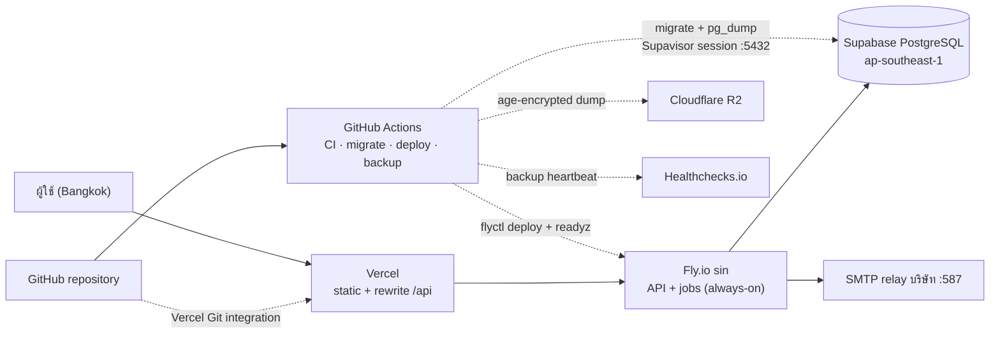

<!-- id: devops -->
## 09 · DevOps, ความปลอดภัย และการทดสอบ (DevOps, Security & QA)

หัวข้อนี้แยก **configuration ที่อยู่ใน repo** ออกจาก **external deployment state**: production target คือ Vercel + Fly.io + Supabase แต่ยังไม่ผ่าน verified TLS provisioning, unique credential onboarding, authenticated topology smoke และ restore drill จึงยังไม่ถือว่า production-ready

### 9.1 สภาพแวดล้อม (Environments)

Topology ที่ browser เห็นเหมือนกันทุก environment: **origin เดียว** `/` → `apps/web`, `/admin/` → `apps/admin` (Vite `base: '/admin/'`), `/api/` → Hono — เพราะ cookie `__Host-sid` ใบเดียวใช้ได้ทั้งสองแอป ไม่มี CORS ไม่มี cookie `Domain`; กลไกต่างกันตามชั้น — local = Vite proxy, staging = Fly เสิร์ฟทุกอย่างเองจาก image, prod = Vercel rewrite `/api/:path*` → Fly

| Env | รันที่ไหน | URL | DB | Mail | ใช้โดย |
|---|---|---|---|---|---|
| **local** | laptop: compose postgres+mailpit + `pnpm dev`; Vite proxy `/api` | `http://localhost:5173` และ admin dev `:5174` | local postgres; canonical initializer แยกจาก test fixtures | Mailpit `:1025` / UI `:8025` | development/tunnel origins ประกาศใน `apps/api/src/server.ts`; ไม่มี `CSRF_EXTRA_ORIGINS` env |
| **test (CI)** | GitHub Actions | — | `postgres:18` service; workflow ไม่ได้เทียบ image/managed server major | ไม่มี Mailpit service | 4 jobs ตาม `.github/workflows/ci.yml` |
| **staging target (ยังไม่ provision/verify)** | `fly.staging.toml` เตรียม Fly app ที่สองแบบ auto-stop และ image เสิร์ฟ statics เอง จึงไม่ต้องมี Vercel; repository ยังไม่มี staging workflow หรือหลักฐานว่า app ถูกสร้างแล้ว | target URL `https://reserveflow-staging.fly.dev` | ต้องใช้ Supabase project แยกและข้อมูล test เท่านั้น; project/plan ยังไม่ยืนยัน | ต้องใช้ SMTP sink ที่ไม่ส่งอีเมลจริง; แนวคิด Mailpit แยกยังไม่มี Fly config ใน repo | dev/UAT เมื่อ provision แล้ว |
| **drill** (planned) | isolated local postgres, no published port | — | restore + scrub + assertion design only; scripts/evidence absent | ไม่มี | go-live gate |
| **prod target** | Vercel static/rewrite + Fly API/worker | company domain (ยังไม่ยืนยัน) | Supabase target; verified TLS/backup restore ยังไม่พิสูจน์ | SMTP ยังไม่ยืนยัน | external state not verified |

ไม่ทำ: preview env ต่อ PR (ทีม 1–3 คนไม่คุ้ม — Vercel preview ของ FE มีมาฟรีแต่ไม่ใช่ gate), Supabase โปรเจกต์ที่สามสำหรับ drill (ลิมิต free = 2 → ใช้ local compose), Vercel Functions / Supabase Edge Functions / pg_cron (jobs ทุกตัวอยู่ใน process ของ API — หัวข้อ 05) โดเมนจริงและ SMTP relay เป็นรายการ "ต้องยืนยันกับบริษัท" (หัวข้อ 11 · ภาคผนวก §11.H)

### 9.2 แพ็กเกจรันไทม์ (Dockerfile, fly.toml, vercel.json)

prod ไม่มี compose และไม่มี Caddy อีกแล้ว: ทั้งระบบคือ `apps/api/Dockerfile` ไฟล์เดียว (multi-stage, non-root, ถือ dist ของ web + admin ไว้ในตัว) + `fly.toml` / `fly.staging.toml` + `vercel.json` ที่ root; `infra/compose.yml` เหลือหน้าที่เดียวคือ **local dev** (postgres + mailpit) และ `Caddyfile` ถูกลบ — ไฟล์จริงทั้งหมดอยู่ใน repo แล้ว: `vercel.json`, `fly.toml`, `fly.staging.toml`, `apps/api/Dockerfile`, `.github/workflows/{ci,deploy,backup}.yml`, `infra/supabase/bootstrap.sql`

:::details ดู vercel.json, fly.toml, Dockerfile และ bootstrap.sql
```jsonc
// vercel.json (root) — ลำดับ routing ของ Vercel: headers → redirects → filesystem → rewrites
// asset จริงจึงถูกเสิร์ฟก่อน SPA fallback เสมอ และ /api/* อยู่บนสุดจึงชนะ
{
  "rewrites": [
    { "source": "/api/:path*", "destination": "https://reserveflow-api.fly.dev/api/:path*" },
    { "source": "/admin/:path*", "destination": "/admin/index.html" },
    { "source": "/:path*", "destination": "/index.html" }
  ],
  "headers": [
    { "source": "/api/(.*)", "headers": [
      { "key": "x-vercel-enable-rewrite-caching", "value": "0" } ] }
  ]
}
```

`vercel.json` ปัจจุบันตั้ง rewrite และปิด rewrite caching บน `/api/*` เท่านั้น. **ยังไม่มี HSTS, nosniff, Referrer-Policy, CSP หรือ Permissions-Policy สำหรับ SPA static responses**; Hono `secureHeaders()` ครอบ API/Fly เท่านั้น. ต้องเพิ่มและตรวจผ่าน Vercel origin ก่อน go-live

```toml
# fly.toml (ตัดมา) — app "reserveflow-api", region sin
[build]
  dockerfile = "apps/api/Dockerfile"
[http_service]
  internal_port = 3000
  force_https = true
  auto_stop_machines = false     # sweep 60 s + outbox ต้องมี process ที่มีชีวิตระหว่าง request
  min_machines_running = 1
  [[http_service.checks]]
    path = "/api/readyz"
    interval = "15s"
[[vm]]
  size = "shared-cpu-1x"
  memory = "512mb"
# fly.staging.toml: app คนละชื่อ + auto_stop_machines = true (~$0 ตอน idle)
```

```dockerfile
# apps/api/Dockerfile (ตัดมา) — multi-stage, non-root; image เดียวถือ API + SPA dists
FROM node:24-slim AS build
# ... pnpm install --frozen-lockfile && pnpm build ...
FROM node:24-slim
ENV NODE_ENV=production PORT=3000
ENV NODE_EXTRA_CA_CERTS=/app/infra/supabase/prod-ca.crt    # path ถูกตั้งไว้ แต่ไฟล์ CA ยังไม่อยู่ใน repo
COPY --from=build /repo/apps/api/dist   ./apps/api/dist
COPY --from=build /repo/apps/web/dist   ./apps/web/dist    # image เสิร์ฟ statics ได้เอง: staging ไม่ต้องมี Vercel
COPY --from=build /repo/apps/admin/dist ./apps/admin/dist  # และ prod ถอด Vercel ออกได้ในครึ่งวันถ้า proxy hop แย่
USER node
CMD ["node", "apps/api/dist/server.js"]
```

middleware ฝั่ง Hono ปิดช่องที่มากับ proxy: (1) `Cache-Control: no-store` บนทุก `/api/*` (2) request ที่ไม่ใช่ `/api` และ `Host` ≠ host ของ `PUBLIC_BASE_URL` → `308` ไปโดเมนจริง — กัน `reserveflow-api.fly.dev` กลายเป็น origin ที่สองแบบครึ่ง ๆ กลาง ๆ (cookie ไม่เคยเดินทางไปที่นั่นอยู่แล้ว เพราะ `__Host-` ผูกกับโดเมนที่ browser ขอ) (3) better-auth ใช้ `baseURL` จาก `PUBLIC_BASE_URL` เสมอ ไม่ derive จาก request เพราะ proxy เขียน `Host` ทับ (`trustHost` ปิด)

```sql
-- infra/supabase/bootstrap.sql (ตัดมา) — รันครั้งเดียวต่อโปรเจกต์ด้วย role postgres
CREATE EXTENSION IF NOT EXISTS btree_gist WITH SCHEMA extensions;  -- Supabase วาง extension ใน schema "extensions"
CREATE EXTENSION IF NOT EXISTS citext     WITH SCHEMA extensions;
ALTER ROLE rf_app SET search_path = public, extensions;            -- ไม่งั้น citext/gist resolve ไม่เจอสำหรับ rf_app
ALTER ROLE rf_app SET statement_timeout = '10s';                   -- postgresql.conf แก้ไม่ได้บน managed → ตั้งที่ role
ALTER ROLE rf_app SET idle_in_transaction_session_timeout = '30s';
-- ปิดผิว PostgREST: default ของ Supabase ให้สิทธิ์ anon/authenticated ใน public —
-- bookings/เบอร์มือถือ/audit ต้องอ่านด้วย public anon key ไม่ได้:
REVOKE ALL ON ALL TABLES IN SCHEMA public FROM anon, authenticated;  -- + sequences/functions + default privileges + REVOKE USAGE
-- และใน dashboard: Settings → API → exposed schemas = (ว่าง); ตรวจด้วย manual deployment check
-- ไม่เปิด RLS — แอปต่อด้วย rf_app และ authz อยู่ในแอป; ทางแก้คือถอน grant ไม่ใช่คุมรายแถว
```

บน Supabase ไม่มี role `rf_owner`: `postgres` (ที่ Supabase ให้มา) เป็นเจ้าของ schema และเป็น role ที่ migration รันด้วย (ผ่าน `DATABASE_URL_MIGRATE`) ส่วน `rf_app` เหลือเป็น role runtime DML ตัวเดียว — local/CI ยังใช้โครง `rf_owner`/`rf_app` ของ `infra/db/init` ต่อไป ผลเชิงสิทธิ์เท่ากัน. native runtime dependency มี `@node-rs/argon2` ตัวเดียว; image ไม่ติดตั้ง `sharp` หรือ image-processing pipeline
:::

### 9.3 ตารางตัวแปร `.env`

Runtime variables ที่ `apps/api/src/env.ts` รู้จักถูก validate ด้วย Zod ตอน boot; initializer และ workflow secrets มี validation/process ของตน. ตารางนี้ต้องไม่เพิ่มชื่อที่ source ไม่รองรับ. เวลาใช้ UTC + `timestamptz` และ `APP_TZ='Asia/Bangkok'`

:::details ดู matrix ตัวแปร `.env` และรายการ secrets
secret หลักของ runtime คือ `BETTER_AUTH_SECRET` (≥ 32 random bytes; better-auth ใช้ sign cookie/hash token และ **ปฏิเสธ start ใน production ถ้าไม่มี** — zod ของเราตรวจซ้ำ; ไม่ generate ตอน start; หมุนแล้วทุกคนต้อง login ใหม่ ซึ่งยอมรับได้สำหรับ 81 บัญชี — C1-02); **ไม่มี** `QR_SECRET`: QR เป็น deep link แบบ static → ไม่ต้อง sign/rotate. ค่าทางธุรกิจ (business hours, grace, increment, advance days) อยู่ในตาราง `settings` ไม่ใช่ env. **prod ไม่มีไฟล์ `.env`**: runtime secrets อยู่ใน `fly secrets`; deploy secrets อยู่ใน GitHub repository หรือ Environment `production`; backup secrets ต้องเป็น repository secrets เพราะ `backup.yml` ไม่ประกาศ environment

| Variable | ใช้โดย | local | staging | prod | หมายเหตุ |
|---|---|---|---|---|---|
| `NODE_ENV` / `PORT` / `LOG_LEVEL` | api | development / 3000 / debug | production / 3000 / info | production / 3000 / info | ค่า non-secret อยู่ใน `[env]` ของ `fly.toml` |
| `DATABASE_URL` | api | `postgres://rf_app:…@localhost/reserveflow` | Supabase โปรเจกต์ 2, direct `:5432` | `postgresql://rf_app:…@db.<ref>.supabase.co:5432/postgres?sslmode=verify-full` | **direct connection (IPv6-only บน free)** — เครื่อง Fly มี IPv6 egress ในตัว; session semantics ครบ (prepared statements, `pg_advisory_xact_lock`); zod `.refine()` ใน `env.ts` **ปฏิเสธทุก URL ที่มี `:6543`** (Supavisor transaction mode ทำ prepared statement/advisory lock พังแบบเงียบ) และปฏิเสธ `sslmode=disable` |
| `DATABASE_URL_MIGRATE` | CI migrate/backup | `rf_owner@localhost` | session pooler `:5432` | ต้องใช้ `sslmode=verify-full` + CA provisioning | workflow ปัจจุบันยังไม่ provision CA จึงเป็น production blocker; ห้ามแก้ด้วยการปิด TLS |
| `PUBLIC_BASE_URL` | api | `http://localhost:5173` | `https://reserveflow-staging.fly.dev` | `https://reserve…` | แหล่งเดียวของ "โดเมนจริง": cookie `Secure`, Origin allowlist, better-auth `baseURL`, 308 host-mismatch, ลิงก์อีเมล/.ics/QR |
| `TRUST_PROXY` | api | false | true | true | อ่าน `X-Forwarded-For` จาก Fly proxy; prod ผ่าน proxy 2 ชั้น (Vercel → Fly) → IP เป็น **advisory** สำหรับ audit/log เท่านั้น ห้ามใช้ทำ IP allowlist (S-04) |
| `BETTER_AUTH_SECRET` | api | ผู้พัฒนาต้องใส่เอง (`.env.example` เว้นว่าง) | `fly secrets` | `fly secrets` | ≥ 32 bytes (`openssl rand -base64 32`); ต่างกันทุก env; หมุนผ่าน `fly secrets set` = users login ใหม่ (runbook 9.9) |
| `ACCOUNT_EMAIL_DOMAINS` | api | ว่าง (= ไม่บังคับ) | target domain | โดเมนบริษัท | `env.ts` รองรับ แต่ `.env.example`/`fly.toml` ไม่ประกาศค่า; ต้องเพิ่มใน runtime environment เมื่อต้องการบังคับโดเมนบัญชี (C1-20) |
| `SMTP_HOST/PORT/USER/PASS` | api | mailpit:1025 | staging target | relay target | ไม่มี `SMTP_SECURE` env; mailer ใช้ secure mode เมื่อ port=465 |
| `MAIL_FROM` / `MAIL_REPLY_TO` | api | อะไรก็ได้ | `ReserveFlow <noreply@…>` (ชื่อบัญชีเดียวกับ D-23 และ T-009 — C2-12) | เหมือน staging | |
| `WORKER_ENABLED` | api | true | true | true | `false` เมื่อแยก worker เป็นเครื่องที่สอง — zero code change |
| `INITIALIZE_DATABASE_URL` / `INITIALIZE_ENVIRONMENT` / `INITIALIZE_CONFIRM` / `INITIALIZE_ALLOW_PRODUCTION` | initializer one-shot | dedicated DB URL / `development` / exact DB confirmation / ไม่ต้องเปิด production | dedicated URL / `staging` / exact confirmation | session-pooler URL / `production` / exact confirmation / `true` | ไม่ใช่ runtime env และไม่ใส่ใน Fly; ต้องใช้ `--apply`; ปฏิเสธ `:6543`, TLS disabled, environment marker/ชื่อ DB ไม่ตรง และ production-like target ที่ไม่มี opt-in |
| `INITIALIZE_ADMIN_PASSWORD` / `INITIALIZE_EMPLOYEE_PASSWORD` | initializer one-shot | bootstrap secret | demo/staging bootstrap | **ห้ามเปิดบริการด้วย shared employee password** | initializer ใช้ password พนักงานค่าเดียวสำหรับ 80 บัญชี; unique onboarding เป็น go-live gate |
| Deploy secrets: `FLY_API_TOKEN`, `DATABASE_URL_MIGRATE` | GitHub repository หรือ Environment `production` (`deploy.yml`) | | | | FE ไม่มี secret ใน GitHub deploy job — Vercel deploy ตัวเองจาก Git integration |
| Backup secrets: `DATABASE_URL_MIGRATE`, `BACKUP_AGE_PUBLIC_KEY`, R2 credentials, `HEALTHCHECKS_PING_URL` | GitHub **repository secrets** (`backup.yml`) | | | | `backup.yml` ไม่มี `environment:`; environment-scoped secret จะไม่ถูกส่งเข้า workflow นี้ |

**ตัวแปรที่หายไปจากแผน VM เดิม:** `UPLOADS_DIR` (รูปห้องเป็น `bytea` บนตาราง `rooms` — 3 ห้อง < 1 MB, อยู่ใน `pg_dump` อัตโนมัติ ไม่มี volume/เส้น backup ที่สอง), `POSTGRES_*`/`RF_OWNER_PASSWORD`/`RF_APP_PASSWORD` (กลายเป็น `infra/supabase/bootstrap.sql` รันครั้งเดียว; local ยังใช้ใน compose), `DOMAIN`/`ACME_EMAIL` (TLS เป็นของ Vercel/Fly ทั้งคู่), `IMAGE_TAG` (Fly ถือ release history — rollback = `fly deploy --image <เดิม>`), `TZ` (UTC เสมอ), `SSH_HOST/USER/KEY` + `PROD_ENV_FILE`/`STAGING_ENV_FILE` (ไม่มี SSH และไม่มีไฟล์ `.env` ให้ ship)

Frontend build ไม่มี `VITE_*` secret/config ใน implementation ปัจจุบัน: ทั้งสอง SPA เรียก `/api` แบบ same-origin และรับ mode/user context จาก session API

Runtime/deploy secrets จริงมี: `BETTER_AUTH_SECRET`, รหัส `rf_app`, SMTP credential, `DATABASE_URL_MIGRATE`, R2 credential + age key pair (private key เก็บ offline ใน password manager — ฝั่ง backup ใช้แค่ public key), `FLY_API_TOKEN`; initializer passwords เป็น one-shot input แยกต่างหาก. ไม่ใช้ Vault/SOPS — เพิ่มเมื่อมีคนแก้ secret เกิน 3 คนและต้องการ audit trail
:::

### 9.4 CI/CD (GitHub Actions — `.github/workflows/ci.yml`, `deploy.yml`)

Workflow ที่ commit อยู่ใน repo เป็นความจริงของ automation ปัจจุบัน: CI มี 4 jobs และ deploy production ทำ migration → Fly → readyz; Vercel deploy frontend จาก Git integration นอก GitHub Actions. รายการทดสอบที่ยังไม่ผูกกับ workflow ต้องระบุเป็น manual/future gate ไม่ใช่อธิบายว่า CI ทำแล้ว

:::details ดูตาราง CI/CD, กติกา migration และ rollback
| Stage | เมื่อไร | ทำอะไร | Required check |
|---|---|---|---|
| `lint` (`ci.yml`) | PR และ push `main` | Node 24 + pnpm 10.27.0 → frozen install → `pnpm biome check .` | ตาม branch protection ที่เจ้าของ repo ตั้ง |
| `typecheck` (`ci.yml`) | PR และ push `main` | frozen install → `pnpm typecheck` | ตาม branch protection |
| `test` (`ci.yml`) | PR และ push `main` | PostgreSQL 18 service → frozen install → `pnpm test` ด้วย DB แยกของ run | ตาม branch protection |
| `build` (`ci.yml`) | PR และ push `main` | frozen install → `pnpm build` | ตาม branch protection |
| `deploy` (`deploy.yml`) | push `main` หรือ manual `workflow_dispatch` | job ใช้ GitHub Environment `production`; frozen install → `pnpm db:migrate` ด้วย `DATABASE_URL_MIGRATE` → `flyctl deploy --remote-only --config fly.toml` → poll `/api/readyz` | migration/deploy/readyz ล้มแล้ว job ล้ม |
| Vercel Git integration | commit ที่ Vercel ติดตาม | root `build:vercel` build web + admin, รวม admin ไว้ใต้ `/admin`, deploy project เดียว; `/api/*` rewrite ไป Fly | จัดการโดย Vercel ไม่ใช่ `deploy.yml` |
| `backup.yml` | schedule/manual แยกจาก deploy | `pg_dump` → age → R2 + heartbeat และ weekly keep-alive | ไม่ใช่ pre-deploy step |

**ยังไม่ automated ใน workflow ปัจจุบัน:** Playwright/axe smoke, migration drift check, HTTP race/k6, dependency audit/Trivy, deploy staging, image SHA reuse, pre-deploy dump และ `@prod-safe`. รายการเหล่านี้ยังเป็น target/manual release evidence ได้ แต่ห้ามนับว่าเป็น GitHub required check จนมี job จริง. Branch protection และจำนวน approver เป็น external GitHub settings จึงต้องตรวจใน repository settings แยกจากไฟล์ YAML

Migration เป็น **forward-only** และรันก่อน Fly deploy ไม่รันตอน API boot; ทุกไฟล์ใช้ lock/statement timeout และต้อง backward-compatible ข้ามช่วงที่ Fly กับ Vercel อาจเป็นคนละ revision ชั่วคราว. **Rollback:** API เลือก Fly release/image ก่อนหน้า; frontend ใช้ Vercel rollback. ไม่มี pre-deploy dump ใน `deploy.yml`; schema error ให้ fix-forward เป็นหลัก ส่วน data corruption จึงหยุด API และ restore จาก backup workflow ล่าสุดตาม runbook/RPO โดยบันทึก incident และผลกระทบ
:::

**Manual release checklist 9 ข้อ :icon[check]** — เป้าหมายสำหรับ production release/go-live; หลายข้อด้านล่างยังไม่ใช่ job ใน workflow ตามรายการ “ยังไม่ automated” ข้างบน จึงต้องแนบหลักฐาน manual กับ sha หรือสร้าง job ก่อนนับว่าผ่าน

| # | ด่านที่ต้องผ่าน |
|---|---|
| 1 | CI 4 jobs ที่มีจริงเขียวบน sha ที่ปล่อย; รัน dependency/image audit และ smoke ผ่าน Vercel origin เป็นหลักฐาน manual จนกว่าจะมี jobs รองรับ (`/api`, deep link + asset ของ `/admin/`, `/`, และ `Cache-Control: no-store`) |
| 2 | `race` suite (`TC-CON-001`, TC-IDEM-011, TC-ROOM-028) ผ่าน 100% ตามหลักฐาน manual/แยก workflow; อย่าอ้างว่า `ci.yml` รัน HTTP staging อยู่แล้ว |
| 3 | migration review checklist และ dry-run ตามแผนผ่าน; ห้ามโหลด dump production เข้า staging/UAT ซึ่งใช้ canonical/test data เท่านั้น |
| 4 | UAT ของ Must FR ผ่านและลงนามโดย admin กับพนักงานอย่างน้อย 2 คน |
| 5 | restore drill และ rollback rehearsal เกิดขึ้นไม่เกินสามสิบวันก่อนปล่อยรุ่น; หลัง scrub ต้องยืนยันว่าไม่พบ identity จริงชุดที่กำหนดก่อน service ใดเข้าถึง `rf-drill` (`TC-BK-022`, CF-05) |
| 6 | อีเมลจริงถึง Gmail, Outlook และกล่องบริษัท; `.ics` เปิดได้ใน Google Calendar, Outlook และ Apple Calendar |
| 7 | ตรวจ `pino` logs, `/api/readyz`, Fly health check, backup heartbeat และหน้า admin email queue; แถว `FAILED` ต้องมองเห็นและ retry ได้ |
| 8 | canonical initializer และคู่มือหลักพร้อมใช้; **restore/scrub drill, formal day-2 runbook และ admin break-glass recovery ต้องสร้างและซ้อมก่อน go-live** |
| 9 | security sign-off ผ่าน `TC-SEC-021`, `TC-RBAC-010`, `TC-PRV-004` และ manual poke 30 นาที |

### 9.5 สถาปัตยกรรม deploy (repository target)

configuration ที่ commit อยู่เลือก **Vercel + Fly.io `sin` + Supabase PostgreSQL `ap-southeast-1`**: browser เห็น origin เดียวผ่าน Vercel rewrite, API เป็น process เดียวแบบ always-on เพื่อให้ sweep/outbox เดินต่อเนื่อง และ database เป็น managed PostgreSQL. ชื่อ plan, ราคา, quota, licensing และสถานะ provisioning เป็น external state ที่ repository ยืนยันไม่ได้และต้องตรวจใหม่ก่อน go-live



สิ่งที่ควรอ่านจากภาพนี้: runtime path คือ Browser → Vercel → Fly → Supabase; delivery path มีสองแขนที่เป็นอิสระ — Vercel deploy จาก Git integration ขณะที่ GitHub Actions ทำ migrate → Fly deploy → readiness. Backup ไม่ได้ไหลจาก Supabase ไป R2 โดยตรง: GitHub runner เป็นผู้ทำ `pg_dump`, เข้ารหัสด้วย `age` แล้ว upload ไป R2

**Vendor gate:** ก่อนใช้เชิงพาณิชย์ เจ้าของระบบต้องตรวจ plan/ToS/ราคาและ backup guarantees ล่าสุดของ Vercel, Fly.io และ Supabase แล้วบันทึก plan ที่อนุมัติ; เอกสารนี้ไม่ตรึงราคาและไม่ถือ plan label เป็นข้อเท็จจริงถาวร. หาก Vercel ไม่เหมาะสม Docker image ปัจจุบันมี SPA bundles และ Fly สามารถเสิร์ฟ frontend เองได้โดยไม่เปลี่ยน domain model หรือ API contract

:::details เปรียบเทียบทางเลือก deploy และกับดักที่กันไว้แล้ว
| ทางเลือก | ~USD/เดือน | ภาระ ops | สรุป |
|---|---|---|---|
| **(a) Vercel + Fly + Supabase** | **3–4** | `fly deploy` + `git push`; backup ยังต้องเขียนเอง (GitHub Actions — งานนี้ไม่หายไปไหน) | **เลือก 2026-08-24** — ไม่มี OS/DBA ให้ดูแล; ทุก guarantee ของสเปก (EXCLUDE A, advisory lock, sweep 60 s, outbox, SMTP 587) รันโดยไม่แก้โค้ดสักบรรทัด |
| (b) 1 VM + docker compose + Caddy | 12–25 | patch OS, เป็น DBA เอง, backup เอง ≈ 1 ชม./เดือน + วันซวยปีละวัน | **แผนเดิม — ถูกแทนที่**; ยังเป็น*ระบบ*ที่เรียบง่ายกว่าจริง (กล่องเดียว, debug ที่เดียว, ไม่มี ToS ให้อ่าน) และคือทางถอยถาวร: runtime ทั้งหมด = 1 Dockerfile + 1 Postgres URL → ย้ายกลับ VM ได้ในครึ่งวัน |
| (c) serverless เต็มตัว (Cloud Run / Vercel Functions) | 0–5 | ต่ำสุดบนกระดาษ | **ไม่รับ** — ฆ่า in-process scheduler (sweep/outbox ต้องมี process ที่มีชีวิตระหว่าง request), cold start ชน p95, เปิด SMTP socket ต่อ invocation; ประหยัด ~$3 แลก failure mode ใหม่ 4 แบบ |

หมายเหตุความจริงจากการรีวิวข้อเสนอเดิม: เหตุผลเก่าที่เคยตัดตัวเลือก Vercel+managed DB ("2 origins → CORS + `SameSite=None`") **ผิด** — rewrite proxy คง origin เดียวได้; ส่วนเหตุผล "sweep/outbox ต้องการ long-lived process ซึ่ง Vercel ไม่มี" **ถูก** และคือเหตุผลที่ API อยู่บน Fly ไม่ใช่บน Vercel. ตัด Neon เพราะ autosuspend 5 นาทีปิดไม่ได้ + งบ 100 CU-h/เดือนทำให้ keep-warm 24/7 ผิดกติกา — sweep ของเราจะปลุก DB ทั้งวัน; Supabase free ไม่หลับระหว่างวันจึงไม่ต้องแก้ design งานเลย

| กับดัก (จากรีวิว 2026-08-24) | กันด้วย |
|---|---|
| Vercel cache external rewrite ตาม header ปลายทาง (โปรเจกต์หลัง 2026-04-06) → availability ค้าง cache | `Cache-Control: no-store` ทุก `/api/*` + `x-vercel-enable-rewrite-caching: 0`; ด่านปล่อยรุ่นข้อ 1 assert ผ่านโดเมนจริง |
| Supabase pause โปรเจกต์ free หลัง inactive 7 วัน — **resume เป็น manual จาก dashboard** | sweep 60 s เป็น traffic ต่อเนื่อง + weekly `SELECT 1` จาก GitHub Actions (กันกรณี Fly ล่มยาว); runbook resume + คนรู้ปุ่ม ≥ 2 ชื่อ (9.9) |
| direct connection เป็น IPv6-only บน free | เครื่อง Fly มี IPv6 egress → app ต่อ direct; CI/backup (runner IPv4) → session pooler `:5432`; **ห้ามซื้อ IPv4 add-on** (มันสลับ AAAA ทิ้ง ไม่ใช่ dual-stack) |
| `:6543` (transaction pooler) ทำ prepared statement + advisory lock พังแบบเงียบ | `env.ts` ปฏิเสธทุก URL ที่มี `:6543`; comment ใน tx จองตรึงว่าใช้ `pg_advisory_xact_lock` เท่านั้น — refactor ไป session lock คือเส้นทาง corruption เงียบ |
| extension อยู่ schema `extensions` → `citext`/gist resolve ไม่เจอ | `ALTER ROLE rf_app SET search_path = public, extensions` ใน bootstrap.sql |
| PostgREST + anon key เปิดเป็น default → ตาราง (เบอร์มือถือ, audit) อ่านได้จาก internet | bootstrap.sql REVOKE ครบ + exposed schemas = ว่าง + manual deployment check ต้องได้ 401; CI ปัจจุบันยังไม่ต่อ Supabase/PostgREST |
| Supabase free ไม่มี backup/PITR | nightly `pg_dump` → `age` → R2 + drill รายไตรมาส (9.9); RPO ดีกว่า 24 ชม. = Supabase Pro |
| `Host` ถูก proxy เขียนทับ → URL ที่ derive จาก request ผิดหมด | ทุกอย่าง derive จาก `PUBLIC_BASE_URL`; `trustHost` ปิด; non-`/api` host แปลก → 308 (9.2) |
| X-Forwarded-For ผ่าน proxy 2 ชั้น → IP ปลอมได้ | IP = advisory; limiter คีย์ที่ identifier; ไม่มี IP allowlist (S-04) |
| ลิมิต Nano: 60 direct connections / 500 MB / 500 MB RAM | `pg.Pool` `max: 10`, เครื่องเดียว; 500 MB ≈ หลายสิบปีของ booking ระดับนี้; timeouts ตั้งที่ role |
| นโยบาย free tier เปลี่ยนได้จริง (Fly ฆ่า free tier 2024, Vercel เปลี่ยน rewrite caching 2026) | ไม่มี SDK เฉพาะ platform (ปฏิเสธ Supabase Storage/Edge Functions ด้วยเหตุนี้); 1 Dockerfile + 1 Postgres URL = re-home ได้ในครึ่งวัน; ทบทวน ToS รายไตรมาส (9.9) |
:::

**รายการตรวจสัปดาห์แรก (week-1 verification) :icon[check]** — หกข้อที่ต้องพิสูจน์ก่อนเขียนงานอื่นทับ:

| # | ตรวจอะไร |
|---|---|
| 1 | สร้างโปรเจกต์ Supabase (`ap-southeast-1`) + รัน `infra/supabase/bootstrap.sql` แล้วยืนยันบน connection string จริง: extensions + `search_path` + constraint `EXCLUDE` + `pg_advisory_xact_lock` ทำงานครบ (30 นาที — de-risk ทั้งแผน) |
| 2 | ปิดผิว PostgREST แล้ว assert ใน CI: endpoint PostgREST + anon key → 401/ว่าง |
| 3 | `fly ssh console -C "getent ahostsv6 db.<ref>.supabase.co"` — ยืนยัน IPv6 egress จากเครื่อง Fly; ไม่ผ่าน → fallback ให้ app ใช้ session pooler |
| 4 | ทดสอบ SMTP 587 จากเครื่อง Fly → relay บริษัท (`swaks`/`openssl s_client`) และให้ IT ยืนยัน **SMTP AUTH vs IP-allowlist** — ข้อที่มีโอกาสบังคับแก้ design ที่สุด ถามตอนนี้ไม่ใช่ W6 (§11.H) |
| 5 | วัด p95 ของ `GET /api/v1/availability` จากเน็ตฝั่ง Bangkok ผ่านโดเมน Vercel; ถ้า proxy hop แย่ → ตัด Vercel ให้ Fly เสิร์ฟ statics (image พร้อมอยู่แล้ว) |
| 6 | manual deploy smoke ผ่าน rewrite จริง: ตรวจ `Set-Cookie` ของ login ว่ามี `__Host-sid; Secure; Path=/; HttpOnly; SameSite=Lax` และ**ไม่มี `Domain=`**; `/api/*` ตอบ `Cache-Control: no-store` |

### 9.6 รายการตรวจความปลอดภัย (Security checklist)

เกณฑ์พื้นฐานมี 18 controls ครอบคลุม session, CSRF, password/token, RBAC/masking, audit, validation, backup, DB roles, PDPA, supply chain และ container hardening; ทุกข้อผูกกับ test ที่พิสูจน์ใน 9.7

:::details ดูรายการตรวจความปลอดภัยทั้งหมด (18 ข้อ)
| # | หัวข้อ | การตัดสินใจ | ทำไม | พิสูจน์โดย |
|---|---|---|---|---|
| S-01 | Sessions / cookie | better-auth เก็บ session ใน Postgres; cookie `__Host-sid` `HttpOnly; Secure; SameSite=Lax; Path=/`; session อายุ 7 วันแบบ sliding; `remember_me: true` ออก persistent cookie สำหรับ session นี้ ส่วน `remember_me: false` ออก browser-session cookie และออกจากระบบเมื่อปิดเบราว์เซอร์; session id ใหม่ตอน login; revoke ทั้งหมดเมื่อเปลี่ยนรหัส/deactivate/ตั้งรหัสผ่านใหม่ (session lookup join `users.status` + `role` ทุก request จึงไม่ต้อง revoke เมื่อเปลี่ยน role — หัวข้อ 06 U-08); ไม่มี JWT | revoke ได้ทันที; `__Host-` บังคับ Secure + ไม่มี Domain; checkbox ไม่ขยายอายุ session | TC-AUTH-009 |
| S-02 | CSRF | origin เดียว → ไม่มี CORS; `SameSite=Lax` + middleware `lib/csrf.ts` ของเรา (หัวข้อ 06 C-04: **ทุก** unsafe method ไม่ว่า content-type ใดหรือไม่มี body ต้องมี `Origin` ∈ allowlist หรือ `Sec-Fetch-Site: same-origin` — Hono `csrf()` ตรวจเฉพาะ content-type แบบฟอร์มจึงไม่พอตาม C-04; C1-12) + รับเฉพาะ `application/json`/multipart ตามที่ route ประกาศ; ไม่มี CSRF token | token เป็น state ที่ไม่จำเป็นเมื่อ same-origin | TC-SEC-021 (เคส JSON, ไม่มี body, multipart, ไม่มี Origin, origin พี่น้อง) |
| S-03 | Passwords + set-password token | ตัวตรวจปัจจุบันบังคับ 10–128 ตัวอักษรโดยไม่มี composition/common-password rule เพิ่ม; hash ด้วย **argon2id** (`@node-rs/argon2`, m=64 MiB, t=3, p=1). Invite/admin reset ใช้ **token flow เดียวบนตาราง `password_setup_tokens` ของเรา** (สุ่ม 256-bit ส่งเฉพาะในอีเมล, เก็บเฉพาะ `sha256(token)` — ฐานข้อมูลที่รั่วจึงใช้ token ต่อไม่ได้; `purpose` INVITE 7 วัน / RESET 24 ชม.; ใช้ครั้งเดียวด้วย guarded update; ออก token ใหม่ = ลบใบเก่าที่ยังไม่ใช้ใน tx เดียวกับ outbox — D-29/C2-06); admin ไม่เห็นและไม่ส่งรหัสผ่าน. ค่า `FORGOT` ยังอยู่ใน schema เพื่อ compatibility แต่ final API ไม่มี route ออก token นี้ | สะท้อน policy ที่บังคับใช้จริงและแยก backlog ของ password screening ออกจาก baseline | TC-AUTH-009 |
| S-04 | Rate limit + lockout | ตัวเลขตามหัวข้อ 06 C-13: sign-in 5/นาที ต่อ identifier (+IP เป็นเกณฑ์รอง — prod อยู่หลัง proxy 2 ชั้น Vercel→Fly, IP จึงเป็น advisory ปลอมได้), lockout 5 ครั้งล้มเหลว/15 นาทีต่อบัญชี → `423 ACCOUNT_LOCKED`; ข้อความ generic; dummy argon2 verify เมื่อไม่พบผู้ใช้ (กัน enumeration/timing); check-in 10/นาที/user; `POST /bookings` 30/นาที/user; resend-invite/reset-password ใช้ budget ร่วม 3/ชม. ต่อ user. ตัว limiter เป็น helper in-process ใน `lib/rate-limit.ts`; API จึงต้องคง single instance หรือย้าย state ลง PostgreSQL ก่อน scale-out | credential stuffing ในออฟฟิศ 80 คน | TC-RATE-024 |
| S-05 | RBAC → 404 | `createRequireAuth()`/`createRequireAdmin()` ที่ route และ ownership checks ใน route/service; ไม่มี `can()` กลาง. Admin resource ที่ non-admin ไม่ควรรู้ตอบ 404; booking read คืน masked view และ action ที่ไม่มีสิทธิ์ตอบ 403 | Admin SPA เป็นเพียง UI; server เป็นผู้บังคับสิทธิ์ | TC-RBAC-010 |
| S-06 | Private masking | ทำใน `toViewerBooking()` serializer (3 ระดับ FULL/PUBLIC/BUSY) ไม่ใช่ CSS; calendar คืน "ไม่ว่าง" + ห้อง/เวลา + `owner_display_name` เท่านั้น (ไม่มี title หรือ owner object) ยกเว้น private BUSY ของ FACILITY ที่ไม่คืนชื่อ; detail/list BUSY ไม่มีชื่อผู้จอง; .ics/อีเมลถึง owner + attendees เท่านั้น; log ไม่มี title (ids เท่านั้น) | ช่องรั่วเดียวคือ API → ทดสอบทุก endpoint ที่คืน booking และ calendar-specific metadata | TC-PRV-004 |
| S-07 | Audit immutability | `audit_logs` เขียนใน tx เดียวกับ mutation; `rf_app` มีแค่ `INSERT, SELECT`; trigger `BEFORE UPDATE OR DELETE … RAISE EXCEPTION` กันแม้ role เจ้าของ schema (`postgres` บน Supabase / `rf_owner` บน local; ยกเว้น DELETE ของแถวที่เก่ากว่า retention 24 เดือน — ดูหัวข้อ 05); migration ที่แตะ `audit_logs` ห้าม | เขียนทับประวัติไม่ได้ด้วย grant + trigger สองชั้น | TC-AUD-016 |
| S-08 | Idempotency-Key | บังคับบน `POST /bookings` เท่านั้น (CSV import เป็น upsert idempotent ในตัว); key เก็บบนแถว `bookings` (`UNIQUE (created_by, idempotency_key)`); `INSERT … ON CONFLICT DO NOTHING` → key ซ้ำ = คืน booking เดิม 200 + `Idempotent-Replayed`; request ซ้อนกันรอที่ unique index; ไม่มีตารางแยก (หัวข้อ 06 C-10) | double-click/retry ไม่เคยสร้าง 2 การจอง | TC-IDEM-011 |
| S-09 | Validation: Zod + service + DB CHECK | API ประกาศ route-local Zod schema และใช้ service policy; web ตรวจฟอร์ม/slot แยกเพื่อ UX; DB `CHECK`/EXCLUDE เป็นด่านความจริงสุดท้าย. สัญญาระหว่างชั้นยังไม่ได้รวมเป็น shared schema เดียว | app เช็กเพื่อ UX, API/DB เช็กเพื่อความจริง | TC-VAL-012 |
| S-10 | Backups | **Supabase free ไม่มี managed backup/PITR** → `.github/workflows/backup.yml` คือ backup story ทั้งหมด: nightly (02:00 Bangkok) `pg_dump -Fc --no-owner` ผ่าน session pooler `\|` `age` (public key) → R2 (retention 30 dumps); heartbeat healthchecks (+`/fail` เมื่อ job พัง); weekly `SELECT 1` กัน 7-day pause; **RPO 24 ชม. / RTO ≤ 30 นาที** — ไม่มี pre-deploy dump ใน workflow ปัจจุบัน; ธุรกิจขอดีกว่านี้ = Supabase Pro (daily backup + PITR) | DB ขนาด MB; restore ซ้อมได้ใน 30 นาที; งาน backup ไม่หายไปกับ managed DB | TC-BK-022 |
| S-11 | DB roles | bootstrap SQL ออกแบบ `postgres` เป็น schema owner และ `rf_app` เป็น runtime DML พร้อม revoke anon/authenticated. Dashboard exposed-schema setting และ anon/PostgREST behavior เป็น **manual deployment check**; CI ปัจจุบันไม่ได้ต่อ Supabase หรือ assert path นี้ | ลด blast radius; external setting ต้องมีหลักฐานก่อน go-live | TC-AUD-016 + manual PostgREST check |
| S-12 | Log redaction + PDPA retention | logger ปัจจุบัน redact key/text pattern สำหรับ `authorization`, email และ mobile รวม nested plain object/error serializer; request middleware log เฉพาะ metadata ไม่ log body/title. **ยังไม่มี explicit cookie/set-cookie/password/token key redaction** จึงต้องเพิ่มและทดสอบก่อนอนุญาตให้ caller ส่ง object เหล่านี้เข้า logger. Retention/pseudonymisation เป็น policy ที่ต้องมี day-2 procedure | บันทึกทั้งสิ่งที่บังคับจริงและ gap ที่ต้องปิดก่อน go-live | TC-USR-017, TC-OPS-026 |
| S-13 | QR check-in threat model (MVP — CB-02) | QR ห้องเป็น static deep link `/check-in/:roomCode`; ต้อง login; server เลือก booking ของ *ผู้ใช้นั้น* ใน *ห้องนั้น* ที่อยู่ในหน้าต่าง self เดียวกับ 06 §6.3.5 `[start−15, LEAST(end_at, start+15))` (CF-02); owner หรือ attendee เท่านั้น; ไม่มี PII ใน QR. ภัย: *ถ่ายรูป QR ไปสแกนจากบ้าน* → ยอมรับเป็น residual risk (รักษาได้แค่การจองของตัวเอง, log IP); *brute force* → ไม่มี token ให้เดา; *replay* → status check (CHECKED_IN แล้วตอบ 200 idempotent). Admin check-in ผ่าน endpoint เดียวกันได้ถึง `end_at` (ไม่มี force flag) | login + window ปิดภัยที่สำคัญในออฟฟิศ 80 คนโดยไม่ต้องมี token rotating | TC-CHK-019 |
| S-14 | Email domain auth | ส่งผ่าน relay ของบริษัท (Google Workspace / M365 connector — plain SMTP AUTH กำลังถูกเลิก; ยืนยันกับ IT ใน W0) → SPF/DKIM/DMARC เป็นของบริษัทอยู่แล้ว แค่ขออนุญาต sender `noreply@…` (ชื่อเดียวกับ D-23 — C2-12); fallback Postmark บน `mail.reserve.<domain>` + DKIM CNAME + SPF include + DMARC `p=none`→`quarantine`; ก่อน go-live ส่งทดสอบเข้า Gmail/Outlook/inbox บริษัท, .ics เปิดได้ใน Google/Outlook/Apple; เก็บ provider message id ใน `notifications` | internal tool ควรส่งในนามโดเมนบริษัท | TC-EMAIL-014 |
| S-15 | Admin cancellation reason | เมื่อ ADMIN ยกเลิก booking ของผู้อื่น route-local Zod บังคับ `reason` 3–1000 ตัวอักษร (`422 REASON_REQUIRED`) แล้วเก็บใน audit/email; schema DB ไม่มี length CHECK จึงพึ่ง API contract | ผู้ถูกกระทบต้องรู้ว่าทำไม | TC-AUD-016 |
| S-16 | Headers | API ใช้ Hono `secureHeaders()` และ `Cache-Control: no-store`; `vercel.json` ปัจจุบันยังไม่ได้ตั้ง static HSTS/CSP/nosniff/Referrer/Permissions headers. เพิ่มและตรวจ `/`, `/admin/`, `/api/healthz` ผ่านโดเมนจริงก่อน go-live | static header hardening เป็น open release gap | TC-SEC-021 |
| S-17 | Dependency scanning + pinning | ปัจจุบัน CI ใช้ `pnpm install --frozen-lockfile`; audit/Trivy, Dependabot policy, digest pin ของ container/actions และ migration drift check ยังเป็น hardening backlog ไม่ใช่ job ที่มีอยู่. ก่อนเปิดใช้งานต้องเพิ่ม workflow แล้วจึงเลื่อนเป็น required check | supply-chain drift | manual review จนมี job จริง |
| S-18 | Env validation + error hygiene | zod env ตอน boot (ชื่อไม่ใช่ค่า); ไม่มี stack trace ถึง client, body `{code,message,details,request_id}`; timing-safe compare ทุก token; container non-root (`USER node`); ทางเข้าที่ browser ใช้มีทางเดียวคือโดเมนจริงผ่าน Vercel rewrite — request ตรงที่ Fly host ที่ไม่ใช่ `/api` ถูก `308` กลับ (9.2) | fail fast ดีกว่า fail ตอน 09:00 | TC-OPS-026, TC-SEC-021 |
:::

### 9.7 กลยุทธ์การทดสอบและ test matrix

automation ที่มีจริงคือ Vitest ของ `packages/shared`, `apps/api`, `apps/web` และ `apps/admin`; ชุด API ใช้ Postgres จริงและรวม concurrency gates ที่ commit อยู่ใน `apps/api/test`. `ci.yml` รัน `pnpm test` เท่านั้น — repository ยังไม่มี Playwright, axe, k6 หรือโฟลเดอร์ `tests/e2e`. การตรวจ journey, accessibility และ production headers จึงเป็น **manual browser release plan** จนกว่าจะมี automation เพิ่มจริง

:::details ดู automation ปัจจุบัน, manual browser plan และ test matrix
| ชั้น | เครื่องมือ | รันเมื่อ | ทดสอบอะไร |
|---|---|---|---|
| Unit | Vitest (colocated `*.test.ts[x]`) | ทุก PR ผ่าน `pnpm test` | shared slot/date rules, SPA helpers/components และ pure domain logic |
| API integration | Vitest + **Postgres 18 จริง** (`apps/api/test`) และ Hono `app.request()` | ทุก PR ผ่าน `pnpm test` | auth, booking, admin/master data, DB constraints, serialization, jobs, email/outbox, readyz และ concurrency gates ที่มีใน repo |
| Manual browser | in-app browser/เบราว์เซอร์จริงผ่าน Vercel origin | ก่อน go-live และเมื่อ flow/UI เปลี่ยน | employee/admin journeys, same-origin rewrite, deep links, cookie/header, QR check-in และ failed-email retry |
| Manual accessibility | keyboard, focus, zoom/reflow และ contrast inspection | ก่อน go-live และเมื่อ shared UI เปลี่ยน | WCAG 2.2 AA checklist ด้านล่าง; axe automation เป็น backlog ไม่ใช่ CI gate ปัจจุบัน |
| Manual performance | browser timing + SQL `EXPLAIN` เมื่อ release owner ต้องการหลักฐาน | ก่อน go-live | calendar budget ด้านล่าง; k6 automation เป็น backlog ไม่ใช่ workflow ปัจจุบัน |

**Concurrency gates ที่มีจริง:** `apps/api/test/gate.bookings.test.ts`, `gate.admin.test.ts` และ `gate.jobs.test.ts` รันผ่าน Vitest/Postgres ใน `pnpm test`. ตัวอย่างด้านล่างคือ intent ของ gate; ไม่มี HTTP staging runner แยก

```ts
// รูปแบบที่ครอบคลุมใน apps/api/test/gate.bookings.test.ts (TC-CON-001)
const N = 100, slot = nextWeekday('13:00', '14:00');
const users = await seedUsers(10), room = await seedRoom();
const statuses = await Promise.all(Array.from({ length: N }, (_, i) =>
  api.post('/api/v1/bookings', { cookie: users[i % 10].cookie, 'Idempotency-Key': randomUUID() },
           { room_id: room.id, start_at: slot.start, end_at: slot.end, title: `race ${i}` }).then(r => r.status)));
const tally = Object.groupBy(statuses, s => s);
expect(tally[201]).toHaveLength(1);
expect(tally[409]).toHaveLength(N - 1);                       // code ตามหัวข้อ 06
expect(await countLive(room.id)).toBe(1);                      // CONFIRMED/CHECKED_IN ใน DB
expect(calendarItems(room.id, slot)).toHaveLength(1);
```

- CI ใช้ Hono `app.request()` กับ Postgres service จริง; handlers, constraints และ advisory locks จึงทำงานจริงโดยไม่ต้องมี staging HTTP runner
- gates ครอบคลุม create slot เดียวพร้อมกัน, reschedule conflict ที่ต้องคง slot เดิม, idempotent replay, last-admin races และ singleton job tick; รายละเอียดที่ยังไม่มี test file ต้องถือเป็น backlog ไม่ใช่ผลทดสอบแล้ว

**Manual browser journeys (current release plan; ยังไม่มี automated E2E):** login/logout และ lockout; ค้นหา/จอง/ชน slot/ยกเลิก/เลื่อนเวลา; private masking; QR, self และ admin check-in; admin จัดการห้อง ผู้ใช้ settings reports และ audit; admin เปิด email queue ที่ filter `FAILED` แล้ว retry; สลับ User/Admin mode ด้วย `AppModeSwitch`; ตรวจ deep links `/`, `/admin/*` และ `/api/*` ผ่าน Vercel origin เดียว. ใช้ canonical initializer เท่านั้นและไม่รัน journey กับฐานสาธิตที่ต้องเก็บข้อมูลเดิม

**Manual accessibility plan:** ทำ flow หลักด้วยคีย์บอร์ดอย่างเดียว, ตรวจ tab order/focus visible/dialog focus, zoom 200 %, reflow 320 px, contrast และสถานะที่ไม่พึ่งสีบน login, rooms, booking, check-in และ admin. บันทึกผลกับ release sha; `axe`/browser automation เป็น future backlog และยังไม่มี allowlist หรือ required check ใน repo

**Job idempotency:** tests ใน `apps/api/test/jobs.test.ts` และ `gate.jobs.test.ts` ครอบคลุม sweep ซ้ำ, singleton lock, auto-release/complete, outbox retry และ `/readyz`. SMTP error ถูกบันทึกด้วย pino; ครบ 8 attempts แล้ว notification เป็น `FAILED`, มองเห็นใน admin email queue และกด retry ให้ requeue เป็น `PENDING` ได้. ไม่มี Sentry หรือ cron-monitor SDK ใน runtime ปัจจุบัน

**Performance budget (manual/future automation):** เป้าหมาย NFR calendar p95 ≤ 2 s แบ่งเป็น API ≤ 500 ms, render ≤ 1 s และ network ≤ 0.5 s สำหรับ 3 ห้อง × 7 วัน. ปัจจุบันไม่มี k6 script/job; ก่อน go-live ให้บันทึก browser timing และ `EXPLAIN (ANALYZE, FORMAT JSON)` บนข้อมูลสาธิต. หากเพิ่ม load automation ภายหลัง ให้ commit script และ workflow ก่อนนับเป็น release gate

**Test matrix** — ครอบคลุม `TC-CON-001` … `TC-ROOM-028` (27 เคสใช้งาน; `TC-APR-003` ถูกยกเลิกตาม CB-01 — คงแถวไว้เป็นบันทึก ไม่ renumber); RTM FR→TC อยู่ในหัวข้อ 02:

| Test ID | ครอบคลุม | ชั้น | สาระ |
|---|---|---|---|
| TC-CON-001 | FR-003, NFR-1 (Concurrency) | integration + race | 100 ขนาน → 201 เดียว, DB 1 แถว; `23P01` → 409 `SLOT_UNAVAILABLE` + `alternatives` (ไม่ใช่ 500/25P02 — map หลัง rollback); **barrier: create↔deactivate สองทิศไม่ deadlock (ลำดับ idempotency→users→rooms — C2-01), create↔`PATCH /admin/rooms` (`active` → false) ไม่ให้ใบ CONFIRMED ในห้องที่ปิดไปแล้ว (C2-04), tx ที่รอ lock คร่อม `start_at`/grace/`end_at` ต้องใช้ `clock_timestamp()` หลัง lock (C2-10), admin จองแทนแล้วถูก disable ระหว่างทาง → 403** |
| TC-AVL-002 | FR-001/002/008/011 | integration + manual browser | availability สะท้อน create/edit/cancel ทันที; filter capacity/feature |
| TC-APR-003 | FR-005/006 (ดู RTM หัวข้อ 02 — "เปลี่ยนตามมติลูกค้า (CB-01)") | — | **ยกเลิกตามมติลูกค้า (CB-01)** — ไม่มี approval flow ให้ทดสอบอีกต่อไป; ความถูกต้องเชิง concurrency ที่แถวนี้เคยถือ ครอบคลุมโดย TC-CON-001 และ TC-ROOM-028; คง ID ไว้เพื่อไม่ renumber matrix |
| TC-PRV-004 | NFR-3 (Security) | integration + manual browser | masking ทุก endpoint เรียก API ตรง ทุก role × status × surface (forbidden-key assertions: PRIVATE ของคนอื่นไม่มี title/owner object; employee/admin calendar มีเพียง `owner_display_name`; detail/list และ private BUSY ของ FACILITY ไม่มี `owner_display_name`) |
| TC-CAN-005 | FR-008 | integration + manual browser | cancel คืน slot ทันที, audit ครบ |
| TC-QR-006 | FR-010 | job | auto-release ครั้งเดียวแม้ retry |
| TC-PERF-007 | NFR-2 (Performance) | manual performance + SQL review | calendar p95 budget; future load automation เมื่อมี script/workflow จริง |
| TC-A11Y-008 | NFR-6 (Accessibility) | manual browser a11y | keyboard, zoom 200 %, contrast, non-colour status; future axe automation |
| TC-AUTH-009 | login, Q-08/Q-09 | integration + manual browser + genuine concurrency | password policy, argon2id, lockout; session 7 วันแบบ sliding พร้อม cookie persistent/browser-session ตาม `remember_me`; set-password token ใช้ครั้งเดียวทั้งตามลำดับและเมื่อ **2 transactions แย่ง token เดียวกันจริง โดยแต่ละฝั่งค้างที่ barrier 250 ms** → commit ได้ 1 ฝั่ง, `used_at` ถูกตั้งครั้งเดียว, รหัสของผู้ชนะ login ได้ 200 และของผู้แพ้ได้ 401; assertion ของ hash ต้องอ่าน `dbHash` จาก DB แล้วตรวจ `expect(timingSafeEqual(dbHash, sha256(rawToken))).toBe(true)` พร้อมยืนยันว่า DB ไม่มี raw token ไม่ใช้การเปรียบเทียบ buffer ตัวเดียวกับตัวเอง |
| TC-RBAC-010 | permission matrix (หัวข้อ 02) | integration (table-driven) | ทุก route × {anon, EMPLOYEE, FACILITY, ADMIN, deactivated} → status ที่คาด |
| TC-IDEM-011 | FR-003 double submit | integration + race | replay 200 booking เดิม; request ซ้อนกันรอแล้วได้ใบเดียว; replay หลังใบเดิมถูก cancel + มีใบ CONFIRMED ใหม่ของคนอื่นทับช่วง → replay คืนใบเดิม (CANCELLED) และไม่แตะใบใหม่ (replay ไม่แตะ user/ห้อง — C1-08); **key เดิม payload ต่าง → 200 ใบเดิม ไม่ใช่ 409 (ไม่มี `request_hash` — CF-01)** |
| TC-VAL-012 | business rules | unit + integration | API + DB CHECK ปฏิเสธ; holidays; advance window |
| TC-EDIT-013 | FR-008, reschedule policy (CB-03) | integration + manual browser | `PATCH` เปลี่ยน `start_at`/`end_at`/`room_id` เป็น tx เดียวใต้ constraint A: ชน → `409 SLOT_UNAVAILABLE` และแถว**ไม่เปลี่ยนเลย** — จองไว้ 13:00–14:00 พยายามย้ายทับ 14:00–15:00 ของใบอื่น → 409 แล้วอ่านซ้ำยังเป็น 13:00–14:00 `version` เดิม (ไม่มีสถานะกลางที่ใบไม่ถือ slot ใด — slot เดิมไม่ถูกปล่อย "ชั่วคราว" แล้วค่อยจองกลับ); UI แสดง conflict + alternatives โดยใบยังอยู่เวลาเดิม; detail-only ไม่แตะ slot; .ics SEQUENCE+1 เมื่อย้ายสำเร็จ |
| TC-EMAIL-014 | FR-007/009, NFR-5 (Reliability) | integration + Mailpit + job | templates, retry/backoff, dead-letter และ message id; `.ics` พิสูจน์ว่า `DTSTART` เป็น UTC ลงท้าย `Z` และไม่มี `TZID`, CANCEL ใช้ `UID` เดียวกับ REQUEST พร้อม `SEQUENCE` เพิ่มขึ้น, bytes ที่ดึงกลับจาก MIME ตรงกับต้นฉบับทุก byte และภาษาไทยรอดครบผ่าน decoder อิสระ 2 ตัว (Mailpit และ Python `email`, ไม่มี U+FFFD) |
| TC-SET-015 | master-data rule BR-11 (หัวข้อ 02) | integration + manual browser | เปลี่ยน business hours/capacity/holiday ไม่ auto-cancel; หน้า admin แสดงรายการการจองที่กระทบ (วนทุกหน้าถึงขอบ `max_advance_days` — C2-08); `PUT /admin/settings` ด้วย `If-Match` เก่า → 409 VERSION_CONFLICT ไม่ย้อนค่าของอีกคน (C2-08); `PATCH /admin/rooms/:id` ถือ advisory lock ห้องเดียวกับ create (C2-04) |
| TC-AUD-016 | audit baseline, reason | integration | audit แถวต่อ mutation ใน tx เดียว; UPDATE/DELETE ถูกปฏิเสธ; reason บังคับ |
| TC-USR-017 | admin user mgmt | integration + manual browser | CSV dry-run/import/upsert, invite→resend→reset token/outbox, INVITE 7 วันเทียบ RESET 24 ชม. (C2-06), deactivate ฆ่า session + create ที่แข่งกัน (FOR SHARE) ไม่เล็ดลอด, **deactivate × ทุก status × สองฝั่งของ `start_at`: CONFIRMED/CHECKED_IN ที่ยังไม่เริ่ม → CANCELLED, ที่เริ่มแล้ว → ไม่ถูกแตะ (C2-11)**, **barrier matrix เต็มของ `LAST_ADMIN`: ทุกคู่ของ {PATCH role, deactivate, DELETE, CSV import ที่เปลี่ยน role} → เหลือ admin ACTIVE ≥ 1 และฝ่ายแพ้ได้ 409 (C1-11)**, อีเมลนอกโดเมน → 422, delete/pseudonymise |
| TC-RPT-018 | FR-012 | unit + manual browser | utilization ตรง SQL oracle; holidays/closed hours ออกจากตัวหาร; AUTO_RELEASED = no-show; **ห้องที่ `created_at` กลางเดือนและกลางวันทำการ ได้ตัวหารเฉพาะตั้งแต่วินาทีที่สร้าง (`GREATEST` + ทิ้งหน้าต่างว่าง — C2-09)** |
| TC-CHK-019 | FR-010/FR-016 | integration + manual browser | window, owner/attendee only; **QR landing ต่อห้อง (MVP — CB-02)**: ไม่มีใบของผู้สแกนในห้องนั้น (รวมสแกนผิดห้อง) → `NO_BOOKING_IN_WINDOW`, เร็ว/ช้าเกินหน้าต่าง → `CHECKIN_WINDOW_CLOSED` + `opens_at`, `roomCode` ไม่รู้จัก → 404, เช็กอินแล้วสแกนซ้ำ → 200 idempotent; `checkin_method` = SELF \| QR \| ADMIN; admin check-in ถึง end_at บน endpoint เดียวกัน; **ADMIN ที่เป็น owner/attendee → `SELF` + หน้าต่าง self** (06 §6.3.5); เส้นตาย self = `LEAST(end_at, start+grace)` เมื่อ grace > ความยาวใบ (C2-03) |
| TC-JOB-020 | FR-009/010 infra | job | sweep/reminder/purge idempotent; graceful stop; scheduler boot + singleton lock; Message-ID คงที่ |
| TC-SEC-021 | security baseline | integration + manual deploy smoke | cookie flags, CSP/HSTS, CSRF middleware (JSON / no-body / multipart / no Origin / sibling origin → 403), ไม่มี stack trace, `BETTER_AUTH_SECRET` ขาด → boot fail; dependency/image audit เป็น manual/future จนมี workflow |
| TC-BK-022 | release gate + PDPA | **manual drill — pending** | ต้อง restore dump จริงลง isolated local DB, scrub PII, assert schema/data/constraints และบันทึก RTO. Repo ปัจจุบันยังไม่มี `infra/scrub-drill.sql`, `infra/drill-assert.sql` หรือบันทึกผล drill; `pg_restore --list` ไม่ถือว่าผ่าน |
| TC-DND-023 | NFR-4 (Usability) (future 1.1) | future manual/browser automation | drag&drop + keyboard alternative + conflict rollback; feature/dependency ยังไม่อยู่ใน current build |
| TC-RATE-024 | security | integration | login/check-in/booking/account-link limits, ข้อความ generic |
| TC-MIG-025 | migration plan | manual/future CI | fresh migrate และ review schema↔SQL; workflow ปัจจุบันยังไม่มี drift/migrate-from-tag job |
| TC-GRC-027 | FR-010/FR-016, settings retroactivity | integration + job | **เส้นตายเดียวทั้งระบบ `LEAST(end_at, start_at + checkin_grace_minutes)`**: (1) ใบยาว 30 นาทีที่สร้างตอน `min_duration_minutes=30` แล้วเปลี่ยนเป็น `min_duration_minutes=60, checkin_grace_minutes=45` → sweep ต้องให้ AUTO_RELEASED ที่ `end_at` ไม่ใช่ COMPLETED; (2) เช็กอิน self ที่ `end_at−1s` ผ่าน, ที่ `end_at` → 422 `CHECKIN_WINDOW_CLOSED`; (3) serializer capability และ mutation guard ต้องให้ผลตรงกัน แม้ implementation อยู่คนละ module (CF-02) |
| TC-ROOM-028 | FR-011 barrier | integration + race | **create/reschedule vs `PATCH /admin/rooms/:id`** ใต้ advisory lock ห้องเดียวกัน: `active = true→false` แต่ละทิศ ×100 → **ตัดสินนโยบายที่จุด linearize ของ tx จอง** (ค่าที่อ่าน `FOR SHARE` ใต้ advisory lock ห้องเดียวกัน) ไม่ใช่ที่สถานะห้องหลังจบการทดสอบ: ผลลัพธ์ที่ยอมรับมี 2 แบบ — (i) **create ชนะ lock** → ใบ CONFIRMED ถูกต้อง และ **ยังเป็น CONFIRMED ต่อไปหลัง `PATCH` commit** (BR-11 ไม่ auto-cancel — หัวข้อ 02 §2.4, D-26); (ii) **`PATCH` ชนะ lock** → create ที่ตามมาได้ 422 `ROOM_INACTIVE`. เคสที่ต้อง fail คือใบ CONFIRMED ที่ตัดสินด้วยค่า `active` ที่อ่าน **นอก** lock (ค่าล้าสมัย) และการเกิด `40P01`; `PATCH` ที่แพ้รอจน create commit แล้วค่อยเขียน (CF-03 + รอบตรวจซ้ำ codex-verify) |
| TC-OPS-026 | observability | integration + manual deploy smoke | `/api/healthz` 200, `/api/readyz` 503 เมื่อ DB ล่ม หรือ sweep ค้าง > 3 นาที, request-id echo, redaction; manual smoke บน image/deploy: `/api/healthz`, `/api/v1/rooms` (401 ไม่ใช่ 404), `/api/auth/get-session`, `/admin/`, `/admin/users` deep link, asset hash ของ admin, `/` (C1-01) |
:::

### 9.8 การสังเกตระบบ (Observability)

การเฝ้าระวังที่มีจริงใช้ pino structured logs + request id, liveness/readiness, Fly health checks, backup heartbeat และหน้า admin failed-email queue. ไม่มี Sentry SDK หรือ external uptime monitor ใน runtime ปัจจุบัน; บริการภายนอกเหล่านั้นเป็นตัวเลือกอนาคตเมื่อทีมตั้งค่าและทดสอบจริง

:::details ดู observability, alerts และ KPI ทั้งหมด
- **Logs:** pino JSON → stdout; request completion มี `request_id`, `method`, `path`, `status_code`, `duration_ms`. Request middleware ปัจจุบันไม่เติม `user_id`/`role`; error log ใช้ serializer ของ pino. Redaction ปัจจุบันครอบ authorization/email/mobile ตาม S-12
- **Request id:** API สร้าง/echo `X-Request-Id` ใน response, business error body และ audit row ที่ mutation ส่งต่อ; ยังไม่มี field `x-vercel-id` ใน logger ปัจจุบัน
- **Jobs/email:** scheduler ใน `jobs/index.ts` บันทึก loop failure ด้วย pino และอัปเดต health state; outbox ครบ 8 attempts เป็น `FAILED`. หน้า admin emails เปิดด้วย filter `FAILED`, แสดง `last_error`/attempts และ retry ให้กลับเป็น `PENDING`; นี่คือคิวงานที่ต้องตรวจปัจจุบัน
- **Health:** `GET /api/healthz` ตอบ liveness; `GET /api/readyz` ตรวจ DB และเมื่อ worker เปิดต้องมี sweep success ภายใน 3 นาที มิฉะนั้นตอบ 503. Fly ใช้ `/api/readyz` เป็น service check; `backup.yml` ส่ง heartbeat แยกสำหรับงานสำรองข้อมูล
- **สิ่งที่คนดู:** `fly logs`, Fly health, Supabase usage/status, backup heartbeat และ admin email queue. external uptime/error tracker เป็น Phase 2; เมื่อเปิดใช้ต้อง ping ผ่าน Vercel origin จริงและเพิ่ม runbook/owner ก่อนเรียกว่า alert path
- **Business KPIs จาก DB** (หน้า Reports ของ admin; ไม่ต้องมี metrics stack): conflict rate (นับ `booking.conflict` — วัดว่า alternatives ช่วยจริง), email delivery rate (`notifications` SENT/FAILED ต่อวัน), no-show/auto-release rate, สัดส่วน `checkin_method` (QR/SELF/ADMIN — วัดว่าป้าย QR หน้าห้องถูกใช้จริง), failed logins ต่อบัญชี — ตรงกับรายการสัญญาณหลังปล่อยรุ่น
- Phase 2 (เฉพาะถ้าไม่พอ): `prom-client /metrics` + Grafana Cloud free ≈ ครึ่งวัน
:::

### 9.9 สำรองข้อมูล, runbook และงาน day-2 (Backups / Runbooks)

repo มี workflow backup เข้ารหัสและรายการขั้นตอน day-2 ด้านล่าง แต่ **ยังไม่มี executable restore/scrub drill หรือหลักฐาน restore สำเร็จ**. ต้องสร้าง isolated drill, assertions และบันทึกผลก่อน go-live; การอ่าน catalog ด้วย `pg_restore --list` ตรวจได้เพียงว่า archive เปิดอ่านได้ ไม่พิสูจน์ว่า restore ได้

:::details ดูนโยบายและคำสั่ง backup
**Backups** (`.github/workflows/backup.yml`, schedule ทุกคืน 02:00 Asia/Bangkok): `pg_dump --format=custom --no-owner` ผ่าน **session pooler `:5432`** (GitHub runner เป็น IPv4-only) `\|` `age -r <BACKUP_AGE_PUBLIC_KEY>` → `rclone copyto` ไป R2 `nightly/` (10 GB ฟรี; retention 30 dumps ด้วย `rclone delete --min-age 30d`) → heartbeat healthchecks.io (job พัง → ping `/fail`); job ที่สองใน workflow เดียวกัน: **weekly `SELECT 1`** กัน 7-day inactivity pause (belt-and-braces — traffic หลักคือ sweep 60 s จาก Fly). age **private key ไม่อยู่ใน CI** — เก็บ offline ใน password manager (ฝั่ง backup ใช้แค่ public key; restore เท่านั้นที่ต้องใช้ private); ผู้ถือ key + ผู้อนุมัติ GitHub `production` ต้องมี ≥ 2 ชื่อ (ยืนยันกับบริษัท). **RPO 24 ชม. / RTO ≤ 30 นาที** (แผน VM เดิมได้ 6 ชม. — ธุรกิจต้องการดีกว่านี้ = Supabase Pro ที่มี daily backup + PITR); ไม่มี `uploads` ให้ tar แยกแล้ว — รูปห้องเป็น `bytea` อยู่ใน dump; `pg_dump` client (18) ต้อง major ตรงกับ Supabase server และ postgres image local (T10)
:::

:::details ดูรายการ runbook และสถานะ (7 รายการ)
| Runbook | ขั้นตอน |
|---|---|
| Deploy prod | push `main` หรือกด `workflow_dispatch` → GitHub Environment `production` ใช้กฎ approval เท่าที่ตั้งไว้ภายนอก repo → `deploy.yml` ทำ `pnpm db:migrate` ผ่าน session pooler → `flyctl deploy --remote-only --config fly.toml` → poll `/api/readyz`; Vercel deploy FE เองจาก Git integration. ไม่มี pre-dump, staging deploy หรือ Playwright ใน workflow นี้ |
| Rollback | ดู 9.4: API = `fly releases` → deploy image/release เดิม; FE = Vercel rollback. Schema ใช้ fix-forward เป็นหลัก; data corruption จึง `fly scale count 0` → restore backup ล่าสุดจาก `backup.yml` **กลับเข้า Supabase prod ผ่าน session pooler** (ผู้อนุมัติตาม incident policy, ไม่ scrub) → `fly scale count 1` → แจ้งช่วงข้อมูลหลัง backup ที่อาจหายตาม RPO |
| **Resume โปรเจกต์ Supabase ที่ถูก pause** | อาการ: `/api/readyz` 503 + ต่อ DB ไม่ได้ + อีเมลแจ้งจาก Supabase (free จะ pause หลัง inactive 7 วัน — ตามปกติเกิดไม่ได้เพราะ sweep ยิงทุก 60 วินาทีและมี weekly `SELECT 1` สำรอง; จะเกิดก็ต่อเมื่อ Fly ล่มยาวระดับสัปดาห์พร้อมกัน) → แก้: Supabase dashboard → เลือกโปรเจกต์ → กด **Resume** (ปุ่ม manual — ไม่มี API ให้เรียกจากฝั่งเรา) → รอ ~1–2 นาที → `/api/readyz` เขียว → ตรวจว่า `last_sweep_at` เดินต่อ; คนที่รู้ตำแหน่งปุ่มต้องมี ≥ 2 ชื่อ |
| Restore drill (quarterly; ครั้งแรกก่อน go-live) | **สถานะ: ยังไม่พร้อมรัน.** ต้องเพิ่ม isolated local database, `infra/scrub-drill.sql`, `infra/drill-assert.sql`, identity assertions, cleanup และผลลัพธ์ที่บันทึกเวลา. เมื่อมีแล้วจึง restore archive จริง → scrub/assert ก่อนเปิด service → ตรวจ schema/constraints/count → ทำลาย drill DB. ห้ามใช้ staging/canonical launch DB และห้ามนับ `pg_restore --list` เป็น restore proof |
| Audit purge (รายไตรมาส, PDPA 24 เดือน) | retention procedure ยังไม่ได้แยกเป็นไฟล์ runbook/automation; ห้ามใช้ purge flag เพื่อลบ audit ล่าสุดหรือข้าม initializer guard. ก่อนเปิดใช้ต้องกำหนดผู้อนุมัติ, cutoff, export/evidence และบันทึกผล |
| Rotate secrets | `BETTER_AUTH_SECRET`: สร้างใหม่ → `fly secrets set` (เครื่อง restart เอง; ทุก session ใช้ไม่ได้ → ผู้ใช้ login ใหม่; ประกาศล่วงหน้า นอกเวลาทำการ); DB: `ALTER ROLE rf_app PASSWORD …` ใน SQL editor → `fly secrets set DATABASE_URL=…` (reconnect ~10 s); SMTP: สร้างใหม่ → `fly secrets set` → revoke เก่า; age key: สร้างคู่ใหม่ → เปลี่ยน repository secret `BACKUP_AGE_PUBLIC_KEY` → เก็บ private เก่าใน password manager ติด label ช่วงวันที่ (dump เก่าต้องใช้); `FLY_API_TOKEN`: สร้าง deploy token ใหม่ → แก้ GitHub secret → revoke เก่า. รอบ: เมื่อมีคนออก ไม่งั้นปีละครั้ง |
| Incidents | API ล่ม: `fly status` → `fly logs` → `fly machine restart` (health check บน `/api/readyz` ก็ restart ให้อัตโนมัติ); DB ต่อไม่ได้: เช็ค Supabase status/dashboard ก่อน — ถ้าโปรเจกต์ถูก pause → runbook Resume ด้านบน; อีเมลล่ม: job retry เอง → ตรวจ filter `FAILED` ในหน้า admin emails → แก้ credential (`fly secrets set`) → retry จากหน้านั้น; TLS/cert: Vercel + Fly ต่ออายุเองทั้งคู่. **Admin credential recovery ยังไม่มี CLI/employee landing ที่ทดสอบแล้ว**: ต้องกำหนดและซ้อม approved break-glass workflow ก่อน go-live ห้ามอ้างคำสั่งที่ไม่มีใน repository |
:::

:::details ดู checklist งาน day-2

- **ข้อกำหนดเป้าหมายสำหรับ dump จริง (ยังไม่ enforce ด้วย tooling):** เปิดได้เฉพาะ isolated drill DB ที่ไม่ publish port; scrub + assert ก่อนเปิด service และทำลาย DB เมื่อจบ; ห้าม restore ลง staging/UAT. การ restore กลับ prod สำหรับ rollback/DR ต้องหยุด API, มีผู้อนุมัติและ incident note และไม่ scrub. ต้องสร้าง scripts/runbook/evidence ก่อนนำข้อกำหนดนี้ไปใช้จริง

- **เพิ่มห้อง:** Admin → Rooms → New (ชื่อ, ชั้น/ตำแหน่ง, ความจุ, features + จำนวน, รูป, active) → **พิมพ์ป้าย QR ประจำห้อง (A5) แล้วติดหน้าประตู** — QR เป็น static ต่อห้อง (`/check-in/<roomCode>`) พิมพ์ใหม่เฉพาะเมื่อ roomCode เปลี่ยน → ประกาศ. ห้องไม่ลบ มีแต่ deactivate (รักษาประวัติ/report)
- **Onboard/offboard ผ่าน CSV:** template `employee_code,full_name,email,mobile,department_code,role` (UTF-8 BOM ให้ Excel เปิดไทยได้) → Users → Import → **dry-run** (ซ้ำ, email/mobile ผิด, department ไม่รู้จัก, role ผิด) → confirm → upsert ด้วย `employee_code`; ผู้ใช้ใหม่ได้ invite 7 วัน ("ส่งซ้ำ" ได้), ผู้ใช้เดิมอัปเดต; ดาวน์โหลดผล CSV. Offboard: Deactivate (ทันที: session ตาย, การจองอนาคตถูกยกเลิกพร้อมแจ้ง) → anonymise เมื่อ HR ร้องขอหลัง 12 เดือน (PDPA, หัวข้อ 05 §5.10); hard delete เฉพาะบัญชีที่ไม่มีประวัติ
- **วันหยุด:** Settings → Holidays: เพิ่มวัน + ชื่อ (import CSV **ปฏิทินวันหยุดของบริษัทที่ HR ประกาศ** ปีถัดไปทุกธันวาคม — รวมวันหยุดชดเชยและวันหยุดบริษัท; ประกาศ ธปท./ครม. เป็นแค่ตั้งต้น; เจ้าของงานประจำปี = HR ที่ระบุชื่อใน 11 §11.H — C1-34) → ผล: slot เลือกไม่ได้, ตัวหาร utilization ตัดออก, การจอง CONFIRMED ที่ค้างในวันนั้นขึ้นรายการ "ต้องตรวจสอบ" → admin ยกเลิก/ย้ายพร้อม reason (อีเมลออก); การเปลี่ยน business hours มีผลกับคำขอใหม่เท่านั้นและถูก audit
- **รายสัปดาห์ (15 นาที):** ดู `fly logs`/Fly health, backup heartbeat, admin email queue ที่ filter `FAILED`, no-show ใน Reports และ Supabase usage; merge Dependabot เมื่อ CI เขียว **รายเดือน:** DMARC report (ถ้าใช้ Postmark), audit anomalies และทบทวน no-show rate **รายไตรมาส:** restore drill, ทบทวน ToS/free-tier limits และทำ manual production-safe smoke ผ่าน Vercel origin **รายปี:** import วันหยุด, เทียบผู้ใช้กับ HR, DR restore บนเครื่องเปล่า และทบทวนว่าควรเพิ่ม external uptime/error tracker หรือ browser automation หรือไม่
:::
