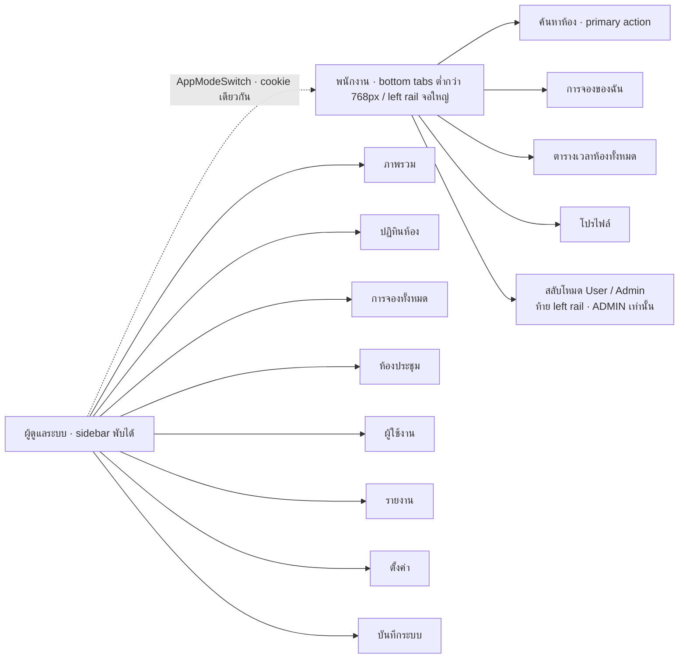

<!-- id: mockups -->
## 10 · หน้าจอและการออกแบบที่ส่งมอบ (As-built UI)

หัวข้อนี้บันทึก UI ที่ใช้งานอยู่ใน `apps/web` และ `apps/admin`: route, action, copy, component, state และข้อกำหนดการเข้าถึงที่ตรวจได้จาก source ปัจจุบัน กฎธุรกิจอยู่หัวข้อ 02 · flow อยู่หัวข้อ 03 · error code อยู่หัวข้อ 06 ภาพ Stitch และ mockup เก่าเป็นเพียงที่มาด้านบุคลิกภาพพาสเทล ไม่ใช่ source of truth

ขอบเขต employee ที่ส่งมอบยึดหลักเดียวกันทุกหน้า: login ใช้ Employee ID, ชุดข้อมูล canonical เริ่มด้วย Horizon/Summit/Grove เท่านั้น, email/mobile/attendee controls ถูกซ่อนจาก employee web, วันที่ใช้ Buddhist date picker ชุดเดียว และ edit/reschedule/check-in แสดงผลใน route เดิม Internal/admin API, credential, attendee, outbox และ `.ics` ยังคงอยู่เป็น backend capability ตามหัวข้อ 02/06 โดยไม่เปิดข้อมูลเหล่านั้นใน employee UI; invite/reset link ยังไม่มี employee landing ใน final build

### 10.1 :icon[browser] รายการหน้าจอ (Screen inventory)

ผังหน้าจอย่อต่อบทบาทอยู่ที่หัวข้อ 01 ระบบทำอะไร — ตารางด้านล่างสรุป behavior ที่ส่งมอบและระบุความสามารถ 1.1 แยกชัดเจน

:::details ตารางหน้าจอและ state ที่ส่งมอบ

| ID | App | หน้าจอ | จุดประสงค์ / primary actions | States | FR / US | สถานะ |
|---|---|---|---|---|---|---|
| E0 | web | Login | `EMPLOYEE ID` + `PASSWORD` + `Remember me` เท่านั้น; ไม่มี email/mobile/forgot-password/self-registration | `INVALID_CREDENTIALS`, `ACCOUNT_LOCKED`, `ACCOUNT_DISABLED`, loading | gate | ส่งมอบ |
| E1 | web | ค้นหาห้อง `/rooms` (หน้าแรกหลัง login) | Horizon/Summit/Grove เท่านั้น การ์ดละภาพและข้อมูล capacity 20, microphone 1, projector 1; ปุ่ม `ค้นหาห้องว่าง` เปิด filter กะทัดรัดซึ่งปิดไว้ก่อน | skeleton; จอใหญ่ 3 คอลัมน์ / มือถือ 1 คอลัมน์ | FR-001/002/011, US-001 | ส่งมอบ |
| E2 | web | ผลค้นหาห้อง (state ใน `/rooms`) | room verdict + reason chips ใน route เดิม; ไม่มี dashboard/home route แยก | empty + slot ว่างถัดไป; แสดง/ซ่อนเหตุผล; error+retry | FR-002/011, US-001 | ส่งมอบ |
| E3 | web | ห้อง & เวลา | รูป/คำอธิบายภาษาไทย, badge `Auto-approve`, capacity/equipment/floor; shared Buddhist date picker; `SlotGrid` 30 นาที + select เริ่ม/สิ้นสุด | วันปิด/เกิน window disabled; room-detail grid ยังไม่ส่ง `past` state แบบ calendar | FR-001/002 | ส่งมอบ; past styling ยังไม่สม่ำเสมอ |
| E4 | web | ฟอร์มจอง | title, description, headcount, private switch, special request; ไม่มี email/mobile/attendee controls; CTA "ยืนยันการจอง" + `Auto-approve` | 409 inline; title มี local field error; 422 อื่นยังเป็น generic alert; submitting + Idempotency-Key | FR-003/004, US-002/007 | ส่งมอบ; server issue→field mapping เป็น gap |
| E5 | web | ผลการจอง / รายละเอียด | `StatusBadge`, timeline, cancellation reason, `.ics`, action ตาม `can`; edit/reschedule เปิด inline; ไม่มี attendee list/resend/email feedback | masked view, conflict/version error, ประชุมเริ่มแล้วล็อกแก้ | FR-008/009 | ส่งมอบ |
| E6 | web | การจองของฉัน | Upcoming/History; quick filter = จองแล้ว/เช็กอินแล้ว/เสร็จสิ้น/ยกเลิกแล้ว; AUTO_RELEASED แสดง "ไม่ได้เช็กอิน" แต่ไม่มี chip; check-in ใช้ `can.check_in` | empty + CTA; local DEV + capability อาจมี "เดโม: ทดลองเช็กอิน" | FR-008/010, US-005/006 | ส่งมอบ |
| E7 | web | Inline reschedule/edit state ใน E5 | preload ค่าเดิม, shared Buddhist date picker + `SlotGrid`, เปลี่ยนห้อง/เวลาโดยไม่ออกจาก detail | 409 คง slot เดิม, `VERSION_CONFLICT` → reload | FR-008, D-13 | ส่งมอบ |
| E8 | web | ยืนยันยกเลิก (native confirmation dialog) | "คืน slot ทันที · กู้คืนไม่ได้"; เหตุผล optional | pending/error ไม่ปิด dialog ก่อน server ตอบ | FR-008, US-005 | ส่งมอบ |
| E9 | web | ตารางเวลาห้องทั้งหมด | 3 ห้อง × 18 แถว; day/week; booking แสดง `ผู้จอง: <ชื่อ>`; private ไม่แสดง title/owner object; elapsed **empty** cell ใช้เทาและเลือกไม่ได้ แต่ elapsed booked cell ยังเป็น busy | loading, empty, error; admin calendar ยังไม่มี past state | FR-001, US-007 | ส่งมอบพร้อม known styling gap |
| E10 | web | Check-in `/check-in/:roomCode` | landing แสดงห้อง/booking และรอ explicit press "เปิดใช้งานการจอง"; ไม่ mutate on mount; success/failure result panel อยู่หน้าเดิม; login แล้วกลับ URL เดิม | `NO_BOOKING_IN_WINDOW`, `CHECKIN_WINDOW_CLOSED`, 404, already checked-in idempotent | FR-010/016, US-006 | ส่งมอบ |
| E11 | web | โปรไฟล์ | ชื่อ รหัสพนักงาน แผนก, เปลี่ยนรหัสผ่าน, font size ปกติ/ใหญ่/ใหญ่มาก, ออกจากระบบ; ไม่มี email/mobile | mutation error/success | NFR-6 | ส่งมอบ |
| E12/13 | web | กระดิ่ง / error states | กระดิ่ง = 1.1; error boundary และ auth redirect ใช้ copy ไทย + action กลับ | — | — | บางส่วน / 1.1 |
| A1 | admin | ภาพรวม | KPI (utilization, การจอง, no-show), "ต้องดำเนินการ", สถานะห้องตอนนี้ | เดือนแรกไม่มีข้อมูล | FR-012 | ส่งมอบ |
| A3 | admin | ปฏิทินห้อง | board เดียวกับ E9 + เห็นชื่อทุกรายการ + เช็กอิน / รายละเอียด; **drag&drop + เมนู "เลื่อนเวลา…" → 1.1** | current build ใช้ inline error; D&D 1.1 ต้อง rollback แล้วแสดง conflict inline | FR-001/010, NFR-4 (Usability) | ส่งมอบ; D&D 1.1 |
| A4 | admin | การจองทั้งหมด | `AdminTable` กรองห้อง/ผู้ใช้/สถานะ/วันที่; ยกเลิก (เหตุผลบังคับ), เช็กอินให้ (`ADMIN` — ถ้า admin คนนั้นเป็น owner/attendee เอง server บันทึกเป็น `SELF`, หัวข้อ 06) | empty filter, pagination | FR-008/010 | ส่งมอบ |
| A5 | admin | รายละเอียดการจอง | = E5 + audit trail + ปุ่ม admin | — | FR-006 | ส่งมอบ |
| A6 | admin | ห้องประชุม | `RoomCard` 3 ห้อง: badge เปิด/ปิดปรับปรุง, แก้ไข / ดูปฏิทิน / QR หน้าห้อง (พิมพ์ป้ายประจำห้อง — MVP, CB-02) | — | FR-011 | ส่งมอบ |
| A7 | admin | แก้ไขห้อง | ชื่อ, คำอธิบาย, ความจุ, ชั้น, feature chips, active/ปิดปรับปรุง, รูป, โน้ตภายใน (เวลาทำการเป็นชุดเดียวทุกห้อง → อยู่ที่ A10, ไม่มี override รายห้อง D-02); Alert "มีผลกับคำขอใหม่เท่านั้น — การจองเดิม N รายการไม่ถูกยกเลิก" (D-26) | ปิดห้องที่มีการจองอนาคต → confirm | FR-011 | ส่งมอบ |
| A8 | admin | ผู้ใช้งาน | ค้นหา, กรอง บทบาท/สถานะ/ทีม, `AdminTable`, `CsvImportDialog` (dry-run → commit) | empty search; import error รายแถว | Deliverable 2 | ส่งมอบ |
| A9 | admin | สร้าง/แก้ไขผู้ใช้ (Sheet) + ปิดใช้งาน | ชื่อ, รหัสพนักงาน, อีเมล, เบอร์, ทีม, บทบาท (FACILITY disabled จนถึง 1.1), active; admin action enqueue ลิงก์ invite/reset แต่ employee landing ถูกซ่อน จึงยังไม่ใช่ flow end-to-end; ปิดใช้งาน = native confirmation dialog บอกผล (ยกเลิกการจองอนาคต, กู้คืนได้, audit คงอยู่) | `VALIDATION_FAILED`, "รอตั้งรหัสผ่าน", `CANNOT_MODIFY_SELF`/`LAST_ADMIN` | Deliverable 2, D-27 | UI/API ส่งมอบ; link landing ไม่เปิด |
| A10 | admin | ตั้งค่า | นโยบายจอง (ขั้น 30, ขั้นต่ำ 60, เพดาน = ไม่มี, ล่วงหน้า 30 วัน, check-in 15/15, reminder 15), เวลาทำการ + วันทำการ (ชุดเดียวทุกห้อง), วันหยุด — หน้าเดียว (settings keys หัวข้อ 05); ฟอร์มถือ `ETag` จาก `GET /settings` แล้วส่งกลับเป็น `If-Match` → ถ้าได้ `409 VERSION_CONFLICT` แสดง "มีผู้อื่นแก้ค่าไปแล้ว" + ปุ่มโหลดใหม่ (ห้าม auto-overwrite — C2-08); กลุ่มคีย์ปฏิบัติการ (check-in/grace/auto-release/reminder) ติดป้าย **มีผลทันทีกับการประชุมที่กำลังจะเกิด** | 409 จาก If-Match | หัวข้อ 02 | ส่งมอบ |
| A11 | admin | รายงาน | ช่วงวันที่ + ห้อง; utilization `<table>` + CSS bar; outcomes; heatmap **ตัวเลขทุกช่อง**; ตัวหารระบุบนหน้า; CSV → 1.1 | no data | FR-012, US-008 | ส่งมอบ; CSV 1.1 |
| A12 | admin | บันทึกระบบ | ตาราง audit อ่านอย่างเดียว | — | Should | ส่งมอบ |
| K3 | — | Facility run-sheet | รายวันต่อห้อง; private masked | — | D-18 | 1.1 |

ข้อความผลเช็กอินยืนยันสถานะ `CHECKED_IN`; การเชื่อมต่อตัวควบคุมประตูจริงอยู่นอกขอบเขตของระบบนี้ เราส่งมอบเฉพาะฝั่งแอป (CB-02)
:::

employee left rail ไม่มี "หน้าแรก": ปุ่มหลักคือ **ค้นหาห้อง** ตามด้วย **การจองของฉัน → ตารางเวลาห้องทั้งหมด → โปรไฟล์**; mobile ใช้สี่ bottom tabs ตามลำดับเดียวกัน `AppModeSwitch` render เฉพาะบัญชี `ADMIN` ที่ท้าย rail และพาไป `/admin/` ส่วน route guard ฝั่ง server ยังคงเป็นด่านสิทธิ์จริง

### 10.2 :icon[tag] โทเค็นการออกแบบ (Design tokens)

พาสเทลเป็น **พื้นหลัง** ส่วน "หมึกบนพาสเทล" + muted + border + focus เข้มพอที่จะผ่าน WCAG 2.2 AA (ข้อความ 4.5:1, UI 3:1) — ตัวเลข contrast ทุกช่องคำนวณจาก relative luminance ห้ามใส่ hex ตรง ๆ ใน component ให้ใช้โทเค็นเท่านั้น

| Token | ค่าที่อยู่ใน `tokens.css` | ใช้กับ | Contrast ที่คำนวณได้ |
|---|---|---|---|
| `--color-ink` / `--color-ink2` | `#1A1C19` / `#424940` | ข้อความหลัก / รอง, หมึกบน neutral | ink 14.71 บน g1 · 13.28 บน r1; ink2 7.97 บน g1 · 7.20 บน r1 |
| `--color-muted` / `--color-bg` | `#596156` / `#F9FAF4` | label/helper · พื้นหน้า | muted 6.42 บน white · 6.12 บน bg |
| `--color-g0` / `--color-g1` / `--color-g2` | `#F6F7E8` / `#EEF0CF` / `#D0D667` | ว่าง · ยืนยัน/เลือก · accent fill | — |
| `--color-g7` | `#5E6300` | primary/olive text และ button | 5.52 บน g1 · 6.44 บน white; white-on-g7 6.44 |
| `--color-y0` / `y1` / `y2` / `y7` | `#FFFAF0` / `#F8E9B9` / `#EDCF83` / `#72530C` | เตือนและ countdown | y7 5.86 บน y1 · 7.10 บน white |
| `--color-r0` / `r1` / `r2` / `r7` | `#FFF5F3` / `#FFDAD6` / `#F2B8B5` / `#93000A` | ไม่ว่าง · conflict · destructive | r7 7.24 บน r1 · 9.35 บน white |
| `--color-surface*`, `--color-n0` / `n1`, `--color-line` | white / `#F4F4EE` / `#EEEEE8`; `#F4F4EE` / `#E2E3DD`; `#D9DED4` | card/soft/strong surfaces; ปิด; slot ที่เวลาผ่านครบแล้ว; เส้นแบ่ง | ใช้ `ink`/`ink2` กำกับ |
| `--color-border-input` | `#7B8278` | ขอบ input/control | 3.96 บน white (SC 1.4.11) |
| focus rule | `2px solid var(--color-g7)`; offset `3px` | ทุก `:focus-visible` | ไม่ใช้ alpha ring |

:::details ความหมายของสี และกฎ "ห้ามสื่อด้วยสีอย่างเดียว"

**ตัดสินครั้งเดียวใช้ทั้งระบบ**: เขียว = ว่าง / CONFIRMED / CHECKED_IN · เหลือง = เตือน / countdown · แดง = ไม่ว่าง / ชนกัน / ยกเลิก / AUTO_RELEASED · เทา = เสร็จสิ้น / ปิดห้อง / เวลาผ่านแล้ว โดยทุกสถานะต้องมีข้อความหรือ icon กำกับ

- `StatusBadge` = fill + icon (lucide, `aria-hidden`) + ข้อความไทย
- cell ใน `SlotGrid`: ว่าง · ไม่ว่าง · เลือกแล้ว · เวลาผ่านแล้ว (`n1`, disabled) แต่ละแบบมี accessible label ไม่พึ่งสีอย่างเดียว
- heatmap พิมพ์ตัวเลขทุกช่อง — พาสเทลต่อพาสเทลต่างกันราว 1.0–1.1:1 แยกด้วยสีไม่ได้อยู่แล้ว
- label domain/admin: `CONFIRMED` ยืนยันแล้ว · `AUTO_RELEASED` ปล่อยอัตโนมัติ; label employee ทุก surface: `CONFIRMED` จองแล้ว · `AUTO_RELEASED` ไม่ได้เช็กอิน; อีกสามสถานะใช้ เช็กอินแล้ว · เสร็จสิ้น · ยกเลิกแล้ว เหมือนกัน
:::

:::details ตัวอักษรและระยะ (Typography)

**Noto Sans Thai** self-host ผ่าน `@fontsource-variable/noto-sans-thai` เป็น font หลักของทั้งผลิตภัณฑ์; หน้า login ใช้ utility `.font-login` ที่ชี้ไป self-hosted **Inter Variable** แล้ว fallback Arial ตามภาพอ้างอิง โดยจำกัด scope ไม่ให้ภาษาไทยส่วนอื่นเปลี่ยนตาม

- base **16 px = 1 rem และทุกขนาดเป็น rem**; body ≥ 14 px, caption ≥ 12 px; น้ำหนัก 400/600/700; line-height 1.6 body / 1.3 heading
- **ห้าม letter-spacing ติดลบกับภาษาไทย** (วรรณยุกต์ชนกัน); `lang="th"`; `tabular-nums` ใน grid/ตาราง/countdown
- **สวิตช์ขนาดตัวอักษร ปกติ/ใหญ่/ใหญ่มาก** = `html{font-size:100%|112.5%|125%}` เก็บใน localStorage (E11 + user menu ฝั่ง admin) — ตอบ NFR-6 ด้วย CSS บรรทัดเดียว
- มุม 10–20 px, เงาอ่อน, gradient เฉพาะหน้า auth; ไม่มี dark mode ใน MVP
:::

:::details ทำไมหมึก 4 ตัวถึงเข้มกว่าพาสเทลเดิม (4 ค่า)

ค่าจากภาพอ้างอิงอ่อนเกินไปสำหรับข้อความ/ขอบ control จึงใช้ชุด olive ที่อยู่ใน `packages/ui/src/tokens.css` ตามตารางด้านบน การคำนวณ contrast ใช้ sRGB relative luminance; automated axe/visual regression ยังเป็น future validation ตาม §10.5 จึงต้องตรวจซ้ำเมื่อแก้ token ใด ๆ
:::

### 10.3 :icon[check] การตัดสินใจ UX ที่ส่งมอบ (Implemented UX decisions)

รายการนี้อธิบายเหตุผลของ behavior ที่อยู่ใน source ปัจจุบัน ไม่ใช่ backlog ก่อน production ID เดิมคงไว้เพื่อให้ ticket และการตัดสินใจย้อนหลังอ้างอิงได้

backlog UX ฉบับเต็ม 42 ข้ออยู่ที่ `docs/build/research/uiux.md`; ที่ไม่ได้ยกมาคือข้อที่ไม่เปลี่ยนพฤติกรรมของหน้าจอ

:::details ตารางรายการแก้ (17 ข้อ)

| ID | กลุ่ม | แก้เป็น | WHY |
|---|---|---|---|
| UX-01 | Login | เหลือ 2 ช่อง `EMPLOYEE ID` + `PASSWORD`; error รวม "รหัสพนักงานหรือรหัสผ่านไม่ถูกต้อง" + ข้อความแยกกรณีบัญชีถูกปิด; email/mobile ไม่แสดงเป็น login field | ลด friction และไม่ leak ว่า code ใดมีบัญชี (D-09) |
| UX-02 | Login | ไม่มีหน้าสมัคร/forgot/set-password ใน employee web; token/outbox ยังอยู่ใน internal/admin API แต่ link ไม่มี employee landing | canonical accounts มาจาก initializer; ห้ามอ้าง invite/reset ว่าใช้งาน end-to-end จนกว่าจะคืน route หรือเชื่อม identity workflow (D-08/D-09) |
| UX-03 | Booking flow | ทุก date field ใช้ `ThaiDatePickerField` ที่ lazy-load `@daypicker/buddhist` + `@daypicker/react`; UI เป็น พ.ศ., controlled value/API/URL เป็น Gregorian `YYYY-MM-DD`, Monday-first, `Asia/Bangkok`; select เริ่ม/สิ้นสุดผูกกัน | calendar และ disabled rules เหมือนกันใน search, room detail และ inline reschedule |
| UX-04 | Booking flow | `/rooms` แสดง Horizon/Summit/Grove เท่านั้น (capacity 20 + microphone/projector อย่างละ 1); filter card ปิดไว้ก่อน; ตัด Manual/Pending approval pill แต่คง badge `Auto-approve` บน E3/E4 | บอกชัดว่าจองสำเร็จทันทีโดยไม่ทำให้เข้าใจว่ามี approval queue |
| UX-05 | Booking flow | Empty state ห้องว่าง = slot ว่างถัดไปของแต่ละห้อง | สิ่งเดียวที่ช่วยผู้ใช้เมื่อผลเป็นศูนย์ |
| UX-06 | Booking flow | หลัง submit ไป E5 และแสดง "จองสำเร็จ"/"จองแล้ว" โดยไม่พูดถึง email delivery; attendee/email controls ไม่ render | employee feedback บอกผล transaction ที่รู้แน่นอน ส่วน outbox เป็น backend concern |
| UX-07 | Slot picker | `SlotGrid` 18 cell × 30 นาที 08:30–17:30; click/แตะ cell เพื่อเริ่มช่วงขั้นต่ำ 60 นาที แล้ว click cell ต่อไปหรือใช้ `Shift+↑/↓` เพื่อขยาย/ย่อ; native select เริ่ม/สิ้นสุดใต้ grid สะท้อน state เดียวกัน | interaction ที่ส่งมอบเป็น click + keyboard + select fallback ไม่มี pointer-drag dependency |
| UX-08 | Slot picker | Buddhist picker ปิดวันนอกช่วง; employee calendar ทำ elapsed empty cell เป็น `past`. Room detail/reschedule/admin calendar ยังไม่ใช้ state เดียวกัน | known consistency gap; server ยังคงปฏิเสธเวลาที่ผ่านแล้ว |
| UX-09 | Conflict | 409 `SLOT_UNAVAILABLE` render ด้วย custom `ConflictAlert` inline เหนือ CTA พร้อมปุ่มเลือกเวลาอื่น/ห้องอื่นจาก `details.alternatives`; ไม่ใช้ toast | conflict ต้องคงอยู่ให้ผู้ใช้ตัดสินใจ ไม่หายตาม timeout |
| UX-11 | Private | controlled `<button role="switch">` + `aria-checked` และ copy "ประชุมส่วนตัว — ผู้อื่นเห็นเพียง 'ไม่ว่าง'; ผู้จัด ผู้เข้าร่วม และ Admin ยังเห็นรายละเอียด" | component ใช้ React state + native semantics ไม่มี form/switch library |
| UX-12 | Reschedule/Cancel | "แก้ไข"/"เลื่อนเวลา" เปิด controlled inline panel E7 ใน E5 ไม่ navigate ไป calendar; ยกเลิกใช้ native `<dialog>` copy "คืน slot ทันที · กู้คืนไม่ได้" | รักษาบริบทห้อง/เวลาเดิมและใช้ `showModal()` สำหรับ Esc/focus containment โดยไม่อ้าง email/attendee |
| UX-15 | States | skeleton/empty/error/success เป็น React markup ในหน้าเดิม; server error ใช้ `role="alert"`, async status ใช้ `aria-live`; irreversible action ใช้ native `<dialog>`; ไม่มี toast/sonner dependency | feedback ที่สำคัญไม่หายเองและ source ปัจจุบันควบคุม state ด้วย component state + TanStack Query mutation state |
| UX-16 | Thai copy | ไม่มี ค่ะ/ครับ/นะคะ ("สวัสดี, วิโนทัย"); หัวข้อเป็นไทย (ห้องว่าง ไม่ใช่ Available Rooms); ศัพท์ที่ผู้ใช้พูดอยู่แล้วคง EN (Projector, Check-in, .ics); error/status/shared copy รวมไว้ใน `apps/web/src/lib/i18n.ts` และ `apps/admin/src/lib/i18n.ts` ของแต่ละ app | เสียงระบบต้องเป็นเสียงเดียว ไม่ปนสองภาษา และสอง bundle ต้องใช้คำสถานะตามบทบาทของตน |
| UX-17 | Dates | พ.ศ. ผ่าน `formatThaiDate()` ของแต่ละ app ("26 ส.ค. 2569", ละปีเมื่อเป็นปีปัจจุบันใน list); 24 ชม. zero-padded, en-dash "08:30–17:30"; ไม่แสดง +07:00 | หัวข้อ 02 BR-12 |
| UX-18 | Responsive | employee: bottom tabs < 768 px, ตาราง → การ์ดซ้อน, grid → list, ฟอร์มคอลัมน์เดียว; admin: sidebar พับได้, `AdminTable` scroll ในกรอบตัวเอง | ใช้งานได้ที่ 320 px และ zoom 200% โดยไม่บังคับ page-level min-width |
| UX-19 | Nav IA | employee rail = ค้นหาห้อง → การจองของฉัน → ตารางเวลาห้องทั้งหมด → โปรไฟล์ ไม่มีหน้าแรก; `AppModeSwitch` อยู่ท้าย rail และ render เฉพาะ ADMIN; admin nav มี route จริงครบ | ป้องกัน dead link และให้ admin สลับบทบาทการใช้งานโดยไม่ logout |
| UX-20 | Icons/Reports | `lucide-react` สำหรับ icon ทั่วไป; report ใช้ semantic `<table>` + CSS/SVG bar; QR ป้ายห้องใช้ `uqr` render inline SVG ขาวดำพร้อม accessible label | ไม่มี chart/component library และ QR สำหรับพิมพ์ต้องคมชัด/contrast สูง |
:::

### 10.4 แผนที่ component ที่ส่งมอบ (As-built component map)

UI ใช้ controlled native HTML + custom React components แต่งด้วย Tailwind และโทเค็นใน `packages/ui` ไม่มี shadcn/Radix, React Hook Form, sonner หรือ TanStack Table ใน dependency graph. `@tanstack/react-query` จัดการ server/mutation state และ `@tanstack/react-router` จัดการ route/search state เท่านั้น Calendar board เป็น custom `SlotGrid`; date field ใช้ `ThaiDatePickerField`; QR ใช้ `uqr`

:::details ตารางแมป component ที่ใช้งาน

| Component | ฐาน | ใช้ที่ | หมายเหตุ |
|---|---|---|---|
| Form controls | native `<button>`, `<input>`, `<textarea>`, `<select>`, `<label>` + controlled React state | Login, QuickSearch, E4/E5/E7, admin forms/filters | validation/error state อยู่ใน component; ไม่มี RHF/form component library |
| `ConfirmDialog`, `CsvImportDialog`, `Sheet`, date dialog | native `<dialog>` + `showModal()` | E8, admin destructive actions/import/drawer, date picker | platform ให้ modal focus containment/Esc; component กำหนด initial safe focus, close/reset และ focus return |
| `ConflictAlert`, `InlineAlert`, inline result/status panels | custom React markup + `role="alert"`/`role="status"`/`aria-live` | E4/E7 409, admin server errors, E10 result, mutation feedback | ไม่มี toast/sonner; feedback สำคัญอยู่จนผู้ใช้แก้หรือปิดเอง |
| `AdminTable`, pager และ filters | semantic native `<table>` + controlled query/search params | A4, A8, A12 และ CSV preview | scroll region มีชื่อ/โฟกัส; sorting/filter/pagination ฝั่ง server ไม่มี TanStack Table |
| `ThaiDatePickerField` | lazy `@daypicker/buddhist` + `@daypicker/react` | Quick search, E3, inline E7 | พ.ศ. บนจอ; Gregorian `YYYY-MM-DD` ใน state/URL/API; disabled matcher ชุดเดียว |
| `StatusBadge` | custom | ทุกที่ที่โชว์ `BookingStatus`/room status | enum → label+icon+token ที่เดียว |
| `SlotGrid` | custom CSS grid, `role="grid"`/row/gridcell, roving tabindex, click + keyboard + `aria-live` | E3, inline E7, E9/A3 | component รองรับ `past`, แต่ current routes ส่ง state นี้ไม่ครบทุก grid; native selects เป็น fallback; admin ไม่มี drag/drop dependency |
| `RoomCard`, `RoomPhoto`, `BookingStatusBadge` | custom controlled React components | E1/E2/E3/E5 และ admin rooms | initializer ทำให้ catalogue เริ่มด้วย Horizon/Summit/Grove; API/UI ยังรองรับห้อง active ที่ admin เพิ่มภายหลัง; employee status map แยกจาก domain/admin labels |
| `AppModeSwitch` | `packages/ui`, native `<nav>` + `<a>` | ท้าย rail ของ employee/admin | render เฉพาะ role `ADMIN`; plain anchors ใช้ข้ามสอง router bundles (`/rooms` ↔ `/admin/`) |
| `QrCode` | `uqr` encoder + inline semantic SVG | admin ป้าย QR ประจำห้อง | ECC M, quiet zone 4, black-on-white; ไม่มี raw HTML หรือ QR endpoint |
| `Countdown`, font-scale, shells/pagers/empty cards | custom React + native controls | employee/admin shared interaction | countdown/status ใช้ `aria-live`; font scale เก็บ local preference |
| Chart/Heatmap | semantic `<table>` + CSS/SVG bar | A11 | ไม่มี chart library |
:::

### 10.5 :icon[users] การเข้าถึง (Accessibility)

เป้าหมาย **WCAG 2.2 AA** ตอบ NFR-6 ("ปรับขนาดตัวอักษรและ contrast … ผู้อาวุโสเห็นปฏิทินชัด") Source ปัจจุบันมี semantic roles/labels/focus behavior ตามตาราง แต่ในรอบเอกสารนี้ตรวจเพียง source review และการทดสอบมือที่ระบุไว้ การเพิ่ม axe/Playwright เป็น future validation gate จนกว่าจะมีผลรันจริง ห้ามถือว่า CI ตรวจอัตโนมัติแล้ว

ข้อที่ละเอียดที่สุดคือ **A11Y-05 สัญญาของ `SlotGrid`** ซึ่ง markup/keyboard handler รองรับแล้ว ส่วน VoiceOver/zoom/automated-browser verification ยังต้องบันทึกผลแยกก่อนอ้างว่าผ่านครบ

:::details ตารางเกณฑ์การเข้าถึง (10 ข้อ)

| ID | ข้อกำหนด | ทำอย่างไร | ตรวจ |
|---|---|---|---|
| A11Y-01 | Contrast ข้อความ ≥ 4.5:1, UI ≥ 3:1 | โทเค็น 10.2; QR ยกเว้นโดยเจตนาเป็นขาวดำเพื่อการสแกน | ค่าตาราง + manual visual review; axe = future |
| A11Y-02 | ตัวอักษร/zoom 200%, reflow 320 px ไม่มี horizontal scroll ระดับหน้า | rem, responsive grid, font-scale; ตาราง scroll ใน region ของตัวเอง | manual 320 px/zoom; Playwright = future |
| A11Y-03 | สถานะไม่พึ่งสีอย่างเดียว | `StatusBadge`/`SlotGrid` มี text/icon/border, heatmap มีตัวเลข | source review + manual; axe = future |
| A11Y-04 | Focus visible | outline token 2 px; native controls/dialog focus | manual keyboard walk |
| A11Y-05 | `SlotGrid` ใช้ keyboard และ screen reader ได้ | `role=grid` + row/gridcell; roving tabindex; ←→/↑↓, Home/End, Ctrl+Home/End, Enter/Space, Shift+↑↓, Esc; accessible name = "ห้อง เวลา สถานะ"; `aria-live=polite`; native select fallback | source review; manual E3 + VoiceOver ยังต้องบันทึก; browser e2e = future |
| A11Y-06 | การเลื่อนเวลามี path ไม่ใช้ pointer | E5 เปิด inline E7 ที่ใช้ date picker + grid + native selects; admin drag/drop ยังไม่อยู่ใน current build | manual keyboard path; D&D verification เมื่อส่ง 1.1 |
| A11Y-07 | Dialog / ฟอร์ม | native `<dialog>` ให้ modal focus containment/Esc; component คืน focus; `<label for>` และ `aria-describedby`/`role=alert` ตาม field | source review + manual; axe = future |
| A11Y-08 | Target size ≥ 24 px; touch target หลัก ≥ 44 px | Tailwind size/min-height classes บน bottom tabs, slot cell, row action | manual measurement/review |
| A11Y-09 | โครงสร้าง | `<nav aria-label>`, `aria-current`, landmarks, `lang=th`, reduced-motion-compatible UI | source review; automated axe = future |
| A11Y-10 | ชาร์ต/heatmap มี text alternative | semantic table เป็นข้อมูลหลักและ bar เป็น decoration | source review + manual screen-reader check pending |
:::
