# ReserveFlow — E2E Test Plan (browser-use)

Browser-driven end-to-end scenarios for the employee SPA (`apps/web`) and admin SPA (`apps/admin`), executed with the `browser-use` CLI. Grounded in `docs/spec/sections/` (screen IDs E0–E13 / A1–A12, FR/BR/TC references are the spec's own).

**Reality check:** the repo is W0 — only Suite 0 is runnable today. Each later suite lists the tickets that unlock it; run a suite the moment its feature lands.

## Harness

- **Single origin, always.** Login sets `__Host-sid` (Secure, no `Domain`), which silently fails to set across split dev ports. Run E2E against the API's static-serving mode: `pnpm build`, then the API on `http://localhost:3000` serving `/`, `/admin/`, and `/api/*` (localhost is a secure context, so the cookie sets). Never test auth against 5173/5174.
- **Stack:** `docker compose --env-file .env -f infra/compose.yml up -d --wait` (postgres + Mailpit).
- **Roles = named browser-use sessions** (isolated cookie jars, may run concurrently):
  - `browser-use --session emp-a …` / `--session emp-b …` / `--session admin …`
- **Email asserts via Mailpit REST** (`curl localhost:8025/api/v1/messages`), polling up to ~30 s — the outbox sender runs on a ~10 s cadence, so arrival is never synchronous with the UI action. Drive the Mailpit web UI in the browser only when clicking links inside an email (e.g. set-password).
- **Seed script** (exists once the W1 schema lands): 1 admin, employees `emp-a`/`emp-b`, 1 throwaway user, 3 rooms, and fixture bookings with timestamps computed **relative to seed time** — this is what makes check-in-window and auto-release scenarios testable without waiting in real time. Truncate + reseed between suites. AUTH-09 (lockout) runs last; it poisons rate-limit state.
- **Assert Thai UI copy or error-code testids, never raw API `message` strings** — the spec requires the UI translate `code` via one i18n table.
- **Evidence:** screenshot per assertion into a run directory; final results table per suite.
- **Execution model:** suites are handed to subagents/Codex runs driving the `browser-use` CLI from self-contained scenario scripts (computer use is delegated, per orchestration policy); the orchestrator spot-checks screenshots and synthesizes the report.

Typical scenario mechanics:

```bash
browser-use --session emp-a open http://localhost:3000/login
browser-use --session emp-a state                 # discover element indices
browser-use --session emp-a input 3 "EMP001"
browser-use --session emp-a input 4 "correct horse Kb!"
browser-use --session emp-a click 5
browser-use --session emp-a screenshot run/auth-01-after-login.png
browser-use close --all                           # end of run
```

---

## Suite 0 — Smoke (runnable today)

No login, no seed. Verifies the W0 scaffold's serving contract.

### SMK-01 · Health probes

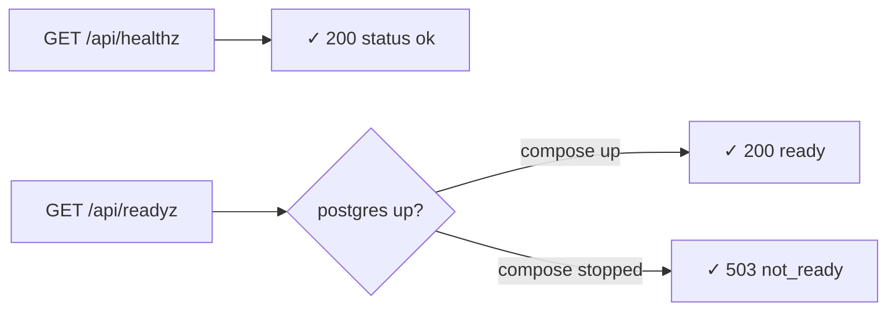

### SMK-02 · Web shell renders

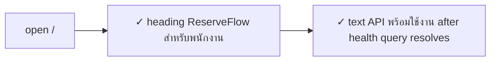

### SMK-03 · Admin shell renders

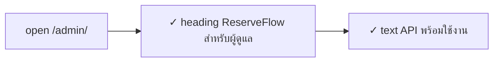

### SMK-04 · SPA fallback vs API 404

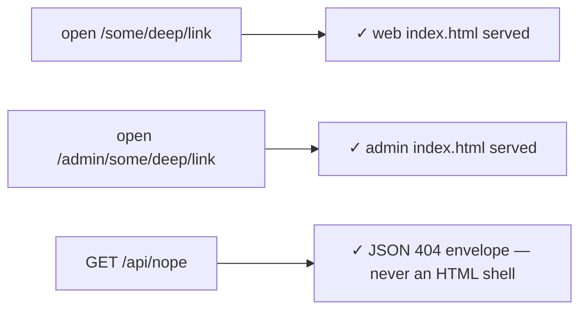

### SMK-05 · Canonical-host redirect (curl, not browser)

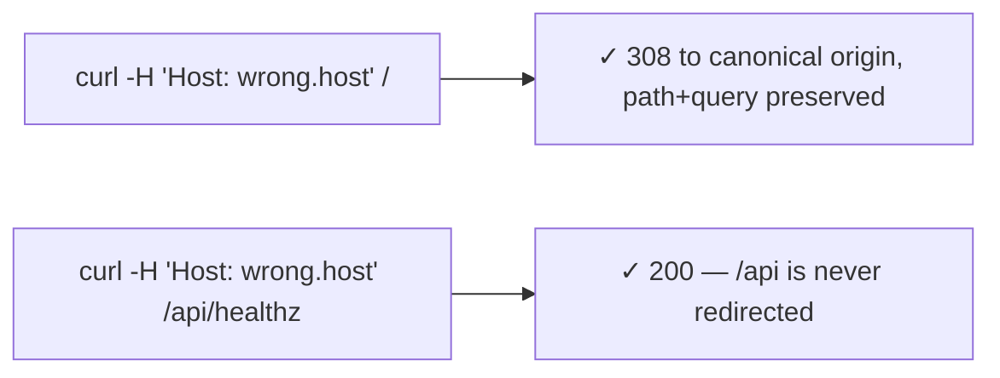

---

## Suite 1 — Auth & sessions

**Unlocks with:** T-012 (login/session), T-013 (set-password tokens), T-017 (web shell + auth pages), T-018 (admin shell).

### AUTH-01 · Login success via employee_code

Employee code is the only accepted sign-in identity. Email remains internal account data and
mobile remains optional profile data; neither is accepted by the sign-in endpoint.

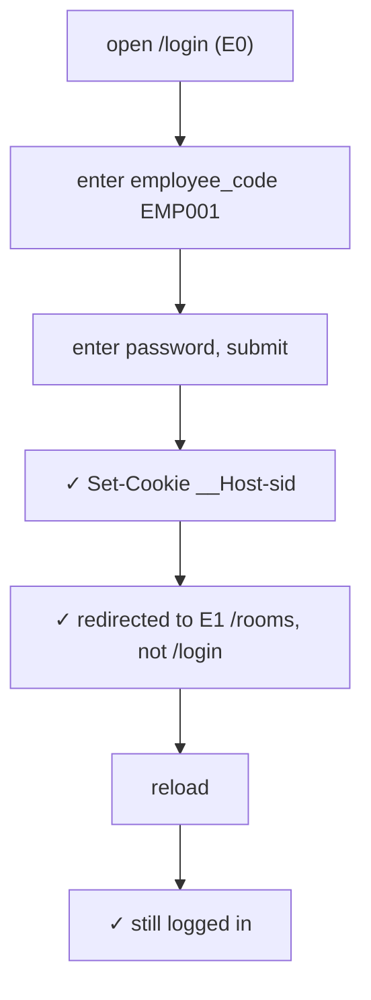

### AUTH-02 · Invalid credentials — merged message, no enumeration

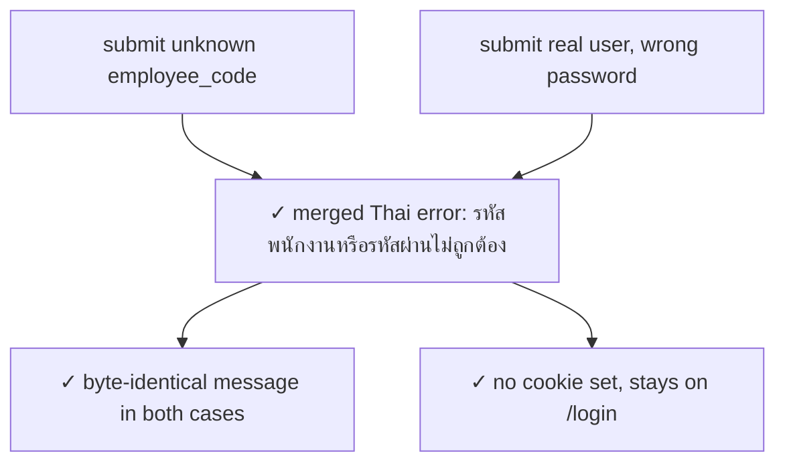

### AUTH-03 · Remember-me cookie attributes

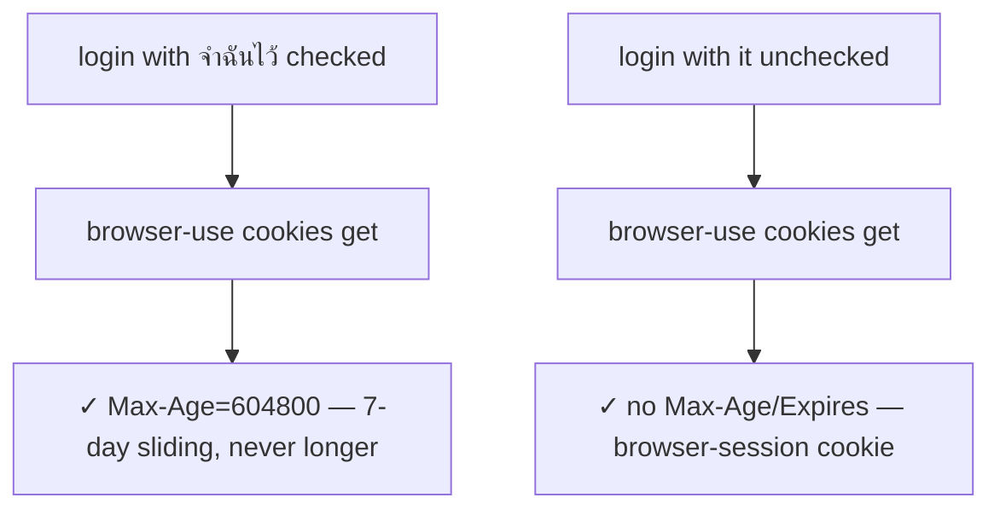

### AUTH-04 · Logout revokes server-side

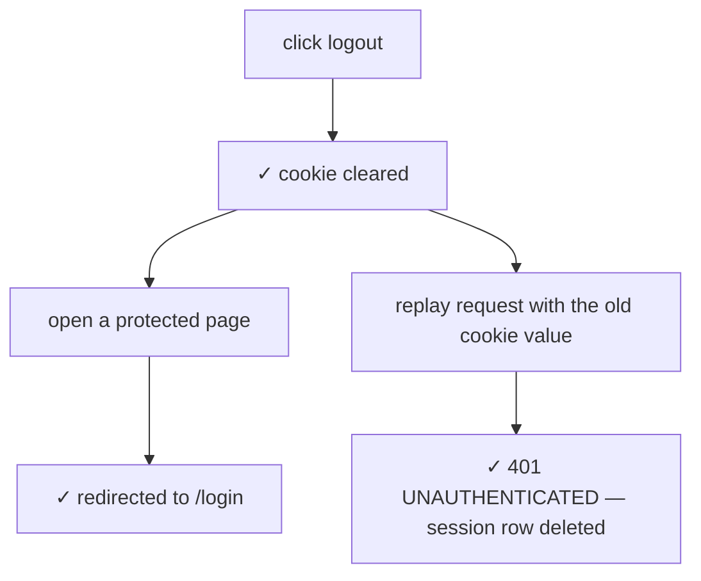

### AUTH-05 · Protected deep link → login → return to original URL

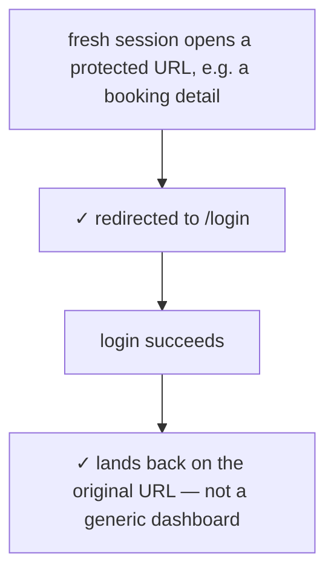

### AUTH-06 · Employee cannot reach the admin surface

The spec's authorization matrix hides existence: **404, not 403**. Asserting 403 would be a wrong test. No "access denied" screen is specced for the `/admin` shell — assert API responses only.

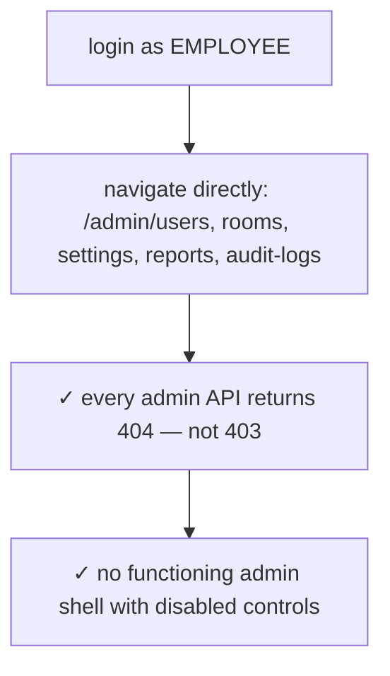

### AUTH-07 · Invite → set-password → first login (with ADM-02)

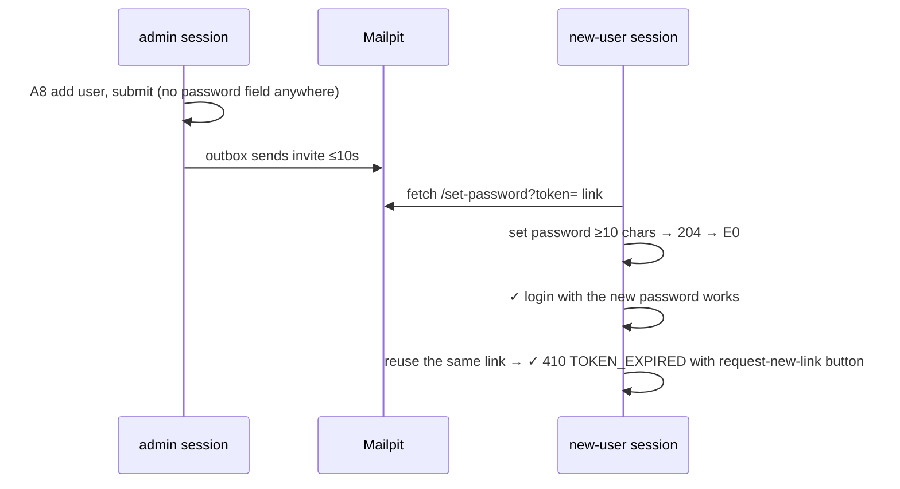

### AUTH-08 · Forgot password always 202

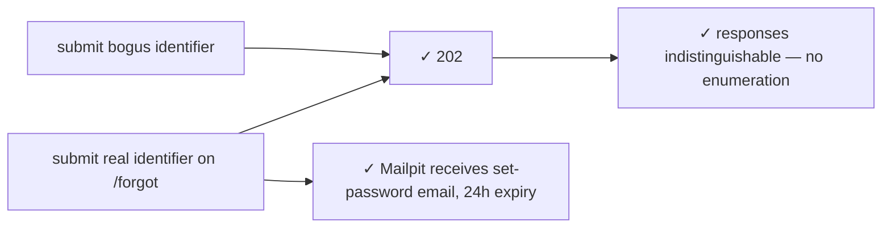

### AUTH-09 · Lockout after 5 failures (throwaway user, run last)

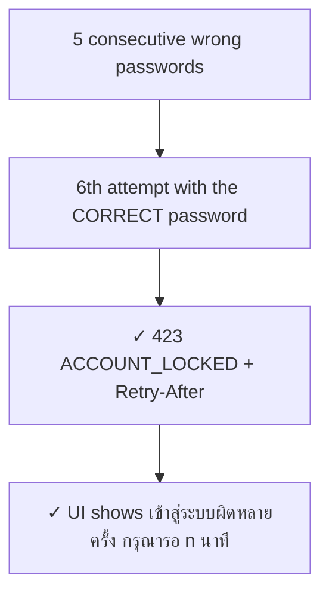

---

## Suite 2 — Employee booking

**Unlocks with:** T-020…T-036 (availability, calendar, booking CRUD).

### EMP-01 · Search with filters — reasons shown, never hidden

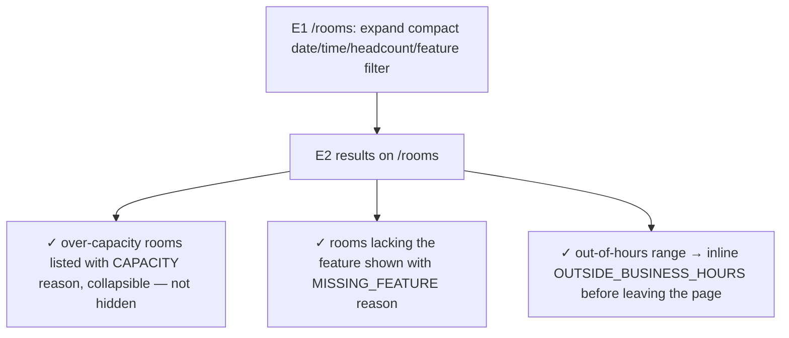

### EMP-02 · Calendar day/week, state survives reload

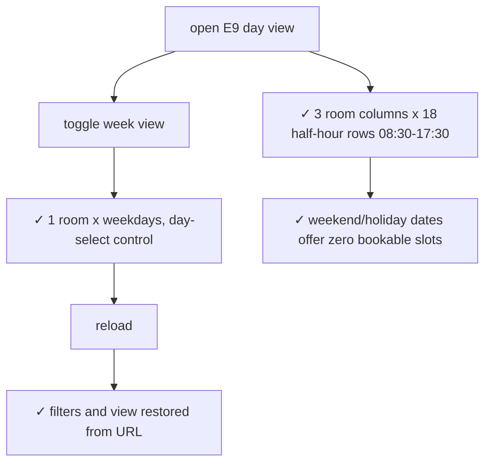

### EMP-03 · Create booking happy path + confirmation email

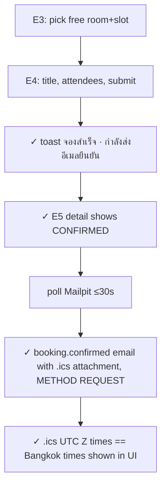

### EMP-04 · Validation matrix — inline Thai errors, no navigation

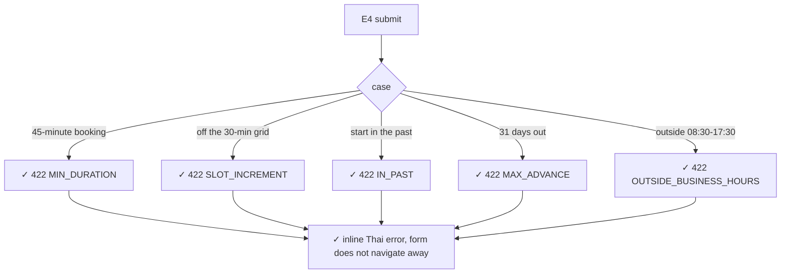

### EMP-05 · Capacity overage warns but never blocks (D-30c)

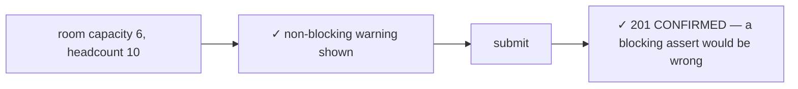

### EMP-06 · Double-click submit — one booking

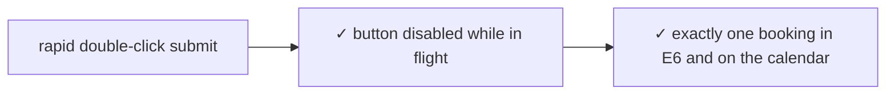

### EMP-07 · Edit details — email rules

```mermaid
flowchart TD
    A["edit title only"] --> B["✓ NO new email in Mailpit (D-30e)"]
    C["add attendee"] --> D["✓ .ics METHOD REQUEST to the new attendee"]
    E["remove attendee"] --> F["✓ .ics METHOD CANCEL to the removed attendee"]
    A & C & E --> G["✓ status stays CONFIRMED, version increments"]
```

### EMP-08 · Reschedule — success and conflict leave no half-state

```mermaid
flowchart TD
    A["E7: pick a free new slot, save"] --> B["✓ 200, new time, still CONFIRMED"]
    B --> C["✓ Mailpit booking.rescheduled, .ics SEQUENCE incremented"]
    D["E7: pick an occupied slot"] --> E["✓ 409 inline alert — not a toast — original time still displayed"]
    E --> F["refetch detail"] --> G["✓ original time and version untouched"]
    E --> H["✓ no email fired for the failed attempt"]
```

### EMP-09 · Cancel — slot frees immediately (two sessions)

```mermaid
sequenceDiagram
    participant A as emp-a
    participant B as emp-b
    participant MP as Mailpit
    A->>A: E8 dialog, confirm cancel
    A->>A: ✓ status CANCELLED immediately, no undo offered
    B->>B: search the same room+time
    B->>B: ✓ slot available right away
    A->>MP: poll ≤30s
    MP-->>A: ✓ attendees receive .ics METHOD CANCEL
```

### EMP-10 · Private booking masking is server-side

```mermaid
sequenceDiagram
    participant A as emp-a owner
    participant B as emp-b
    participant AD as admin
    A->>A: create booking with private switch on
    B->>B: E9 calendar → ✓ cell shows ไม่ว่าง + owner_display_name, no private title/owner object
    B->>B: open detail by direct URL → ✓ 200 BUSY-level view, not 403/404
    AD->>AD: A5 → ✓ full detail + ส่วนตัว badge — proves masking is the serializer, not CSS
```

---

## Suite 3 — Cross-role choreography

Needs Suites 1–2 features. This is where the named browser-use sessions earn their keep.

### X-01 · Double-booking race — exactly one winner

Which session wins is nondeterministic; assert the *shape*: one 201, one 409.

```mermaid
sequenceDiagram
    participant A as emp-a
    participant B as emp-b
    participant API
    par simultaneous submit
        A->>API: POST booking, room 1, same slot
        B->>API: POST booking, room 1, same slot
    end
    API-->>A: 201 CONFIRMED
    API-->>B: 409 SLOT_UNAVAILABLE + alternatives
    B->>B: ✓ inline alert names room+time, alternatives clickable
    A->>A: ✓ calendar shows exactly one booking in the slot
```

### X-02 · Version conflict — no silent overwrite

```mermaid
sequenceDiagram
    participant T1 as emp-a tab 1
    participant T2 as emp-a tab 2
    T1->>T1: edit booking, save → ✓ 200, version bumps
    T2->>T2: save the stale form
    T2->>T2: ✓ 409 VERSION_CONFLICT with reload prompt
    T2->>T2: reload → ✓ tab 1's value preserved
```

### X-03 · Deactivation kills the live session immediately

Observes the spec's nuance black-box: `banned=true` alone doesn't revoke — the deleted session row does.

```mermaid
sequenceDiagram
    participant E as emp-a
    participant AD as admin
    E->>E: logged in, browsing
    AD->>AD: A9 deactivate emp-a, confirm dialog
    AD->>AD: ✓ response lists the bookings being cancelled
    E->>E: very next navigation
    E->>E: ✓ 401 → bounced to /login promptly, not on expiry
    E->>E: re-login → ✓ 403 บัญชีถูกปิดใช้งาน ติดต่อ Admin
    AD->>AD: ✓ future bookings CANCELLED reason OWNER_DISABLED
    AD->>AD: ✓ an already-started booking is untouched
```

### X-04 · Change password revokes the other session

```mermaid
sequenceDiagram
    participant S1 as session 1
    participant S2 as session 2
    S1->>S1: login as emp-a
    S2->>S2: login as emp-a
    S1->>S1: E11 change password → ✓ 200
    S2->>S2: next request → ✓ 401, bounced to /login
```

### X-05 · Settings stale save (ETag/If-Match)

```mermaid
sequenceDiagram
    participant T1 as admin tab 1
    participant T2 as admin tab 2
    T1->>T1: A10 change a value, save → ✓ ok
    T2->>T2: save the stale form
    T2->>T2: ✓ conflict มีผู้อื่นแก้ค่าไปแล้ว + reload button
    T2->>T2: reload → ✓ tab 1's value preserved, never overwritten
```

---

## Suite 4 — Admin

**Unlocks with:** T-014 (users API), T-018 (admin shell), T-054…T-058 (bookings admin, reports, settings, audit).

### ADM-01 · Cancel someone's booking — reason mandatory

```mermaid
flowchart TD
    A["A4: open another employee's CONFIRMED booking"] --> B["cancel → reason dialog"]
    B --> C["confirm with empty reason"] --> D["✓ confirm disabled / 422 REASON_REQUIRED"]
    B --> E["type reason, confirm"] --> F["✓ CANCELLED immediately, slot free"]
    F --> G["✓ owner's email contains the admin's reason text"]
    F --> H["✓ A12 audit row with actor + reason"]
```

### ADM-02 · Invite user — admin never touches a password

```mermaid
flowchart TD
    A["A8 add user → A9 drawer"] --> B["employee_code, name, email, department, role"]
    B --> C["✓ no password field exists anywhere in the form"]
    B --> D[submit] --> E["✓ new row, status รอตั้งรหัสผ่าน INVITED"]
    D --> F["resubmit same code/email"] --> G["✓ 409 ALREADY_EXISTS inline on the offending field"]
```

### ADM-03 · CSV import — dry-run then idempotent commit

```mermaid
flowchart TD
    A["upload CSV"] --> B["✓ dry-run preview per row, nothing changed yet"]
    B --> C["confirm import"] --> D["✓ create/update/skip/error counts match preview"]
    D --> E["re-import the same file"] --> F["✓ 0 new users — idempotent by employee_code"]
    A --> G["file over 2MB"] --> H["✓ 413"]
    A --> I["malformed header"] --> J["✓ 400 before any row is processed"]
    B --> K["✓ bad rows marked ERROR and skipped; valid rows still commit"]
```

### ADM-04 · Reactivate and hard-delete guards

```mermaid
flowchart TD
    A["open a DISABLED user"] --> B[reactivate]
    B --> C["✓ back to ACTIVE — cancelled bookings NOT restored"]
    D["user with zero booking/audit history"] --> E["delete"] --> F["✓ row gone permanently"]
    G["user with any history"] --> H["✓ delete hidden/blocked — 409 USER_HAS_HISTORY, hint to deactivate"]
```

### ADM-05 · Self and last-admin guards

```mermaid
flowchart LR
    A["admin deactivates own account"] --> B["✓ 409 CANNOT_MODIFY_SELF"]
    C["deactivate/demote the last ACTIVE admin"] --> D["✓ 409 LAST_ADMIN"]
```

### ADM-06 · Room edit + photo limits, no retroactive cancels

```mermaid
flowchart TD
    A["A7 change capacity, save"] --> B["✓ card updates + note มีผลกับคำขอใหม่เท่านั้น"]
    C["upload normal jpeg/png/webp"] --> D["✓ preview appears on A7 and room card"]
    E["file over 5MB"] --> F["✓ 413"]
    G["unsupported type"] --> H["✓ 415"]
    I["deactivate a room with future bookings"] --> J["✓ warning dialog lists affected bookings — nothing auto-cancelled"]
```

### ADM-07 · Business hours / holidays affect new bookings only

```mermaid
flowchart TD
    A["shrink hours or add a holiday"] --> B["✓ slot picker stops offering the closed window for new bookings"]
    A --> C["✓ existing CONFIRMED booking inside the closed window stays CONFIRMED"]
    C --> D["✓ admin sees a warning list with links to cancel manually"]
```

### ADM-08 · Reports render as real tables

```mermaid
flowchart TD
    A["A11: pick range + room"] --> B["✓ utilization is an actual table, numbers as text not color-only"]
    B --> C["✓ heatmap: every cell carries a number"]
    B --> D["✓ outcome totals internally consistent for the range"]
    A --> E["empty range"] --> F["✓ clear no-data state, not a broken table"]
```

### ADM-09 · Audit log read-only, nothing sensitive

```mermaid
flowchart TD
    A["A12: filter by date/actor/entity"] --> B["✓ no edit/delete controls anywhere"]
    B --> C["✓ diffs never show password_hash or mobile"]
    A --> D["filter to zero matches"] --> E["✓ empty state, not an error"]
```

---

## Suite 5 — Lifecycle & check-in

**Unlocks with:** check-in tickets + sweep job. Requires seeded bookings with relative timestamps.

### LIF-01 · QR deep link while logged out — the canonical return-URL case

```mermaid
flowchart TD
    A["logged out, open /check-in/:roomCode"] --> B["✓ redirected to /login"]
    B --> C[login] --> D["✓ returned to /check-in/:roomCode — not a dashboard"]
    D --> E["seeded booking is inside its check-in window"] --> F["✓ success modal, status CHECKED_IN"]
```

### LIF-02 · Re-check-in is idempotent

```mermaid
flowchart LR
    A["check in again on the same booking"] --> B["✓ already-checked-in modal — 200, not an error toast"]
```

### LIF-03 · Outside the window

```mermaid
flowchart LR
    A["open check-in link before/after the window"] --> B["✓ 422 CHECKIN_WINDOW_CLOSED showing opens_at / closes_at"]
    C["no booking in that room+time for this user"] --> D["✓ 422 NO_BOOKING_IN_WINDOW"]
```

### LIF-04 · Admin check-in has the wider window

The admin-who-is-also-owner narrowing (SELF window applies) needs precise timestamp control — leave that variant to API tests.

```mermaid
flowchart LR
    A["unrelated admin clicks check-in on A3"] --> B["✓ CHECKED_IN, method recorded ADMIN"]
    B --> C["✓ allowed up to end_at — wider than the 15-min self window"]
```

### LIF-05 · Auto-release of a no-show (seeded, not waited)

```mermaid
sequenceDiagram
    participant SEED as seed
    participant SW as sweep every 60s
    participant UI as browser
    participant MP as Mailpit
    SEED->>SEED: CONFIRMED booking, start 16 min ago, never checked in
    SW->>SW: next tick ≤60s
    UI->>UI: reload detail → ✓ AUTO_RELEASED
    UI->>UI: ✓ slot searchable/free again
    UI->>MP: poll
    MP-->>UI: ✓ owner+attendees get .ics CANCEL, admins get the no-ics variant
```

### LIF-06 · CHECKED_IN is never auto-released

```mermaid
flowchart LR
    A["booking CHECKED_IN, grace period long past"] --> B["wait ≥1 sweep tick"] --> C["✓ still CHECKED_IN"]
```

### LIF-07 · Timezone independence (BR-12)

```mermaid
flowchart TD
    A["launch a browser session with TZ=UTC"] --> B["login, open a known booking"]
    B --> C["✓ times shown in Buddhist-era Thai, 24h, Asia/Bangkok"]
    C --> D["✓ no fallback to the machine's local time"]
```

---

## Deliberately NOT E2E (API/integration territory)

The spec itself files these under TC-CON / TC-IDEM / TC-JOB / TC-EMAIL — browser tests here are slow and flaky for zero extra coverage:

- 100-parallel booking races (TC-CON-001) — the EXCLUDE-constraint guarantee is race-suite work; X-01 covers the user-visible shape.
- Sweep idempotency/timing mechanics (TC-JOB-020) — E2E only observes the resulting UI state (LIF-05/06).
- Byte-exact .ics/MIME and dual-decoder Thai checks (TC-EMAIL-014) — E2E asserts "email exists, .ics opens, time plausible".
- Email retry/backoff/dead-letter timing.
- `Idempotency-Key` header replay semantics (200 + `Idempotent-Replayed`) — EMP-06 covers the DOM-observable outcome only.
- Exact rate-limit counters (per-IP vs per-account interplay) — AUTH-09 asserts the lockout outcome once.

## Open flags (resolve before writing the affected tests)

1. **Approval Center (A2) contradiction.** §02 and §06 (source of truth, client decision CB-01) say approval mode was cut: booking is 201-or-409, no PENDING state, no approve/reject endpoints. §08's tickets (T-042/T-044) and §10's mockups still describe A2 in detail. **No A2 scenarios in this plan**; recommend scrubbing §08/§10. The W0 admin scaffold's `PENDING_APPROVAL` badge is the same stale remnant.
2. **Admin email-outbox screen** is referenced by the RTM (FR-009/NFR-5, retry endpoint) but has no screen in §10's inventory. No test until the team decides where it lives.
3. **Employee loading the `/admin` SPA shell**: no gate screen is specced — AUTH-06 asserts API-level 404s only and must not invent an "access denied" page.

## Suite execution order

Suites are independent given a reseed; within a run: 0 → 1 → 2 → 3 → 4 → 5, with AUTH-09 (lockout) last overall. Reset = truncate + reseed. Evidence + per-suite pass/fail table goes in the run report.
